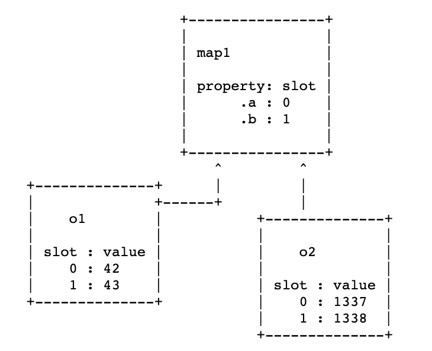

# V8 基本概览

参考链接：<http://www.phrack.org/papers/jit_exploitation.html>

V8 引擎是 Chromium 内核的 JavaScript 引擎，用来解释执行 JavaScript，使用 C++ 编写。

V8 引擎有以下特性：

1. 支持一系列从 JavaScript 来的原生的好用的功能

2. 多种追踪模式，输出引擎内部事件，也可以追踪不同优化下的行为

3. 提供了各种分析用的辅助工具

与静态语言编译时即确定变量类型不同，JavaScript 是动态语言，因此需要在每次执行时存储类型信息，V8 采用的方法是通过指针标记，同时结合使用专用类型信息对象（Map）来记录。Map 是 V8 引擎中最重要的数据结构，其内部记录了对象的动态类型、对象的大小、对象的属性以及存储的地方、数组元素的类型、对象的原型信息等。

V8 引擎中，任意 JavaScript 变量都会由一个 Tagged Pointer 表示，Tagged Pointer 的表示如下（Smi 和 HeapObject 是 V8 中用来代表 JavaScript 对象的两大类）：

Smi（立即数）：[32-bit signed int][31 bits unused] 0

HeapObject：[64-bit direct pointer] 0 1

上面的 `direct pointer` 即为指向 Map 对象的指针。

所有对 HeapObject 的内部成员变量的访问，都需要使用特殊的访问器来访问，为了更好地访问对象中的属性，在 HeapObject 类型的对象中，每个对象对应的 Map 都会有一个属性的插槽号：

```javascript
let o1 = {a: 42, b: 43}
let o2 = {a: 1337, b: 1338}
```



如果对象的属性稍有改变，则会有一个新的对应的 Map 被创建，同时对象指向该新创建的对象。

以上就是大致的 V8 引擎中对对象表示的基本原理。现代 JavaScript 引擎通常采用一个解释器以及一个或多个 JIT 编译器的基本架构来实现。对于 JavaScript 来说，其类型信息通常只有在真正执行到这句代码时才能知道，因此对于确实类型信息的处理是一个挑战。JIT 得到的机器码在遇到类型问题时，JIT 会通过异常使得其进入类型转换（将机器码转换成适应当前变量的类型），从而完成对应类型的处理。在后续处理该代码的过程中，JIT 会假设一段代码会以与之前相同的方式在未来被使用，在假设之后，JIT 则会根据 Tagged Pointer 来验证对象类型是否正确，比如 Smi 来比较最后一位，对于 HeapObject 则比较其指向的 Map 信息。这是 JIT 对 JavaScript 动态类型处理的基本原则。
V8 引擎处理 JavaScript 代码的基本流程是：

JavaScript 代码 ———解析器———> 抽象语法树 ——— 解释器 ———> 字节码 ———编译器（JIT）———>机器代码

所谓的字节码，其实就是机器代码的抽象，更适合人类阅读。每个字节码可以看作是一个小型的块，该块包括一些机器代码指令，用来完成一个小型的功能。多个字节码组合在一起可以实现任何的 JavaScript 功能，每个字节码需要指定输入输出作为寄存器的操作数。

V8 引擎中的 JIT 编译器为 Turbofan，其在处理字节码时，通常会将字节码转换为中间表示形式，从而使其更适合被优化，中间表示形式有三种不同的操作，JS 操作、简单操作和机器操作，其中机器操作是可以转化为机器指令来进行执行的，而 JS 操作和简单操作则需要进一步额外的操作才行（Lowering）。总的来说，Turbofan 的操作分为以下三步：

1. 图形构建：根据字节码生成的 IR 图，对值的类型进行基本的猜测
2. 优化：基于猜测的值的类型，对 IR 图进行优化
3. Lowering：将 IR 图 Lowering 为机器代码，然后写入可执行内存区，等待执行

（而从阅读中发现，并不是所有的字节码都会交给 Turbofan 进行编译，只有热度很高的代码，才会由解释器交由编译器编译）

在 JIT 对字节码进行优化的过程中，一个比重很大的地方就是冗余消除。因为 JavaScript 生成的机器代码中，有很大一部分的检查代码，而有一些会被 Turbofan 认为是冗余的，因此在编译过程中会被消除。而本文的漏洞就出现在 Turbofan 所做的优化过程中。在优化过程中，两个连续的类型检查会被过滤掉一个，但是如果在第一个检查之后，第二个检查（被过滤掉了）之前对对象的类型进行更改，则可以对 JIT 进行欺骗，从而导致浏览器出现 Type Confusion 的错误。

对于具体的 Type Confusion 错误，还没有具体去了解其基本原理，因此下周的一个任务之一就是好好了解一下 Type Confusion 错误的原理以及一些相应的例子，争取将 Type Confusion 漏洞理解。同时，现在只是对 V8 引擎的对象管理和编译流程有了大致的了解，下周或者国庆期间准备好好看一下 V8 引擎的内部实现机制。
