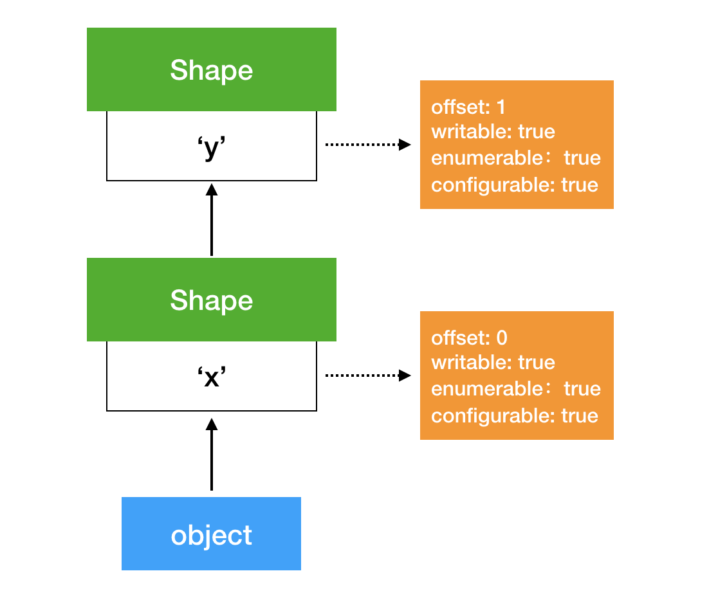
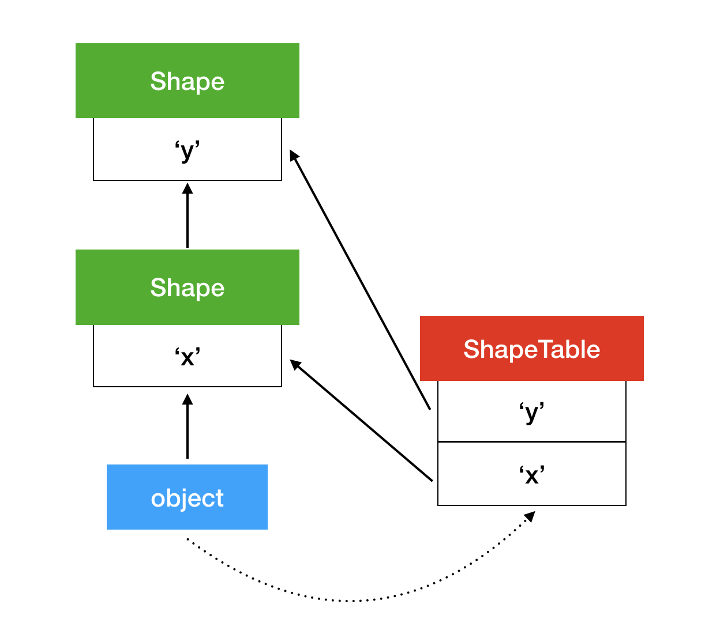
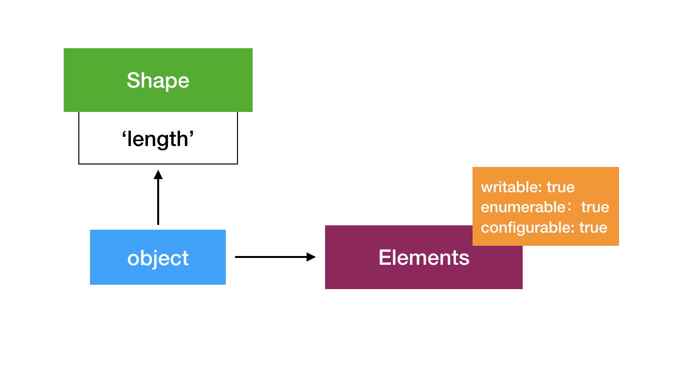
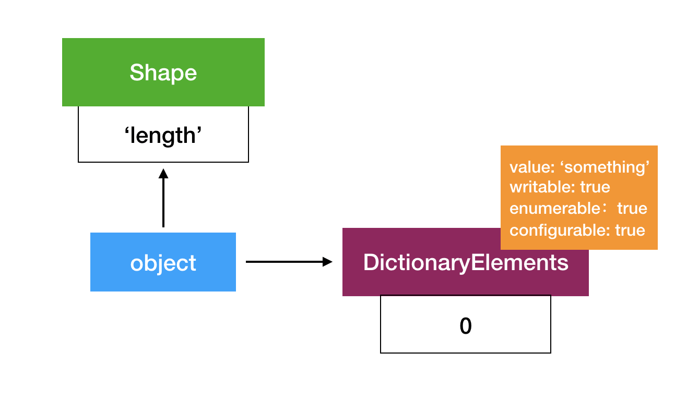
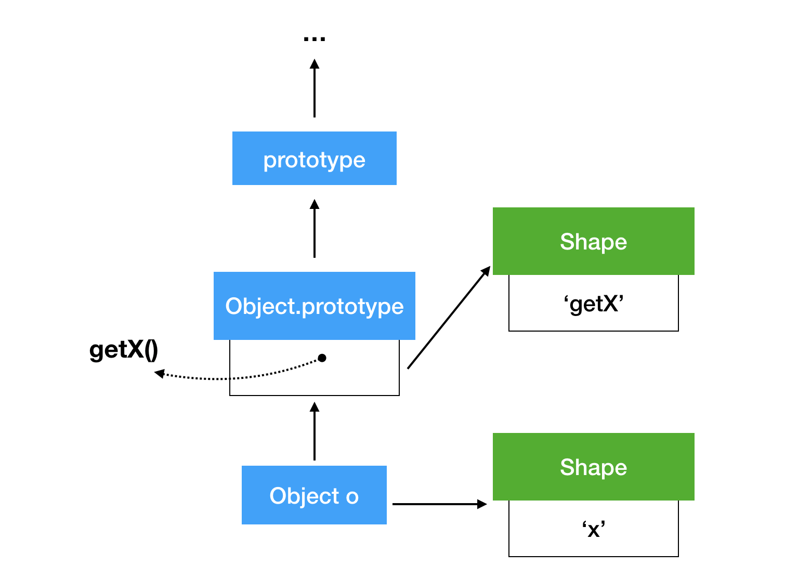
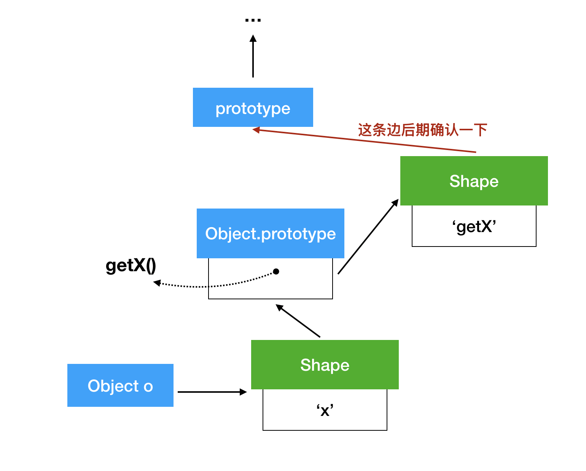
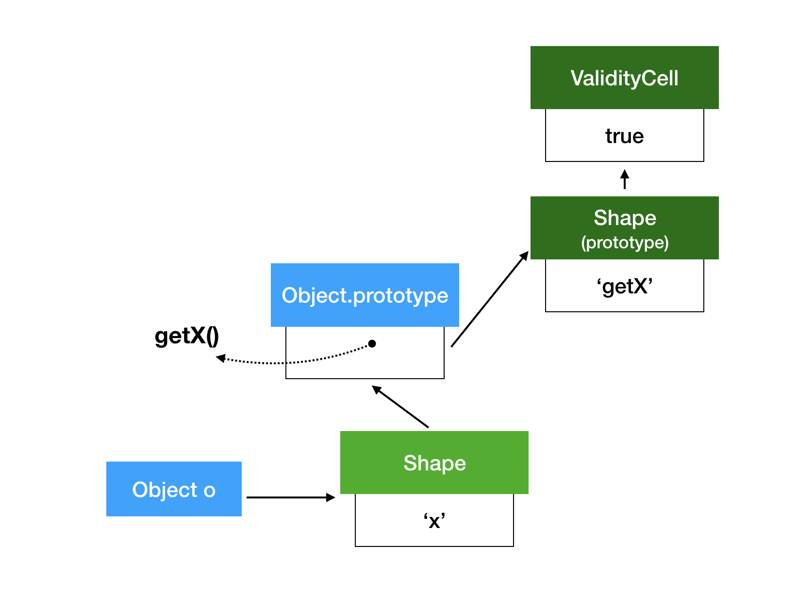

# JavaScript 引擎的一些优化思想

参考链接：
* <https://mathiasbynens.be/notes/shapes-ics>
* <https://mathiasbynens.be/notes/prototypes>

首先，JavaScript 引擎中代码的执行以及执行的优化过程大致如下图所示：


引擎的基本优化过程如上图所示，但是根据具体实现的引擎不同，会有一些差距，比如 V8 就是跟上图一样，只有一级优化，而 SpiderMonkey、Chakra 具有两级优化、JSC 具有三级优化。具备不同级别优化的目的是为了平衡「生成机器代码的时间」和「代码执行时间」两个时间所带来的消耗。

在 ECMAScript 中规定，所有对象都被当成字典，所有的键都映射到对应的属性，即 [value]、[Writable]、[Enumerable]、[Configurable] 这些基本属性。此外，数组是特殊的对象，数组的索引都被当成键来存储，并且数组都有一个 length 属性，用来存储数组的长度。每个数组最多存放 2^32 - 1 个元素。

对于 JavaScript 语言来说，访问对象的属性是很频繁的，因此如何快速访问属性对于 JavaScript 引擎来说就是主要的任务。对于一般情况下，多个对象具有相同的属性是很常见的（来自同一个类），因此首要解决的是如何快速访问不同对象的相同属性。

JavaScript 引擎中解决这个问题，使用的是引入一个 Shape 数据结构（即 V8 中的 Maps）：


这个 Shape 就是用来表示对象的类型的，Shape 是会被多个对象共享的。访问属性时，首先根据属性名找到对应的 Shape，根据对应的 Shape 找到对应属性的偏移量，然后在对象所占的内存中根据偏移量得到需要访问的属性，这样就不需要在每个对象中存储一个属性名。在不同的引擎中，有不同的叫法，V8 称为 Maps，Chakra 中称为 Types，JavaScriptCore 中称为 Structures 等，而在学术界通常称为 Hidden Class。

当对一个对象添加属性时，会延长 Shape 链，如下图所示：



由于这个性质，JavaScript 的对象可以随时添加属性。

但是，如果链条长了，访问属性会变得很慢。因此，JavaScript 引擎会添加一个数据结构，来映射不同的属性找到不同的 Shape，从而实现快速定位到需要用到的 Shape，实现快速访问。如下图所示：



但是这样又添加了一个字典，来映射不同的属性与不同的 Shape。实际上，使用这一系列的原因是可以使用 Inline Caches 加快对象属性的快速访问。引擎使用 Inline Cache 记录从哪儿寻找属性的信息，导致了 JavaScript 快速运行的关键因素。

例如，在下列代码中：

```javascript
function getX(o) {
    return o.x;
}
```
使用 Inline Cache 之后，会生成字节码如下：
```c
get_by_id loc0, arg1, [A], [B]
return loc0
```
其中，[A] 和 [B] 是两个槽，当第一次执行时，A 槽会记录对象的 Shape 的地址，B 槽会记录访问当前属性的偏移；在之后执行时，只需要对比 A 槽中的 Shape 是否被改变，如果没有改变，则无需再寻找属性的偏移，直接返回对应的偏移处的值即可。

对于数组来说，如果对于每一个增加的下标都使用这种方式进行存储（Shape 以及更改的 ShapeTable），那么会消耗很大的内存。因此对于每个数组，都有一个连续的 Backing Store 来存储所有数组的下标属性值。



之所以可以这么存，是因为数组中所有元素的那些属性（Writable 等）都是一样的，而如果对某个属性进行更改，那么就不能用这种方式进行存储了，需要改成如下图所示的方式（Dictionary Elements）。



下面来看看对代码执行的优化。V8 在解释器中执行字节码的时候，当 V8 的解释器（Ignition）认为这段代码会被执行得很频繁，就会启动 V8 的编译器（TurboFan 前端）对其进行编译优化准备：1. 集成从解释器过来的分析数据；2. 构建代码的基本机器表示形式，然后发送给 TurboFan 优化器，开始优化。优化通常在子线程中进行，因此这边在优化的同时，另一边 Ignition 仍会执行字节码，直到 TurboFan 优化完成之后，Ignition 将执行转给机器代码进行执行。这种实现方式，在进行优化之前（即 TurboFan 前端的处理过程中）会阻塞一段时间的主线程，而另一种实现方式是编译器的前端以及优化过程均在特定的子线程中进行。

在 JavaScript 引擎对代码的优化过程中，存在着两种平衡：

1. 时间上的平衡：生成优化后的机器代码的过程慢，但是生成机器代码之后执行时间快；
2. 内存上的平衡：生成的机器代码通常比字节码大很多；

基于以上原因，JavaScript 引擎不会对 JavaScript 的所有源代码进行优化。

下面是引擎中对于方法调用的优化。

prototype 是 JavaScript 中的一种对象，在基于 prototype 的编程语言中，方法是通过 prototype 进行共享。假设对于一个类，其中有一个方法 getX，那么其在 JavaScript 引擎中的表示形式如下图所示：



也就是说，对于一个对象来说，其方法是存储在类的 prototype 中的，而类的 prototype 也是个对象，对象就有对应的 Shape，因此具体的方法的偏移就存在 prototype 对应的 Shape 里。

在对象调用方法时，比如：

```js
o.getX();
```

实际上是进行如下操作：

```js
$getX = o.getX;
$getX.call(o);
```

即首先获得对象的 prototype，然后通过 prototype 的 Shape 获得对应的方法的偏移值，再根据偏移值得到最终的方法，最后将自身做为方法的参数调用目标方法。

那么上述涉及到的问题就是，对于每个方法的调用，首先会检查对象自身的类型（Shape 是否对应），然后检查对象的 prototype，最后再检查 prototype 中是否存在对应的方法。这样的一个过程，如果涉及到的 prototype 链很长的话（假设 N 个 prototype），则会进行 1 + 2 * N 次的检查，最终获得相应的方法。

因此，对上述结构进行优化，将每个对象的 prototype 与 Shape 进行关联，即得到如下结构：



这也就意味着，每次改变 prototype，引擎直接对 Shape 进行改变，这样每次调用方法的时候，只需要进行 1 + N 次检查即可。

但是这样还不够快，之前提到过 Inline Cache，那么如何在方法调用的过程中使用 Inline Cache？对每一个 prototype 的 Shape 进行修改，使其变成特殊的 Shape，这个 Shape 不与其他对象共享，而且每个 Shape 都有一个 ValidityCell 与之对应，其内部的值是 true/false。当这个 prototype 不再使用了，或者这个 prototype 不是顶层 prototype 的时候，这个内部值为 false，其余时间为 true。这时对象结构如下所示：



在调用方法时，InlineCache 会增加两个字段，一个是当前方法所在 prototype 的地址，另一个是对应 ValidityCell 地址。在第二次调用时，检查 ValidityCell 中的值是否为 true，若是，则直接从 prototype 中的 offset 偏移处取得方法即可，从而加快了方法调用的速度。
