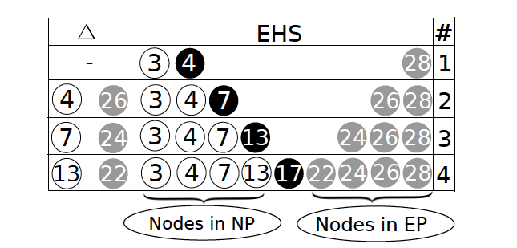

# Papers

一些使用静态程序分析的方式来进行漏洞挖掘的工作，其他方式进行漏洞挖掘的工作可以参看：

* [Fuzzing](../Fuzzing/)：模糊测试相关的一些学习记录；
* [Deep Learning](../DLP/Vulnerability.md)：借助深度学习来进行漏洞挖掘的一些工作记录；

论文列表：

* [Understanding and Detecting Disordered Error Handling with Precise Function Pairing](#understanding-and-detecting-disordered-error-handling-with-precise-function-pairing)：通过函数对匹配的方式检测程序错误处理路径中的由于不匹配的操作或者操作序列导致的漏洞
* [Sys: a Static/Symbolic Tool for Finding Good Bugs in Good (Browser) Code](#sys-a-static/symbolic-tool-for-finding-good-bugs-in-good-browser-code)
* [Under-Constrained Symbolic Execution: Correctness Checking for Real Code](#under-constrained-symbolic-execution-correctness-checking-for-real-code)

---

## Understanding and Detecting Disordered Error Handling with Precise Function Pairing

*30th {USENIX} Security Symposium ({USENIX} Security 21). 2021.*

这篇文章作者主要聚焦于程序中普遍存在的错误处理过程中出现的一些新的漏洞。错误处理由于其本身的复杂性，经常会出现一些比较严重的漏洞，作者提到之前的相关工作都专注于类似返回不正确的错误码，或者在错误传递过程中缺失一些信息等问题。而作者这篇文章主要针对错误处理之前进行的 `cleanup` 操作，作者发现这些操作可能会因为不正确的操作顺序、多余的操作或者不足的操作而引起一些比较严重的漏洞，作者将这一系列的漏洞命名为 **DiEH** 漏洞，并开发了一个针对该类漏洞的检测系统 **HERO**。

作者首先对相关的工作进行了调研，发现在 **Linux** 内核的漏洞中，有 `34%` 的漏洞是跟错误处理流程相关的，过去也有工作针对错误处理流程进行安全性分析，但是这些工作没有针对错误处理流程之前的这些操作（比如 `cleanup` 操作）进行安全性分析的。作者提到，在程序处理错误之前，通常会进行一系列的 `cleanup` 操作，例如释放相关的内存等。

作者定义了 **Leader Function** 和 **Follower Function** 的概念。**Leader Function** 对一些资源进行初始化（例如申请内存 / 获得锁等），而 **Follower Function** 则对资源进行恢复（例如释放内存 / 释放锁）。这两个函数最终构成一个函数对。作者还对错误处理结构进行了统一化的定义，在处理错误之前，**Leader Function** 和 **Follower Function** 以一个栈的形式进行配对调用（例如最初申请的资源在最后释放），因此作者将其描述成为一个栈结构。而在一段代码中，可能会有很多这样的路径（栈），这些路径不一定相同，作者将这些路径之间的差别定义为 **EH delta**，而函数对就通过 **EH delta** 来识别：

上图中的数字代表代码行（即上述的 **Leader Function** 和 **Follower Function** 所在的行），白色的圆点代表正常的执行路径，黑色的圆点代表发生错误的代码，灰色的圆点代表错误处理路径。

接着，作者正式定义了 **DiEH** 漏洞，这种漏洞是在 **Follower Function** 在不正确的顺序被调用的情况下，或者被多余调用、调用不足的情况下发生的。作者通过当前 **Follower Function** 列表与期待的列表对比来检测该漏洞，因此主要的关键点在于提取期待的 **Follower Function** 列表。而作者通过手动分析 **Linux** 内核的 **CVE** 发现，有较多的漏洞是与 **DiEH** 相关的。

为了可以检测出 **DiEH** 漏洞，作者提出了叫做 **HERO** 的方法。首先，需要提取出统一化的错误处理结构。这里有一个比较困难的地方是如何定位到正常的执行路径和错误处理执行路径，以及如何将这两个执行路径对应起来。（因为一个函数中可能有很多正常的执行路径和错误处理路径，但是他们并不是互相关联的）。此外，还需要分别从这两个路径中提取出 **Leader Function** 和 **Follower Function**，同时还需要构造期待的 **Follower Function** 序列。最后，还要考虑有一些与期待序列不匹配，但是不存在漏洞的情况，对这些误报进行消除。

总的来说，**HERO** 分成 4 个部分，首先从源码中提取 **CFG** 和 **Call Graph**，然后提取出错误处理结构，构造 **EHG**，然后提取出函数对，并得到 **Follower Function** 序列，最后通过序列的匹配来检测漏洞。如下图所示：

接下来作者分别对这 4 个阶段进行了详细的介绍。

为了提取出错误处理结构，作者首先对错误检查的相关代码进行定位。作者通过预先收集通用的错误码，错误处理函数等。如果这条路径返回了某个错误码或者调用了错误处理函数，则认为这条路径是错误路径。通过定位到这样一个错误检查的代码，可以同时收集到正常路径和错误路径（*这里其实没太明白，总感觉这么处理有点粗糙*）。

在初步得到两个路径之后，还需要对无关函数进行过滤。作者发现，错误处理中的代码通常是比较简单的，无关的函数通常就是一些常见的函数，因此作者首先通过函数匹配对错误处理路径中的无关函数进行过滤，然后对于正常路径中的函数，由于 **Leader Function** 和 **Follower Function** 通常需要通过一个变量相连，因此，作者这里使用了数据依赖的方式，从错误路径中的函数反推回正常路径中的函数，从而过滤掉无关函数。（*这个过滤方式是不是有点粗糙了？*）

之后，作者对于每一个错误检查点构造一个错误处理栈（EHS），依据 CFG 中的控制流连接关系，最终构造出一个 **EHG**，如下图所示：

之后，对于相邻节点，计算一个 **EH delta** 来提取函数对（*基本思想应该是作者认为相邻的错误处理逻辑可能就相差一个资源的管理？*）。

在提取到函数对之后，就可以用函数对来进行 **DiEH** 漏洞检测（*但是文中作者好像没有提到是如何计算期待序列的？*）。这样检测出来的漏洞可能会存在假阳性的情况，因为有一些错误处理路径会有相应的约束使得漏洞路径无法被满足，作者在这里提出了 `symbolic summary` 的方法，对路径上相关的约束进行提取，然后检查约束之间是否冲突，本质上是一种轻量的符号执行的方案，但是仅考虑当前函数中相关的约束，因此开销远远小于符号执行。此外，作者还发现对于顺序不一致的 **Follower Function** 序列漏洞来说，如果两个 **Follower Function** 之间不存在数据依赖关系，则可能也是一个误报。

在实验阶段，作者首先评估了其函数对提取方法的准确性，通过手动确认之后，作者发现直接的函数对提取确实准确率较低（89 / 150），因此作者还提出了一种函数对排名的机制，来更进一步根据函数在工程中出现的次数对函数对进行排名，从而提升了准确性。

作者最后将 **HERO** 部署到 **Linux**、**FreeBSD** 和 **OpenSSL** 上进行漏洞检测，分别发现了 234、2、3 个漏洞。作者还提供了对这些漏洞进行自动化触发的方案。

## Sys: a Static/Symbolic Tool for Finding Good Bugs in Good (Browser) Code

*29th {USENIX} Security Symposium ({USENIX} Security 20). 2020.*

这篇文章的作者主要实现了一个将静态分析代码与符号执行结合起来的自动化漏洞挖掘工具，作者将该工具部署在具有大规模代码的程序中（比如 Chrome 等），发现了多个漏洞。作者的基本思想是在于发现程序的静态分析开销较小，但是可能存在比较多的误报，导致准确率较低。而使用符号执行的方式通常会存在开销较大的问题，无法很好地在实际大型应用程序中应用。作者同时发现，与漏洞相关的上下文通常是在比较小的范围内的，因此作者提出将开销小的不精确的程序静态分析技术与开销大的符号执行相结合，实现一个仅分析一小段可能存在错误的代码的符号执行引擎对代码进行分析，从而克服符号执行开销大的问题。

作者基于上述想法，实现了 **Sys** 系统，该系统主要由 3 个步骤构成：

1. 静态扫描源代码，并标记出潜在的错误；
2. 通过符号执行潜在的错误代码检查是否存在错误；

作者定义了 **SysDSL** 语言，可以通过 **SysDSL** 来实现对应漏洞的检查器，对每一种漏洞进行有针对性地检查。

在静态扫描阶段，**Sys** 具有可拓展性。通过编写静态的分析拓展，来针对目标代码进行扫描，从而定位潜在的错误位置。与传统的静态检查器不同，因为有后序的符号执行进行进一步验证和检查，**Sys** 的静态检查阶段追求的是高准确率（可以有很高的误报）。通过查看对应段源码，可以看到作者通过给定一个 **LLVM-IR** 文件（也可以是一个目录，对目录中的每一个文件进行解析），从中间语言生成对应的控制流图之后遍历每一条路径，来执行检查器进行既定规则扫描，如果满足对应的漏洞条件，则加入到潜在漏洞路径中，等待符号执行进行进一步验证。例如对于堆溢出的漏洞，作者通过静态检查器遍历每一条指令，首先获取申请内存相关的指令，将对应的内存大小的变量名进行保存，在之后遍历的过程中，记录与该变量相关的所有运算操作（包括赋值、算数运算等），然后当找到相关的访问内存的指令时，判断访问的索引与内存大小变量是否有关联，如果有关联，则将其作为潜在的漏洞路径，等待符号执行模块进行验证。

在符号执行阶段，**Sys** 对上一步得到的潜在错误的路径进行符号执行，对于每一个 LLVM 的中间表示形式指令求得相应的符号约束，并对符号约束进行检查，从而判断是否存在漏洞。**Sys** 在符号执行阶段，会有选择性地跳过部分代码，从而提高效率，同时可以指定从哪个位置开始进行符号执行（从靠近 `main` 函数的地方开始还是只从目标路径开始）。

但是跳过代码，仅分析程序中的部分函数或者部分代码的符号执行会导致同时跳过了一些必要的约束和相应的影响，从而会影响符号执行的准确性（这种称为 **Under Constrained(UC) 符号执行**）。因此，在跳过相应的代码的时候，需要确保能够伪造相应的状态，同时确保跳过的代码中对应的约束不会导致误报的出现。**Sys** 使用跟 **UC-KLEE** 类似的懒加载的机制来构造相应的状态，只有当前代码对指针进行解引用的时候才申请相应的内存进行执行。此外，借用一些内置的启发式的规则来减少误报：

1. 消除一些本身存在矛盾的路径，如果符号执行路径本身出现矛盾，则说明这个漏洞假设不成立；
2. 只判断特定的错误，而不是验证整个函数的正确性；
3. 可以使用一些有用的信息来不去考虑一些未定义的状态（例如对于越界访问，不需要考虑索引和内存大小的具体值，只需要考虑两者的关系）；
4. 大量的误报的原因是相同的，**Sys** 可以对这些类似的误报提取相似的内容，从而消除误报率；

作者通过提供的 **SysDSL** 接口，将 LLVM 的 IR 转换成符号执行的约束和公式，从而降低了用户对检查器开发的难度，更方便对特定类型的漏洞实现合适的检查器。此外，与 **KLEE** 不同，作者使用连续的数组来实现内存，这样对内存的访问等速度会更快、更方便，并能方便地使用 **Shadow Memory** 的形式来保存内存状态，更好地检查内存错误。

作者在文中介绍了 4 个实现的检查器，并将这些检查器部署在比较大型的代码库中（**Chrome** 等），通过实际的漏洞检查，确实可以在大型代码库中发现漏洞，并且有较低的误报。如下图是使用越界访问漏洞检查器发现的漏洞情况：

最后，作者将 **Sys** 与其他静态分析工具进行了对比。在误报率的控制上，**Sys** 比其他两个对比的工具要好很多。其他静态工具可以处理简单的程序流程，但是对于过于复杂的流程，无法进行很好地判断，因此会出现较多的误报。

此外，作者还对比了传统的符号执行工具，将他们在 **UC** 模式下运行的结果跟 **Sys** 进行对比。但是在大型程序上，这些工具表现都不好，作者推断是因为程序体量太大了，导致难以分析。

总的来说，作者通过静态分析初步筛选出漏洞之后，能将初步筛选出来的漏洞路径跟 **UC** 符号执行结合起来，从而降低误报率，而 **UC** 符号执行也能在一定程度上增加其拓展性，使其可以在大型应用程序中进行检索。但是由于 **UC** 符号执行本身存在准确性低的缺点，作者通过一系列启发式的方式以及让用户指定检查器从而只聚焦于某个类型的漏洞的方式，排除了其他干扰因素，从而达到比较好的效果。

## Under-Constrained Symbolic Execution: Correctness Checking for Real Code

*24th {USENIX} Security Symposium ({USENIX} Security 15). 2015.*

符号执行是程序分析的一种静态分析方式，可以用于发现程序中所存在的一些缺陷。但是符号执行受限于其众所周知的路径爆炸的原因，无法有效地深入到比较深处的代码进行探索，从而无法对大型程序的错误进行有效地挖掘。

**Under-Constrained (UC)** 符号执行主要思想是只对单个函数进行符号执行，而不需要完整地从程序入口开始。这样可以减少符号执行过程需要探索和维护的状态数量，从而可以有效地克服路径爆炸的问题。

但是 **UC** 符号执行同样存在很多需要解决的挑战。这篇文章主要是基于 **KLEE** 实现了一个相应的 **UC** 符号执行引擎，称为 **UC-KLEE**，作者使用 **UC-KLEE** 针对程序的 Patch 做了一个分析，发现了 Patch 中存在的一些漏洞。同时，作者借助实现的 **UC-KLEE** 结合具体的漏洞，实现了若干个检查器，对真实程序的函数进行了检查，发现了大量的漏洞。

对于只执行单个函数来说，由于其没有对应的外部调用点，因此对应的参数通常是确实约束的，而这些缺少约束的函数可能会导致大量的误报（FP）出现，**UC-KLEE** 则通过让用户指定简单的 C 代码来消除这种 FP，同时，使用了懒加载的机制来减少用户的干预。在进入函数时，对于每个参数进行初始化，对于指针参数，则将他们定义为 `unbound` 状态。然后对于每一个路径进行探索，当遇到对 `unbound` 状态的指针进行解引用时，申请一块内存区域，并将其指向该内存区域，取消 `unbound` 状态。而新生成的内存区域的内容为 `unbound` 状态。通过这种方式可以实现懒加载的机制。

首先作者讲解了对于 Patch 的安全性检查的技术实现。对于 Patch 的检查，作者对 Patch 前的代码和 Patch 后的代码进行检查，如果 Patch 后的代码造成了 Patch 前的代码不存在的 Crash，则认为这个 Patch 引入了新的问题。但是考虑到对单个函数的检查下不存在输入约束，不能单纯地认为所有 Crash 都是 Bug。这里作者用了错误等价的思想，如果 Patch 前的代码和 Patch 后的代码造成的 Crash 是等价的，则认为这个 Crash 是由于输入缺少约束造成的。作者针对两个函数自动生成 `harness`，来对两个函数的执行进行判断。首先执行 Patch 后的代码，执行完之后消除符号空间的值，保留符号执行路径，然后执行 Patch 后的代码。如果两者都崩溃了，则认为这两个崩溃是等价的。下图是一个 `harness` 的示例：

在执行时，**UC-KLEE** 还对一些不感兴趣的路径进行裁剪，以减少 FP，具体地，通过对 CFG 进行遍历，找到不同的基本块，然后过滤掉以下路径：

1. 在 Patch 后代码中不存在错误的路径；
2. 在 Patch 后代码存在路径但是没有到达不同的基本块的路径；

这种方式可以消除掉上千条冗余的错误路径。

作者通过一些方式选定了一些潜在的 Patch 来对这一方法进行评测，针对 Patch 前的代码和 Patch 后的代码，一共选定了 1000+ 个 Patch 进行测试。作者通过这种方式，在 Patch 代码中发现了 11 个漏洞。

此外，作者还对这些 Patch 进行了验证，均可以在很高的代码覆盖率下对这些 Patch 的有效性进行正确的验证。

作者提到 **UC-KLEE** 验证漏洞时出现的 FP 主要有以下几种缺乏前提条件的类型：

1. 缺少数据结构的类型约束；
2. 缺少状态约束；
3. 缺少 API 调用参数的约束；

作者提出使用人工注解（数据类型注解 / 函数调用注解）等方式来解决这些问题。通过这些注解，在每次符号执行路径的最后对不满足注解的错误报告进行过滤，从而可以消除大部分的误报错误。下图是作者提供的注解宏的列表：

此外，作者还在 **UC-KLEE** 中采取了一些启发式的方法，来筛选出一些对任何输入来说都一定存在漏洞的执行路径，从而确定漏洞。

除了对 Patch 进行验证之外，**UC-KLEE** 还通过提供检查器的机制对通用的函数进行检查。以内存泄漏检查器为例，**UC-KLEE** 的符号执行期间，记录所有申请的堆上的变量，然后当函数返回之后，如果该变量无法被任何指针所访问，则认为存在内存泄漏。当遇到一些无法进入执行的函数调用时，则判断对应的变量是否会被传递到该函数中，如果传递进该函数，则认为该变量可能被泄漏，如下图的 `b`：

通过这些检查器的实现，**UC-KLEE** 也能发现多个漏洞。

这篇文章主要实现的是基于单个函数的符号执行，通过对单个函数的符号执行可以缓解路径爆炸的问题，但是也会由于输入约束的不足引入过多的误报。作者通过将这种符号执行技术与实际的问题结合（Patch 验证与漏洞的挖掘），并引入一些例如路径对比、手工注解、启发式方法等对产生的误报进行消除，取得了不错的效果。
