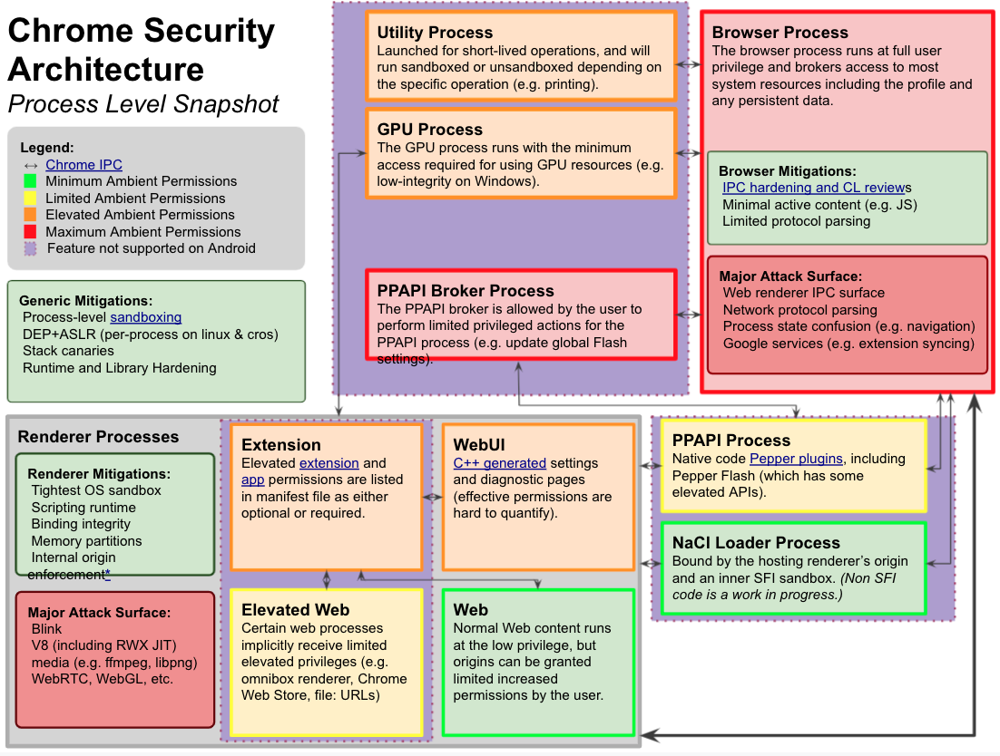

# Chrome

## 运行 Chrome

开启 MojoJS：

```sh
./chrome --disable-gpu --remote-debugging-port=1338 --enable-blink-features=MojoJS,MojoJSTest
```

一些选项：

* --disable-gpu：To-Do
* --remote-debugging-port：To-Do
* --headless：在不打开 UI 的情况下使用 Chrome
* --no-sandbox：关闭沙箱

如果在启动 Chrome 时提示 No usable sandbox，则需要开启 Linux 非特权用户命名空间：

```sh
sudo sysctl -w kernel.unprivileged_userns_clone=1
```

## 调试 Chrome

使用 `ps` 找到 **Chrome** 进程，然后 `gdb` 附加上去。

## Chrome 安全架构图

* <https://docs.google.com/drawings/d/1TuECFL9K7J5q5UePJLC-YH3satvb1RrjLRH-tW_VKeE/edit>

以进程为单位的 Chrome 安全架构关系图以及各个进程主要面对的攻击面：



Chrome 安全架构中最重要的就是沙盒，借助沙盒，可以将大部分的攻击面限制在沙盒进程中，从而减少攻击面带来的危害。但是 Chrome 中有一个浏览器进程，该进程位于沙盒之外，对于该进程的攻击可以带来较大的危害。除了沙盒，Chrome 还实现了站点隔离，可以确保不同来源的数据在不同的沙盒进程中处理、储存。

由于上述安全架构的存在，对于 Chrome 的完整的攻击通常需要借助两个或两个以上的漏洞：其中一个漏洞用来在沙盒进程中获得任意代码执行，另一个漏洞用来逃逸沙盒。

## 使用 Mojo

Mojo 是 Chromium 提供的一种 IPC 机制，Chromium 中的 Renderer 等进程处于沙箱中，隔离，需要通过 Mojo 与主进程（浏览器进程）交互，来完成一些操作。因此，Mojo 上的一些漏洞可以绕过沙箱。关于 Mojo 的详细介绍可以查看 [Mojo](./Mojo.md)。

在 JavaScript 中使用 Mojo 通常需要包含进来两个文件，一个是 mojo_bindings.js，另一个是需要调用的 Mojo 接口的 JavaScript 文件，例如：

```html
<script src="./mojo_js/mojo/public/js/mojo_bindings.js"></script>
<script src="./mojo_js/third_party/blink/public/mojom/plaidstore/plaidstore.mojom.js"></script>
```

## 一些对象的创建函数

* RenderFrameHost：`content::RenderFrameHostFactory::Create()`
* ...

## 一些安全性相关的博文

* <https://googleprojectzero.blogspot.com/2019/04/virtually-unlimited-memory-escaping.html>

## Tips

* 查找函数偏移（因为 Chrome 通常比较大）：

```sh
nm --demangle ./chrome | grep -i 'Function Name'
```

* `call _ZnwmRKSt9nothrow_t` 为调用 `new` 函数，因此可以找到这个函数调用来查看某类对象的大小（C++ 相关）