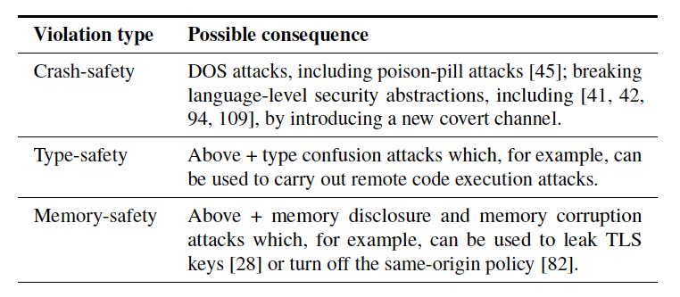

# Papers

* [Finding and Preventing Bugs in JavaScript Bindings](#finding-and-preventing-bugs-in-javascript-bindings)：针对 JavaScript 引擎中 JavaScript 语言与高级语言的 Binding 机制中的漏洞进行分析和挖掘；

---

## Finding and Preventing Bugs in JavaScript Bindings

*2017 IEEE Symposium on Security and Privacy (SP)*

这篇文章作者讲解了 JavaScript 引擎中，负责 JavaScript 与其他高级语言（C/C++）联合的部分的漏洞，并提出了一种静态分析方式，以及一些防御方法。

在类似于 JavaScript、Python 这种高级动态语言中，由于语言的设计，在语言层面上可以杜绝底层的内存错误，例如 Overflow 等。但是在例如 JavaScript 引擎中，出于对功能实现的考虑以及性能的影响，会调用一些使用 C/C++ 实现的函数来实现功能，例如对文件系统的访问、网络层面的访问、I/O 读取等。由于 JavaScript 语言与 C/C++ 这种语言有很大的不同，包括变量的类型，内存的管理等，因此无法直接进行调用，通常需要一个 **Binding** 层，将 JavaScript 代码和底层的 C/C++ 代码进行结合，从而可以执行 C/C++ 的底层方法来实现功能。Binding 层可以在不同的语言层面上实现对变量类型的转换等工作，比如 JavaScript 中的 `Number` 类型，可以转化成 C/C++ 中的具体的 `uint32_t` 等类型。除了需要确定所使用的变量的具体类型之外，还需要确保变量的值是合法的，例如对于数组的访问，需要确保所访问的下标索引位于正确的数组边界以内。而如果相应的检查未通过，则会返回到 JavaScript 层，用于处理错误，或者以较低性能执行对应代码。

由于 JavaScript 这种动态语言的复杂性，因此 Binding 层的编写实际上会非常复杂，例如在将 `Number` 转换成 `uint32_t` 的过程中，会调用 JavaScript 的 `Uint32Value` 方法，而调用该方法的过程中，又允许执行一个 *Callback*，因此攻击者可能在执行 *Callback* 的过程中改变该变量的类型，而如果 Binding 层未考虑这一点，则可能出现类型相关的错误（**Type-Confusion**）。对于这一类型的漏洞，通常比较难以避免。

基于上述问题，作者针对 **V8** 引擎，提出了一种静态分析的方式，具体对两个主要的程序：**Node.js** 和 **Chrome** 进行分析，发现了大量的漏洞，同时作者提出了一种防御这种漏洞的方式。

根据漏洞的不同种类，作者将这一大类的漏洞分成 3 个小类：**Crash-Safety**、**Type-Safety** 和 **Memory-Safety**，如下图所示。

由于作者的这个工作主要基于 V8 相关的，因此作者首先分析了 V8 引擎对于 Binding 层的实现。此外作者提到，其他类似的动态语言解释器（引擎）也会存在相似的问题。

在 V8 引擎中，提供了内置的 API（），可以通过 C++ 代码实现一些新的功能，供 JavaScript 层面调用。作者通过 **WebIDL** 功能，实现了一个简单的功能，来对上述定义的 3 类漏洞进行讲解。总的来说，由于 JavaScript 语言与 C/C++ 语言的不一致性，比如 JavaScript 是内存安全的，而 C/C++ 需要自己维护内存，所以 Binding 层在处理两层语言之间的转换时，很容易出现处理不当的问题，从而引入了一些严重的错误。

基于上述的观察，作者分别针对 3 类漏洞实现了 3 个不同的检查器，来挖掘定位在 Binding 层中的这 3 类漏洞（这些检查器应该都是在单个函数范围内进行检查的）。

对于 Crash-Safety 类型的漏洞，作者实现了两种检测器。一种最简单的检测器是通过判断代码中那些直接可以引起 Crash 的检查（例如 *Assert* 等）的宏的参数是否是 JavaScript 层面传递过来的变量，作者提到这种错误在 Node.js 中很容易识别到，因为 Node.js 中很容易地可以看出当前的变量是否是 JavaScript 层传递过来的，以及参数的传递路径。但是这种检查在 Chrome 上却无法识别出漏洞，因为在 Chrome 中，参数在传递给这种宏之前都会使用 `if` 语句做一个严格的检查。

这类漏洞的另一种检查器是对于 Maybe 类型的变量的类型转换。对于 Maybe 变量的类型转换，如果无法转换到目标类型，则最终会得到一个空值，这可能会导致程序在后续运行过程中产生崩溃。这个检查器会以此遍历解析树，同时维护一个可能为 Nothing 值的集合，如果这个集合中的值在类型转换的调用中，则表示出现一个潜在的错误。

对于 Type-Safety 类型的漏洞，作者对没有经过检查的类型转换操作进行检查。作者初始化了一个变量集合，将所有用户可以控制的 JavaScript 变量添加到该集合中，然后向前遍历解析树，如果在执行过程中该变量的类型被检查了，则移除该变量；如果没有经过类型检查，就调用了相应的类型转换方法，则显示该错误。

对于 Memory-Safety 类型的漏洞，作者首先对会发生发生隐式转换的函数进行检查，在一些隐式转换中，会调用一些 Callback，这些 Callback 可能会引入一些安全问题，而如果在发生了这些隐式 Callback 之后，代码没有对变量的类型（包括值的返回）进行检查，则可能出现与内存相关的安全性问题，例如越界读写等。对于这类检查，作者在遍历解析树的过程中首先将一些未被检查类型的变量放到集合中，同时将 JavaScript 参数放置到集合中，然后如果当前变量经过了一个类型检查，则从该集合中移除该变量。对于未检查类型集合中的变量，如果该变量经过了一个隐式调用，则将该变量放置到危险变量集合中，同时对危险变量的传递链中的变量也放置到危险变量集合中，如果危险变量出现在任何内存操作中，则认为发现了一个 Memory-Safety 类型的漏洞。类似的，作者还实现了一个检查 UAF 漏洞的检查器。

随后，作者提出了一个安全的 Binding 层 API 设计的原则：

1. 强制开发者以不会 Crash 的方式处理错误，；
2. 在对变量类型检查之前，不允许使用该 JavaScript 变量；
3. 通过明确哪些操作可能调用 JavaScript 的函数，使得并发编程模型更明确；

作者通过引入一个新的类型 `JS<T>` 来实现上述目标。
