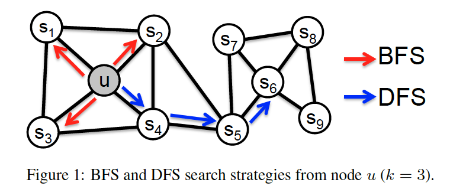

# 嵌入

类似于自然语言处理，由于程序表示形式为文本的源代码或者汇编指令，因此为了更好地使用神经网络对程序进行处理，通常需要对程序进行预处理，将程序的源代码或者汇编指令嵌入到数字空间中，形成向量之后，再进一步进行后续的工作。因此在使用神经网络对程序进行分析、处理之前，需要对嵌入的思想和方式进行大致了解。

* [Distributed Representations of Sentences and Documents](#distributed-representations-of-sentences-and-documents)：借助 **Word2vector** 的思想对自然语言文本的段落生成向量表示

## Graph Related

* [DeepWalk: online learning of social representations](#deepwalk-online-learning-of-social-representations)：采用随机游走策略产生节点嵌入
* [node2vec: Scalable Feature Learning for Networks](#node2vec-scalable-feature-learning-for-networks)：优化随机游走策略，对图节点嵌入方式进行优化
* [Structural Deep Network Embedding](#structural-deep-network-embedding)
* [graph2vec: Learning Distributed Representations of Graphs](#graph2vec-learning-distributed-representations-of-graphs)

---

## Distributed Representations of Sentences and Documents

*International conference on machine learning. PMLR, 2014.*

作者提到，为了表示文本信息，对文本信息进行向量化表示，最简单的方法是使用 **bag-of-words** 的方式。但是这种方式存在如下几个缺点：

* 这种表示方式未考虑文本内部单词之间的语义相关性；
* 这种表示方式通常有很高的维度，较稀疏，导致效率不高；

因此，作者提出了一种称为 **Paragraph Vector** 的形式对文本信息进行表示，这种方式可以使用定长的向量，表示变长的文本内容，且向量中包含一定的文本语义信息。

作者分析到，之前用来表示变长文本内容的方式都是从词的表示向量中拓展而来，其中有对得到的词向量作加权平均来得到完整的文本内容的表示，但是这种方式忽略了词与词之间的顺序关系；另一种方式是通过类似解析树的方式对文本内容进行解析，得到单词顺序之后组合词向量，但是这种方式只能适用于句子。

而作者提出的 Paragraph Vector 可以使用向量的形式来表示任意类型的文本，包括句子、段落甚至整个文档，而且在表示这些内容的同时在向量中包含一定的语义信息。

作者提出的方法基于 **Word2vector** 的思想，借助环境词来预测当前词，也就是最大化下面公式：

其中，具体的 `P` 可以通过 Softmax 来计算：

式中的 `y` 可以定义为如下形式：

其中 `h` 可以被定义为多个向量的拼接或者多个词向量求平均的操作。

作者认为，在训练 Paragraph Vector 的过程中，词向量由于可以捕获上下文关系，可以帮助提取语义信息，同时还能作为预测任务的间接结果。因此，在训练 Paragraph Vector 的过程中，用到了 Word Vector 的训练。

具体的，对于文本中的每一个段落，作者将其映射到唯一的一个向量中，同时，对于段落中的每一个词，也将其映射到另一个向量中，段落向量与词向量可以用拼接或者加权和的方式从而来预测上下文中的下一个词。单词的上下文可以看作是一个滑动窗口，在段落上滑动，从而得到不同的训练数据。在训练过程中，段落向量是每个段落唯一的，不会在段落之间共享，而段落内的词向量则在多个段落之间共享，即不同段落之间的相同词共享同一个词向量。最终训练完成后会分别得到每个段落的段落向量和每个词的词向量。

在预测阶段，对于每个新的段落，都需要采用与训练过程类似的步骤来训练新的段落向量，而保持其他参数不变。在训练得到段落向量之后，可以用这个向量进行更近一步的工作。

Paragraph Vector 的好处是可以在没有 `label` 的数据中表现良好，由于训练过程中具有语义信息，因此最终得到的段落向量拥有较好的语义特征。

最后作者使用几个数据集在情感分析和信息提取层面上，使用 Paragraph Vector 的方法提取出段落向量进行实验，均得到较好的结果。

## DeepWalk: online learning of social representations

*Proceedings of the 20th ACM SIGKDD international conference on Knowledge discovery and data mining. 2014.*

**To-Do**

## node2vec: Scalable Feature Learning for Networks

*Proceedings of the 22nd ACM SIGKDD international conference on Knowledge discovery and data mining. 2016.*

本文是图嵌入相关工作中的一篇经典的文章，作者通过提出的称为 **node2vec** 的方法，将图中的节点映射成为向量表示，所得到的向量表示可以为下游节点多标签分类任务或者边预测等任务提供较好的嵌入支持。**node2vec** 是一种半监督学习算法，通过借助 **SGD** 梯度下降算法优化目标函数，可以用于学习图中节点的特征。**node2vec** 的主要贡献在于随机游走的过程中对邻居节点的探索，作者通过提出的偏差随机游走（*biased random walks*）来更有效地探索某个节点的不同领域，从而更好地学习到邻居特征，来对每个节点的特征嵌入进行提取。此外，作者还提到，在学习到节点特征嵌入之后，可以使用简单的二阶操作，进一步得到边的特征嵌入，从而可以用于一些边预测等下游任务中。

首先，作者借鉴了 **NLP** 领域的 **SkipGram** 定义了目标函数：

其中 `Ns(u)` 表示通过某个策略探索得到的 `u` 节点的邻居节点，`f(u)` 函数则表示节点 `u` 的嵌入，最终通常是一个用于查表的矩阵。目标函数的意义就是可以找到一个合适的嵌入函数 `f`，使得 `u` 节点与其邻居节点的对应的目标函数值最大。

为了简化上述目标函数，作者提出了两个假设：

1. 条件独立性假设：假设对于节点 `u`，其邻居节点出现的概率相互独立；
2. 特征空间对称假设：某个节点在作为源节点与邻居节点时共享同一套向量空间；

基于上述两个假设，最终作者将目标函数简化成如下形式：

其中：

由于 **Zu** 在规模比较大的图中计算开销较大，因此作者使用负采样技术对其进行优化。

对图相关结构进行嵌入与 **NLP** 最大的不同是在 **NLP** 中本来就具有序列，而图相关结构没有对应的序列结构，因此目前都采用**随机游走**的方式产生相应的序列结构。

随机游走具有不同的策略，作者在文中提出了两种最基本的策略：深度优先采样（DFS）和广度优先采样（BFS），如下图所示：

通常对于一个图来说，图中的节点具有两种类型的相似性：同质性和结构等价。

对于同质性相似度来说，两个节点更有可能具有连通性，在图中的距离通常很近，如上图中的 `u` 和 `s1`，因此对于这种相似性，更适合用 DFS 来进行探索；对于结构等价来说，两个节点不一定直接相连，但是周边的连接结构很相似，如上图中的 `u` 和 `s6`，因此这种相似性更适合用 BFS 进行探索。

传统的随机游走公式如下所示：

</img>

而作者提出的偏差随机游走在计算随机游走概率时引入了一个偏差项，基本的思想是，如果当前的随机游走步骤通过节点 `t`，从 `t, v` 边走到了节点 `v`，那么下一步从节点 `v` 出发的游走选择会根据 `t` 节点与 `v` 节点的邻居节点（`x`）的关系来决定，偏差公式如下所示：

其中 `d` 表示两个节点之间的最短路径，因此 `d=0` 则表示 `t` 节点就是 `x` 节点，`d=1` 表示 `t` 节点与 `x` 节点有一条直接相连的边，`d=2` 表示 `t` 节点与 `x` 节点没有直接相连的边。最终的游走转移概率由下列公式计算得到：

其中 `w` 为边的权重。游走示意图如下所示：

通过引入这一偏差项，作者可以通过控制参数 `p` 和参数 `q` 来更好地控制游走策略，是偏向于 `BFS` 还是 `DFS`。

**node2vec** 算法如下：

对于边的嵌入，作者在使用 **node2vec** 得到每个节点的嵌入之后，定义一系列的二元操作，对于每两个节点之间的边，得到每一条边的嵌入：

最后，作者使用 **node2vec** 与其他图嵌入算法进行对比，分别就节点相似性、节点多标签分类、边预测等下游任务进行比对。此外，还进行了参数敏感性和可扩展性等的实验。

## Structural Deep Network Embedding

*Proceedings of the 22nd ACM SIGKDD international conference on Knowledge discovery and data mining. 2016.*

**To-Do**

## graph2vec: Learning Distributed Representations of Graphs

作者提到，之前对整个图进行嵌入的方法主要有采用核的方式（Graph Kernel），但是这种方式通常需要手动提取图中的一些特征，因此存在泛化性差的缺点。目前还有一些方法可以学习到子图的表示形式（例如节点、路径等），但是这些表示形式无法用来表示整个图。此外，还有一些方法只用于特定的任务，例如分类任务，这些方法需要大量的标签数据，来进行有监督学习。基于这些缺陷，作者提出基于神经网络的嵌入方式：**graph2vec**，这种方式通过无监督学习得到的嵌入可以与下游任务无关，因此得到的嵌入可以用作很多不同的下游任务。作者将整个图看作一个文档，将每一个节点围绕的子图看作单词，引入 **Doc2vec** 的思想，来对整个图实现嵌入，这种方式有以下几个好处：

1. 无监督表示学习；
2. 与下游任务无关；
3. 从大语料库中学习，无需手动提取的特征；
4. 提取结构相似性特征；

由于 **graph2vec** 主要基于 **Skip-Gram** 模型来实现，因此作者大致介绍了一下 **Skip-Gram** 的基本任务，主要是选定一个上下文窗口，在上下文窗口内部的词，做到最大化下面这个目标函数：

将这个公式展开之后可以得到如下公式：

如果直接使用统计的方法求解上述公式，则当单词数量很多的时候，会导致计算速度很慢。为了更有效地计算，通常会使用负采样的方法，随机选取不在窗口上下文中的单词来进行单词的训练，从而减少每次计算的时间。

此外，作者简单介绍了一下 **Doc2vec**，其目标函数如下，通过得到每个文档的嵌入以及从每个文档中抽样出词并求出词的嵌入进行计算：

**graph2vec** 则引入了 **Doc2vec** 的思想，将整个图看作一个文档，将子图看作文档中的单词。

作者提到，有根子图（rooted subgraphs）更适合于学习图嵌入，主要有一下几个原因：

1. 更好的结构特征：子图可以比较好地保留途中的顺序结构信息；
2. 可以更好地捕获图中的非线性信息；

基于此，**graph2vec** 算法可以分为两个主要的部分，首先是生成根子图，然后学习得到给定图的嵌入；算法如下图所示：

算法大致的流程是首先需要随机初始化图的嵌入（第二行），然后对于每一个节点，提取出根子图（第八行），并在多次迭代中学习图的嵌入（第三行到第十行）。