# 恶意样本

这里主要记录一些将 Deep Learning 与恶意样本检测结合的相关工作。

* [Graph Embedding based Familial Analysis of Android Malware using Unsupervised Learning](#graph-embedding-based-familial-analysis-of-android-malware-using-unsupervised-learning)

---

## Graph Embedding based Familial Analysis of Android Malware using Unsupervised Learning

*2019 IEEE/ACM 41st International Conference on Software Engineering (ICSE)*

这篇文章的作者主要实现了基于图嵌入算法的 Android 平台的恶意软件家族分类的无监督学习。作者认为，当前的 Android 平台恶意软件分析方法存在精度低（所提取文本特征在理解语义逻辑上还是稍差一点）、效率低（如果提取程序语义相关的图，使用图匹配算法效率较低）、缺少标注数据等问题。基于上述问题，作者提出了使用图嵌入算法，将高阶的图表示转化成低阶的向量表示，从而在保证准确性的同时提高匹配的效率，同时作者引入无监督学习算法，使得恶意样本家族分配的过程不依赖于有标签的数据。

作者首先提到，在 Android 生态系统中，有大量的恶意软件，但是这些恶意软件一般都是在正常软件中注入相似的恶意组件而实现恶意功能的，因此它们之间存在一定的共性。研究人员在分析这些恶意软件的时候，对于相似的恶意软件，实际上只需要分析其中的一个或几个就行，而不需要每个都进行分析，因此对这些恶意软件进行家族分类可以减轻安全研究人员的工作量。但是目前对恶意软件进行分析的方法中，存在一些问题（如上所述），作者为了解决这些问题，提出了名为 **GefDroid** 的方法，通过提取每个 Android 程序内部的函数调用图（**FCG**）来提取每个程序的特征，此外，为了更有效地比较两个 Android 程序的相似度，作者提出 **SRA** 的图嵌入方式，将函数调用图嵌入到向量空间。最后，考虑到恶意软件家族的特殊性，可能无法完全获得所有恶意样本的家族分类，同时对恶意样本训练集进行事先标注很耗费人力，因此作者将最终得到的向量嵌入应用到无监督学习中，来实现恶意样本的家族分类。

作者实现的 GefDroid 如下图所示：

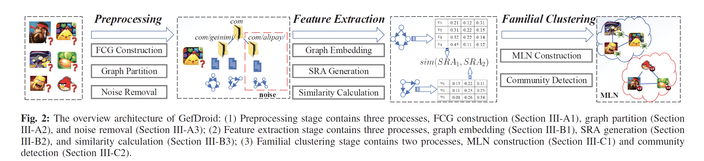

可以看到总体分为多个步骤来实现。

在预处理阶段，作者从 `.dex` 文件中反编译得到函数调用图，此外，作者认为完整的函数调用图太大了，而恶意软件通常是程序中的某一个小部分具有恶意行为，因此作者将完整的函数调用图以类为单位进行划分。最终得到多个子图。作者还考虑到，在软件中通常有一些通用的广告组件等，这类组件在各个软件中的相似度可能比较高，因此对于恶意软件识别来说属于噪点，需要去除，作者通过事先构建广告类相关的字典，通过匹配对这些噪点进行消除，对于混淆后的包，作者使用 **Deguard** 对这些包进行去混淆，然后再匹配去除。

在得到函数调用图之后，直观的方法是采用一种图嵌入算法，图中节点的嵌入，进一步得到整个图的嵌入。但是作者在实验中发现，由于随机性（作者称由于图嵌入算法的随机游走的方法），得到的节点嵌入通常是随机的，但是节点嵌入之间的距离是基本固定的，如下图为同一个图在采用 struc2vec 的两次结果：

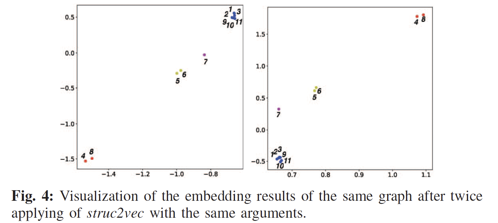

基于上述观察，作者进一步优化方法，将图的特征从简单的节点的嵌入向量的组合转化成多个节点之间的距离。由于用户定义的方法通常不具有共性，但是程序内部对 Android 的 API 的调用名称是不会改变的，因此作者最后将原来的函数调用图简化成只关注对敏感 API 的调用（关于 Android 敏感 API 的识别，作者借助了之前他人的工作）节点，作者将敏感 API 集合使用 **SA** 来表示。接着，对于每个子图，作者通过一系列算法生成 **SRA**。

具体地，对每个子图，首先通过 struc2vec 可以生成每一个调用 API 节点的嵌入，然后对每两个节点使用余弦相似度求相似度：

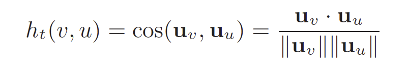

然后，使用每两个节点之间的相似度，得到 SRA：

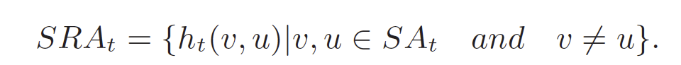

可以知道，SRA 的大小满足下列公式：

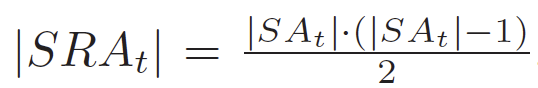

在得到每个子图的表示之后，需要确定一个比较每个子图相似度的方式。对比相似度需要满足下列两个直觉：

1. 如果两个子图共享较少的 SA 的调用，则两个 SRA 的相似性要比较低；
2. 如果两个子图中的 SA 调用的结构特征不太相似，则两个 SRA 的相似性也应该比较低；

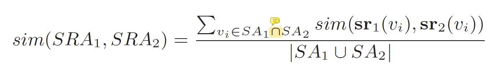

注意式中的交集，因此对于相似度的比较只考虑两者共有的 SA。

此外，为了定义式中的 `sr(v)`，作者引入了一个矩阵 `D`，定义如下：

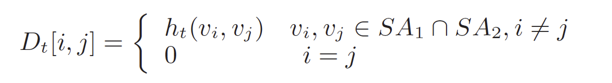

那么 `sr(v)` 的定义：

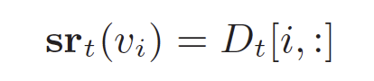

实际上 `sr` 的含义是当前节点（`v_i`） 与其他所有节点的相似度拼接起来的一个向量。最后，作者定义 `sim(sr, sr)` 如下：

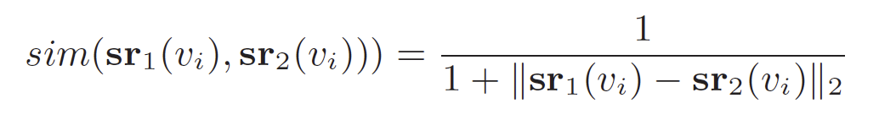

在可以计算多个子图之间的相似度之后，作者构建 **MLN** 来进行无监督学习。对于每两个恶意软件，遍历他们之间的 SRA，如果 SRA 的相似度超过了某个阈值，则认为两个 SRA 相似。而对于整个恶意软件来说，如果相似的 SRA 超过一个阈值，则在 MLN 中将这两个恶意软件加一条边。最终实现聚类算法，如下图所示：

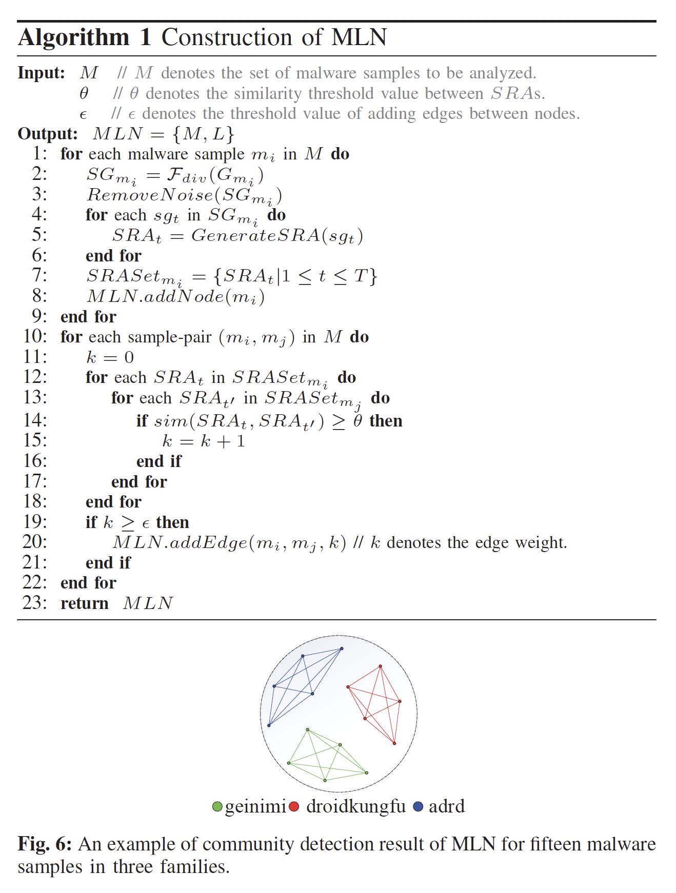

作者最后与多个算法使用 3 个数据集进行对比，可以看到在准确性、效率等方面均有所提高。此外，由于对比的算法（baseline）均是有监督学习，作者对其进行了部分修改，最终均使用相同的聚类算法（作者通过实验得到的效果最好的算法）进行比较，最终结果如下：

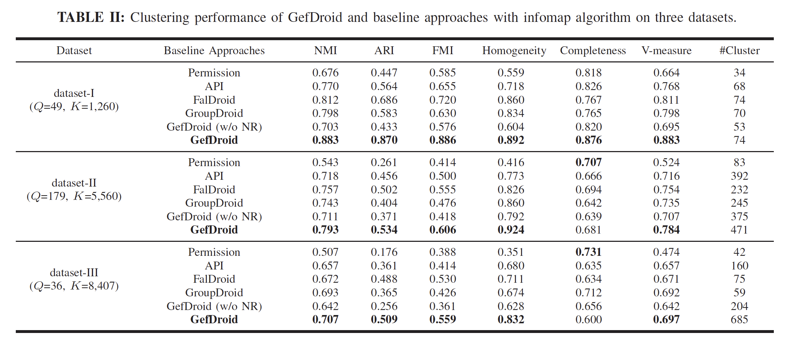

文章的最后，作者也提到了少数当前工作所存在的缺点。