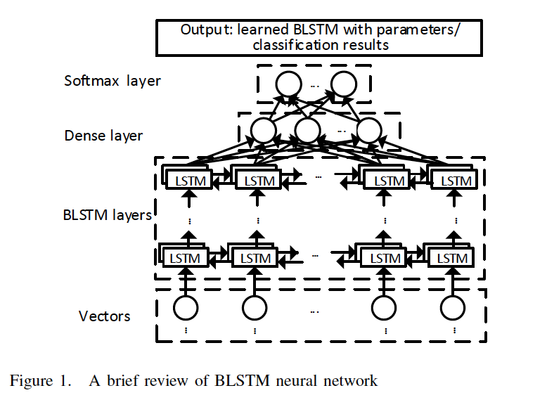
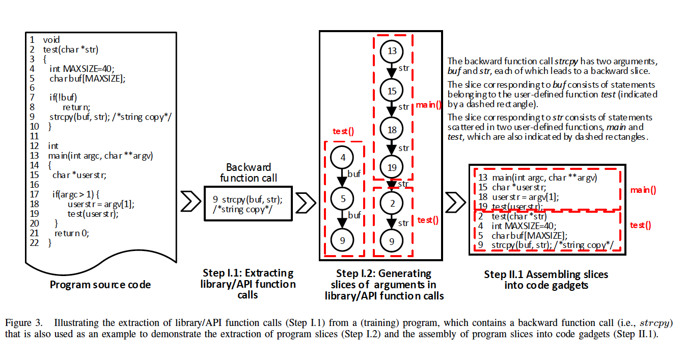
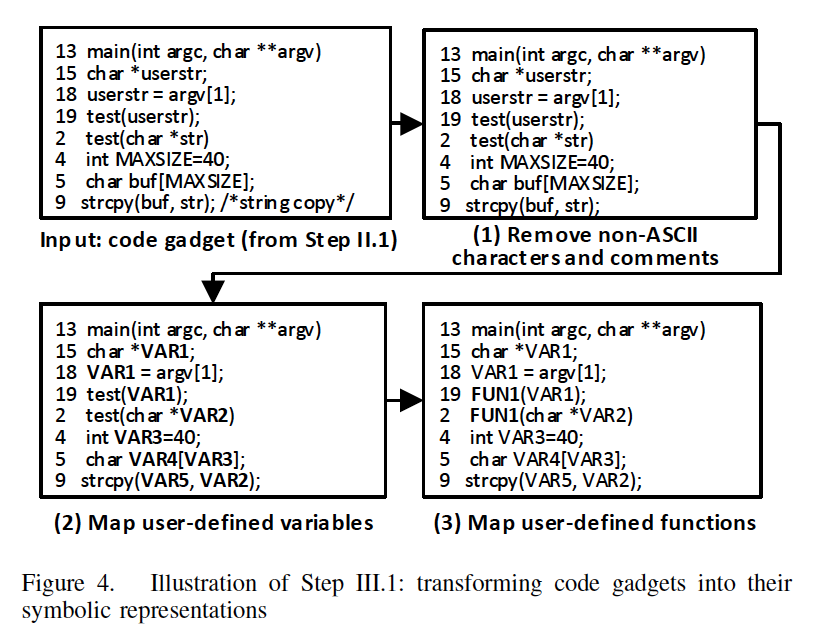
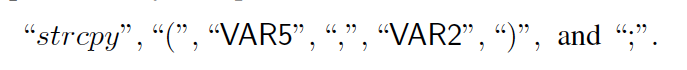
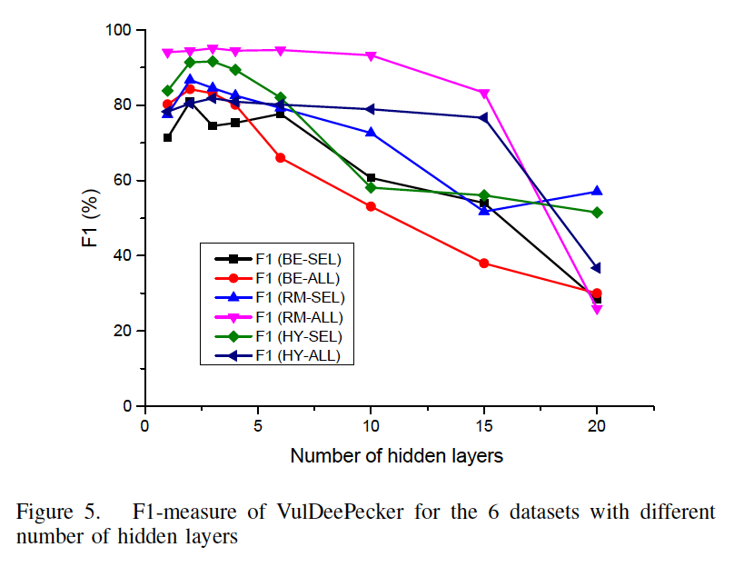
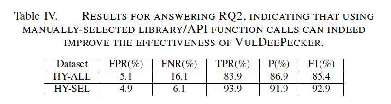
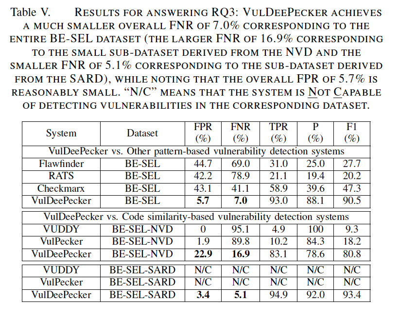
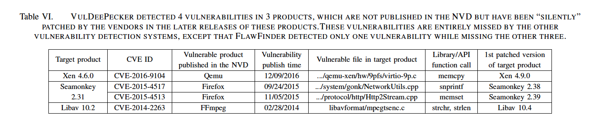

# 漏洞

这里主要记录一些将 Deep Learning 和程序漏洞相关工作结合的文章。

* [Devign: Effective Vulnerability Identification by Learning Comprehensive Program Semantics via Graph Neural Networks](#devign-effective-vulnerability-identification-by-learning-comprehensive-program-semantics-via-graph-neural-networks)
* [VulDeePecker: A Deep Learning-Based System for Vulnerability Detection](#vuldeepecker-a-deep-learning-based-system-for-vulnerability-detection)

---

## Devign: Effective Vulnerability Identification by Learning Comprehensive Program Semantics via Graph Neural Networks

*NeurIPS 2019*

这篇文章用到了图神经网络对源代码函数中的漏洞进行检测。对于漏洞检测来说，除了使用静态分析、动态分析以及符号执行等方法之外，现在也开始使用机器学习的方式对具有漏洞的代码进行检测。但是早期的机器学习方法依赖于人工专家对漏洞特征进行提取，由于漏洞的多样性以及越来越多的漏洞的出现，这种方式无法很好地将全部的漏洞特征提取出来，而且不具有很好的拓展性。

最近的工作有使用深度学习的方式，来使得对源代码特征提取的过程更加自动化，从而可以减少专家知识的干预。但是目前的方法均无法提取到程序的高级语义信息。因为目前的这些方式都将程序看作平整的文本流，然后使用 NLP 的方式对这些信息进行除了，这样的处理方式无法有效地保留应用程序的高级特征。源代码通常是结构化的，可以将源代码转化成 AST、CFG、DFG 等形态的特征来进行表示，而且漏洞出现的逻辑特征通常是比较微小的，直接展成扁平化序列的方式可能会使这种微小的信息被忽视。

基于源代码的结构化特征，作者提出使用图神经网络的基本模型，对每个函数的节点特征进行迭代求解，在得到每个节点的向量化表示之后，再采用一个卷积层，对整个函数是否具有漏洞进行检测。作者最终基于这一思想实现了一个名为 **Devign** 的模型系统。

Devign 模型由 3 层结构组成：

1. 图嵌入层：将函数源码在保留高阶语义特征的情况下嵌入到图中；
2. Gated Graph Recurrent 层：图节点迭代算法，通过邻居节点的特征更新当前节点特征，并不断迭代；
3. 卷积层：针对得到的节点信息预测函数是否具有漏洞（将漏洞检测问题转化为一个二分类问题）

作者将漏洞检测问题转化为一个二分类问题之后，得到的损失函数定义如下：

其中，`g` 表示对于每个函数源代码，将函数源代码嵌入成图（对应图嵌入层），`f` 表示对于每个得到的嵌入图，进行二分类，求解该函数是否具有漏洞（对应 GGR 层和卷积层）。`L` 为交叉熵损失函数。

对于图嵌入层来说，为了更好地保留程序原有的语义信息，最好的方式是采用 AST、CFG 或 DFG。对于漏洞检测的问题来说，如果只使用一种 AST 的方式来表示目标代码，可能只能发现一种单一的漏洞。为了可以发现多种类型的漏洞，作者同时结合了多个代码表示形式，包括 AST、CFG、DFG 和 NCS（Natural Code Sequence），这些图的节点相同，但是边不同，这样对于每一个函数代码可以得到多个邻接矩阵。例如下图：

由上图可以知道，图中的每个节点都包含代码（`a=a+b`）和类型（`Assignment`）两个类型，作者使用 **Word2vec** 的方式对整个代码语料库进行编码，得到每个节点的代码初始特征，同时对类型进行标签化嵌入，最后将两个向量拼接，得到每个节点的初始化特征向量。

之后，进入 Gated Graph Recurrent 层，该层通过不断迭代传递每个节点的邻居特征向量信息，来更新当前节点的特征表示。通过不同类型的邻接矩阵来得到邻居节点的特征信息，可以得到如下公式：

其中 `t` 表示迭代次数，`h` 就是每个节点在某个迭代次数下的特征向量，`A` 表示某个类型的图的邻接矩阵（与 `A` 做运算可以保证只在有边相连的情况下会对节点信息进行传递）。

在得到新的状态 `a` 之后，再使用一个 **GRU** 单元，完成对当前节点的特征向量进行更新：

其中 **AGG** 是一些常规的运算，例如 Max、Min、Sum 等。

通过上述迭代过程迭代 **T** 次之后，得到的每个节点向量最终作为传送给卷积层的向量。

之前所使用的卷积方法会首先对这些节点进行排序，但是作者提到由于之前的 Gated Graph Recurrent 层已经将节点之间的关系信息在迭代过程中传递了，因此得到的节点向量实际上应该会包含节点之间的顺序信息，所以无需再对节点信息进行排序。作者提出直接使用 1-D 卷积的方式，对最终的节点信息进行卷积，经过多层这样的卷积，具体的卷积公式如下：

最终进行将得到的卷积结果使用 **Sigmoid** 分类器进行分类：

通过阅读源码发现，具体在实现过程中，为了矩阵的维度对齐，作者将每个函数对应的初始矩阵假设为 `205 * 101`，即假设每个函数都有 `205` 个节点。

此外，在数据集的使用上，作者认为目前所使用的漏洞检测数据集都使用自动标注，缺乏准确性，因此作者通过开源项目的 `git commit` 记录，识别出与漏洞相关的 `commit`，从而定位到漏洞函数。

作者最终进行实验，与多个 Baseline 模型进行比较，得到的实验结果如下图所示：

可以看到，在同时使用 AST、CFG 和 DFG 的情况下，可以取得最好的效果。

## VulDeePecker: A Deep Learning-Based System for Vulnerability Detection

*NDSS 2018.*

这篇文章提出了基于深度学习的静态源码漏洞检测的方法。作者提出，之前的自动漏洞检测方法存在两个主要的问题，一个是大量依赖人类专家知识，这使得自动化漏洞检测的方式不是很高效；另一个是之前的工作存在大量的漏报和误报，而对于漏洞检测来说，不应该存在大量的漏报。作者使用深度学习的方式对静态源码进行漏洞检测，首先提出了将程序进行向量化表示的方法，并实现漏洞检测系统 **VulDeePecker**，此外，作者还开源了所使用的数据集：<https://github.com/CGCL-codes/VulDeePecker>。

首先，为了可以将深度学习应用到源码检测中，需要将程序表示为向量的形式，同时还需要保留目标代码的语义。作者提出的基本想法是将程序转化成保留语义信息的中间表示形式（*code gadget*），之后将中间表示形式转化成向量。此外，由于目标的任务不只是将目标代码判断是否存在漏洞，还需要进一步定位到存在漏洞的地方，因此需要确保代码表示形式的粒度足够小。作者所使用的 *code gadget* 为包含若干行的很小的代码片段，因此可以满足细粒度这一条件。

另一个主要的问题是如何选取合适的神经网络来处理目标代码。由于代码具有上下文信息，因此可以借鉴自然语言处理领域中的。作者首先考虑了 **RNN**，但是由于单纯的 **RNN** 存在梯度消失的问题，因此作者进一步考虑结合 **LSTM** 来对语言表示进行处理。但是对于程序函数来说，其参数除了被前面的语句影响之外，还会被后续的语句影响，因此作者最终使用 **Bidirectional LSTM** 对漏洞进行检测。最终的网络结构如下图所示：

之后，作者首先定义了 *code gadget* 的概念。*code gadget* 由若干代码的语句组成，在各个语句之间存在数据依赖或控制依赖。为了生成 *code gadget*，作者提出了关键点的概念。关键点与特定的漏洞类型相关，对于 **API** 误用相关的漏洞，关键点是 **API** 的调用点；对于数组访问相关的漏洞，关键点是数组。在得到关键点之后，借助切片技术，对关键点周围的代码进行切片，得到最终的 *code gadget*。

最终 **VulDeePecker** 有两个阶段组成，分别是学习阶段和检测阶段。

在学习阶段，又可以分为 4 个步骤。第一步提取 API 的调用以及根据 API 调用的参数获得相应的程序切片。第二步将程序切片组装成 *code gadget*。*code gadget* 不一定在程序上是连续的语句，但是在语义上是相互关联的。在得到 *code gadget* 之后，对其打标签（即根据是否存在漏洞标记 `0`/`1`）。第三步将 *code gadget* 转换成向量表示形式，首先将 *code gadget* 转化为符号表示形式，然后将符号表示形式转化为向量表示形式。第四步则使用得到的向量训练 **Bidirectional LSTM** 模型。检测阶段则将得到的向量表示形式输入到模型之后，输出相应的标签，表示该 *code gadget* 是否包含漏洞。

在提取 API 时，作者区分前向 API（会从外界获得数据的 API，例如 `recv` 等）和后向 API。对于前向 API，那些使用前向 API 中的参数的语句可能会受该 API 影响；而对于后向 API，影响该 API 中的参数的语句可能非常重要。因此，在切片阶段，也根据所定义的前向 API 和后向 API，来进行前向切片和后向切片。对于切片，作者使用 **Checkmarx** 来完成。对于一些需要突破当前函数边界的参数切片，也会继续分析上一个或者下一个函数的参数，例如下图针对 `strcpy` 函数进行方向切片，对于 `str` 参数会涉及到上一层的 `main` 函数：

在得到切片之后，对切片组装形成 *code gadget*。如果涉及到多个函数，且这多个函数在之前有顺序，则会按照函数原本顺序进行组装，否则会根据随机顺序来组装。

之后对 *code gadget* 进行符号化，总的来说就是移除与漏洞无关的部分，包括注释等，之后将一些变量替换成统一的形式（例如 **VAR1**），如下图所示：

之后，对语句进行词法分析，拆成 *token* 之后，使用 **Word2vec** 进行训练，得到每个 *token* 的向量表示形式，之后以序列的方式得到整个 *code gadget* 的嵌入。由于 **BLSTM** 需要接受定长输入，因此引入定长阈值，如果超过阈值的长度，对于后向 API，舍弃掉前面相应长度的语句，对于前向 API 则相反。对 `strcpy(VAR5, VAR2);` 进行 *token* 拆分的结果如下图所示：

作者主要针对资源管理漏洞和缓冲区错误漏洞进行研究。在训练过程中，主要使用从 **SARD** 中以及选定的 19 个开源项目中获得的数据，从中提取 *code gadget* 之后，对 *code gadget* 打标签，对于从开源项目中提取出来的 *code gadget*，其对比 NVD 中的补丁，如果补丁中对该行代码进行修改，则认为该 *code gadget* 中包含漏洞，最后再对所有标记为 1 的 *code gadget* 进行手动检查；对于从 **SARD** 中提取出来的 *code gadget*，因为其已经区分了 Good 与 Bad，对于 Good 中提取出来的 *code gadget* 直接将其标记为 1，而对于 Bad 中提取出来的则如果其包含漏洞语句，则标为 0，否则也标为 1。

在实验阶段，作者主要提出了 3 个问题：

1. VulDeePecker 是否可以同时处理多个类型的漏洞？
2. 人类专家只是是否可以提高 VulDeePecker 的准确性？
3. 与其他漏洞挖掘方法对比，VulDeePecker 的效果怎么样？

通过调整隐藏层的数量对 **BLSTM** 进行训练，训练得到的结果示意图如下所示：

为了验证问题 1，作者提供了 6 个数据集，如上图所示，最终发现 VulDeePecker 可以同时处理多个类型的的漏洞（HY-SEL 和 HY-ALL），但是在数据集中包含较少 API 调用的情况下效果稍好。此外，这两个数据集的情况也说明了问题 2，在人工专家干预的情况下，VulDeePecker 的性能会更好，详细程度如下图所示：

之后作者验证了问题 3，与多个类似的基于模式的或者基于相似度的漏洞检测系统进行比较，发现基于深度学习的方式确实可以对发现漏洞有帮助，如下图所示：

最后，作者在 3 个软件产品中进行实验，发现了一些真实的 0-day 漏洞：

