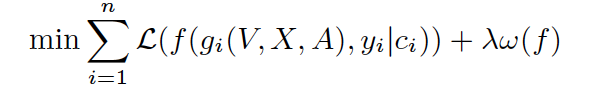
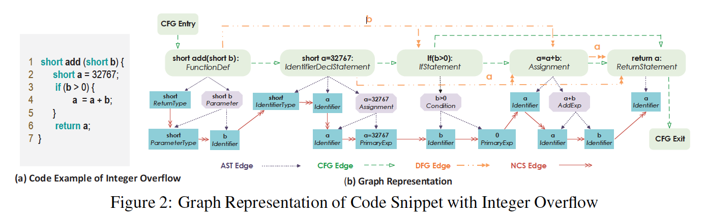
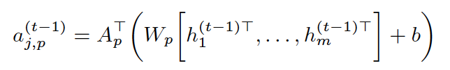
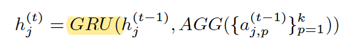
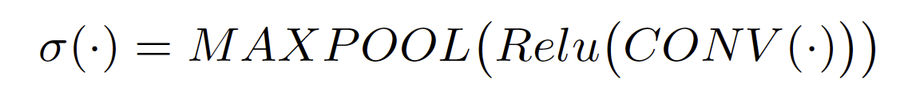
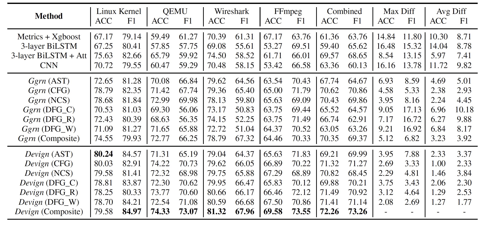

# 漏洞

这里主要记录一些将 Deep Learning 和程序漏洞相关工作结合的文章。

* [Devign: Effective Vulnerability Identification by Learning Comprehensive Program Semantics via Graph Neural Networks](#devign-effective-vulnerability-identification-by-learning-comprehensive-program-semantics-via-graph-neural-networks)

---

## Devign: Effective Vulnerability Identification by Learning Comprehensive Program Semantics via Graph Neural Networks

*NeurIPS 2019*

这篇文章用到了图神经网络对源代码函数中的漏洞进行检测。对于漏洞检测来说，除了使用静态分析、动态分析以及符号执行等方法之外，现在也开始使用机器学习的方式对具有漏洞的代码进行检测。但是早期的机器学习方法依赖于人工专家对漏洞特征进行提取，由于漏洞的多样性以及越来越多的漏洞的出现，这种方式无法很好地将全部的漏洞特征提取出来，而且不具有很好的拓展性。

最近的工作有使用深度学习的方式，来使得对源代码特征提取的过程更加自动化，从而可以减少专家知识的干预。但是目前的方法均无法提取到程序的高级语义信息。因为目前的这些方式都将程序看作平整的文本流，然后使用 NLP 的方式对这些信息进行除了，这样的处理方式无法有效地保留应用程序的高级特征。源代码通常是结构化的，可以将源代码转化成 AST、CFG、DFG 等形态的特征来进行表示，而且漏洞出现的逻辑特征通常是比较微小的，直接展成扁平化序列的方式可能会使这种微小的信息被忽视。

基于源代码的结构化特征，作者提出使用图神经网络的基本模型，对每个函数的节点特征进行迭代求解，在得到每个节点的向量化表示之后，再采用一个卷积层，对整个函数是否具有漏洞进行检测。作者最终基于这一思想实现了一个名为 **Devign** 的模型系统。

Devign 模型由 3 层结构组成：

1. 图嵌入层：将函数源码在保留高阶语义特征的情况下嵌入到图中；
2. Gated Graph Recurrent 层：图节点迭代算法，通过邻居节点的特征更新当前节点特征，并不断迭代；
3. 卷积层：针对得到的节点信息预测函数是否具有漏洞（将漏洞检测问题转化为一个二分类问题）

作者将漏洞检测问题转化为一个二分类问题之后，得到的损失函数定义如下：

其中，`g` 表示对于每个函数源代码，将函数源代码嵌入成图（对应图嵌入层），`f` 表示对于每个得到的嵌入图，进行二分类，求解该函数是否具有漏洞（对应 GGR 层和卷积层）。`L` 为交叉熵损失函数。

对于图嵌入层来说，为了更好地保留程序原有的语义信息，最好的方式是采用 AST、CFG 或 DFG。对于漏洞检测的问题来说，如果只使用一种 AST 的方式来表示目标代码，可能只能发现一种单一的漏洞。为了可以发现多种类型的漏洞，作者同时结合了多个代码表示形式，包括 AST、CFG、DFG 和 NCS（Natural Code Sequence），这些图的节点相同，但是边不同，这样对于每一个函数代码可以得到多个邻接矩阵。例如下图：

由上图可以知道，图中的每个节点都包含代码（`a=a+b`）和类型（`Assignment`）两个类型，作者使用 **Word2vec** 的方式对整个代码语料库进行编码，得到每个节点的代码初始特征，同时对类型进行标签化嵌入，最后将两个向量拼接，得到每个节点的初始化特征向量。

之后，进入 Gated Graph Recurrent 层，该层通过不断迭代传递每个节点的邻居特征向量信息，来更新当前节点的特征表示。通过不同类型的邻接矩阵来得到邻居节点的特征信息，可以得到如下公式：

其中 `t` 表示迭代次数，`h` 就是每个节点在某个迭代次数下的特征向量，`A` 表示某个类型的图的邻接矩阵（与 `A` 做运算可以保证只在有边相连的情况下会对节点信息进行传递）。

在得到新的状态 `a` 之后，再使用一个 **GRU** 单元，完成对当前节点的特征向量进行更新：

其中 **AGG** 是一些常规的运算，例如 Max、Min、Sum 等。

通过上述迭代过程迭代 **T** 次之后，得到的每个节点向量最终作为传送给卷积层的向量。

之前所使用的卷积方法会首先对这些节点进行排序，但是作者提到由于之前的 Gated Graph Recurrent 层已经将节点之间的关系信息在迭代过程中传递了，因此得到的节点向量实际上应该会包含节点之间的顺序信息，所以无需再对节点信息进行排序。作者提出直接使用 1-D 卷积的方式，对最终的节点信息进行卷积，经过多层这样的卷积，具体的卷积公式如下：

最终进行将得到的卷积结果使用 **Sigmoid** 分类器进行分类：

通过阅读源码发现，具体在实现过程中，为了矩阵的维度对齐，作者将每个函数对应的初始矩阵假设为 `205 * 101`，即假设每个函数都有 `205` 个节点。

此外，在数据集的使用上，作者认为目前所使用的漏洞检测数据集都使用自动标注，缺乏准确性，因此作者通过开源项目的 `git commit` 记录，识别出与漏洞相关的 `commit`，从而定位到漏洞函数。

作者最终进行实验，与多个 Baseline 模型进行比较，得到的实验结果如下图所示：

可以看到，在同时使用 AST、CFG 和 DFG 的情况下，可以取得最好的效果。