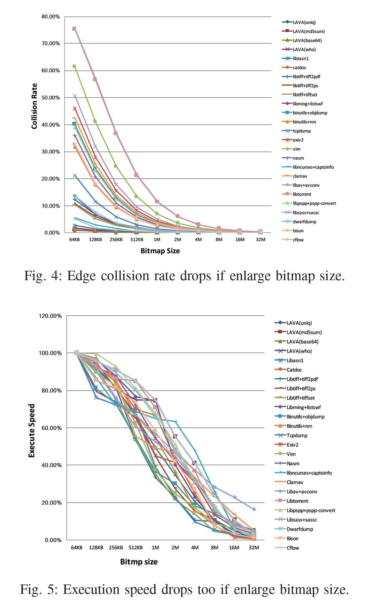
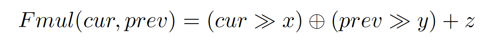
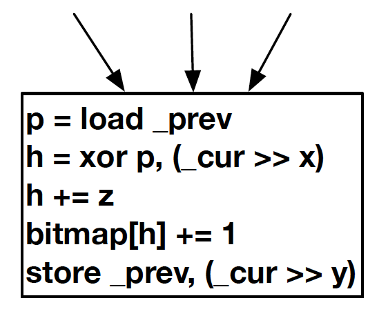
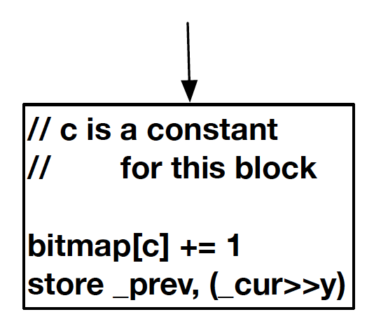
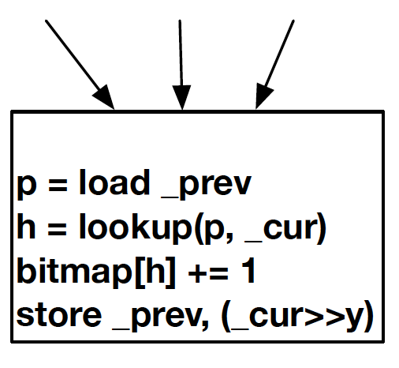
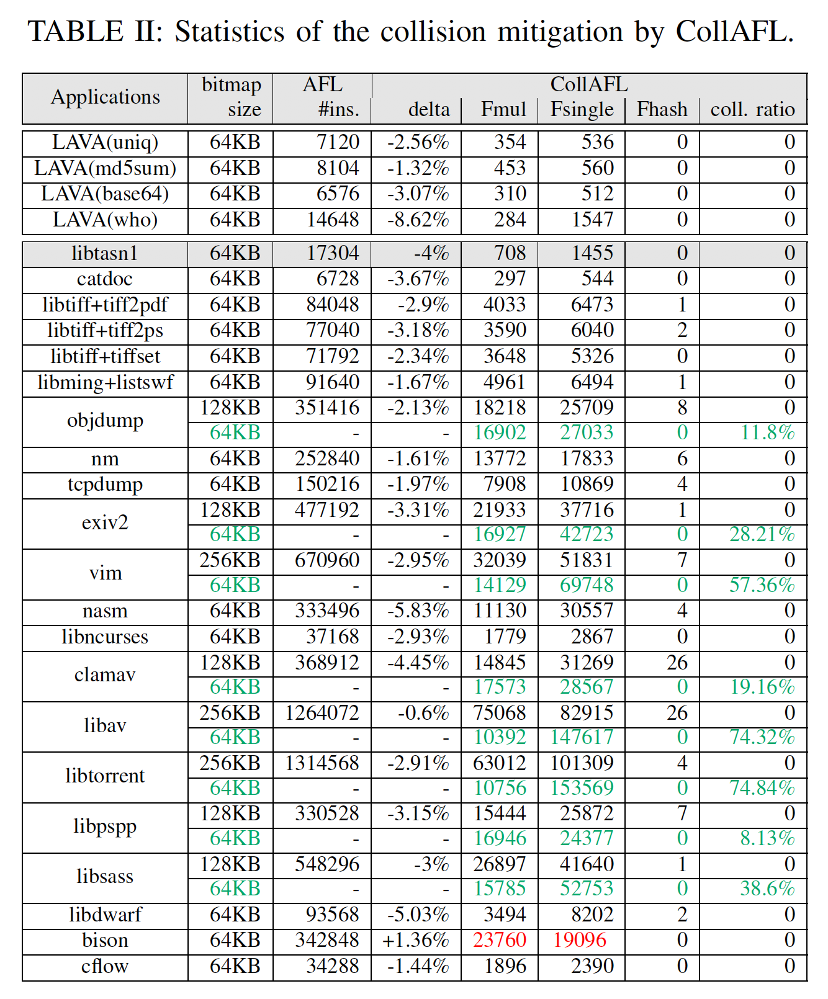
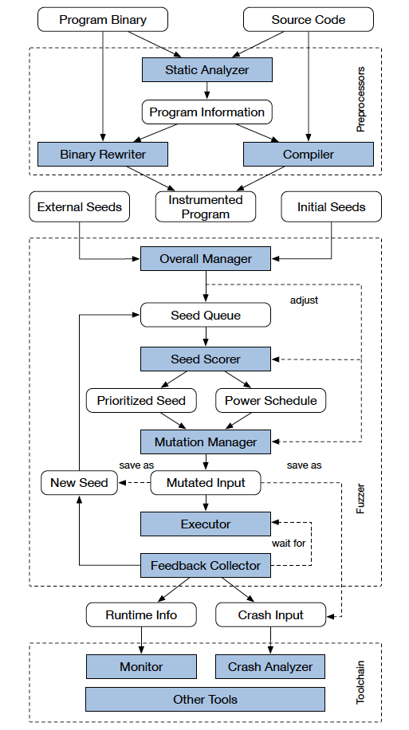

# Papers

* [CollAFL: Path Sensitive Fuzzing](#collafl-path-sensitive-fuzzing)
* [FOT: A Versatile, Configurable, Extensible Fuzzing Framework](#fot-a-versatile-configurable-extensible-fuzzing-framework)
* [The Art, Science, and Engineering of Fuzzing: A Survey](#the-art-science-and-engineering-of-fuzzing-a-survey)

---

## CollAFL: Path Sensitive Fuzzing

*2018 IEEE Symposium on Security and Privacy (SP)*

本篇文章的作者发现在基于覆盖率的模糊测试的过程中，例如 AFL，为了节省开销，会使用较粗粒度的覆盖率信息（具体到 AFL 就是对 Edge 求哈希值时遇到哈希冲突的问题），而这样就会由于覆盖率信息统计的不正确而导致无法区分两条不同的路径，从而使得新路径可能被忽略，这会影响模糊测试的效率和性能。此外，作者还指出由于覆盖率信息的不准确，会影响其他一些基于覆盖率信息作出调整的模糊测试工具的性能，例如 AFLFast、AFLGo 等。

因此，作者提出了一种**可以使用较精细粒度的覆盖率信息统计方式来更好地指导模糊测试**，此外，作者还提出了 **3 种可以更有效指导模糊测试种子选择**的策略。

作者发现 AFL 使用的 Edge 统计方案是最好的覆盖率信息统计方法，因此作者基于 AFL 的方法进行改进。作者认为，要解决 AFL 中的哈希碰撞的问题，最简单的办法是增大用于存放哈希信息的 Bitmap 的容量，但是即使将容量增大了，仍然无法完全解决哈希碰撞的问题，且还会导致模糊测试的性能大幅度降低。作者还基于这一点做了实验，实验证明这种最简单的方案效果确实会大大降低模糊测试的执行速度：

那么作者是如何解决的呢？作者首先提出了一个对于每一条 Edge 进行计算哈希值的基本公式：

这条公式与原本 AFL 的计算方式其实差不多，只是相比于 AFL 多了 `x`、`y`、`z` 三个参数，因此增加了计算哈希时的多样性，从而减少哈希冲突的几率。在进行模糊测试之前，通过静态分析结合贪心算法求得这 3 个参数的值，然后每一条 Edge 的 End Block（即流向的 Block）会存储这 3 个参数，同时 `prev >> y` 由全局变量进行保存（每计算一条 Edge 都会更新），从而更好地计算 Edge 的哈希值，如下图所示（Fmul）：

但是即使多使用了 3 个参数，对于应用程序这么庞大的状态空间来说，也不一定是有解的，因此作者继续考虑了两种情况：

如果当前基本块只有一个前驱节点，也即执行到当前基本块时的 Edge 的哈希值是定的，因此直接生成一个定的哈希值，存储在该基本块中，如下图所示（Fsingle）：

对于剩下的还是无法求解对应不同的哈希值（Unique）的 `x`、`y`、`z` 三个参数的情况下，则构建一个哈希表，使用当前节点（`cur`）与前一个节点（`prev`）作为键进行查询（Fhash）：

通过这种方式，可以确保每一条边得到的哈希值都是不同的。

那么对于上述三种方式的性能来说，肯定是 Fhash 方式最低，Fsingle 方式最快。作者分析发现，Fsingle 通常在应用程序中占大多数，而 Fhash 通常是占极小部分的，因此使用这种方式反而会提升求 Edge 哈希的效率：

此外，作者还提出了 3 种种子选择的优先级策略：

* 作者认为，那些存在大量未遍历到的邻居基本块的测试用例应该优先被进行突变；
* 作者认为，那些存在大量未遍历到的邻居基本块后继节点的测试用例也应该优先被突变；
* 作者认为，具有大量操作内存的指令的基本块更有可能存在漏洞，因此也需要优先被突变；

基于上述这些思想，作者实现了原型系统，并进行了充足的实验，最终性能得到了很大的提升。

## FOT: A Versatile, Configurable, Extensible Fuzzing Framework

*Proceedings of the 2018 26th ACM Joint Meeting on European Software Engineering Conference and Symposium on the Foundations of Software Engineering*

本篇文章作者提出了一种高度模块化、可拓展的模糊测试框架。作者认为现在基于灰盒模糊测试已经有很多工作，取得了不错的成果，但是缺少模块化的模糊测试方案，无法快速集成新技术来验证有效性，导致在实现某一个 Feature 的时候经常需要对现有模糊测试工具的代码进行大幅修改。

基于这个想法，作者实现了一个框架，该框架具有如下性质：

* 多功能：提供包括静态分析和动态分析等辅助模糊测试过程的充足的功能；
* 可配置：提供多个配置选项，可以对模糊测试过程中的各个模块进行定制化配置；
* 可拓展：对于模糊测试过程中的部分模块，提供很强的拓展性，从而可以对部分模块进行定制；

作者实现的框架的架构图如下：

其中蓝色的框表示的部分为可以进行配置和拓展的模块。对于 **Static Analyzer** 模块，可以对该模块进行自定义，从 PUT 中提取对应的信息并转化成指定的形式。对于 **Overall Manager** 模块，可以进行定制，从指定的目录获取种子文件，放入 **Seed Queue** 中。**Seed Scorer** 模块可以对 **Seed Queue** 中的种子进行定制化打分，从而实现种子调度策略的定制。**Mutation Manager** 模块则可以对所采用的突变器进行定制。**Executor** 则可以根据是否需要 `forkserver` 来进行配置。**Feedback Collector** 可以对需要收集哪些反馈信息进行定制（*但是反馈信息收集一般需要跟插桩阶段结合，因此是不是需要协同前面的插桩模块进行统一定制化？*）

作者基于模块化的模糊测试框架，实现了几种不同类型的模糊测试方案：

1. 静态漏洞分析集成方案：首先对 PUT 进行静态分析，得到每个函数所对应的漏洞分数，之后使用函数级别的插桩方式对 PUT 进行插桩，每次执行完成后，收集测试用例的函数覆盖信息，并根据之前计算得到的漏洞分数对当前测试用例进行优先级调度；
2. 导向型灰盒模糊测试：作者根据导向型模糊测试的原理，对静态分析模块、插桩模块、反馈收集模块、种子调度模块以及突变模块进行定制化，通过计算每个基本块与 Target 的距离，并在插桩阶段插入距离信息，在反馈收集阶段收集当前测试用例与 Target 的距离，然后对种子进行调度，在突变阶段根据距离调整突变粒度，从而实现导向型灰盒模糊测试；

## The Art, Science, and Engineering of Fuzzing: A Survey
