# Papers

* [CollAFL: Path Sensitive Fuzzing](#collafl-path-sensitive-fuzzing)
* [FOT: A Versatile, Configurable, Extensible Fuzzing Framework](#fot-a-versatile-configurable-extensible-fuzzing-framework)
* [The Art, Science, and Engineering of Fuzzing: A Survey](#the-art-science-and-engineering-of-fuzzing-a-survey)
* [Driller: Augmenting Fuzzing Through Selective Symbolic Execution](#driller-augmenting-fuzzing-through-selective-symbolic-execution) 
* [PAFL: Extend Fuzzing Optimizations of Single Mode to Industrial Parallel Mode](#pafl-extend-fuzzing-optimizations-of-single-mode-to-industrial-parallel-mode)
* [Qsym : A Practical Concolic Execution Engine Tailored for Hybrid Fuzzing](#qsym-a-practical-concolic-execution-engine-tailored-for-hybrid-fuzzing) 
* [MOpt: Optimized Mutation Scheduling for Fuzzers](#mopt-optimized-mutation-scheduling-for-fuzzers) 
* [IJON: Exploring Deep State Spaces via Fuzzing](#ijon-exploring-deep-state-spaces-via-fuzzing) 
* [Profuzzer: On-the-fly input type probing for better zero-day vulnerability discovery](#profuzzer-on-the-fly-input-type-probing-for-better-zero-day-vulnerability-discovery)
* [Send Hardest Problems My Way: Probabilistic Path Prioritization for Hybrid Fuzzing](#send-hardest-problems-my-way-probabilistic-path-prioritization-for-hybrid-fuzzing)
* [EnFuzz: Ensemble Fuzzing with Seed Synchronization among Diverse Fuzzers](#enfuzz-ensemble-fuzzing-with-seed-synchronization-among-diverse-fuzzers)

---

## CollAFL: Path Sensitive Fuzzing

*2018 IEEE Symposium on Security and Privacy (SP)*

本篇文章的作者发现在基于覆盖率的模糊测试的过程中，例如 AFL，为了节省开销，会使用较粗粒度的覆盖率信息（具体到 AFL 就是对 Edge 求哈希值时遇到哈希冲突的问题），而这样就会由于覆盖率信息统计的不正确而导致无法区分两条不同的路径，从而使得新路径可能被忽略，这会影响模糊测试的效率和性能。此外，作者还指出由于覆盖率信息的不准确，会影响其他一些基于覆盖率信息作出调整的模糊测试工具的性能，例如 AFLFast、AFLGo 等。

因此，作者提出了一种**可以使用较精细粒度的覆盖率信息统计方式来更好地指导模糊测试**，此外，作者还提出了 **3 种可以更有效指导模糊测试种子选择**的策略。

作者发现 AFL 使用的 Edge 统计方案是最好的覆盖率信息统计方法，因此作者基于 AFL 的方法进行改进。作者认为，要解决 AFL 中的哈希碰撞的问题，最简单的办法是增大用于存放哈希信息的 Bitmap 的容量，但是即使将容量增大了，仍然无法完全解决哈希碰撞的问题，且还会导致模糊测试的性能大幅度降低。作者还基于这一点做了实验，实验证明这种最简单的方案效果确实会大大降低模糊测试的执行速度：

那么作者是如何解决的呢？作者首先提出了一个对于每一条 Edge 进行计算哈希值的基本公式：

这条公式与原本 AFL 的计算方式其实差不多，只是相比于 AFL 多了 `x`、`y`、`z` 三个参数，因此增加了计算哈希时的多样性，从而减少哈希冲突的几率。在进行模糊测试之前，通过静态分析结合贪心算法求得这 3 个参数的值，然后每一条 Edge 的 End Block（即流向的 Block）会存储这 3 个参数，同时 `prev >> y` 由全局变量进行保存（每计算一条 Edge 都会更新），从而更好地计算 Edge 的哈希值，如下图所示（Fmul）：

但是即使多使用了 3 个参数，对于应用程序这么庞大的状态空间来说，也不一定是有解的，因此作者继续考虑了两种情况：

如果当前基本块只有一个前驱节点，也即执行到当前基本块时的 Edge 的哈希值是定的，因此直接生成一个定的哈希值，存储在该基本块中，如下图所示（Fsingle）：

对于剩下的还是无法求解对应不同的哈希值（Unique）的 `x`、`y`、`z` 三个参数的情况下，则构建一个哈希表，使用当前节点（`cur`）与前一个节点（`prev`）作为键进行查询（Fhash）：

通过这种方式，可以确保每一条边得到的哈希值都是不同的。

那么对于上述三种方式的性能来说，肯定是 Fhash 方式最低，Fsingle 方式最快。作者分析发现，Fsingle 通常在应用程序中占大多数，而 Fhash 通常是占极小部分的，因此使用这种方式反而会提升求 Edge 哈希的效率：

此外，作者还提出了 3 种种子选择的优先级策略：

* 作者认为，那些存在大量未遍历到的邻居基本块的测试用例应该优先被进行突变；
* 作者认为，那些存在大量未遍历到的邻居基本块后继节点的测试用例也应该优先被突变；
* 作者认为，具有大量操作内存的指令的基本块更有可能存在漏洞，因此也需要优先被突变；

这些基本块的信息都是通过静态分析得到，因此不会造成额外的开销。基于上述这些思想，作者实现了原型系统，并进行了充足的实验，最终性能得到了很大的提升。

## FOT: A Versatile, Configurable, Extensible Fuzzing Framework

*Proceedings of the 2018 26th ACM Joint Meeting on European Software Engineering Conference and Symposium on the Foundations of Software Engineering*

本篇文章作者提出了一种高度模块化、可拓展的模糊测试框架。作者认为现在基于灰盒模糊测试已经有很多工作，取得了不错的成果，但是缺少模块化的模糊测试方案，无法快速集成新技术来验证有效性，导致在实现某一个 Feature 的时候经常需要对现有模糊测试工具的代码进行大幅修改。

基于这个想法，作者实现了一个框架，该框架具有如下性质：

* 多功能：提供包括静态分析和动态分析等辅助模糊测试过程的充足的功能；
* 可配置：提供多个配置选项，可以对模糊测试过程中的各个模块进行定制化配置；
* 可拓展：对于模糊测试过程中的部分模块，提供很强的拓展性，从而可以对部分模块进行定制；

作者实现的框架的架构图如下：

其中蓝色的框表示的部分为可以进行配置和拓展的模块。对于 **Static Analyzer** 模块，可以对该模块进行自定义，从 PUT 中提取对应的信息并转化成指定的形式。对于 **Overall Manager** 模块，可以进行定制，从指定的目录获取种子文件，放入 **Seed Queue** 中。**Seed Scorer** 模块可以对 **Seed Queue** 中的种子进行定制化打分，从而实现种子调度策略的定制。**Mutation Manager** 模块则可以对所采用的突变器进行定制。**Executor** 则可以根据是否需要 `forkserver` 来进行配置。**Feedback Collector** 可以对需要收集哪些反馈信息进行定制（*但是反馈信息收集一般需要跟插桩阶段结合，因此是不是需要协同前面的插桩模块进行统一定制化？*）

作者基于模块化的模糊测试框架，实现了几种不同类型的模糊测试方案：

1. 静态漏洞分析集成方案：首先对 PUT 进行静态分析，得到每个函数所对应的漏洞分数，之后使用函数级别的插桩方式对 PUT 进行插桩，每次执行完成后，收集测试用例的函数覆盖信息，并根据之前计算得到的漏洞分数对当前测试用例进行优先级调度；
2. 导向型灰盒模糊测试：作者根据导向型模糊测试的原理，对静态分析模块、插桩模块、反馈收集模块、种子调度模块以及突变模块进行定制化，通过计算每个基本块与 Target 的距离，并在插桩阶段插入距离信息，在反馈收集阶段收集当前测试用例与 Target 的距离，然后对种子进行调度，在突变阶段根据距离调整突变粒度，从而实现导向型灰盒模糊测试；

## The Art, Science, and Engineering of Fuzzing: A Survey

*IEEE Transactions on Software Engineering (2019)*

这篇论文是一个 Survey，作者对当前模糊测试的工作做了一个系统化地调研和总结。

首先，作者定义了 6 个术语：

* Fuzzing：使用从输入空间中采样得到的输入对目标程序进行执行；
* Fuzz Testing：通过 Fuzzing 来测试目标程序是否违反正确的策略；
* Fuzzer：对目标程序执行 Fuzz Testing 的程序；
* Fuzz Campaign：对于某一目标程序，使用某策略和特定的 Fuzzer 来执行；
* Bug Oracle：用来确定对于目标程序的执行是否违反了特定的正确策略；
* Fuzz Configuration：控制 Fuzz 算法的一些配置；

作者还提到，由于模糊测试的原理，实际上模糊测试这种方法不仅可以用来寻找程序的漏洞，还可以通过对特定策略的修改用在其他方面，这方面也有一些比较有意思的工作。

作者为了更系统化地总结模糊测试工作的进展，定义了一个用于描述模糊测试的模型。在该模型中，作者将模糊测试分为 5 个部分：预处理、调度、输入生成、输入评测、配置更新。

在进行实际的总结之前，作者还将模糊测试工作分为 3 类：

* 黑盒模糊测试：只能看到目标程序的输入和输出；
* 白盒模糊测试：这种模糊测试通常可以获得很多关于目标程序的信息，经常与符号执行等静态分析方法结合在一起；
* 灰盒模糊测试：相比于白盒模糊测试获得的信息少一点，会执行一些轻量的静态分析或者获得一些与执行相关的动态信息（例如覆盖率）；

然后，作者按照划分的 5 个部分对模糊测试工作做了总结。

### 预处理阶段

在预处理阶段，作者发现现有模糊测试针对这一阶段做的工作有插桩、种子选择、种子修剪、生成驱动程序。

#### 插桩

对于插桩，主要用于辅助模糊测试工具进行信息收集，同时也可以对并行程序的多个线程执行进行调度，还可以添加 In-Memory 模糊测试执行的支持。插桩可以分为静态插桩和动态插桩，静态插桩对执行速度的消耗通常更小一些。

**LibFuzzer** 和 **AFL** 以及基于这两个模糊测试工具的后续工作都使用插桩的方式来统计分支覆盖率信息来反馈执行。**CollAFL** 对这种反馈信息的收集进行了优化，减少了信息收集过程中由于路径冲突导致的信息不完整的问题，从而提高了模糊测试的精度和效率。**Syzkaller** 使用节点（基本块）覆盖率来指导后续模糊测试过程。**Honggfuzz** 也使用插桩对执行反馈信息进行收集，但是它可以对这些反馈信息的粒度进行定制。

条件竞争漏洞对于传统的模糊测试工具通常不易发现，因此有一些工作通过对目标程序插桩来控制目标程序多个线程之间的调度，从而更好地发现条件竞争漏洞。

由于模糊测试过程需要对目标程序进行加载，这一部分的时间开销通常比较大，因此提出了一种 In-Memory 模糊测试的方法，在程序获得输入之前对程序进行快照，这样不用在每一轮新的模糊测试时重新加载目标程序。例如 **GRR** 就使用了这种方式。而 **AFL** 则使用 `fork server` 的形式来减少这种开销。大部分网络协议的模糊测试工作都是采用这种方式进行的。还有一些工作不在每一轮模糊测试结束之后恢复目标程序状态，而是直接迭代进入到下一轮模糊测试的过程，例如 **AFL** 的 `persistent` 模式。

#### 种子选择

在模糊测试过程中，由于目标程序输入空间的庞大，通常可能会伴随一个规模较大的种子库，为了减少冗余，通常需要对种子库进行缩减。如果对种子库中的种子进行有效的选择称为种子选择问题。一个常见的选择方法是找一个最小的种子库的子集，但是该子集可以达到最大的程序路径覆盖率。**AFL** 使用分支覆盖率来衡量种子库的覆盖率。**Honggfuzz** 根据执行的指令数、执行的分支数以及不同的基本块的数量来衡量覆盖率。

#### 种子缩减

通常认为更小的种子文件可以消耗更小的内存，从而提高吞吐量，提高执行效率。**AFL** 不断地挪走种子文件中的一部分内容，如果挪走后该种子文件的覆盖率不发生变化，则进行缩减。**Optimizing seed selection for fuzzing** 这个工作通过给小的种子文件更高的优先级来保证小种子优先被执行。**MoonShine** 在 Syzkaller 的基础上，通过静态分析，保留种子文件中不同系统调用之间的依赖关系，从而将 Syzkaller 中的种子大小减小。

#### 提供驱动程序

这一部分通常缺少一些自动化的方式，主要针对一些无法直接运行的目标程序，比如库程序，需要写一个程序来调用相应的 API。而对于内核来说，需要使用用户态程序对内核进行模糊测试。**IoTFuzzer** 在不单独提取目标固件的基础上，直接使用固件对应的控制 App 与 IoT 固件交互，通过对传输的数据包进行修改从而实现模糊测试。

### 调度

调度表示选择一个种子的配置用于下一次模糊测试的过程，每一个调度算法都需要在 `exploration` 和 `exploitation` 探索上作权衡（广度和深度）。黑盒模糊测试由于其具有的信息有限，主要还是使用每一次执行得到的 Crash 数量和 Bug 数量以及执行的时间对种子文件进行调度。也有一些工作基于这些信息在黑盒模糊测试上对种子进行了调度。

灰盒模糊测试则具有更多的信息可以使用。以 **AFL** 为代表，基本思想是使用进化算法，维护大量的配置（种子文件），每一个配置都有对应的 `fitness` 值，然后根据 `fitness` 值（最合适的）选择一些配置进行遗传变换，得到新的配置。因此灰盒模糊测试的调度可以分成三个小问题：1. 什么样的配置是合适的？2. 怎么选择一个配置？3. 所选择的配置如何使用。**AFL** 认为最合适的配置是比较小的但是覆盖率高的种子文件。**AFLFast** 通过修改 `fitness` 的计算方式来更有效地调度配置，从而更多地探索路径。**AFLGo** 通过修改 `fitness` 计算来指导生成测试用例更快地到达程序的目标位置。**Hawkeye** 通过静态分析和种子调度来更快的到达目标位置。**FairFuzz** 通过对种子和稀有分支对使用突变掩码来促使目标程序更容易到达稀有分支。**QTEP** 使用静态分析，推测哪一个分支更容易有错误，然后将覆盖这个分支的配置的优先级提高。

### 输入生成

输入生成可以分成两个类别，分别是基于生成的模糊测试（基于模型）以及基于突变的模糊测试（模型无关）。基于生成的模糊测试根据给定的测试用例的描述（比如语法文件）来生成新的测试用例。基于突变的模糊测试通过对已有的种子文件进行突变来生成新的测试用例。

#### 基于生成的模糊测试（基于模型）

一些模糊测试工具使用用户提供的输入模型对测试用例进行生成，例如 **Peach**、**PROTOS**、**Dharma** 等。还有一些会保留一些生成测试用例相关的接口，可以让用户自定义测试用例的生成方式，例如 **Sulley**、**SPIKE**、**LibFuzzer** 等。而网络协议的模糊测试工具使用具体的协议准则指导测试用例的生成，例如 **PROTOS**、**SNOOZE**、**KiF**、**T-Fuzz** 等。内核 API 的模糊测试工具则使用系统调用模板，例如 **Trinity**、**Syzkaller** 等。**Nautilus** 使用语法相关的输入来实现通用模糊测试工具。在这一类中，还有大量针对目标语言解释器的模糊测试工作，例如 **ccross_fuzz** 和 **DOMfuzz** 对 DOM 树进行模糊测试，**jsfunfuzz** 针对 JavaScript 语言进行模糊测试，还有一些例如 **QuickFuzz**、**LangFuzz**、**BlendFuzz** 等都属于这一类模糊测试工具。

还有一部分工作通过用户给的输入，推导出用于生成测试用例的模型，来进一步指导测试用例的生成。例如 **Test-Miner** 从目标程序中搜索字面量，指导测试用例的生成。**Skyfire** 通过给定的种子文件和语法，推测出上下文相关的语法来生成语法有效的种子。**IMF** 通过分析 API 日志，学习内核 API 模型，然后使用推测的模型产生一个调用一系列 API 的 C 代码。**CodeAlchemist** 把 JavaScript 代码划分为不同的代码块，然后计算约束，用来描述代码块之间是否可以组合，然后进一步组合不同的代码块，生成新的种子文件。**Neural** 和 **Learn&Fuzz** 使用神经网络来指导测试用例的生成。还有一些工作在模糊测试的过程中，不断更新得到的测试用例生成模型。最后还有一些工作针对于一些文件的解码器，对其相应的编码器进行修改，以产生具有部分错误的编码数据，对解码器进行模糊测试。

#### 基于突变的模糊测试（模型无关）

现在有较多的工作是基于突变的模糊测试。突变的方式有位翻转（**SymFuzz**、**BFF**、**FOE**）、算术变换（**AFL**、**Honggfuzz**）基于块的变换（大量工作，插入块、减少块、替换块等）、基于字典的突变（**AFL**、**Honggfuzz**、**LibFuzzer**、**Radamsa**、**GPF**）

在这一块还有一些对变异算法进行调度的工作（**MOpt**）作者没有提到，这些工作通过执行的反馈信息动态调度模糊测试的变异算法，而不是使用传统的已经确定的概率分布的变异算法，从而提高模糊测试的效率。

#### 白盒模糊测试

这里的白盒模糊测试是指通过对程序的分析，结合一些符号执行等静态技术来生成新的测试用例。有较多的工作将动态符号执行与模糊测试结合，比如 **Driller**、**Cyberdyne** 与 **QSYM** 等。但是动态符号执行有很大的性能开销，因此 **DigFuzz** 通过评估路径概率来在灰盒模糊测试与白盒模糊测试之间切换。

还有一些工作单纯使用静态分析或动态分析获取一些目标程序有用的信息，这些信息用于指导测试用例的生成，比如 **TaintScope** 通过使用污点分析来找到 `hot bytes`，然后着眼于对这些字节进行突变。**Dower** 通过程序分析，并结合启发式方式，标记出一些更有可能存在漏洞的地方，然后仅对这些关键的字节进行动态符号执行。**VUzzer** 与 **GRT** 均使用静态分析和动态分析，提取出控制流和数据流特征，指导输入的生成。

**Angora** 和 **RedQueen** 减少了对程序分析时的开销，并结合污点分析等技术来更近一步地促使模糊测试朝着目标位置进行探索。

#### 对目标程序进行修改

一些目标程序中存在校验和，对模糊测试的过程不太友好，一些工作着眼于对目标程序进行修改，从而绕过这些校验和。**TaintScope** 使用污点分析，将校验和 Patch 掉，如果有 Crash，则在 Crash 的测试用例中将校验和设置为程序中的校验和，然后在原程序中验证该测试用例是否有效。**T-Fuzz** 则将这种思想拓展到所有的条件分支上，其一开始收集这些分支，如果当前模糊测试过程无法发现新的路径，则对某一个分支进行 Patch。

### 输入评估

#### 检测漏洞

有一些漏洞可能无法直接触发漏洞，因此研究人员开发了一些 `sanitizers`，来对这些漏洞的效果进行放大，使其触发漏洞时更有可能出现崩溃。这些 `sanitizers` 包括：1. **Address Sanitizer** 、 **MEDS**、**SoftBound**（检测内存访问漏洞）；2. **Memory Sanitizer**、**Undefined Behavior Sanitizer**（检测未定义行为，例如未初始化变量）；3. **Thread Sanitizer**（检测条件竞争）；

此外，有一些漏洞可能无法通过运行状态检测出来，则可以指定一个攻击成功的实例的模式树来指示是否攻击成功，例如 **KameleonFuzz**、**u4SQLi** 等。

还有一种工作，通过比较两次执行的行为之间的差异来检测目标漏洞。

#### 优化执行速度

通过 `fork server` 或者 In-Memory 的方式。同时还有工作对 `fork` 系统调用的开销进行缩减。

#### 对 Crash 的处理

首先需要考虑对 Crash 进行去重。去重的方式有根据栈回溯的哈希值（部分工作，会使用不同层数进行实现）、根据覆盖率信息（**AFL** 等）、基于语义的（**RETracer**）这三种方式。

此外，还需要对 Crash 进行优先级排序，以指导更好地对漏洞进行 Patch。通常，这是通过评估漏洞的可利用性来实现的，相关的工作有 WinDbg 的 **!exploitable**、GDB 的 **exploitable** 插件以及 Apple 的 **CrashWrangler** 等。

最后，对造成 Crash 的测试用例进行缩小也有一点工作进行研究。

### 配置更新

这一块在黑盒模糊测试、灰盒模糊测试以及白盒模糊测试上的区分较大。对于黑盒模糊测试来说，由于通常没有什么有效的信息，因此较少会对配置进行更新。灰盒和白盒模糊测试由于获得的信息比较多，因此可以比较容易地进行更新。

对于配置更新，通常使用进化算法。模糊测试工具通过观察对目标程序的执行，如果该执行得到新的路径覆盖率，则将对应的测试用例放入到种子库中。在这个阶段，评估是否将种子放入种子库的策略通常是对 `fitness` 的值的求法进行定义。例如，**AFL** 通过记录某一分支执行到的次数进行记录，**STADS** 使用一个统计框架来预估如果模糊测试过程继续的话会有多少个新的配置会被发现。**LAF-INTEL** 在模糊测试过程中记录比较，将单个复杂的分支划分成多个小分支，从而更好地指导模糊测试变异。**LibFuzzer**、**Honggfuzz**、**go-fuzz** 和 **Steelix** 对比较指令进行插桩，获得比较的常量值作为突变的字典。**Angora** 使用函数调用上下文来设置对应的 `fitness` 值，**VUzzer** 对每个基本块的权重进行求值，从而更好地指导配置更新。

## Driller: Augmenting Fuzzing Through Selective Symbolic Execution

*NDSS. Vol. 16. No. 2016. 2016*

这篇文章作者提出了将符号执行与模糊测试结合的方法。作者发现普通的**模糊测试**只能发现目标程序中浅层的漏洞，而无法到达比较浅的路径，作者认为这是由于模糊测试在生成测试用例时，无法通过一些复杂的检测。而**符号执行**在理解程序语义方面有较好的能力，可以更好地指导生成通过复杂检测的输入，因此作者提出结合使用这两种技术的优点，来更好地挖掘漏洞。

作者通过分析程序，将程序的输入分成 `General` 输入和 `Specific` 输入。`General` 输入代表比较通用的输入，这种输入的有效值空间较大；`Specific` 输入代表有效的输入值限定在一定的范围内，例如某些 `magic` 值。而模糊测试由于其效率高，比较擅长在 `General` 输入中进行探索，符号执行则擅长在 `Specific` 输入中探索。根据以上发现，作者将基于 `AFL` 与 `angr` 实现了一套混合模糊测试工具 `Driller`，使用符号执行来辅助模糊测试。

过去的工作也有将符号执行与模糊测试进行结合，但是这些工作过于依赖符号执行，而符号执行本身由于约束庞大的问题，导致效率不高，因此这些工作可能会导致模糊测试的性能下降。作者所提出的思想是，仅将符号执行用于求解一些模糊测试过程中无法解决的分支条件，而将其余的路径探索任务交给符号执行本身，从而减少符号执行中由于约束求解和路径爆炸等带来的消耗。

具体的，作者首先认为，程序会通过检查 `Specific` 输入来将程序的执行流分成两个部分，执行流通过检查 `Specific` 输入从而实现在不同的部分之间移动。作者首先对目标程序进行普通的模糊测试过程，而当模糊测试过程经历了一段时间之后没有发现新的路径，此时作者认为当前模糊测试过程被卡住了。当卡住时，作者会执行符号执行引擎，将当前模糊测试生成的输入作为预约束传递给符号执行引擎，从而防止符号执行引擎在求解输入值时出现路径爆炸的问题，降低时间开销。当通过符号执行引擎求解得到一个可以导致进入新的程序执行路径的输入时，再将这个输入回传给模糊测试流程，从而辅助模糊测试过程的路径探测。

基于上述思想，作者对 `Driller` 的两个子模块：模糊测试模块和符号执行模块进行了**实现**。

对于**模糊测试模块**，作者基于 `AFL` 进行实现。作者通过使用 `AFL` 的 `QEMU` 模式，从而消除了对目标程序的源代码的要求，作者认为当模糊测试过程经过了很多轮突变之后还没有发现新的路径时，就可以认为模糊测试卡住，进而调用符号执行模块。

对于**符号执行模块**，作者使用 `angr` 来实现。作者首先介绍了符号执行的基本流程和存在的一些限制（主要是慢以及路径爆炸），然后作者介绍符号执行在 `Driller` 中的使用，首先追踪目标程序执行模糊测试产生的输入所得到的路径，如果符号执行引擎发现当前的路径可以产生另一个分支，而该分支在模糊测试过程中没有发现过，则使用符号执行求解进入该分支的输入。对于输入的求解，符号执行引擎使用**预约束**的方式，将模糊测试产生的输入的每个字节都进行预约束，如果发现了新的基本块转移，符号执行引擎会将之前添加的预约束移除，然后对这个分支的条件约束进行求解（*？这一块具体是怎么实现的还是有点没懂，或许可以看看代码*）。最终，符号执行引擎可以得到进入不同分支的输入，然后将这个输入重新返回给模糊测试模块，继续进行模糊测试。

最后，作者将所提出的方法进行了实验。可能由于这篇文章比较早，作者并没有在真实世界的软件中进行实验，而是针对 `CGC` 比赛提供的赛题进行对比。作者在 `126` 个程序中新发现了 `9` 个程序的漏洞，相比于普通的模糊测试，效果略有提高。*但是考虑到赛题的程序可能相对比较简单，因此普通的模糊测试本身就可以处理大部分的漏洞发现工作，因此可能提升的并不明显*。漏洞发现能力的实验结果如下图所示。

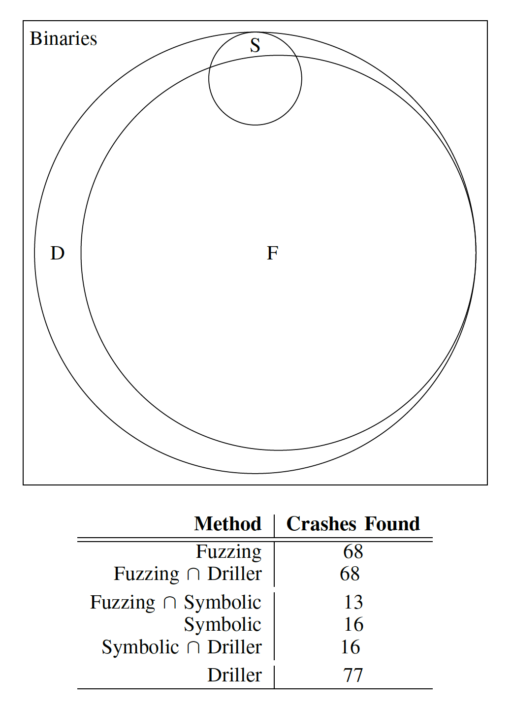

此外，作者在对符号执行引擎对模糊测试过程的程序路径探索能力的提高程度也相应做了实验，作者仅针对 `13` 个在模糊测试过程中会卡住，而且符号执行模块可以指引其提高的程序做了分析，得到的基本块执行数量提升的结果图如下。

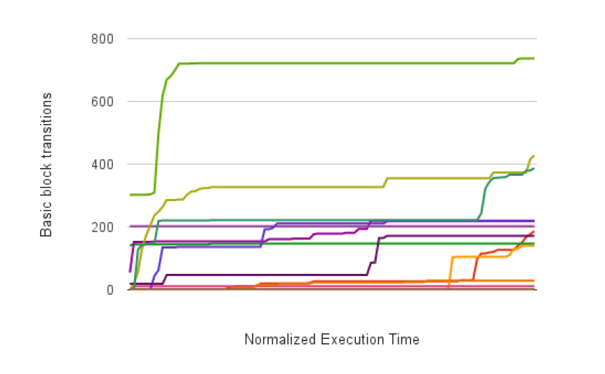

可以看到，使用了符号执行引擎之后，模糊测试过程确实能在程序路径探索的方面得到很大的提升，作者统计了符号执行所产生的输入对后续模糊测试过程的影响的比例，如下表所示。

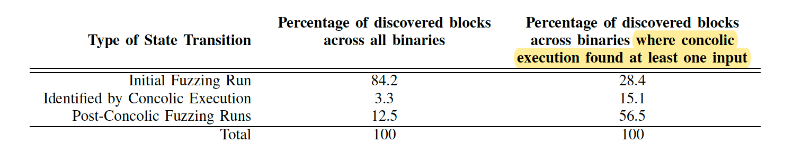

主要看右边一列，一共超过一半的基本块是基于符号执行得到的输入之后突变得来的测试用例所覆盖到的。因此符号执行在程序理解以及相应输入生成这方面还是起到了比较大的作用。

*但是作者没有对剩下将近一半的程序为什么无法发现漏洞做进一步分析，如果再进行分析是不是还能发现什么更好的方法*？最后，作者也对当前工作的一些不足做了总结，主要是在模糊测试方面，由于路径统计粒度较大，因此可能会漏过一些本应是新的状态转移的部分，从而影响符号执行引擎对程序状态的判断，而忽视一些输入的求解。另一方面是在符号执行方面，可能会将一些 `General` 输入误判为 `Specific` 输入而频繁调用符号执行引擎，从而影响模糊测试的整体性能。

## PAFL: Extend Fuzzing Optimizations of Single Mode to Industrial Parallel Mode

*Proceedings of the 2018 26th ACM Joint Meeting on European Software Engineering Conference and Symposium on the Foundations of Software Engineering*

这篇文章的作者认为目前大部分模糊测试相关的工作仅在单实例运行的情况下有较好的改善，而无法将这些改善在并行化模糊测试中进行同步。基于此，作者设计出多个实例之间有效的信息同步和任务分发方式，将单实例下比较有效的信息在多个实例之间共享，从而提高并行化模糊测试的效率。

作者首先使用 **AFLFast** 和 **FairFuzz** 在并行模式下进行实验，发现这两个在单实例模式下效果很好的的模糊测试工具在并行模式下反而没有 **AFL** 好。作者分析发现出现这个现象的主要原因有两点：

1. **AFLFast** 和 **FairFuzz** 获取到的信息没有在多个实例之间同步；
2. 并行模式下相同的多个实例会由于相似的指导信息，执行相似的模糊测试行为；

因此，作者基于上述两个原因，设计了一种在不同的模糊测试实例之间信息的同步机制，同时作者通过对程序分支分组来将模糊测试划分成不同的子任务，分发到不同的模糊测试实例中进行。最终作者实现了一个并行框架 **PAFL**，整体架构图如下所示。

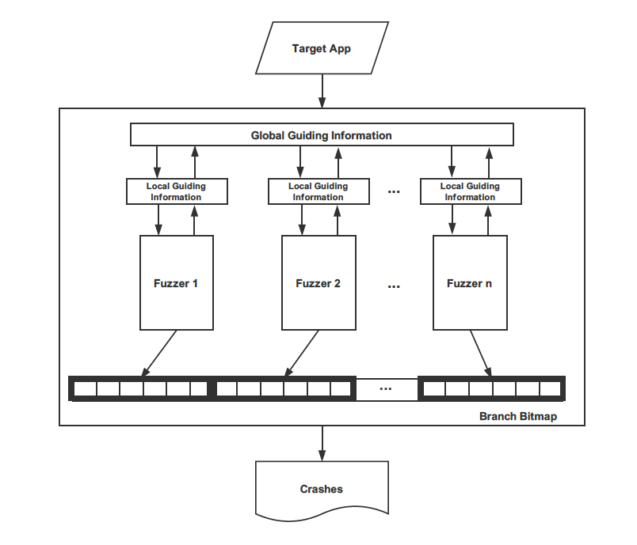

在 PAFL 中，模糊测试过程收集到的信息分为全局信息和局部信息。局部信息由每个模糊测试实例本身维护，全局信息则由所有模糊测试实例维护。由于模糊测试执行的过程很快，因此每一次每个实例都执行完就共享信息是不现实的。作者使用全局信息和局部信息将信息共享的频率降低，每次同步时都分为三步：1. 上传局部信息；2. 更新全局信息；3. 拉取全局信息；从而完成信息在多个实例之间的共享。

在任务划分机制中，作者通过种子选择阶段来使不同模糊测试实例针对不同的程序区域进行探索。作者将记录分支的 Bitmap 划分成 `n` 个区间，其中 `n` 是模糊测试实例的数量。然后对于每一个种子，获取其命中的最少的分支的数量的分支，如果该分支位于当前模糊测试实例所划分的区间内，则认为该种子属于当前模糊测试实例，交给当前模糊测试实例突变。否则，跳过该种子。

作者在 AFLFast 和 FairFuzz 上分别实现了这套 PAFL 方法，并在部分真实程序上进行实验，实验结果如下表：

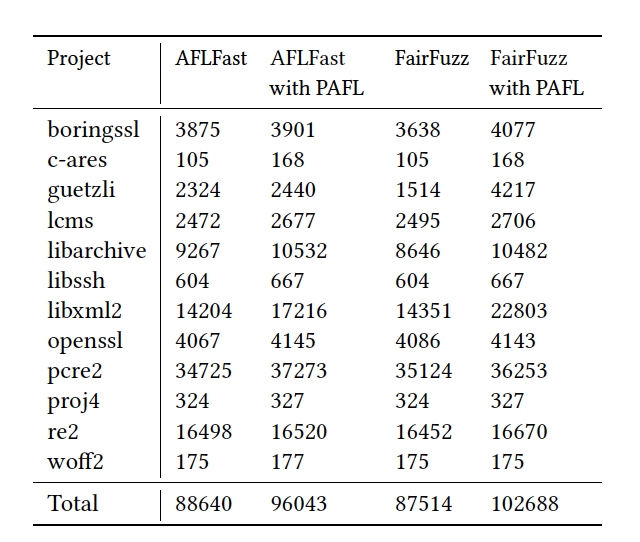

作者认为，这种信息共享机制以及任务划分的方式可以使得模糊测试的过程覆盖更多的分支（*但是感觉提高并不是很明显？*）

此外，作者还找了 GitHub 上的一些开源程序，最终拿到了 25 个 CVE。

*思考：这一部分对于模糊测试性能的提高，是信息共享的功劳还是任务划分的功劳呢？*

## Qsym: A Practical Concolic Execution Engine Tailored for Hybrid Fuzzing

*27th USENIX Security Symposium (USENIX Security 18). 2018*

这篇文章工作的重心在于提高 **Hybrid Fuzzing** 等性能。作者认为尽管 Hybrid Fuzzing 结合了模糊测试的速度以及符号执行的准确，但是由于符号执行本身的局限性，目前 Hybrid Fuzzing 仍然无法很好地应用在真实世界软件的漏洞挖掘工作中。

作者首先系统地分析了之前符号执行所存在的性能瓶颈，然后定制符号执行器来解决瓶颈问题。基本的思想是使用动态二进制翻译将符号仿真与真实执行结合在一起，这种方法可以实现更细粒度、指令级别的符号模拟，从而减小符号执行的开销。此外，作者还结合模糊测试的特点，将传统的符号执行中的较为严格的约束放松，而通过模糊测试来验证放松之后的符号执行的约束的求解结果。而符号执行在求解这种不严格的约束时可以获得更好的性能。

### 符号执行开销分析

作者发现，符号执行之所以慢的一个主要原因在于符号仿真方面，而不是人们普遍认为的路径爆炸。传统的符号执行通常使用 **IR** 将机器指令进行翻译从而对执行进行仿真，这样可以降低实现过程中的复杂程度，但是这会大大降低符号仿真时的执行速度。此外，如果使用 IR 会使得无法对其进行进一步优化，尤其在以基本块为单位进行指令翻译（成 IR）时，这时无法跳过基本块中一些与当前约束无关的指令，作者发现，基本块中只有 **30%** 的指令是有必要进行符号执行的。此外，作者还发现在将机器指令翻译成 IR 的过程，每一条机器指令都会对应多条 IR 语句，进一步造成了性能的开销。

符号执行的另一个开销是所使用的快照机制。快照的主要目的是在探索同一个分支的不同路径的时候可以使用符号程序的状态，但是由于模糊测试的随机性，每一次从模糊测试中获得的测试用例一般都不会共享某一个分支，因此，从一个测试用例中执行得到的分支通常不会在下一个测试用例中被重用。而传统的符号执行使用的快照只记录了程序内部的状态，不能反应外部环境，导致准确率下降；如果同时维护外部环境，则会导致性能下降。

符号执行为了精确求得分支信息，通常使用精确完整的约束。完整的约束保证了求解的正确性，但是同时引入了约束的复杂性。对于过于复杂的约束，求解的时间通常较长，甚至有一些过于复杂的约束无法求解。

### 解决方案

作者提出使用动态二进制翻译（DBT）的方式，与传统的符号执行需要采用基本块中的所有指令进行符号仿真的方式不同，作者仅对一些必要的指令进行仿真，从而减少了需要仿真的指令数量。因为上述方式，导致符号执行的开销减少，因此作者认为即使从头开始重复执行也不会造成太大的开销，从而将符号执行的快照机制略去。此外，作者采用一些启发式的方法对约束进行适当放松，然后通过模糊测试可以快速验证该松弛约束所生成的输入是否有效。

具体的，作者采用动态二进制翻译（DBT）方式，实现指令级别的符号翻译和仿真。此外，由于使用动态二进制翻译方式，可以在同一进程中同时进行 Native 执行和符号执行，而传统的 Concolic 执行方式需要两个进程之间进行通信来进行切换，这样的开销很大。

除了采用指令级别的仿真和动态二进制翻译技术外，作者还仅对与当前相关的约束进行求解，而不是求解整个路径约束。传统的符号执行引擎对路径上的所有约束进行求解，这对于没有初始输入的情况比较有效，但是对于模糊测试来说不太有效。作者通过只求解部分分支的约束，更新部分输入来生成新的测试用例。如下图是作者所用方法和 Driller 方法对输入求解的对比：

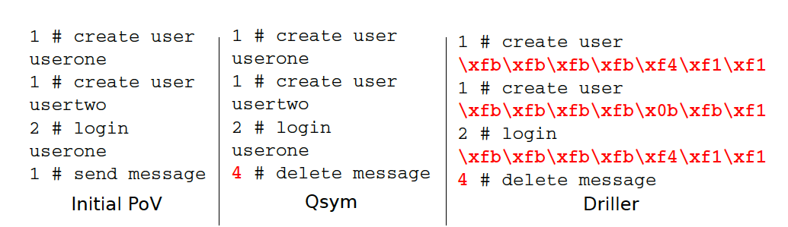

可以看到，为了探索新的路径，作者所使用的方法只更新了某一个菜单选项，而 Driller 使用的方法对之前的一些无关数据也进行了更新，从而可以见的 Driller 对输入中的无关部分也进行了求解。（*但是 Driller 的描述中好像也是根据具体执行到某个分支，如果该分支的另一个分支未被执行，则会对该分支进行求解，难道是对整个约束进行求解？*）

此外，作者还对约束的生成进行了松弛操作，不生成较完整的约束，使得约束更容易求解，更能适合真实的软件。

对于符号执行过程生成的约束，作者不对其进行完整求解，因为在这里符号执行用作对模糊测试的辅助，因此可以选择求解部分约束的值来生成新的测试用例。作者选择路径约束的最后一部分进行求解，这是因为最后一个约束通常是最简单的约束，而且求解最后一个约束可以更直接地指导探索新的路径。作者还发现由于循环或者函数调用等原因，有些基本块会被多次用来求约束，而这种重复的约束对于新的覆盖率的发现是无效的。因此作者对基本块的执行进行统计，如果某个基本块出现的过于频繁，则对基本块进行修剪，只求这条路径的子约束，从而加快符号执行的效率。

总的来说，作者主要做了这些工作：

1. 使用动态二进制翻译技术实现指令级的符号仿真，同时对一些不必要的指令仿真消除，从而加快执行速度
2. 由于执行速度加快，可以不借助快照机制
3. 对于每一条路径的约束，不对其进行完整的求解，只求解部分约束，然后更新对应的部分测试用例用于指导模糊测试
4. 在约束生成过程对多余的基本块中的约束进行修剪，从而得到更精简的约束

作者根据这些工作，实现了 **QSYM**，并与 AFL 结合。通过遍历 AFL 的 `queue` 目录，将该目录下的所有测试用例作为输入，使用结合 **PIN** 插桩实现的符号执行引擎进行求解，得到新的测试用例。对于新的测试用例，检查是否产生了新的分支，如果产生了新的分支则保存，并在之后同步到 AFL 的目录下。

之后，作者做了如下实验。

### 实验

作者首先在真实软件中进行实验，最终可以在 8 个真实程序中找到 13 个漏洞，而这些漏洞通过其他模糊测试工具无法发现：

其次，作者使用 libpng 作为模糊测试对象，并通过赋予不同数量的初始种子来评测 AFL 与 QSYM 的覆盖率情况，发现 QSYM 基本不会太受是否提供初始种子的影响：

作者还评估了 QSYM 的快速符号执行约束求解方法是否可以达到很高的性能，是否可以为模糊测试提供较高的覆盖率，因此作者将时间限制在 5 分钟，评测其与 Driller 的覆盖率的比（其中红色表示 Driller 效果更好，蓝色则相反，每一个方块代表 CGC 中的比赛）：

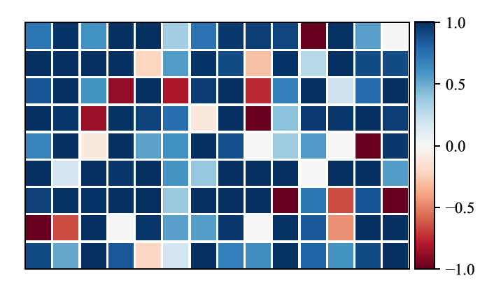

作者还将 QSYM 的符号执行时间限制为 5 分钟，将 Driller 从 5 分钟递增到 30 分钟，来评估两者之间的覆盖率，发现即使 Driller 运行了 30 分钟，其能解决的仍然比不过 QSYM：

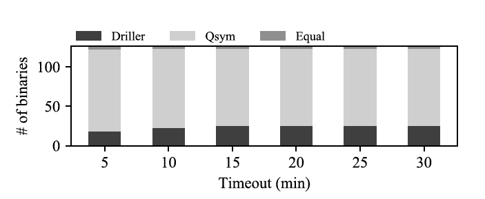

为了分析 Driller 为什么慢，作者将 Driller 的时间开销进行分割，发现在仿真阶段所花费时间最多，其次，Driller 所仿真的指令数量远远大于 QSYM 的指令数量，这更进一步导致了其符号执行速度下降：

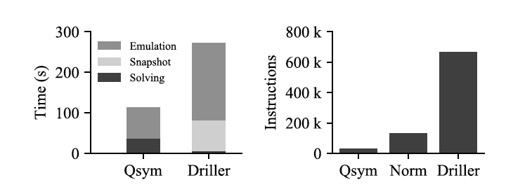

作者最后评估了其优化约束求解对漏洞挖掘能力的影响，发现 QSYM 在使用了优化求解的情况下可以发现较多的漏洞：

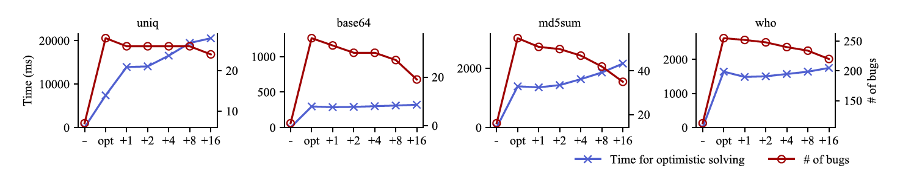

可以看到使用效率高的符号执行结合模糊测试还是可以获得较多的程序覆盖率。

## MOpt: Optimized Mutation Scheduling for Fuzzers

*28th USENIX Security Symposium (USENIX Security 19). 2019.*

这篇文章作者强调，对于模糊测试来说，性能很大程度上取决于突变策略的选择。作者认为现有的模糊测试工具通常依照特定的分布选择突变操作，效率较低。因此，作者提出了 **MOpt**，使用粒子群优化算法（Particle Swarm Optimization）找到更适合当前模糊测试的突变操作。

之前的模糊测试工具，例如 **AFL** 等，预定义好了一系列突变操作，在模糊测试过程中，根据调度策略对这些突变操作进行选择。调度策略是概率分布的，模糊测试工具通过预先定义的概率分布来随机地选择一些突变操作。这些固定的突变调度策略会影响模糊测试的性能，之前也有一些工作通过强化学习的方式来动态选择突变策略，但是这些效果并不是很好，作者认为主要原因有以下几点：

* 不同的突变操作在发现新的路径和新的 Crash 上有不同的有效性
* 同一个突变操作对于不同的目标程序的有效性也不同
* 同一个突变策略会随着时间不同有效性不同（对当前测试用例有效，对下一个测试用例效果就不好了）
* 过去提出的调度策略会影响模糊测试本身的性能
* 过去的方法与深度学习结合对突变策略调度，但是会遭遇数据不平衡的问题（是否能触发新的路径）

基于上述发现，作者将突变操作的调度问题转化成一个优化问题，通过动态评估候选突变策略的效率，来调整对突变操作的选择。

作者通过观察 AFL 的调度策略，发现 AFL 会对每一个测试用例经过确定性突变、havoc 突变和切分突变三个阶段，如下图。

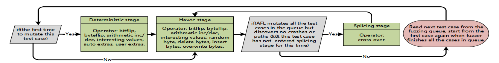

而 havoc 突变阶段是整个模糊测试阶段中最主要的一个阶段，且具有通用性，因此作者主要这一阶段实现调度算法。

作者通过实验发现，不同的突变策略对于同一个程序来说有效性不同，如下图所示。

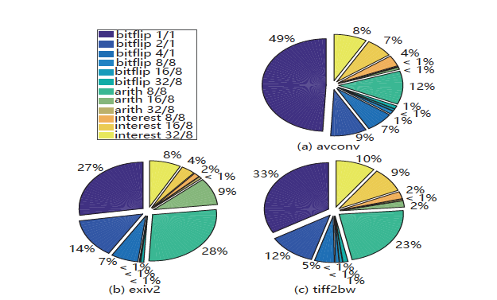

但是同时，默认的模糊测试的突变策略调度算法可能会导致选择的突变操作的次数也不同，如下图所示。

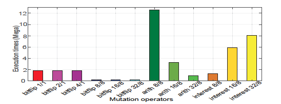

这就会导致模糊测试的过程可能过多地浪费在无效的突变策略中，从而降低了模糊测试过程的效率。因此，作者认为需要实现一种更有效的策略，可以更多地选择那些效率高的突变操作，对测试用例进行突变。

作者将寻找有效突变策略概率分布问题看作一个寻找最优概率分布的问题，作者使用粒子群优化算法来求解这一优化问题。其基本思想是首先探索每一个突变操作的最优概率，然后构造一个完整的最优概率分布。作者将每一个突变操作看作粒子，并在概率空间中进行探索。对于每一个粒子，如果这个粒子在某个位置（某个概率下）可以使得 AFL 生成更多的有趣的测试用例，则认为该位置更好，将粒子使用粒子群优化算法向该位置移动。作者将每个粒子所得到的最高的效率作为局部最优效率，将所有粒子得到的最高的效率作为全局最优效率。

但是，这种突变策略概率分布不像传统的粒子群优化算法可以在每个粒子上探索解空间，这种突变策略的分布概率只有一个解，因此作者实现了多个粒子群，在多个粒子群内部执行粒子群优化算法，找到每个粒子群的最优解，然后最终在多个粒子群中找到一个全局最优解（*但是我感觉这个也只是减少了局部最优解的概率*）。作者所实现的粒子群更新优化算法公式如下：

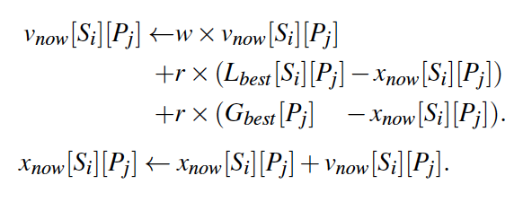

作者将 MOpt 分为 4 个模块进行实现。在 PSO 初始化模块中，对一些参数进行初始化，包括设置多个集群，对每个集群内部的粒子初始位置，初始动能等进行初始化。初始化阶段在模糊测试过程中只执行一次。

接下来进入 **Pivot Fuzzing** 阶段，在这个阶段中，对每一个集群进行评估，从而选择最好的集群进入下一个阶段。每一个评估通过执行指定次数的模糊测试过程，然后求得每个粒子的局部最优解以及每个集群的最优解，从而选取最好的集群。然后进入 **Core Fuzzing** 阶段，该阶段使用选定集群对应的概率分布进行模糊测试过程，求得每一个粒子的全局最优解。最后进入更新阶段，通过求到的局部最优解和全局最优解对粒子的位置进行更新。

在实现了粒子更新算法之后，作者还发现确定性突变阶段通常花费较多时间，且对于新路径的探索没什么帮助，因此提出当发现一段时间未探索到新路径之后，将确定性突变阶段略去。

接下来，作者进行了大量实验。作者首先针对 13 个真实程序进行模糊测试，并与原始的 AFL 进行对比，通过测试发现的 Crash 的数量来评测性能。作者通过比对 **ASan** 提供的调用栈来区分不同的 Crash，作者实验结果如下表所示：

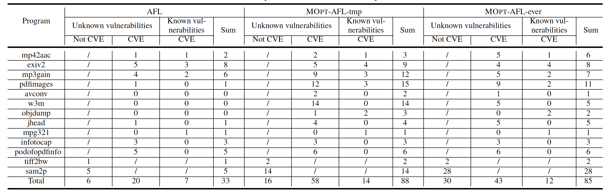

除了所发现的 CVE 意外以外，作者还评估了所实现的方法发现 Crash 的能力，同时作者还基于 **AFLFast** 和 **VUzzer** 对 **MOpt** 进行了实现，最终实验结果如下表所示：

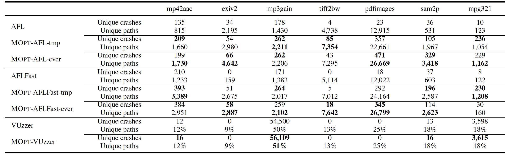

之后，作者针对 LAVA-M 数据集合也做了相应的实验，最后，作者通过对种子的调整，以及实现的不同，分别对 **MOpt** 的不同的模块进行了实验。

## IJON: Exploring Deep State Spaces via Fuzzing

*2020 IEEE Symposium on Security and Privacy (SP)*

这篇文章的作者认为在模糊测试过程中，为了探索更多的路径，发现更多更深的漏洞，一些专家知识是不可少的。作者认为，单一的完全自动化的模糊测试算法无法适应所有应用程序，而正常的模糊测试过程研究人员通常先执行自动的模糊测试流程，一段时间之后，分析代码，之后可以移除一些不重要的但是影响覆盖率的代码（比如校验和）；或者对模糊测试的突变策略进行转化。因此，对于有效的模糊测试过程来说，适当的人工交互还是有必要的。基于这个思想，作者提出了借助人工的分析，对目标程序的状态空间进行注解，从而指导模糊测试对目标程序状态空间的探索。最终，作者将这一思想实现为以拓展的形式进行实现。

作者首先介绍了基于代码覆盖率指导的模糊测试的基本流程，但是同时作者提到，目前的代码覆盖率指导的模糊测试在模糊测试过程卡住的时候没有任何有效的反馈可以帮助模糊测试继续前进。基于此，作者认为使用代码覆盖率来表示程序状态空间在某些时候是有意义的，但是对于探索全新的路径不太合适，因此，作者观察现有模糊测试生成的测试用例对程序覆盖率的影响，同时分析了程序的状态转移之间的关系，总结得到如下三个情况：

1. 程序的分支是不变的，但是状态由一些值来代表，不同的变量值会代表不同的程序状态；
2. 程序的值无法表示状态，但是可以通过代码的位置来代表程序状态，但是不同死的状态多次经过同一个代码位置；
3. 以上两种情况都不能很好的反映当前程序状态，引入中间状态；

对于第 `1` 种情况，如下所示：

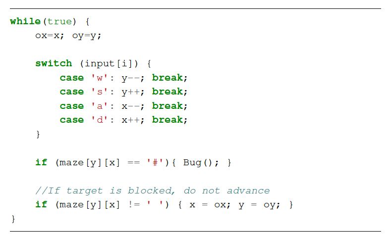

由于需要探索不同的迷宫，每一个点的位置都属于不同的状态，因此可以将 `x` 和 `y` 的值的组合作为状态的唯一表示。

对于第 `2` 种情况，如下所示：

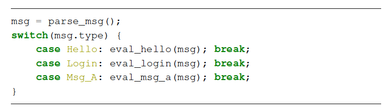

对于每一个不同类型的状态，都可以认为属于不同的单独的状态。但是每次消息的发送可能会涉及到多种不同类型的消息组合，例如先发送 `hello` 消息，再发送 `login` 消息，最后发送普通消息，即每个代码位置代表的状态会被以一个序列的形式出现，因此需要考虑每个代码位置对应状态的历史信息。

对于第 `3` 种情况，常见的比如 `magic` 的检测，校验和等信息，在真正对目标状态进行突破之前无法获得有用的反馈信息。而分析人员可以通过将这种复杂的检测进行拆分，使用多个简单的检测替换，在每一次简单的检测之后对模糊测试提供反馈。

基于上述观察，作者提出了一种注解的机制，通过在测试程序中添加少量的代码，来辅助覆盖率指导机制更精准地指导模糊测试工具突变，注解的可选代码如下：

1. `IJON_ENABLE()` 和 `JION_DISABLE()`，用于决定是否对这一段代码使用覆盖率反馈机制，可以对目标程序节省一些不重要的路径的探索时间；
2. `IJON_INC()` 和 `IJON_SET()` 用于对 `Bitmap` 设置，从而可以提供更有效、细粒度的突变反馈机制；
3. `IJON_STATE()` 开启一个虚拟状态，在该虚拟状态下，之前的那些覆盖到的分支路径对应的 `Hash` 值的计算结果均与之前不同；
4. `IJON_MAX()` 由于不同的模糊测试过程可能具有不同的优化目标，使用 `IJON_MAX()` 可以指导模糊测试的优化偏好；

作者使用动态链接库的形式实现了 **IJON**，主要实现了在目标程序上使用上述的这些函数添加注解，并对目标程序与模糊测试工具之间的通信方式进行了一些修改。

接下来作者针对上述三种情况做了实验，在添加了 **IJON** 注解的情况下均比原始基于 **AFL** 的模糊测试工具完成的更好，且效率更高。此外，作者发现在结合了 **IJON** 之后的模糊测试器，一些基于 **AFL** 改进之后的模糊测试器性能反而有所下降，这是因为在解决这些问题时（使用值作为状态），这些先进的方法不但没有帮助，反而造成了性能的下降：

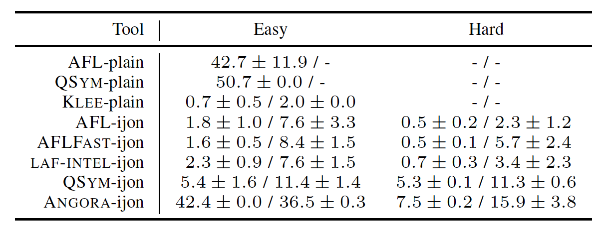

同时，作者还发现，如果使用较好的状态表示方法来指导模糊测试过程，对于结构化数据来说，测试用例的语法指导甚至不是关键的部分，即不需要语法指引也能通过特定的状态描述来获得较好的效果。

除了上述实验，作者还演示了在真实程序中部署 IJON 来更好地指导模糊测试过程，如下图所示：

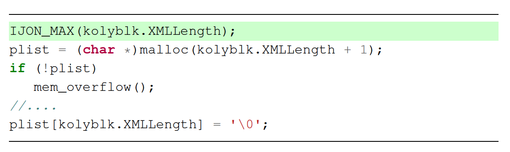

可以通过 `IJON_MAX` 指导模糊测试更好地发现整型溢出漏洞。

总的来说，作者通过添加注解的方式，在模糊测试过程中引入了人工的因素，可以更好地表示模糊测试过程的状态，而不是单一地使用覆盖率信息对模糊测试作为指引，作者在最后还提到，将模糊测试与人工干预相结合渐渐开始成为目前研究的一大趋势。

## Profuzzer: On-the-fly input type probing for better zero-day vulnerability discovery

*2019 IEEE Symposium on Security and Privacy (SP)*

这篇文章的作者提到，对于之前的模糊测试过程来说，在突变过程中通常缺乏语法和语义信息的指导。因此作者提出结合类型推导技术，自动化推导出测试用例中每个字节的字段含义，从而更智能地指导模糊测试过程。

作者提到，先前生成式的模糊测试依赖于指定的语法文件，但是过于完备的语法文件可能减少了模糊测试过程的搜索空间，因为可以触发漏洞的测试用例可能并不是完全符合语法的。而对于突变式的模糊测试，由于突变过程过于随机，会降低模糊测试过程的效率。

对于一个程序的输入来说，通常是结构化的，能够被区分成多个不同的字段，例如缓冲区大小、类别字段等，这些字段可以用来指导模糊测试的突变过程。但是这些字段可能无法直接提供给模糊测试工具，因此作者提出了一种可以自动探测不同字段类型的模糊测试过程，称为 **ProFuzzer**。作者将模糊测试划分成多个阶段的过程，在第一个阶段，对每一个字节进行探测。具体地，对于每一个字节进行突变，然后记录该字节多次突变之后的目标程序的执行路径信息。这些信息在第二个阶段用于推测出数据的各个字段的类型，从而实现更智能的突变，提高模糊测试效率。

作者在实现 ProFuzzer 之前，通过观察对 **OpenJPEG** 的模糊测试过程，发现在大量的模糊测试过程中，只有少量的字节（`24/60`）的突变对于目标程序覆盖率有帮助，如下图所示：

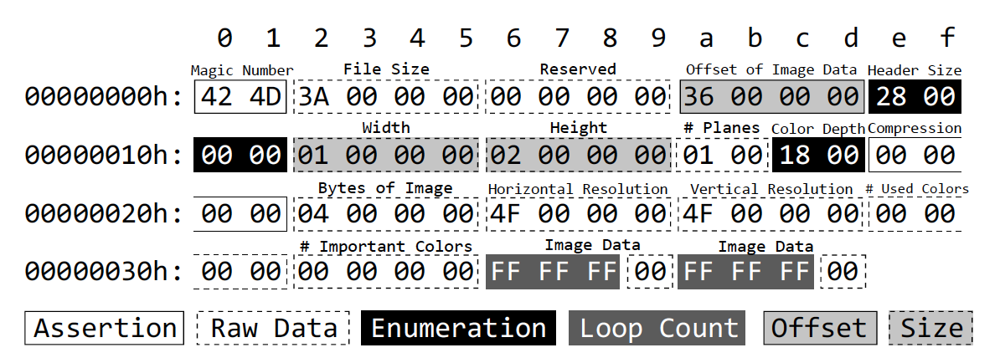

而盲目地突变会浪费大量的时间在一些没用的字节上，从而降低了模糊测试的效率。而 **AFL** 的 `afl-analyse` 以及 `Dictionary` 机制虽然可以对输入字段进行分析，但是过于简单，无法对模糊测试过程提高太多。同时作者分析发现，即使是输入中的一些具有含义的字段，对于模糊测试过程可能也是不重要的，如上图中的 `Horizontal Resolution` 和 `Vertical Resolution` 两个字段，对于覆盖率没有影响。而模糊测试过程中关注的字段可以通过在模糊测试过程中推导出来，用于后续指导模糊测试过程。

作者实现 **ProFuzzer** 的架构图如下所示，可以分成 4 个部分：推导部分、突变部分、执行引擎和报告引擎：

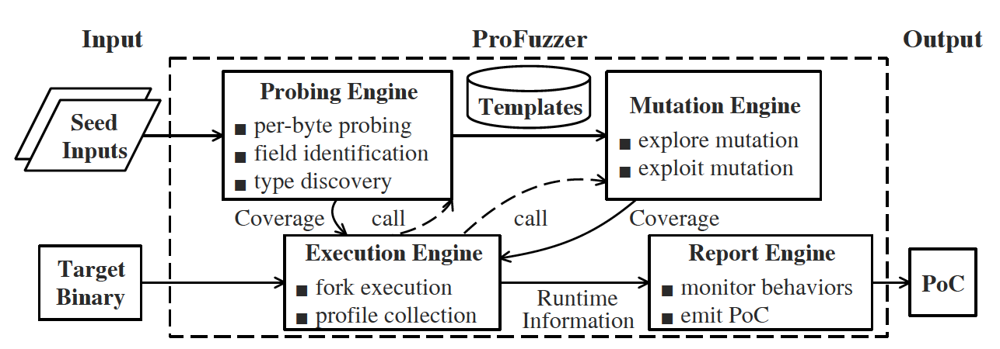

对于推导引擎，其遍历每个种子文件中的每一个字节，从 `0x00` 到 `0xff`，然后记录覆盖率的变化情况，将具有相同覆盖率变化情况的相邻字节看作同一个字段，然后推测这个字段的类型。

突变引擎则使用推导引擎得到的字段与字段类型模板对测试用例突变。作者将突变分成两个概念，第一个是探索，在这一阶段尽可能探索更多的程序执行路径，来提高程序的覆盖率；第二个是利用，在这一阶段则更倾向于发现程序的漏洞。

其他两个引擎作者使用的 AFL 原本的实现，因此不做过多介绍。

为了更好地指导模糊测试过程，作者针对模糊测试的特征，定义了 6 种字段类型：断言、元数据、枚举、循环数、大小、偏移。在推导阶段，作者针对每一个字节进行 256 次突变，对于每一次突变，记录突变后执行的覆盖率信息，并与原始测试用例的覆盖率信息进行比较，计算相似度信息，如下公式所示：

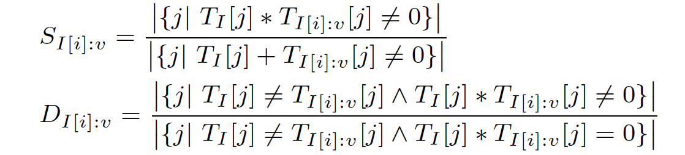

其中 `T` 表示覆盖到的边，`S` 表示覆盖的相似度，`D` 表示不同覆盖次数的边的数量与不同覆盖到的边的数量的比值。由于对于每一个字节，可以突变 256 次，因此每个字节可以有 256 个相似度，从而可以构成一个向量：

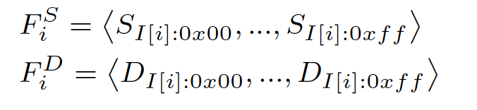

因此，每一个测试文件的每一个字节都可以得到如上的一个向量。接下来通过这个向量对字段进行划分，依照公式如下：

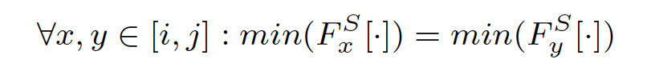

将满足上述公式的字节范围（`[i, j]`）看作是一个字段。而接下来根据 6 种字段类型的特征，对每一个字段进行分类，从而对于每一个测试用例都能得到字段模板文件，用于后续指导模糊测试。

对于每一个新得到的测试用例，首先会尝试重用已有的模板文件。但是如果找不到这样的模板文件，则会进行重新推导。重新推导的过程与初次推导的过程类似，仅在公式计算上略有不同。

在得到每一个测试用例的模板文件之后，可以对其进行针对性的突变。这里作者实现了两种不同的突变类型，分别是探索优先的突变和利用优先的突变。对于探索优先的突变，作者的目的是尽可能多地探索不同的程序路径，因此针对枚举、大小、偏移等类别的字段进行突变。对于利用优先的突变，作者事先调查了大量的 **PoC**，对于每个字段选定部分有趣的值，进行针对性地突变，从而加大发现漏洞的概率。

接下来作者对 ProFuzzer 进行评测。作者首先对 ProFuzzer 会带来的开销做了解释，由于使用字段类型模板，因此开销与输入的测试用例的大小是成正比的，作者通过 AFL 本身提供的 `trim` 机制来将输入大小限制在一个范围内，从而减少带来的开销，实验证明在限制了输入大小的情况下，仍然可以比原先的 AFL 带来多 `93%` 的路径覆盖率。

此外，作者还对推导引擎的准确性进行了验证，发现在大多数情况下可以保持较高的准确性，如下图所示：

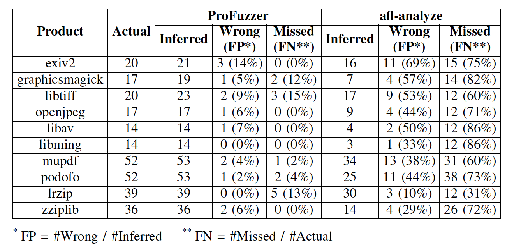

作者在多个开源项目下部署 ProFuzzer 两个月时间，发现了较多的漏洞，由此证明了 ProFuzzer 的漏洞挖掘效果。同时，作者还在 **LAVA-M** 上与其他模糊测试工具进行了对比，均可以发现比其他工具更多的漏洞：

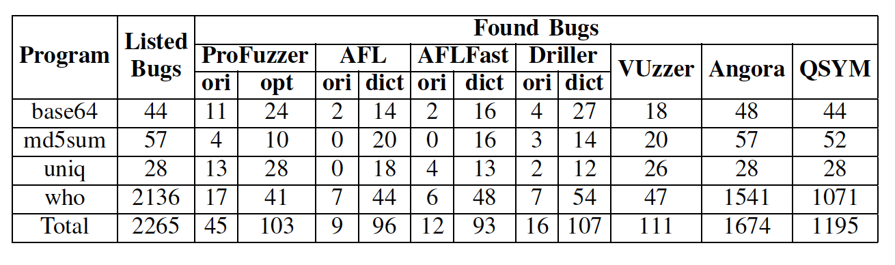

最后，作者对有效性进行了实验，通过在 OpenJPEG 上部署多个模糊测试工具，作者认为之前模糊测试工具一个不足的地方就是在太多的突变无法产生新的覆盖率，因此作者对突变的有效性进行了评测，结果如下图（横轴为时间，纵轴为效率）：

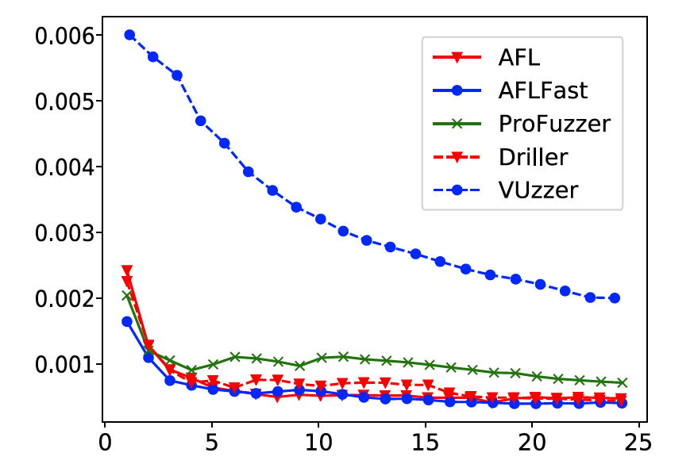

作者提到 **VUzzer** 之所以有这么高的效率是因为其使用的动态污点分析技术可以避免产生无效的突变。

作者同时对路径覆盖率的效率进行了评估，结果如下图（横轴为时间，纵轴为覆盖率）：

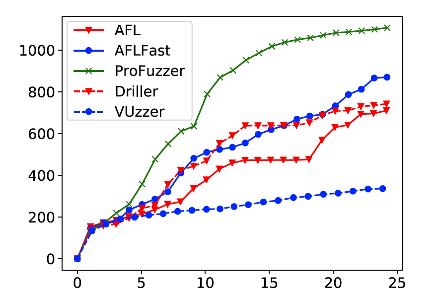

可以看到效率明显增强。

总的来说，作者提出的类型推导的模糊测试方法比较新颖，可以更好地指导模糊测试过程，从而克服了模糊测试过程中盲目突变的缺点，提高模糊测试的效率。

## Send Hardest Problems My Way: Probabilistic Path Prioritization for Hybrid Fuzzing

*NDSS. 2019.*

这篇文章的工作也是聚焦于模糊测试与符号执行的结合。由于模糊测试擅长于探索简单的路径，但是对复杂的路径探索无能为力。而符号执行可以较精确地探索到复杂路径，但是经常会遇到路径爆炸的问题，因此现在有很多工作将符号执行用于辅助模糊测试的路径探索。作者发现，现有的模糊测试与符号执行的结合方式有两种，一种是按需启动符号执行引擎，当模糊测试发现不了新路径后启动符号执行引擎对路径进行探索（Driller）；另一种是量化探索每条路径的成本，然后选择最有效率的一条路径去探索。作者评估了两种方式，发现这两种方式都不是最有效的。对于**按需启动**的方案，作者认为当模糊测试正在正常进行的时候也可以使用符号执行进行辅助探索，而不能仅将模糊测试过程卡住作为唤起符号执行的契机。此外，这种按需启动的方案不能保证符号执行所探索出来的路径正是导致模糊测试卡住的路径，有可能当符号执行探索出一个新的路径之后，模糊测试也探索出来了，而符号执行本身比较消耗时间，如果符号执行消耗的时间比卡住的时间短，反而浪费了性能，如下图是卡住的时间间隔的占比：

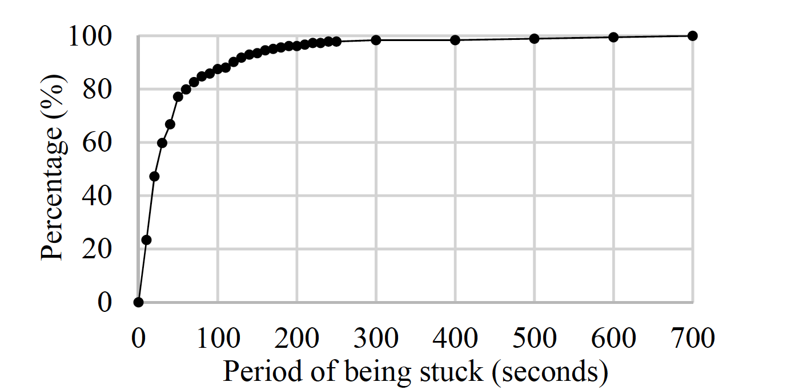

因此不准确地执行符号执行反而会加大资源开销，浪费了符号执行的资源。而对于**另一种**方案，如何评估路径的成本本身就是一个困难的问题，这个过程中可能会造成很大的开销，且无法统一符号执行与模糊测试共同的量化标准。

作者认为，由于符号执行本身比较慢，因此符号执行应该只用于解决最棘手的路径，此外因为高的吞吐量对于模糊测试来说很重要，所以额外的分析需要很轻量。因此，在本文中，作者提出一种调度方案，使得符号执行仅辅助解决最困难的路径，同时对于路径的难以程度的判断标准也很轻量，从而更好地结合模糊测试与符号执行。作者提出使用蒙特卡洛模型，将模糊测试过程看作是一个随机采样过程，来根据路径难易程度调度路径，而难易程度则通过随机的输入遍历到该路径的频率来得到。

如果需要使用蒙特卡罗方法，则需要满足两个约束：

1. 对于搜索空间的采样需要是随机的；
2. 需要大量的随机采样；

而模糊测试过程由于其随机的生成测试用例，以及其速度高效，自然而然满足上述两个条件。此外，为了使用蒙特卡罗方法，还需要统计路径的概率。但是如果记录每一次测试用例的路径会造成很大的开销，作者提出将执行路径看作是一条马尔可夫链，整条执行路径的概率可以通过每个分支的概率得到，每个分支的概率由下列公式计算得到：

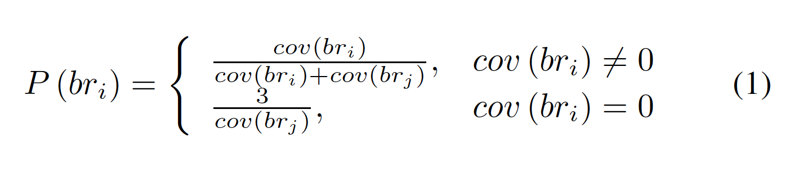

其中 `brj` 表示与 `bri` 具有相同前缀基本块的基本块。之后用马尔可夫模型计算路径概率：

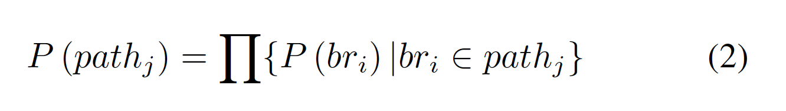

之后，作者介绍了基于蒙特卡罗模型的执行树，用来记录分支概率以及计算路径概率。

整个系统从模糊测试开始，当产生了新的测试用例之后，蒙特卡罗模型执行采样，来统计每个分支的覆盖次数，从而计算每个分支的概率，之后构建执行树，构建的执行树中仅包含已经被命中过的分支，并计算路径概率，然后选取路径概率最低的路径。具体地，通过遍历执行树的每个 trace 中的分支，获得其后继分支，如果这个分支未被探索过，则计算到达那个分支的概率（使用马尔可夫链）作为路径概率。在对每一个 trace 完成遍历之后，获取概率最低的路径，蒙特卡罗模型会根据该路径选择对应的测试用例（通过之前的 trace，哪个 trace 得到了这条路径，就选择那个 trace 的测试用例），使用该测试用例并结合符号执行，来求解探索路径的测试用例，将得到的新的测试用例返回给模糊测试过程，并更新执行树。

作者的实验从 3 个维度进行，分别是比较覆盖率、漏洞发现数量以及符号执行引擎所做出的贡献。

对于覆盖率，作者直接使用 AFL 的覆盖 Bitmap 来统计。此外，作者还加了一组 Random 的对照实验，该对照实验中随机选择一个未访问到的路径进行探索，最终覆盖率实验结果如下图所示：

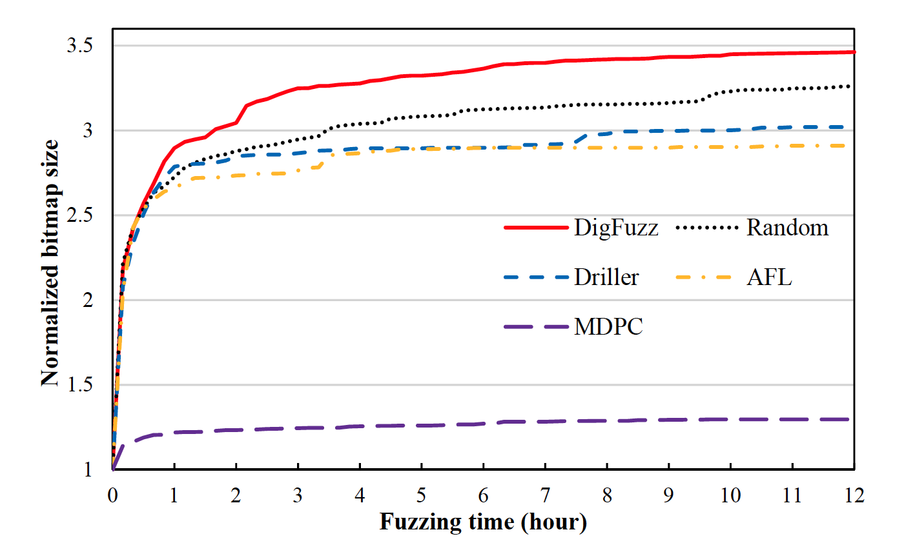

其中 Radom 的实验效果可以证明 Driller 所使用的按需启用符号执行策略并不能较好地发挥符号执行的性能。

对于贡献程度的贡献，作者认为如果符号执行产生的测试用例被模糊测试采用，则记为一次贡献。贡献的实验结果如下表所示：

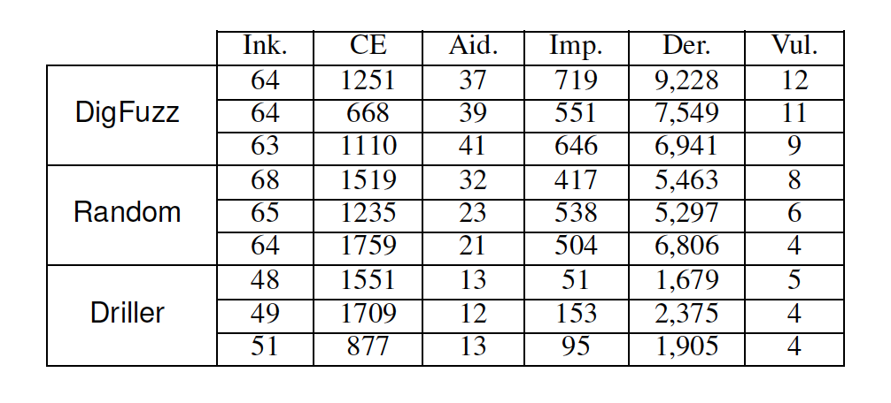

之后，作者同时在 Lava-M 数据集上做了实验，实验结果类似。

总的来说作者就是在符号执行与模糊测试的结合上，是的符号执行对路径探索的选择更有目的性，通过概率来获取那些对于模糊测试来说较难探索到的路径进行探索，从而提高两者结合的性能。

## EnFuzz: Ensemble Fuzzing with Seed Synchronization among Diverse Fuzzers

*28th USENIX Security Symposium (USENIX Security 19). 2019.*

作者提到，尽管有越来越多的针对模糊测试的优化的工作出现，例如 **AFLFast**、**FairFuzz** 等，但是这些模糊测试工具无法在真实的各种各样的应用程序中具有较强的鲁棒性，通常这些模糊测试工具可能在某些应用程序中有较高的性能，但是在另外的应用程序中性能甚至不如原始的 **AFL**。基于这个发现，作者提出将多个基本的模糊测试工具进行协作，将多样性高的模糊测试工具组装在一起协作，从而提高模糊测试的鲁棒性，对目标应用程序进行更高效地漏洞挖掘。

作者提出 **EnFuzz** 的基本思想是结合多个模糊测试工具的优点对目标应用程序进行模糊测试，例如下列程序：

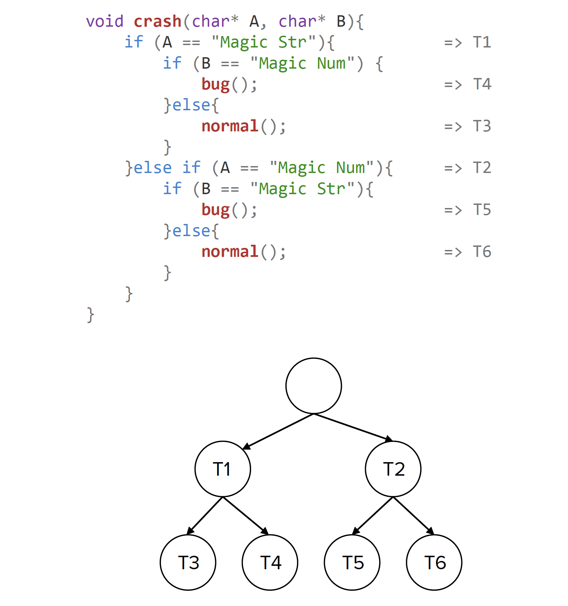

假设有 `fuzz_0` 和 `fuzz_1` 两个模糊测试工具，一个擅长解决 `Magic Str` 的分支，另一个擅长解决 `Magic Num` 的分支，那么如果将这两个模糊测试工具产生的测试用例同步，则最终两个模糊测试工具的组合可以解决图中的所有分支，而单独的模糊测试工具无法达到这种效果。基于这个思想，作者提出了协作模糊测试的两个基本目标：

1. 找到多个多样性较大的不同的基本模糊测试工具；
2. 实现一种有效的同步机制；

作者将模糊测试工具的多样性定义为如下三种：

1. 种子选择和突变策略的多样性；
2. 覆盖率信息粒度的多样性；
3. 输入生成策略的多样性；

作者根据上述三种启发式的多样性定义，手动选择多个基本的模糊测试工具。

在协同阶段，对于每个基本模糊测试工具来说，与单实例运行时的工作一样，执行传统的模糊测试循环，从 `queue` 中选取测试用例，对该测试用例进行突变，生成新的测试用例，使用新的测试用例执行目标程序。如果这个测试用例触发了新的路径，则除了将这个测试用例添加到本地的队列外，还会添加到全局队列，等待同步。

之后，会开启一个 `monitor` 线程，该线程初始化一个全局覆盖率信息，用于记录当前应用程序的模糊测试覆盖率情况。然后该线程会遍历全局队列，将全局队列中的测试用例分配给每一个基本模糊测试实例中（会检测是否能触发新的分支），从而完成测试用例的同步。