# Papers

主要记录一些 **Fuzzing** 相关的工作的论文。

## Survey / Evaluation

* [The Art, Science, and Engineering of Fuzzing: A Survey](#the-art-science-and-engineering-of-fuzzing-a-survey)
* [Evaluating Fuzz Testing](#evaluating-fuzz-testing)

## Symbolic Execution

* [Driller: Augmenting Fuzzing Through Selective Symbolic Execution](#driller-augmenting-fuzzing-through-selective-symbolic-execution) 
* [Qsym : A Practical Concolic Execution Engine Tailored for Hybrid Fuzzing](#qsym-a-practical-concolic-execution-engine-tailored-for-hybrid-fuzzing) 
* [Send Hardest Problems My Way: Probabilistic Path Prioritization for Hybrid Fuzzing](#send-hardest-problems-my-way-probabilistic-path-prioritization-for-hybrid-fuzzing)

## Mutation / Scheduling

* [MOpt: Optimized Mutation Scheduling for Fuzzers](#mopt-optimized-mutation-scheduling-for-fuzzers) 
* [Profuzzer: On-the-fly input type probing for better zero-day vulnerability discovery](#profuzzer-on-the-fly-input-type-probing-for-better-zero-day-vulnerability-discovery)
* [FairFuzz: A Targeted Mutation Strategy for Increasing Greybox Fuzz Testing Coverage](#fairfuzz-a-targeted-mutation-strategy-for-increasing-greybox-fuzz-testing-coverage)
* [GREYONE: Data Flow Sensitive Fuzzing](#greyone-data-flow-sensitive-fuzzing)
* [REDQUEEN: Fuzzing with Input-to-State Correspondence](#redqueen-fuzzing-with-input-to-state-correspondence)

## Binary-Only

* [STOCHFUZZ: Sound and Cost-effective Fuzzing of Stripped Binaries by Incremental and Stochastic Rewriting](#stochfuzz-sound-and-cost-effective-fuzzing-of-stripped-binaries-by-incremental-and-stochastic-rewriting)

## Hook / Patch

* [T-Fuzz: fuzzing by program transformation](#t-fuzz-fuzzing-by-program-transformation) 

## Feedback

* [Steelix: Program-State Based Binary Fuzzing](#steelix-program-state-based-binary-fuzzing)
* [CollAFL: Path Sensitive Fuzzing](#collafl-path-sensitive-fuzzing)
* [IJON: Exploring Deep State Spaces via Fuzzing](#ijon-exploring-deep-state-spaces-via-fuzzing) 

## Collaboration

* [FOT: A Versatile, Configurable, Extensible Fuzzing Framework](#fot-a-versatile-configurable-extensible-fuzzing-framework)
* [PAFL: Extend Fuzzing Optimizations of Single Mode to Industrial Parallel Mode](#pafl-extend-fuzzing-optimizations-of-single-mode-to-industrial-parallel-mode)
* [EnFuzz: Ensemble Fuzzing with Seed Synchronization among Diverse Fuzzers](#enfuzz-ensemble-fuzzing-with-seed-synchronization-among-diverse-fuzzers)
* [Designing New Operating Primitives to Improve Fuzzing Performance](#designing-new-operating-primitives-to-improve-fuzzing-performance)
* [Towards Systematic and Dynamic Task Allocation for Collaborative Parallel Fuzzing](#towards-systematic-and-dynamic-task-allocation-for-collaborative-parallel-fuzzing)

## Specific Target

* [NYX: Greybox Hypervisor Fuzzing using Fast Snapshots and Affine Types](#NYX-Greybox-Hypervisor-Fuzzing-using-Fast-Snapshots-and-Affine-Types)

---

## CollAFL: Path Sensitive Fuzzing

*2018 IEEE Symposium on Security and Privacy (SP)*

本篇文章的作者发现在基于覆盖率的模糊测试的过程中，例如 AFL，为了节省开销，会使用较粗粒度的覆盖率信息（具体到 AFL 就是对 Edge 求哈希值时遇到哈希冲突的问题），而这样就会由于覆盖率信息统计的不正确而导致无法区分两条不同的路径，从而使得新路径可能被忽略，这会影响模糊测试的效率和性能。此外，作者还指出由于覆盖率信息的不准确，会影响其他一些基于覆盖率信息作出调整的模糊测试工具的性能，例如 AFLFast、AFLGo 等。

因此，作者提出了一种**可以使用较精细粒度的覆盖率信息统计方式来更好地指导模糊测试**，此外，作者还提出了 **3 种可以更有效指导模糊测试种子选择**的策略。

作者发现 AFL 使用的 Edge 统计方案是最好的覆盖率信息统计方法，因此作者基于 AFL 的方法进行改进。作者认为，要解决 AFL 中的哈希碰撞的问题，最简单的办法是增大用于存放哈希信息的 Bitmap 的容量，但是即使将容量增大了，仍然无法完全解决哈希碰撞的问题，且还会导致模糊测试的性能大幅度降低。作者还基于这一点做了实验，实验证明这种最简单的方案效果确实会大大降低模糊测试的执行速度：

那么作者是如何解决的呢？作者首先提出了一个对于每一条 Edge 进行计算哈希值的基本公式：

这条公式与原本 AFL 的计算方式其实差不多，只是相比于 AFL 多了 `x`、`y`、`z` 三个参数，因此增加了计算哈希时的多样性，从而减少哈希冲突的几率。在进行模糊测试之前，通过静态分析结合贪心算法求得这 3 个参数的值，然后每一条 Edge 的 End Block（即流向的 Block）会存储这 3 个参数，同时 `prev >> y` 由全局变量进行保存（每计算一条 Edge 都会更新），从而更好地计算 Edge 的哈希值，如下图所示（Fmul）：

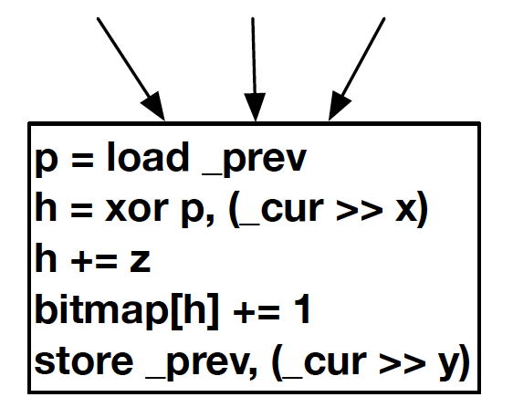

但是即使多使用了 3 个参数，对于应用程序这么庞大的状态空间来说，也不一定是有解的，因此作者继续考虑了两种情况：

如果当前基本块只有一个前驱节点，也即执行到当前基本块时的 Edge 的哈希值是定的，因此直接生成一个定的哈希值，存储在该基本块中，如下图所示（Fsingle）：

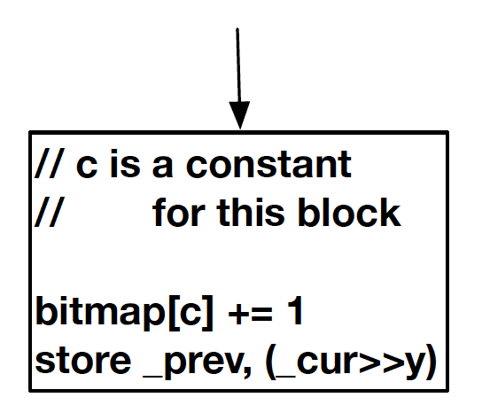

对于剩下的还是无法求解对应不同的哈希值（Unique）的 `x`、`y`、`z` 三个参数的情况下，则构建一个哈希表，使用当前节点（`cur`）与前一个节点（`prev`）作为键进行查询（Fhash）：

通过这种方式，可以确保每一条边得到的哈希值都是不同的。

那么对于上述三种方式的性能来说，肯定是 Fhash 方式最低，Fsingle 方式最快。作者分析发现，Fsingle 通常在应用程序中占大多数，而 Fhash 通常是占极小部分的，因此使用这种方式反而会提升求 Edge 哈希的效率：

此外，作者还提出了 3 种种子选择的优先级策略：

* 作者认为，那些存在大量未遍历到的邻居基本块的测试用例应该优先被进行突变；
* 作者认为，那些存在大量未遍历到的邻居基本块后继节点的测试用例也应该优先被突变；
* 作者认为，具有大量操作内存的指令的基本块更有可能存在漏洞，因此也需要优先被突变；

这些基本块的信息都是通过静态分析得到，因此不会造成额外的开销。基于上述这些思想，作者实现了原型系统，并进行了充足的实验，最终性能得到了很大的提升。

## FOT: A Versatile, Configurable, Extensible Fuzzing Framework

*Proceedings of the 2018 26th ACM Joint Meeting on European Software Engineering Conference and Symposium on the Foundations of Software Engineering*

本篇文章作者提出了一种高度模块化、可拓展的模糊测试框架。作者认为现在基于灰盒模糊测试已经有很多工作，取得了不错的成果，但是缺少模块化的模糊测试方案，无法快速集成新技术来验证有效性，导致在实现某一个 Feature 的时候经常需要对现有模糊测试工具的代码进行大幅修改。

基于这个想法，作者实现了一个框架，该框架具有如下性质：

* 多功能：提供包括静态分析和动态分析等辅助模糊测试过程的充足的功能；
* 可配置：提供多个配置选项，可以对模糊测试过程中的各个模块进行定制化配置；
* 可拓展：对于模糊测试过程中的部分模块，提供很强的拓展性，从而可以对部分模块进行定制；

作者实现的框架的架构图如下：

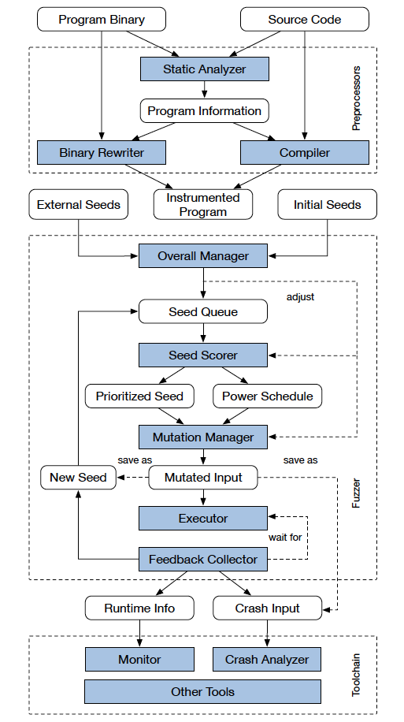

其中蓝色的框表示的部分为可以进行配置和拓展的模块。对于 **Static Analyzer** 模块，可以对该模块进行自定义，从 PUT 中提取对应的信息并转化成指定的形式。对于 **Overall Manager** 模块，可以进行定制，从指定的目录获取种子文件，放入 **Seed Queue** 中。**Seed Scorer** 模块可以对 **Seed Queue** 中的种子进行定制化打分，从而实现种子调度策略的定制。**Mutation Manager** 模块则可以对所采用的突变器进行定制。**Executor** 则可以根据是否需要 `forkserver` 来进行配置。**Feedback Collector** 可以对需要收集哪些反馈信息进行定制（*但是反馈信息收集一般需要跟插桩阶段结合，因此是不是需要协同前面的插桩模块进行统一定制化？*）

作者基于模块化的模糊测试框架，实现了几种不同类型的模糊测试方案：

1. 静态漏洞分析集成方案：首先对 PUT 进行静态分析，得到每个函数所对应的漏洞分数，之后使用函数级别的插桩方式对 PUT 进行插桩，每次执行完成后，收集测试用例的函数覆盖信息，并根据之前计算得到的漏洞分数对当前测试用例进行优先级调度；
2. 导向型灰盒模糊测试：作者根据导向型模糊测试的原理，对静态分析模块、插桩模块、反馈收集模块、种子调度模块以及突变模块进行定制化，通过计算每个基本块与 Target 的距离，并在插桩阶段插入距离信息，在反馈收集阶段收集当前测试用例与 Target 的距离，然后对种子进行调度，在突变阶段根据距离调整突变粒度，从而实现导向型灰盒模糊测试；

## The Art, Science, and Engineering of Fuzzing: A Survey

*IEEE Transactions on Software Engineering (2019)*

这篇论文是一个 Survey，作者对当前模糊测试的工作做了一个系统化地调研和总结。

首先，作者定义了 6 个术语：

* Fuzzing：使用从输入空间中采样得到的输入对目标程序进行执行；
* Fuzz Testing：通过 Fuzzing 来测试目标程序是否违反正确的策略；
* Fuzzer：对目标程序执行 Fuzz Testing 的程序；
* Fuzz Campaign：对于某一目标程序，使用某策略和特定的 Fuzzer 来执行；
* Bug Oracle：用来确定对于目标程序的执行是否违反了特定的正确策略；
* Fuzz Configuration：控制 Fuzz 算法的一些配置；

作者还提到，由于模糊测试的原理，实际上模糊测试这种方法不仅可以用来寻找程序的漏洞，还可以通过对特定策略的修改用在其他方面，这方面也有一些比较有意思的工作。

作者为了更系统化地总结模糊测试工作的进展，定义了一个用于描述模糊测试的模型。在该模型中，作者将模糊测试分为 5 个部分：预处理、调度、输入生成、输入评测、配置更新。

在进行实际的总结之前，作者还将模糊测试工作分为 3 类：

* 黑盒模糊测试：只能看到目标程序的输入和输出；
* 白盒模糊测试：这种模糊测试通常可以获得很多关于目标程序的信息，经常与符号执行等静态分析方法结合在一起；
* 灰盒模糊测试：相比于白盒模糊测试获得的信息少一点，会执行一些轻量的静态分析或者获得一些与执行相关的动态信息（例如覆盖率）；

然后，作者按照划分的 5 个部分对模糊测试工作做了总结。

### 预处理阶段

在预处理阶段，作者发现现有模糊测试针对这一阶段做的工作有插桩、种子选择、种子修剪、生成驱动程序。

#### 插桩

对于插桩，主要用于辅助模糊测试工具进行信息收集，同时也可以对并行程序的多个线程执行进行调度，还可以添加 In-Memory 模糊测试执行的支持。插桩可以分为静态插桩和动态插桩，静态插桩对执行速度的消耗通常更小一些。

**LibFuzzer** 和 **AFL** 以及基于这两个模糊测试工具的后续工作都使用插桩的方式来统计分支覆盖率信息来反馈执行。**CollAFL** 对这种反馈信息的收集进行了优化，减少了信息收集过程中由于路径冲突导致的信息不完整的问题，从而提高了模糊测试的精度和效率。**Syzkaller** 使用节点（基本块）覆盖率来指导后续模糊测试过程。**Honggfuzz** 也使用插桩对执行反馈信息进行收集，但是它可以对这些反馈信息的粒度进行定制。

条件竞争漏洞对于传统的模糊测试工具通常不易发现，因此有一些工作通过对目标程序插桩来控制目标程序多个线程之间的调度，从而更好地发现条件竞争漏洞。

由于模糊测试过程需要对目标程序进行加载，这一部分的时间开销通常比较大，因此提出了一种 In-Memory 模糊测试的方法，在程序获得输入之前对程序进行快照，这样不用在每一轮新的模糊测试时重新加载目标程序。例如 **GRR** 就使用了这种方式。而 **AFL** 则使用 `fork server` 的形式来减少这种开销。大部分网络协议的模糊测试工作都是采用这种方式进行的。还有一些工作不在每一轮模糊测试结束之后恢复目标程序状态，而是直接迭代进入到下一轮模糊测试的过程，例如 **AFL** 的 `persistent` 模式。

#### 种子选择

在模糊测试过程中，由于目标程序输入空间的庞大，通常可能会伴随一个规模较大的种子库，为了减少冗余，通常需要对种子库进行缩减。如果对种子库中的种子进行有效的选择称为种子选择问题。一个常见的选择方法是找一个最小的种子库的子集，但是该子集可以达到最大的程序路径覆盖率。**AFL** 使用分支覆盖率来衡量种子库的覆盖率。**Honggfuzz** 根据执行的指令数、执行的分支数以及不同的基本块的数量来衡量覆盖率。

#### 种子缩减

通常认为更小的种子文件可以消耗更小的内存，从而提高吞吐量，提高执行效率。**AFL** 不断地挪走种子文件中的一部分内容，如果挪走后该种子文件的覆盖率不发生变化，则进行缩减。**Optimizing seed selection for fuzzing** 这个工作通过给小的种子文件更高的优先级来保证小种子优先被执行。**MoonShine** 在 Syzkaller 的基础上，通过静态分析，保留种子文件中不同系统调用之间的依赖关系，从而将 Syzkaller 中的种子大小减小。

#### 提供驱动程序

这一部分通常缺少一些自动化的方式，主要针对一些无法直接运行的目标程序，比如库程序，需要写一个程序来调用相应的 API。而对于内核来说，需要使用用户态程序对内核进行模糊测试。**IoTFuzzer** 在不单独提取目标固件的基础上，直接使用固件对应的控制 App 与 IoT 固件交互，通过对传输的数据包进行修改从而实现模糊测试。

### 调度

调度表示选择一个种子的配置用于下一次模糊测试的过程，每一个调度算法都需要在 `exploration` 和 `exploitation` 探索上作权衡（广度和深度）。黑盒模糊测试由于其具有的信息有限，主要还是使用每一次执行得到的 Crash 数量和 Bug 数量以及执行的时间对种子文件进行调度。也有一些工作基于这些信息在黑盒模糊测试上对种子进行了调度。

灰盒模糊测试则具有更多的信息可以使用。以 **AFL** 为代表，基本思想是使用进化算法，维护大量的配置（种子文件），每一个配置都有对应的 `fitness` 值，然后根据 `fitness` 值（最合适的）选择一些配置进行遗传变换，得到新的配置。因此灰盒模糊测试的调度可以分成三个小问题：1. 什么样的配置是合适的？2. 怎么选择一个配置？3. 所选择的配置如何使用。**AFL** 认为最合适的配置是比较小的但是覆盖率高的种子文件。**AFLFast** 通过修改 `fitness` 的计算方式来更有效地调度配置，从而更多地探索路径。**AFLGo** 通过修改 `fitness` 计算来指导生成测试用例更快地到达程序的目标位置。**Hawkeye** 通过静态分析和种子调度来更快的到达目标位置。**FairFuzz** 通过对种子和稀有分支对使用突变掩码来促使目标程序更容易到达稀有分支。**QTEP** 使用静态分析，推测哪一个分支更容易有错误，然后将覆盖这个分支的配置的优先级提高。

### 输入生成

输入生成可以分成两个类别，分别是基于生成的模糊测试（基于模型）以及基于突变的模糊测试（模型无关）。基于生成的模糊测试根据给定的测试用例的描述（比如语法文件）来生成新的测试用例。基于突变的模糊测试通过对已有的种子文件进行突变来生成新的测试用例。

#### 基于生成的模糊测试（基于模型）

一些模糊测试工具使用用户提供的输入模型对测试用例进行生成，例如 **Peach**、**PROTOS**、**Dharma** 等。还有一些会保留一些生成测试用例相关的接口，可以让用户自定义测试用例的生成方式，例如 **Sulley**、**SPIKE**、**LibFuzzer** 等。而网络协议的模糊测试工具使用具体的协议准则指导测试用例的生成，例如 **PROTOS**、**SNOOZE**、**KiF**、**T-Fuzz** 等。内核 API 的模糊测试工具则使用系统调用模板，例如 **Trinity**、**Syzkaller** 等。**Nautilus** 使用语法相关的输入来实现通用模糊测试工具。在这一类中，还有大量针对目标语言解释器的模糊测试工作，例如 **ccross_fuzz** 和 **DOMfuzz** 对 DOM 树进行模糊测试，**jsfunfuzz** 针对 JavaScript 语言进行模糊测试，还有一些例如 **QuickFuzz**、**LangFuzz**、**BlendFuzz** 等都属于这一类模糊测试工具。

还有一部分工作通过用户给的输入，推导出用于生成测试用例的模型，来进一步指导测试用例的生成。例如 **Test-Miner** 从目标程序中搜索字面量，指导测试用例的生成。**Skyfire** 通过给定的种子文件和语法，推测出上下文相关的语法来生成语法有效的种子。**IMF** 通过分析 API 日志，学习内核 API 模型，然后使用推测的模型产生一个调用一系列 API 的 C 代码。**CodeAlchemist** 把 JavaScript 代码划分为不同的代码块，然后计算约束，用来描述代码块之间是否可以组合，然后进一步组合不同的代码块，生成新的种子文件。**Neural** 和 **Learn&Fuzz** 使用神经网络来指导测试用例的生成。还有一些工作在模糊测试的过程中，不断更新得到的测试用例生成模型。最后还有一些工作针对于一些文件的解码器，对其相应的编码器进行修改，以产生具有部分错误的编码数据，对解码器进行模糊测试。

#### 基于突变的模糊测试（模型无关）

现在有较多的工作是基于突变的模糊测试。突变的方式有位翻转（**SymFuzz**、**BFF**、**FOE**）、算术变换（**AFL**、**Honggfuzz**）基于块的变换（大量工作，插入块、减少块、替换块等）、基于字典的突变（**AFL**、**Honggfuzz**、**LibFuzzer**、**Radamsa**、**GPF**）

在这一块还有一些对变异算法进行调度的工作（**MOpt**）作者没有提到，这些工作通过执行的反馈信息动态调度模糊测试的变异算法，而不是使用传统的已经确定的概率分布的变异算法，从而提高模糊测试的效率。

#### 白盒模糊测试

这里的白盒模糊测试是指通过对程序的分析，结合一些符号执行等静态技术来生成新的测试用例。有较多的工作将动态符号执行与模糊测试结合，比如 **Driller**、**Cyberdyne** 与 **QSYM** 等。但是动态符号执行有很大的性能开销，因此 **DigFuzz** 通过评估路径概率来在灰盒模糊测试与白盒模糊测试之间切换。

还有一些工作单纯使用静态分析或动态分析获取一些目标程序有用的信息，这些信息用于指导测试用例的生成，比如 **TaintScope** 通过使用污点分析来找到 `hot bytes`，然后着眼于对这些字节进行突变。**Dower** 通过程序分析，并结合启发式方式，标记出一些更有可能存在漏洞的地方，然后仅对这些关键的字节进行动态符号执行。**VUzzer** 与 **GRT** 均使用静态分析和动态分析，提取出控制流和数据流特征，指导输入的生成。

**Angora** 和 **RedQueen** 减少了对程序分析时的开销，并结合污点分析等技术来更近一步地促使模糊测试朝着目标位置进行探索。

#### 对目标程序进行修改

一些目标程序中存在校验和，对模糊测试的过程不太友好，一些工作着眼于对目标程序进行修改，从而绕过这些校验和。**TaintScope** 使用污点分析，将校验和 Patch 掉，如果有 Crash，则在 Crash 的测试用例中将校验和设置为程序中的校验和，然后在原程序中验证该测试用例是否有效。**T-Fuzz** 则将这种思想拓展到所有的条件分支上，其一开始收集这些分支，如果当前模糊测试过程无法发现新的路径，则对某一个分支进行 Patch。

### 输入评估

#### 检测漏洞

有一些漏洞可能无法直接触发漏洞，因此研究人员开发了一些 `sanitizers`，来对这些漏洞的效果进行放大，使其触发漏洞时更有可能出现崩溃。这些 `sanitizers` 包括：1. **Address Sanitizer** 、 **MEDS**、**SoftBound**（检测内存访问漏洞）；2. **Memory Sanitizer**、**Undefined Behavior Sanitizer**（检测未定义行为，例如未初始化变量）；3. **Thread Sanitizer**（检测条件竞争）；

此外，有一些漏洞可能无法通过运行状态检测出来，则可以指定一个攻击成功的实例的模式树来指示是否攻击成功，例如 **KameleonFuzz**、**u4SQLi** 等。

还有一种工作，通过比较两次执行的行为之间的差异来检测目标漏洞。

#### 优化执行速度

通过 `fork server` 或者 In-Memory 的方式。同时还有工作对 `fork` 系统调用的开销进行缩减。

#### 对 Crash 的处理

首先需要考虑对 Crash 进行去重。去重的方式有根据栈回溯的哈希值（部分工作，会使用不同层数进行实现）、根据覆盖率信息（**AFL** 等）、基于语义的（**RETracer**）这三种方式。

此外，还需要对 Crash 进行优先级排序，以指导更好地对漏洞进行 Patch。通常，这是通过评估漏洞的可利用性来实现的，相关的工作有 WinDbg 的 **!exploitable**、GDB 的 **exploitable** 插件以及 Apple 的 **CrashWrangler** 等。

最后，对造成 Crash 的测试用例进行缩小也有一点工作进行研究。

### 配置更新

这一块在黑盒模糊测试、灰盒模糊测试以及白盒模糊测试上的区分较大。对于黑盒模糊测试来说，由于通常没有什么有效的信息，因此较少会对配置进行更新。灰盒和白盒模糊测试由于获得的信息比较多，因此可以比较容易地进行更新。

对于配置更新，通常使用进化算法。模糊测试工具通过观察对目标程序的执行，如果该执行得到新的路径覆盖率，则将对应的测试用例放入到种子库中。在这个阶段，评估是否将种子放入种子库的策略通常是对 `fitness` 的值的求法进行定义。例如，**AFL** 通过记录某一分支执行到的次数进行记录，**STADS** 使用一个统计框架来预估如果模糊测试过程继续的话会有多少个新的配置会被发现。**LAF-INTEL** 在模糊测试过程中记录比较，将单个复杂的分支划分成多个小分支，从而更好地指导模糊测试变异。**LibFuzzer**、**Honggfuzz**、**go-fuzz** 和 **Steelix** 对比较指令进行插桩，获得比较的常量值作为突变的字典。**Angora** 使用函数调用上下文来设置对应的 `fitness` 值，**VUzzer** 对每个基本块的权重进行求值，从而更好地指导配置更新。

## Driller: Augmenting Fuzzing Through Selective Symbolic Execution

*NDSS. Vol. 16. No. 2016. 2016*

这篇文章作者提出了将符号执行与模糊测试结合的方法。作者发现普通的**模糊测试**只能发现目标程序中浅层的漏洞，而无法到达比较浅的路径，作者认为这是由于模糊测试在生成测试用例时，无法通过一些复杂的检测。而**符号执行**在理解程序语义方面有较好的能力，可以更好地指导生成通过复杂检测的输入，因此作者提出结合使用这两种技术的优点，来更好地挖掘漏洞。

作者通过分析程序，将程序的输入分成 `General` 输入和 `Specific` 输入。`General` 输入代表比较通用的输入，这种输入的有效值空间较大；`Specific` 输入代表有效的输入值限定在一定的范围内，例如某些 `magic` 值。而模糊测试由于其效率高，比较擅长在 `General` 输入中进行探索，符号执行则擅长在 `Specific` 输入中探索。根据以上发现，作者将基于 `AFL` 与 `angr` 实现了一套混合模糊测试工具 `Driller`，使用符号执行来辅助模糊测试。

过去的工作也有将符号执行与模糊测试进行结合，但是这些工作过于依赖符号执行，而符号执行本身由于约束庞大的问题，导致效率不高，因此这些工作可能会导致模糊测试的性能下降。作者所提出的思想是，仅将符号执行用于求解一些模糊测试过程中无法解决的分支条件，而将其余的路径探索任务交给符号执行本身，从而减少符号执行中由于约束求解和路径爆炸等带来的消耗。

具体的，作者首先认为，程序会通过检查 `Specific` 输入来将程序的执行流分成两个部分，执行流通过检查 `Specific` 输入从而实现在不同的部分之间移动。作者首先对目标程序进行普通的模糊测试过程，而当模糊测试过程经历了一段时间之后没有发现新的路径，此时作者认为当前模糊测试过程被卡住了。当卡住时，作者会执行符号执行引擎，将当前模糊测试生成的输入作为预约束传递给符号执行引擎，从而防止符号执行引擎在求解输入值时出现路径爆炸的问题，降低时间开销。当通过符号执行引擎求解得到一个可以导致进入新的程序执行路径的输入时，再将这个输入回传给模糊测试流程，从而辅助模糊测试过程的路径探测。

基于上述思想，作者对 `Driller` 的两个子模块：模糊测试模块和符号执行模块进行了**实现**。

对于**模糊测试模块**，作者基于 `AFL` 进行实现。作者通过使用 `AFL` 的 `QEMU` 模式，从而消除了对目标程序的源代码的要求，作者认为当模糊测试过程经过了很多轮突变之后还没有发现新的路径时，就可以认为模糊测试卡住，进而调用符号执行模块。

对于**符号执行模块**，作者使用 `angr` 来实现。作者首先介绍了符号执行的基本流程和存在的一些限制（主要是慢以及路径爆炸），然后作者介绍符号执行在 `Driller` 中的使用，首先追踪目标程序执行模糊测试产生的输入所得到的路径，如果符号执行引擎发现当前的路径可以产生另一个分支，而该分支在模糊测试过程中没有发现过，则使用符号执行求解进入该分支的输入。对于输入的求解，符号执行引擎使用**预约束**的方式，将模糊测试产生的输入的每个字节都进行预约束，如果发现了新的基本块转移，符号执行引擎会将之前添加的预约束移除，然后对这个分支的条件约束进行求解（*？这一块具体是怎么实现的还是有点没懂，或许可以看看代码*）。最终，符号执行引擎可以得到进入不同分支的输入，然后将这个输入重新返回给模糊测试模块，继续进行模糊测试。

最后，作者将所提出的方法进行了实验。可能由于这篇文章比较早，作者并没有在真实世界的软件中进行实验，而是针对 `CGC` 比赛提供的赛题进行对比。作者在 `126` 个程序中新发现了 `9` 个程序的漏洞，相比于普通的模糊测试，效果略有提高。*但是考虑到赛题的程序可能相对比较简单，因此普通的模糊测试本身就可以处理大部分的漏洞发现工作，因此可能提升的并不明显*。漏洞发现能力的实验结果如下图所示。

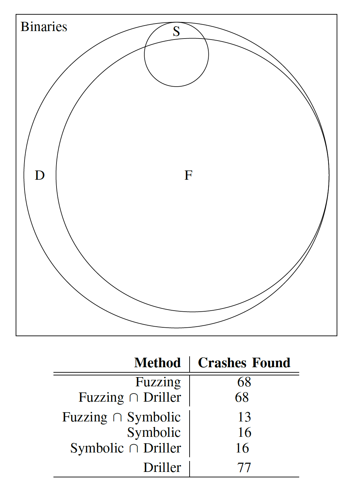

此外，作者在对符号执行引擎对模糊测试过程的程序路径探索能力的提高程度也相应做了实验，作者仅针对 `13` 个在模糊测试过程中会卡住，而且符号执行模块可以指引其提高的程序做了分析，得到的基本块执行数量提升的结果图如下。

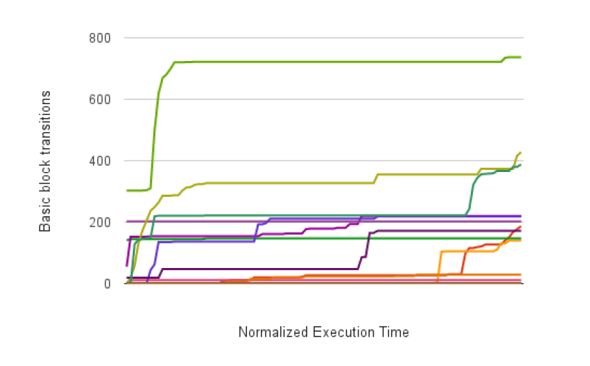

可以看到，使用了符号执行引擎之后，模糊测试过程确实能在程序路径探索的方面得到很大的提升，作者统计了符号执行所产生的输入对后续模糊测试过程的影响的比例，如下表所示。

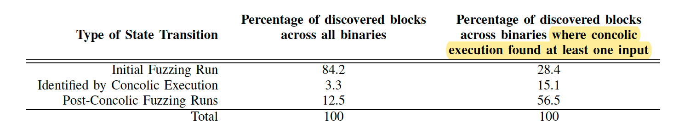

主要看右边一列，一共超过一半的基本块是基于符号执行得到的输入之后突变得来的测试用例所覆盖到的。因此符号执行在程序理解以及相应输入生成这方面还是起到了比较大的作用。

*但是作者没有对剩下将近一半的程序为什么无法发现漏洞做进一步分析，如果再进行分析是不是还能发现什么更好的方法*？最后，作者也对当前工作的一些不足做了总结，主要是在模糊测试方面，由于路径统计粒度较大，因此可能会漏过一些本应是新的状态转移的部分，从而影响符号执行引擎对程序状态的判断，而忽视一些输入的求解。另一方面是在符号执行方面，可能会将一些 `General` 输入误判为 `Specific` 输入而频繁调用符号执行引擎，从而影响模糊测试的整体性能。

## PAFL: Extend Fuzzing Optimizations of Single Mode to Industrial Parallel Mode

*Proceedings of the 2018 26th ACM Joint Meeting on European Software Engineering Conference and Symposium on the Foundations of Software Engineering*

这篇文章的作者认为目前大部分模糊测试相关的工作仅在单实例运行的情况下有较好的改善，而无法将这些改善在并行化模糊测试中进行同步。基于此，作者设计出多个实例之间有效的信息同步和任务分发方式，将单实例下比较有效的信息在多个实例之间共享，从而提高并行化模糊测试的效率。

作者首先使用 **AFLFast** 和 **FairFuzz** 在并行模式下进行实验，发现这两个在单实例模式下效果很好的的模糊测试工具在并行模式下反而没有 **AFL** 好。作者分析发现出现这个现象的主要原因有两点：

1. **AFLFast** 和 **FairFuzz** 获取到的信息没有在多个实例之间同步；
2. 并行模式下相同的多个实例会由于相似的指导信息，执行相似的模糊测试行为；

因此，作者基于上述两个原因，设计了一种在不同的模糊测试实例之间信息的同步机制，同时作者通过对程序分支分组来将模糊测试划分成不同的子任务，分发到不同的模糊测试实例中进行。最终作者实现了一个并行框架 **PAFL**，整体架构图如下所示。

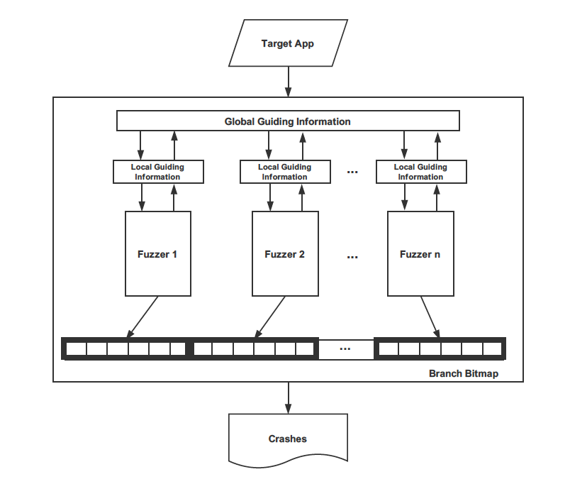

在 PAFL 中，模糊测试过程收集到的信息分为全局信息和局部信息。局部信息由每个模糊测试实例本身维护，全局信息则由所有模糊测试实例维护。由于模糊测试执行的过程很快，因此每一次每个实例都执行完就共享信息是不现实的。作者使用全局信息和局部信息将信息共享的频率降低，每次同步时都分为三步：1. 上传局部信息；2. 更新全局信息；3. 拉取全局信息；从而完成信息在多个实例之间的共享。

在任务划分机制中，作者通过种子选择阶段来使不同模糊测试实例针对不同的程序区域进行探索。作者将记录分支的 Bitmap 划分成 `n` 个区间，其中 `n` 是模糊测试实例的数量。然后对于每一个种子，获取其命中的最少的分支的数量的分支，如果该分支位于当前模糊测试实例所划分的区间内，则认为该种子属于当前模糊测试实例，交给当前模糊测试实例突变。否则，跳过该种子。

作者在 AFLFast 和 FairFuzz 上分别实现了这套 PAFL 方法，并在部分真实程序上进行实验，实验结果如下表：

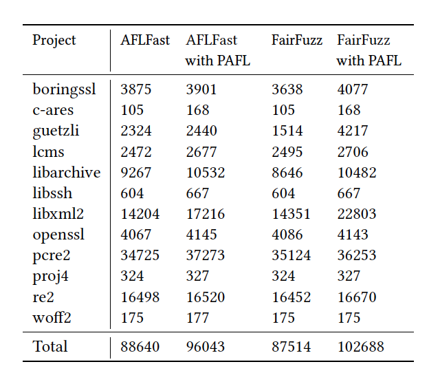

作者认为，这种信息共享机制以及任务划分的方式可以使得模糊测试的过程覆盖更多的分支（*但是感觉提高并不是很明显？*）

此外，作者还找了 GitHub 上的一些开源程序，最终拿到了 25 个 CVE。

*思考：这一部分对于模糊测试性能的提高，是信息共享的功劳还是任务划分的功劳呢？*

## Qsym: A Practical Concolic Execution Engine Tailored for Hybrid Fuzzing

*27th USENIX Security Symposium (USENIX Security 18). 2018*

这篇文章工作的重心在于提高 **Hybrid Fuzzing** 等性能。作者认为尽管 Hybrid Fuzzing 结合了模糊测试的速度以及符号执行的准确，但是由于符号执行本身的局限性，目前 Hybrid Fuzzing 仍然无法很好地应用在真实世界软件的漏洞挖掘工作中。

作者首先系统地分析了之前符号执行所存在的性能瓶颈，然后定制符号执行器来解决瓶颈问题。基本的思想是使用动态二进制翻译将符号仿真与真实执行结合在一起，这种方法可以实现更细粒度、指令级别的符号模拟，从而减小符号执行的开销。此外，作者还结合模糊测试的特点，将传统的符号执行中的较为严格的约束放松，而通过模糊测试来验证放松之后的符号执行的约束的求解结果。而符号执行在求解这种不严格的约束时可以获得更好的性能。

### 符号执行开销分析

作者发现，符号执行之所以慢的一个主要原因在于符号仿真方面，而不是人们普遍认为的路径爆炸。传统的符号执行通常使用 **IR** 将机器指令进行翻译从而对执行进行仿真，这样可以降低实现过程中的复杂程度，但是这会大大降低符号仿真时的执行速度。此外，如果使用 IR 会使得无法对其进行进一步优化，尤其在以基本块为单位进行指令翻译（成 IR）时，这时无法跳过基本块中一些与当前约束无关的指令，作者发现，基本块中只有 **30%** 的指令是有必要进行符号执行的。此外，作者还发现在将机器指令翻译成 IR 的过程，每一条机器指令都会对应多条 IR 语句，进一步造成了性能的开销。

符号执行的另一个开销是所使用的快照机制。快照的主要目的是在探索同一个分支的不同路径的时候可以使用符号程序的状态，但是由于模糊测试的随机性，每一次从模糊测试中获得的测试用例一般都不会共享某一个分支，因此，从一个测试用例中执行得到的分支通常不会在下一个测试用例中被重用。而传统的符号执行使用的快照只记录了程序内部的状态，不能反应外部环境，导致准确率下降；如果同时维护外部环境，则会导致性能下降。

符号执行为了精确求得分支信息，通常使用精确完整的约束。完整的约束保证了求解的正确性，但是同时引入了约束的复杂性。对于过于复杂的约束，求解的时间通常较长，甚至有一些过于复杂的约束无法求解。

### 解决方案

作者提出使用动态二进制翻译（DBT）的方式，与传统的符号执行需要采用基本块中的所有指令进行符号仿真的方式不同，作者仅对一些必要的指令进行仿真，从而减少了需要仿真的指令数量。因为上述方式，导致符号执行的开销减少，因此作者认为即使从头开始重复执行也不会造成太大的开销，从而将符号执行的快照机制略去。此外，作者采用一些启发式的方法对约束进行适当放松，然后通过模糊测试可以快速验证该松弛约束所生成的输入是否有效。

具体的，作者采用动态二进制翻译（DBT）方式，实现指令级别的符号翻译和仿真。此外，由于使用动态二进制翻译方式，可以在同一进程中同时进行 Native 执行和符号执行，而传统的 Concolic 执行方式需要两个进程之间进行通信来进行切换，这样的开销很大。

除了采用指令级别的仿真和动态二进制翻译技术外，作者还仅对与当前相关的约束进行求解，而不是求解整个路径约束。传统的符号执行引擎对路径上的所有约束进行求解，这对于没有初始输入的情况比较有效，但是对于模糊测试来说不太有效。作者通过只求解部分分支的约束，更新部分输入来生成新的测试用例。如下图是作者所用方法和 Driller 方法对输入求解的对比：

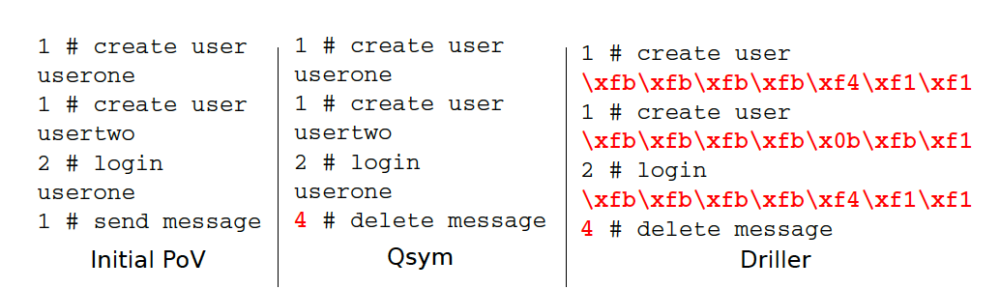

可以看到，为了探索新的路径，作者所使用的方法只更新了某一个菜单选项，而 Driller 使用的方法对之前的一些无关数据也进行了更新，从而可以见的 Driller 对输入中的无关部分也进行了求解。（*但是 Driller 的描述中好像也是根据具体执行到某个分支，如果该分支的另一个分支未被执行，则会对该分支进行求解，难道是对整个约束进行求解？*）

此外，作者还对约束的生成进行了松弛操作，不生成较完整的约束，使得约束更容易求解，更能适合真实的软件。

对于符号执行过程生成的约束，作者不对其进行完整求解，因为在这里符号执行用作对模糊测试的辅助，因此可以选择求解部分约束的值来生成新的测试用例。作者选择路径约束的最后一部分进行求解，这是因为最后一个约束通常是最简单的约束，而且求解最后一个约束可以更直接地指导探索新的路径。作者还发现由于循环或者函数调用等原因，有些基本块会被多次用来求约束，而这种重复的约束对于新的覆盖率的发现是无效的。因此作者对基本块的执行进行统计，如果某个基本块出现的过于频繁，则对基本块进行修剪，只求这条路径的子约束，从而加快符号执行的效率。

总的来说，作者主要做了这些工作：

1. 使用动态二进制翻译技术实现指令级的符号仿真，同时对一些不必要的指令仿真消除，从而加快执行速度
2. 由于执行速度加快，可以不借助快照机制
3. 对于每一条路径的约束，不对其进行完整的求解，只求解部分约束，然后更新对应的部分测试用例用于指导模糊测试
4. 在约束生成过程对多余的基本块中的约束进行修剪，从而得到更精简的约束

作者根据这些工作，实现了 **QSYM**，并与 AFL 结合。通过遍历 AFL 的 `queue` 目录，将该目录下的所有测试用例作为输入，使用结合 **PIN** 插桩实现的符号执行引擎进行求解，得到新的测试用例。对于新的测试用例，检查是否产生了新的分支，如果产生了新的分支则保存，并在之后同步到 AFL 的目录下。

之后，作者做了如下实验。

### 实验

作者首先在真实软件中进行实验，最终可以在 8 个真实程序中找到 13 个漏洞，而这些漏洞通过其他模糊测试工具无法发现：

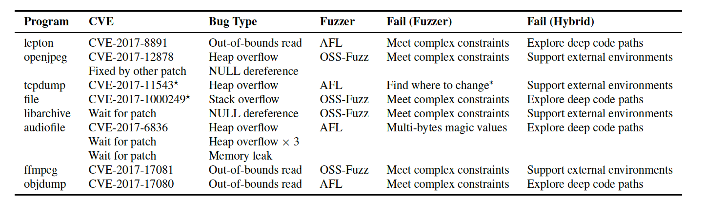

其次，作者使用 libpng 作为模糊测试对象，并通过赋予不同数量的初始种子来评测 AFL 与 QSYM 的覆盖率情况，发现 QSYM 基本不会太受是否提供初始种子的影响：

作者还评估了 QSYM 的快速符号执行约束求解方法是否可以达到很高的性能，是否可以为模糊测试提供较高的覆盖率，因此作者将时间限制在 5 分钟，评测其与 Driller 的覆盖率的比（其中红色表示 Driller 效果更好，蓝色则相反，每一个方块代表 CGC 中的比赛）：

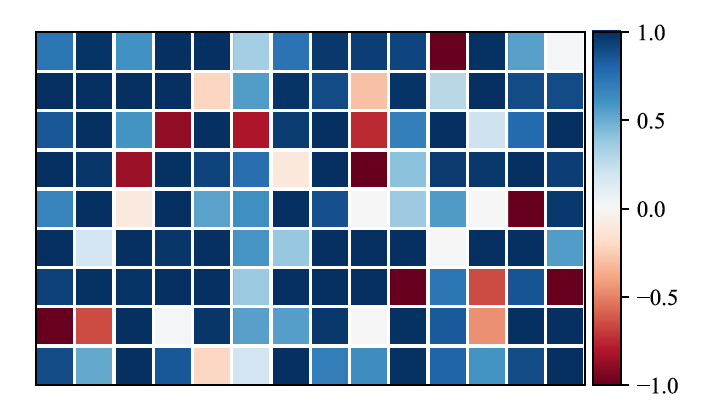

作者还将 QSYM 的符号执行时间限制为 5 分钟，将 Driller 从 5 分钟递增到 30 分钟，来评估两者之间的覆盖率，发现即使 Driller 运行了 30 分钟，其能解决的仍然比不过 QSYM：

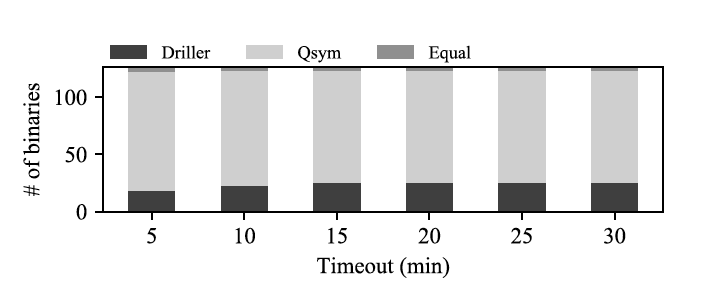

为了分析 Driller 为什么慢，作者将 Driller 的时间开销进行分割，发现在仿真阶段所花费时间最多，其次，Driller 所仿真的指令数量远远大于 QSYM 的指令数量，这更进一步导致了其符号执行速度下降：

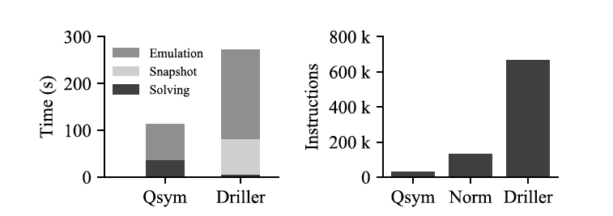

作者最后评估了其优化约束求解对漏洞挖掘能力的影响，发现 QSYM 在使用了优化求解的情况下可以发现较多的漏洞：

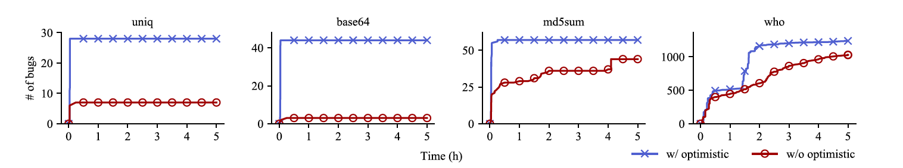

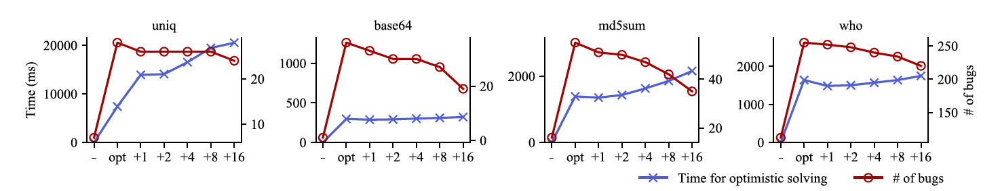

可以看到使用效率高的符号执行结合模糊测试还是可以获得较多的程序覆盖率。

## MOpt: Optimized Mutation Scheduling for Fuzzers

*28th USENIX Security Symposium (USENIX Security 19). 2019.*

这篇文章作者强调，对于模糊测试来说，性能很大程度上取决于突变策略的选择。作者认为现有的模糊测试工具通常依照特定的分布选择突变操作，效率较低。因此，作者提出了 **MOpt**，使用粒子群优化算法（Particle Swarm Optimization）找到更适合当前模糊测试的突变操作。

之前的模糊测试工具，例如 **AFL** 等，预定义好了一系列突变操作，在模糊测试过程中，根据调度策略对这些突变操作进行选择。调度策略是概率分布的，模糊测试工具通过预先定义的概率分布来随机地选择一些突变操作。这些固定的突变调度策略会影响模糊测试的性能，之前也有一些工作通过强化学习的方式来动态选择突变策略，但是这些效果并不是很好，作者认为主要原因有以下几点：

* 不同的突变操作在发现新的路径和新的 Crash 上有不同的有效性
* 同一个突变操作对于不同的目标程序的有效性也不同
* 同一个突变策略会随着时间不同有效性不同（对当前测试用例有效，对下一个测试用例效果就不好了）
* 过去提出的调度策略会影响模糊测试本身的性能
* 过去的方法与深度学习结合对突变策略调度，但是会遭遇数据不平衡的问题（是否能触发新的路径）

基于上述发现，作者将突变操作的调度问题转化成一个优化问题，通过动态评估候选突变策略的效率，来调整对突变操作的选择。

作者通过观察 AFL 的调度策略，发现 AFL 会对每一个测试用例经过确定性突变、havoc 突变和切分突变三个阶段，如下图。

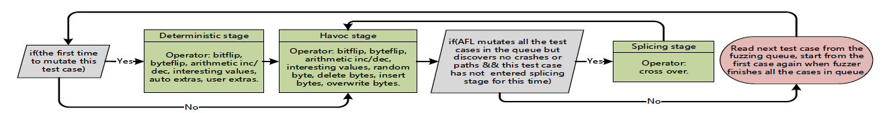

而 havoc 突变阶段是整个模糊测试阶段中最主要的一个阶段，且具有通用性，因此作者主要这一阶段实现调度算法。

作者通过实验发现，不同的突变策略对于同一个程序来说有效性不同，如下图所示。

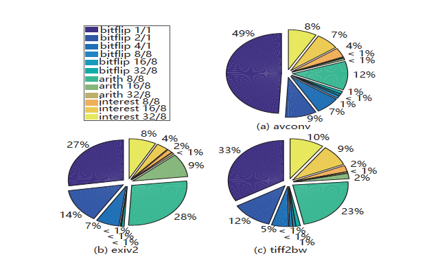

但是同时，默认的模糊测试的突变策略调度算法可能会导致选择的突变操作的次数也不同，如下图所示。

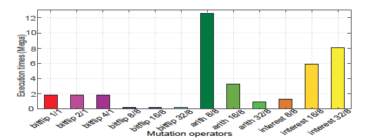

这就会导致模糊测试的过程可能过多地浪费在无效的突变策略中，从而降低了模糊测试过程的效率。因此，作者认为需要实现一种更有效的策略，可以更多地选择那些效率高的突变操作，对测试用例进行突变。

作者将寻找有效突变策略概率分布问题看作一个寻找最优概率分布的问题，作者使用粒子群优化算法来求解这一优化问题。其基本思想是首先探索每一个突变操作的最优概率，然后构造一个完整的最优概率分布。作者将每一个突变操作看作粒子，并在概率空间中进行探索。对于每一个粒子，如果这个粒子在某个位置（某个概率下）可以使得 AFL 生成更多的有趣的测试用例，则认为该位置更好，将粒子使用粒子群优化算法向该位置移动。作者将每个粒子所得到的最高的效率作为局部最优效率，将所有粒子得到的最高的效率作为全局最优效率。

但是，这种突变策略概率分布不像传统的粒子群优化算法可以在每个粒子上探索解空间，这种突变策略的分布概率只有一个解，因此作者实现了多个粒子群，在多个粒子群内部执行粒子群优化算法，找到每个粒子群的最优解，然后最终在多个粒子群中找到一个全局最优解（*但是我感觉这个也只是减少了局部最优解的概率*）。作者所实现的粒子群更新优化算法公式如下：

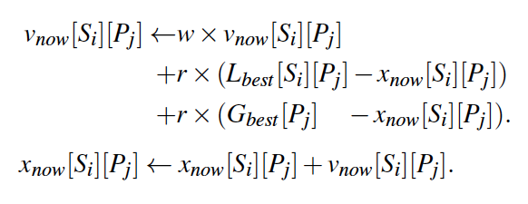

作者将 MOpt 分为 4 个模块进行实现。在 PSO 初始化模块中，对一些参数进行初始化，包括设置多个集群，对每个集群内部的粒子初始位置，初始动能等进行初始化。初始化阶段在模糊测试过程中只执行一次。

接下来进入 **Pivot Fuzzing** 阶段，在这个阶段中，对每一个集群进行评估，从而选择最好的集群进入下一个阶段。每一个评估通过执行指定次数的模糊测试过程，然后求得每个粒子的局部最优解以及每个集群的最优解，从而选取最好的集群。然后进入 **Core Fuzzing** 阶段，该阶段使用选定集群对应的概率分布进行模糊测试过程，求得每一个粒子的全局最优解。最后进入更新阶段，通过求到的局部最优解和全局最优解对粒子的位置进行更新。

在实现了粒子更新算法之后，作者还发现确定性突变阶段通常花费较多时间，且对于新路径的探索没什么帮助，因此提出当发现一段时间未探索到新路径之后，将确定性突变阶段略去。

接下来，作者进行了大量实验。作者首先针对 13 个真实程序进行模糊测试，并与原始的 AFL 进行对比，通过测试发现的 Crash 的数量来评测性能。作者通过比对 **ASan** 提供的调用栈来区分不同的 Crash，作者实验结果如下表所示：

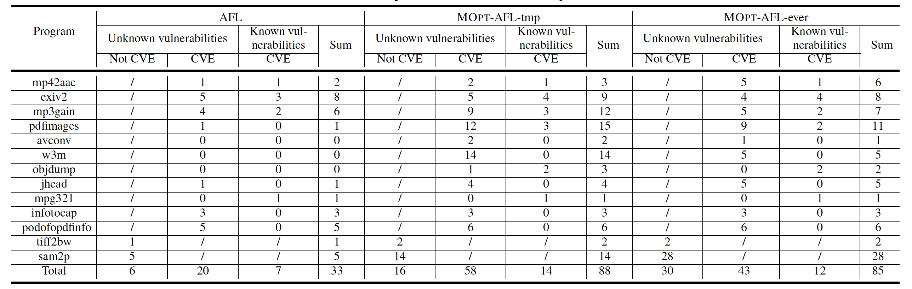

除了所发现的 CVE 意外以外，作者还评估了所实现的方法发现 Crash 的能力，同时作者还基于 **AFLFast** 和 **VUzzer** 对 **MOpt** 进行了实现，最终实验结果如下表所示：

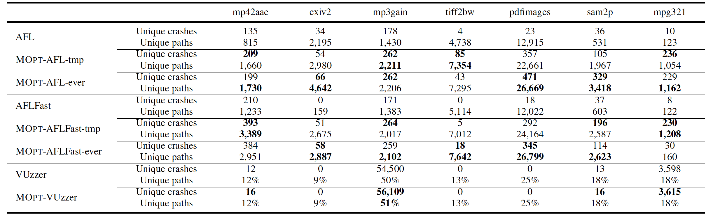

之后，作者针对 LAVA-M 数据集合也做了相应的实验，最后，作者通过对种子的调整，以及实现的不同，分别对 **MOpt** 的不同的模块进行了实验。

## IJON: Exploring Deep State Spaces via Fuzzing

*2020 IEEE Symposium on Security and Privacy (SP)*

这篇文章的作者认为在模糊测试过程中，为了探索更多的路径，发现更多更深的漏洞，一些专家知识是不可少的。作者认为，单一的完全自动化的模糊测试算法无法适应所有应用程序，而正常的模糊测试过程研究人员通常先执行自动的模糊测试流程，一段时间之后，分析代码，之后可以移除一些不重要的但是影响覆盖率的代码（比如校验和）；或者对模糊测试的突变策略进行转化。因此，对于有效的模糊测试过程来说，适当的人工交互还是有必要的。基于这个思想，作者提出了借助人工的分析，对目标程序的状态空间进行注解，从而指导模糊测试对目标程序状态空间的探索。最终，作者将这一思想实现为以拓展的形式进行实现。

作者首先介绍了基于代码覆盖率指导的模糊测试的基本流程，但是同时作者提到，目前的代码覆盖率指导的模糊测试在模糊测试过程卡住的时候没有任何有效的反馈可以帮助模糊测试继续前进。基于此，作者认为使用代码覆盖率来表示程序状态空间在某些时候是有意义的，但是对于探索全新的路径不太合适，因此，作者观察现有模糊测试生成的测试用例对程序覆盖率的影响，同时分析了程序的状态转移之间的关系，总结得到如下三个情况：

1. 程序的分支是不变的，但是状态由一些值来代表，不同的变量值会代表不同的程序状态；
2. 程序的值无法表示状态，但是可以通过代码的位置来代表程序状态，但是不同死的状态多次经过同一个代码位置；
3. 以上两种情况都不能很好的反映当前程序状态，引入中间状态；

对于第 `1` 种情况，如下所示：

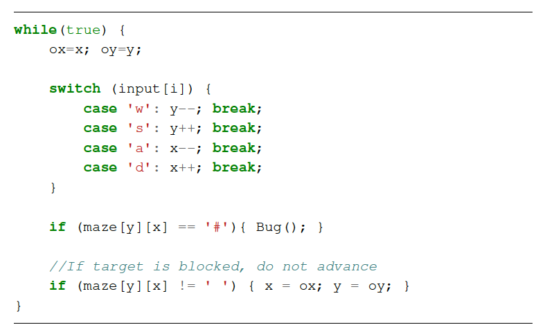

由于需要探索不同的迷宫，每一个点的位置都属于不同的状态，因此可以将 `x` 和 `y` 的值的组合作为状态的唯一表示。

对于第 `2` 种情况，如下所示：

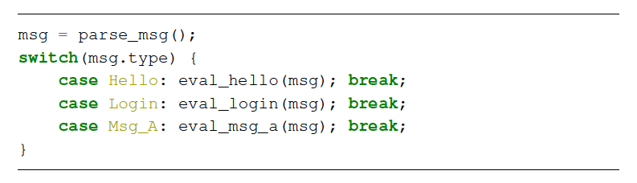

对于每一个不同类型的状态，都可以认为属于不同的单独的状态。但是每次消息的发送可能会涉及到多种不同类型的消息组合，例如先发送 `hello` 消息，再发送 `login` 消息，最后发送普通消息，即每个代码位置代表的状态会被以一个序列的形式出现，因此需要考虑每个代码位置对应状态的历史信息。

对于第 `3` 种情况，常见的比如 `magic` 的检测，校验和等信息，在真正对目标状态进行突破之前无法获得有用的反馈信息。而分析人员可以通过将这种复杂的检测进行拆分，使用多个简单的检测替换，在每一次简单的检测之后对模糊测试提供反馈。

基于上述观察，作者提出了一种注解的机制，通过在测试程序中添加少量的代码，来辅助覆盖率指导机制更精准地指导模糊测试工具突变，注解的可选代码如下：

1. `IJON_ENABLE()` 和 `JION_DISABLE()`，用于决定是否对这一段代码使用覆盖率反馈机制，可以对目标程序节省一些不重要的路径的探索时间；
2. `IJON_INC()` 和 `IJON_SET()` 用于对 `Bitmap` 设置，从而可以提供更有效、细粒度的突变反馈机制；
3. `IJON_STATE()` 开启一个虚拟状态，在该虚拟状态下，之前的那些覆盖到的分支路径对应的 `Hash` 值的计算结果均与之前不同；
4. `IJON_MAX()` 由于不同的模糊测试过程可能具有不同的优化目标，使用 `IJON_MAX()` 可以指导模糊测试的优化偏好；

作者使用动态链接库的形式实现了 **IJON**，主要实现了在目标程序上使用上述的这些函数添加注解，并对目标程序与模糊测试工具之间的通信方式进行了一些修改。

接下来作者针对上述三种情况做了实验，在添加了 **IJON** 注解的情况下均比原始基于 **AFL** 的模糊测试工具完成的更好，且效率更高。此外，作者发现在结合了 **IJON** 之后的模糊测试器，一些基于 **AFL** 改进之后的模糊测试器性能反而有所下降，这是因为在解决这些问题时（使用值作为状态），这些先进的方法不但没有帮助，反而造成了性能的下降：

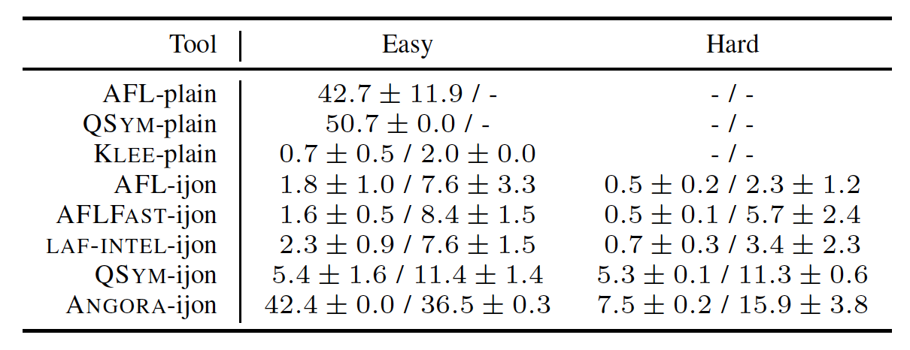

同时，作者还发现，如果使用较好的状态表示方法来指导模糊测试过程，对于结构化数据来说，测试用例的语法指导甚至不是关键的部分，即不需要语法指引也能通过特定的状态描述来获得较好的效果。

除了上述实验，作者还演示了在真实程序中部署 IJON 来更好地指导模糊测试过程，如下图所示：

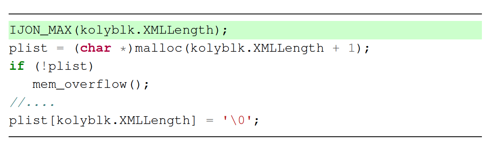

可以通过 `IJON_MAX` 指导模糊测试更好地发现整型溢出漏洞。

总的来说，作者通过添加注解的方式，在模糊测试过程中引入了人工的因素，可以更好地表示模糊测试过程的状态，而不是单一地使用覆盖率信息对模糊测试作为指引，作者在最后还提到，将模糊测试与人工干预相结合渐渐开始成为目前研究的一大趋势。

## Profuzzer: On-the-fly input type probing for better zero-day vulnerability discovery

*2019 IEEE Symposium on Security and Privacy (SP)*

这篇文章的作者提到，对于之前的模糊测试过程来说，在突变过程中通常缺乏语法和语义信息的指导。因此作者提出结合类型推导技术，自动化推导出测试用例中每个字节的字段含义，从而更智能地指导模糊测试过程。

作者提到，先前生成式的模糊测试依赖于指定的语法文件，但是过于完备的语法文件可能减少了模糊测试过程的搜索空间，因为可以触发漏洞的测试用例可能并不是完全符合语法的。而对于突变式的模糊测试，由于突变过程过于随机，会降低模糊测试过程的效率。

对于一个程序的输入来说，通常是结构化的，能够被区分成多个不同的字段，例如缓冲区大小、类别字段等，这些字段可以用来指导模糊测试的突变过程。但是这些字段可能无法直接提供给模糊测试工具，因此作者提出了一种可以自动探测不同字段类型的模糊测试过程，称为 **ProFuzzer**。作者将模糊测试划分成多个阶段的过程，在第一个阶段，对每一个字节进行探测。具体地，对于每一个字节进行突变，然后记录该字节多次突变之后的目标程序的执行路径信息。这些信息在第二个阶段用于推测出数据的各个字段的类型，从而实现更智能的突变，提高模糊测试效率。

作者在实现 ProFuzzer 之前，通过观察对 **OpenJPEG** 的模糊测试过程，发现在大量的模糊测试过程中，只有少量的字节（`24/60`）的突变对于目标程序覆盖率有帮助，如下图所示：

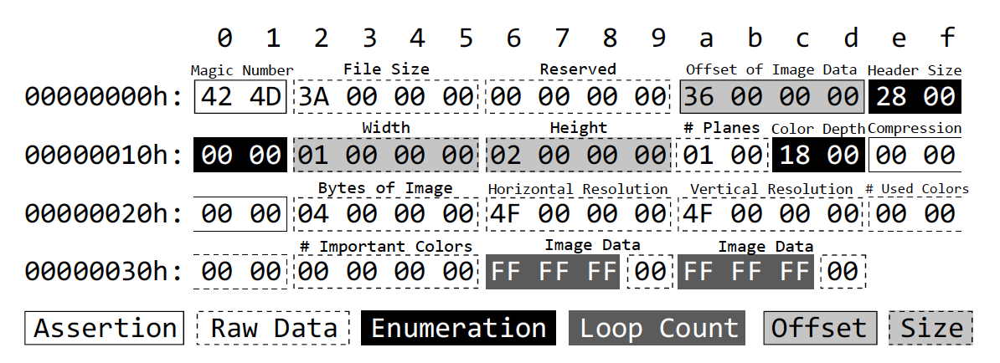

而盲目地突变会浪费大量的时间在一些没用的字节上，从而降低了模糊测试的效率。而 **AFL** 的 `afl-analyse` 以及 `Dictionary` 机制虽然可以对输入字段进行分析，但是过于简单，无法对模糊测试过程提高太多。同时作者分析发现，即使是输入中的一些具有含义的字段，对于模糊测试过程可能也是不重要的，如上图中的 `Horizontal Resolution` 和 `Vertical Resolution` 两个字段，对于覆盖率没有影响。而模糊测试过程中关注的字段可以通过在模糊测试过程中推导出来，用于后续指导模糊测试过程。

作者实现 **ProFuzzer** 的架构图如下所示，可以分成 4 个部分：推导部分、突变部分、执行引擎和报告引擎：

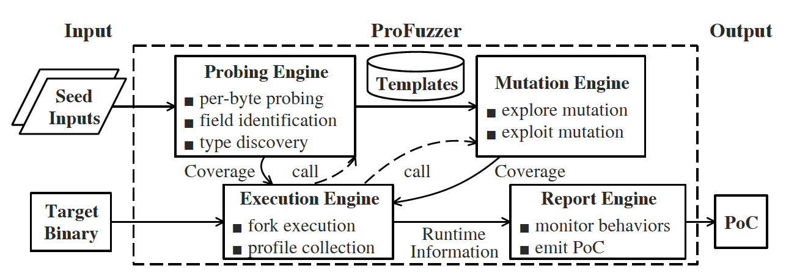

对于推导引擎，其遍历每个种子文件中的每一个字节，从 `0x00` 到 `0xff`，然后记录覆盖率的变化情况，将具有相同覆盖率变化情况的相邻字节看作同一个字段，然后推测这个字段的类型。

突变引擎则使用推导引擎得到的字段与字段类型模板对测试用例突变。作者将突变分成两个概念，第一个是探索，在这一阶段尽可能探索更多的程序执行路径，来提高程序的覆盖率；第二个是利用，在这一阶段则更倾向于发现程序的漏洞。

其他两个引擎作者使用的 AFL 原本的实现，因此不做过多介绍。

为了更好地指导模糊测试过程，作者针对模糊测试的特征，定义了 6 种字段类型：断言、元数据、枚举、循环数、大小、偏移。在推导阶段，作者针对每一个字节进行 256 次突变，对于每一次突变，记录突变后执行的覆盖率信息，并与原始测试用例的覆盖率信息进行比较，计算相似度信息，如下公式所示：

其中 `T` 表示覆盖到的边，`S` 表示覆盖的相似度，`D` 表示不同覆盖次数的边的数量与不同覆盖到的边的数量的比值。由于对于每一个字节，可以突变 256 次，因此每个字节可以有 256 个相似度，从而可以构成一个向量：

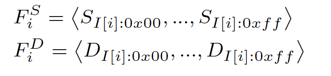

因此，每一个测试文件的每一个字节都可以得到如上的一个向量。接下来通过这个向量对字段进行划分，依照公式如下：

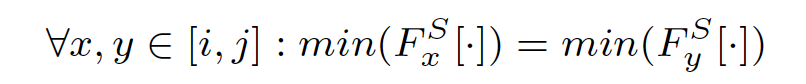

将满足上述公式的字节范围（`[i, j]`）看作是一个字段。而接下来根据 6 种字段类型的特征，对每一个字段进行分类，从而对于每一个测试用例都能得到字段模板文件，用于后续指导模糊测试。

对于每一个新得到的测试用例，首先会尝试重用已有的模板文件。但是如果找不到这样的模板文件，则会进行重新推导。重新推导的过程与初次推导的过程类似，仅在公式计算上略有不同。

在得到每一个测试用例的模板文件之后，可以对其进行针对性的突变。这里作者实现了两种不同的突变类型，分别是探索优先的突变和利用优先的突变。对于探索优先的突变，作者的目的是尽可能多地探索不同的程序路径，因此针对枚举、大小、偏移等类别的字段进行突变。对于利用优先的突变，作者事先调查了大量的 **PoC**，对于每个字段选定部分有趣的值，进行针对性地突变，从而加大发现漏洞的概率。

接下来作者对 ProFuzzer 进行评测。作者首先对 ProFuzzer 会带来的开销做了解释，由于使用字段类型模板，因此开销与输入的测试用例的大小是成正比的，作者通过 AFL 本身提供的 `trim` 机制来将输入大小限制在一个范围内，从而减少带来的开销，实验证明在限制了输入大小的情况下，仍然可以比原先的 AFL 带来多 `93%` 的路径覆盖率。

此外，作者还对推导引擎的准确性进行了验证，发现在大多数情况下可以保持较高的准确性，如下图所示：

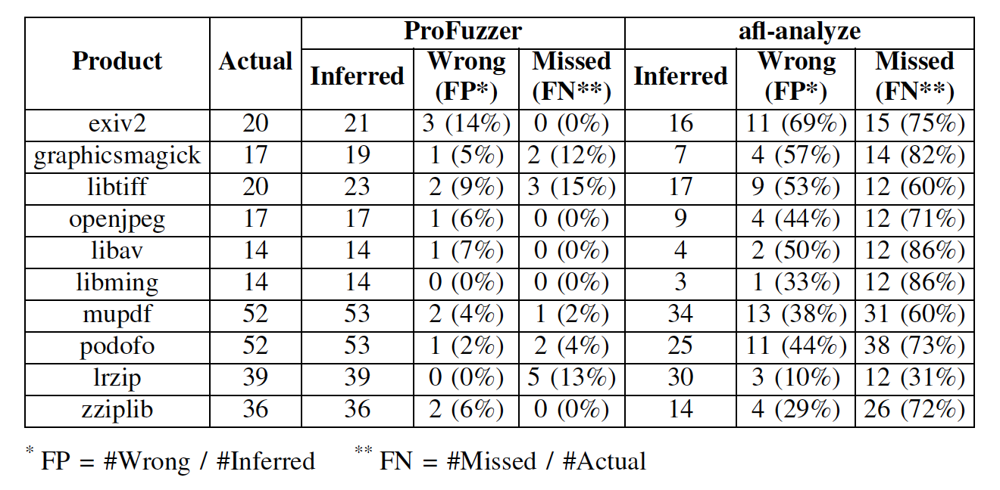

作者在多个开源项目下部署 ProFuzzer 两个月时间，发现了较多的漏洞，由此证明了 ProFuzzer 的漏洞挖掘效果。同时，作者还在 **LAVA-M** 上与其他模糊测试工具进行了对比，均可以发现比其他工具更多的漏洞：

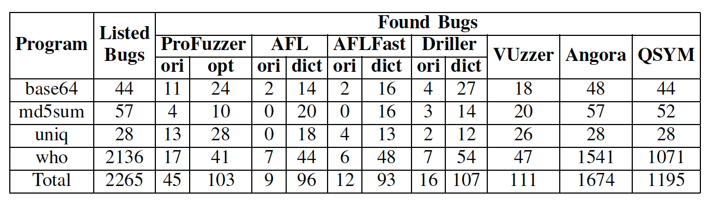

最后，作者对有效性进行了实验，通过在 OpenJPEG 上部署多个模糊测试工具，作者认为之前模糊测试工具一个不足的地方就是在太多的突变无法产生新的覆盖率，因此作者对突变的有效性进行了评测，结果如下图（横轴为时间，纵轴为效率）：

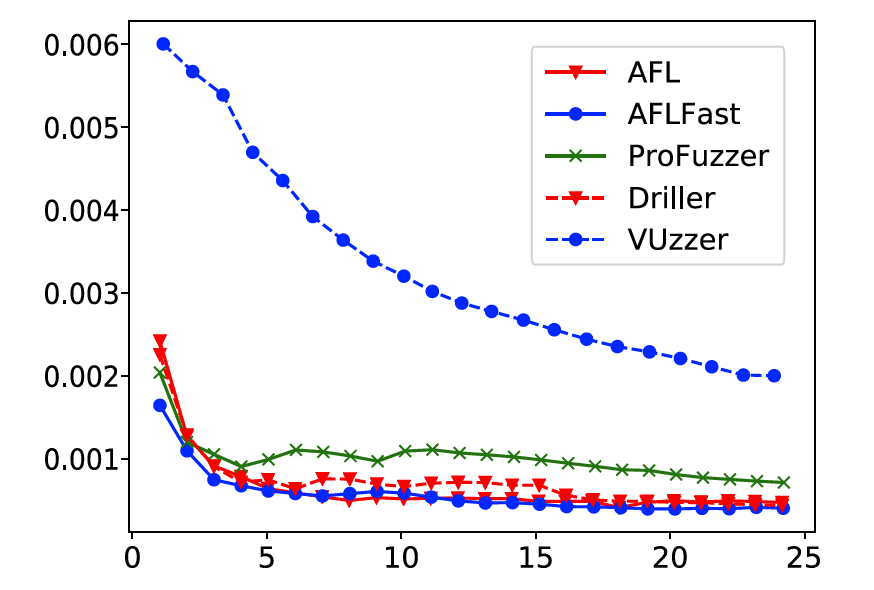

作者提到 **VUzzer** 之所以有这么高的效率是因为其使用的动态污点分析技术可以避免产生无效的突变。

作者同时对路径覆盖率的效率进行了评估，结果如下图（横轴为时间，纵轴为覆盖率）：

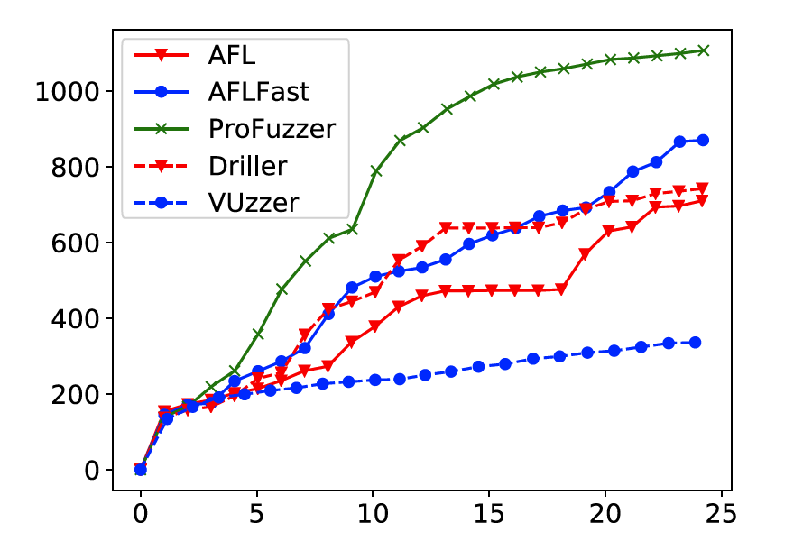

可以看到效率明显增强。

总的来说，作者提出的类型推导的模糊测试方法比较新颖，可以更好地指导模糊测试过程，从而克服了模糊测试过程中盲目突变的缺点，提高模糊测试的效率。

## Send Hardest Problems My Way: Probabilistic Path Prioritization for Hybrid Fuzzing

*NDSS. 2019.*

这篇文章的工作也是聚焦于模糊测试与符号执行的结合。由于模糊测试擅长于探索简单的路径，但是对复杂的路径探索无能为力。而符号执行可以较精确地探索到复杂路径，但是经常会遇到路径爆炸的问题，因此现在有很多工作将符号执行用于辅助模糊测试的路径探索。作者发现，现有的模糊测试与符号执行的结合方式有两种，一种是按需启动符号执行引擎，当模糊测试发现不了新路径后启动符号执行引擎对路径进行探索（Driller）；另一种是量化探索每条路径的成本，然后选择最有效率的一条路径去探索。作者评估了两种方式，发现这两种方式都不是最有效的。对于**按需启动**的方案，作者认为当模糊测试正在正常进行的时候也可以使用符号执行进行辅助探索，而不能仅将模糊测试过程卡住作为唤起符号执行的契机。此外，这种按需启动的方案不能保证符号执行所探索出来的路径正是导致模糊测试卡住的路径，有可能当符号执行探索出一个新的路径之后，模糊测试也探索出来了，而符号执行本身比较消耗时间，如果符号执行消耗的时间比卡住的时间短，反而浪费了性能，如下图是卡住的时间间隔的占比：

因此不准确地执行符号执行反而会加大资源开销，浪费了符号执行的资源。而对于**另一种**方案，如何评估路径的成本本身就是一个困难的问题，这个过程中可能会造成很大的开销，且无法统一符号执行与模糊测试共同的量化标准。

作者认为，由于符号执行本身比较慢，因此符号执行应该只用于解决最棘手的路径，此外因为高的吞吐量对于模糊测试来说很重要，所以额外的分析需要很轻量。因此，在本文中，作者提出一种调度方案，使得符号执行仅辅助解决最困难的路径，同时对于路径的难以程度的判断标准也很轻量，从而更好地结合模糊测试与符号执行。作者提出使用蒙特卡洛模型，将模糊测试过程看作是一个随机采样过程，来根据路径难易程度调度路径，而难易程度则通过随机的输入遍历到该路径的频率来得到。

如果需要使用蒙特卡罗方法，则需要满足两个约束：

1. 对于搜索空间的采样需要是随机的；
2. 需要大量的随机采样；

而模糊测试过程由于其随机的生成测试用例，以及其速度高效，自然而然满足上述两个条件。此外，为了使用蒙特卡罗方法，还需要统计路径的概率。但是如果记录每一次测试用例的路径会造成很大的开销，作者提出将执行路径看作是一条马尔可夫链，整条执行路径的概率可以通过每个分支的概率得到，每个分支的概率由下列公式计算得到：

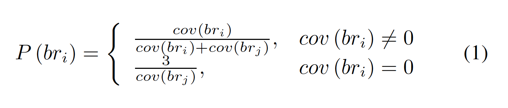

其中 `brj` 表示与 `bri` 具有相同前缀基本块的基本块。之后用马尔可夫模型计算路径概率：

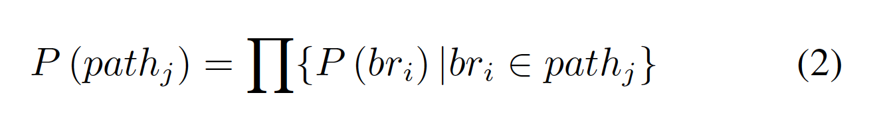

之后，作者介绍了基于蒙特卡罗模型的执行树，用来记录分支概率以及计算路径概率。

整个系统从模糊测试开始，当产生了新的测试用例之后，蒙特卡罗模型执行采样，来统计每个分支的覆盖次数，从而计算每个分支的概率，之后构建执行树，构建的执行树中仅包含已经被命中过的分支，并计算路径概率，然后选取路径概率最低的路径。具体地，通过遍历执行树的每个 trace 中的分支，获得其后继分支，如果这个分支未被探索过，则计算到达那个分支的概率（使用马尔可夫链）作为路径概率。在对每一个 trace 完成遍历之后，获取概率最低的路径，蒙特卡罗模型会根据该路径选择对应的测试用例（通过之前的 trace，哪个 trace 得到了这条路径，就选择那个 trace 的测试用例），使用该测试用例并结合符号执行，来求解探索路径的测试用例，将得到的新的测试用例返回给模糊测试过程，并更新执行树。作者基于这一思想，实现了原型系统 **DigFuzz**。

作者的实验从 3 个维度进行，分别是比较覆盖率、漏洞发现数量以及符号执行引擎所做出的贡献。

对于覆盖率，作者直接使用 AFL 的覆盖 Bitmap 来统计。此外，作者还加了一组 Random 的对照实验，该对照实验中随机选择一个未访问到的路径进行探索，最终覆盖率实验结果如下图所示：

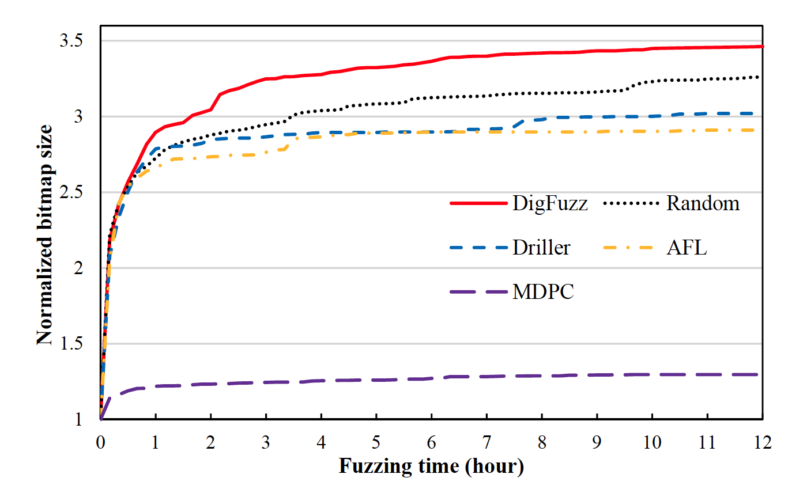

其中 Radom 的实验效果可以证明 Driller 所使用的按需启用符号执行策略并不能较好地发挥符号执行的性能。

对于贡献程度的贡献，作者认为如果符号执行产生的测试用例被模糊测试采用，则记为一次贡献。贡献的实验结果如下表所示：

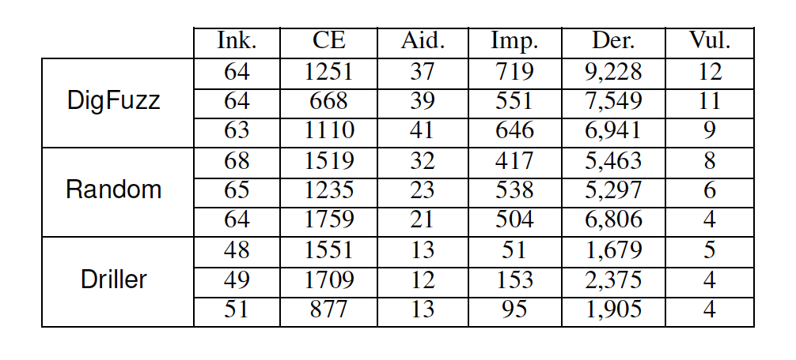

之后，作者同时在 Lava-M 数据集上做了实验，实验结果类似。

总的来说作者就是在符号执行与模糊测试的结合上，是的符号执行对路径探索的选择更有目的性，通过概率来获取那些对于模糊测试来说较难探索到的路径进行探索，从而提高两者结合的性能。

## EnFuzz: Ensemble Fuzzing with Seed Synchronization among Diverse Fuzzers

*28th USENIX Security Symposium (USENIX Security 19). 2019.*

作者提到，尽管有越来越多的针对模糊测试的优化的工作出现，例如 **AFLFast**、**FairFuzz** 等，但是这些模糊测试工具无法在真实的各种各样的应用程序中具有较强的鲁棒性，通常这些模糊测试工具可能在某些应用程序中有较高的性能，但是在另外的应用程序中性能甚至不如原始的 **AFL**。基于这个发现，作者提出将多个基本的模糊测试工具进行协作，将多样性高的模糊测试工具组装在一起协作，从而提高模糊测试的鲁棒性，对目标应用程序进行更高效地漏洞挖掘。

作者提出 **EnFuzz** 的基本思想是结合多个模糊测试工具的优点对目标应用程序进行模糊测试，例如下列程序：

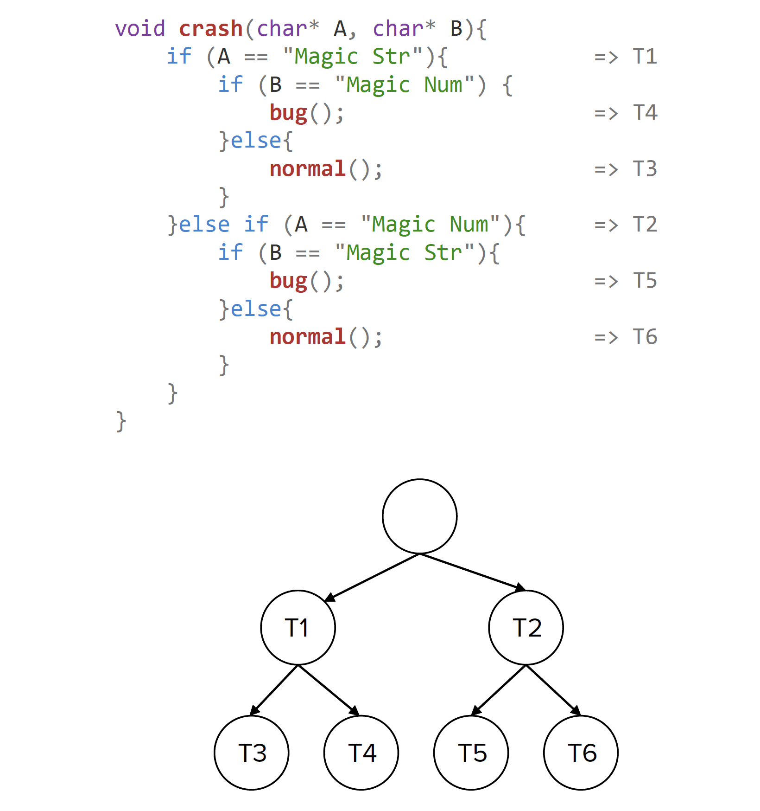

假设有 `fuzz_0` 和 `fuzz_1` 两个模糊测试工具，一个擅长解决 `Magic Str` 的分支，另一个擅长解决 `Magic Num` 的分支，那么如果将这两个模糊测试工具产生的测试用例同步，则最终两个模糊测试工具的组合可以解决图中的所有分支，而单独的模糊测试工具无法达到这种效果。基于这个思想，作者提出了协作模糊测试的两个基本目标：

1. 找到多个多样性较大的不同的基本模糊测试工具；
2. 实现一种有效的同步机制；

作者将模糊测试工具的多样性定义为如下三种：

1. 种子选择和突变策略的多样性；
2. 覆盖率信息粒度的多样性；
3. 输入生成策略的多样性；

作者根据上述三种启发式的多样性定义，手动选择多个基本的模糊测试工具。

在协同阶段，对于每个基本模糊测试工具来说，与单实例运行时的工作一样，执行传统的模糊测试循环，从 `queue` 中选取测试用例，对该测试用例进行突变，生成新的测试用例，使用新的测试用例执行目标程序。如果这个测试用例触发了新的路径，则除了将这个测试用例添加到本地的队列外，还会添加到全局队列，等待同步。

之后，会开启一个 `monitor` 线程，该线程初始化一个全局覆盖率信息，用于记录当前应用程序的模糊测试覆盖率情况。然后该线程会遍历全局队列，将全局队列中的测试用例分配给每一个基本模糊测试实例中（会检测是否能触发新的分支），从而完成测试用例的同步。

作者最终使用 AFL、AFLFast、FairFuzz、libFuzzer、Radamsa 和 QSYM 作为基础模糊测试工具来实现 **EnFuzz**。作者实现了 5 个原型系统来进行实验：

* EnFuzz-A：AFL、AFLFast、FairFuzz 组成，全部由基于 AFL 的模糊测试工具组成；
* EnFuzz-Q：AFL、AFLFast、FairFuzz、QSYM 组成，除了基于 AFL 的模糊测试工具，还加上了一个符号执行辅助的模糊测试工具；
* EnFuzz-L：AFL、AFLFast、FairFuzz、libFuzzer 组成，libFuzzer 是以块为单位统计覆盖率信息的；
* EnFuzz：AFL、AFLFast、libFuzzer、Radamsa 组成，Radamsa 是生成式模糊测试工具；
* EnFuzz-：由 AFL、AFLFast、FairFuzz 组成，但是没有启用种子同步机制；

作者使用路径数量、分支数量和发现的漏洞数量来评估上述几个原型系统的组合。首先作者在 **LAVA-M** 数据集上进行评测，评测结果如下：

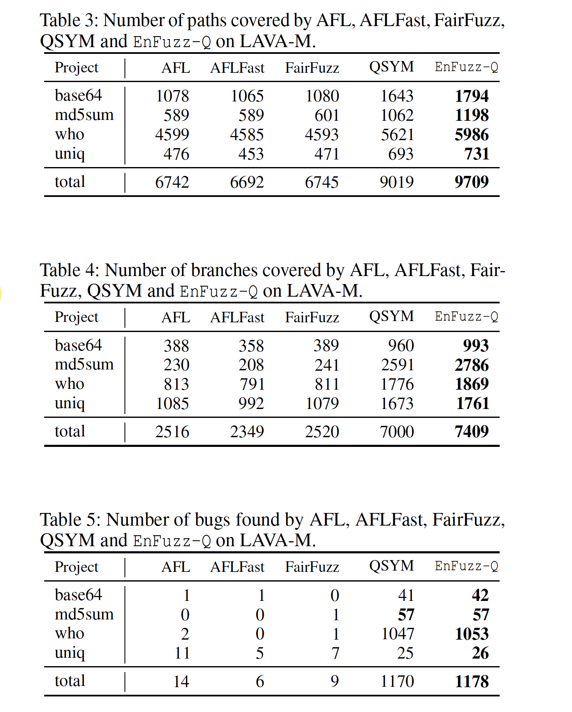

可以看到 EnFuzz-Q 的性能有所提升（*但是跟 QSYM 比起来其实提升有限*）

此外，作者在 **Google fuzzer-test-suite** 上进行了评测，评测结果如下：

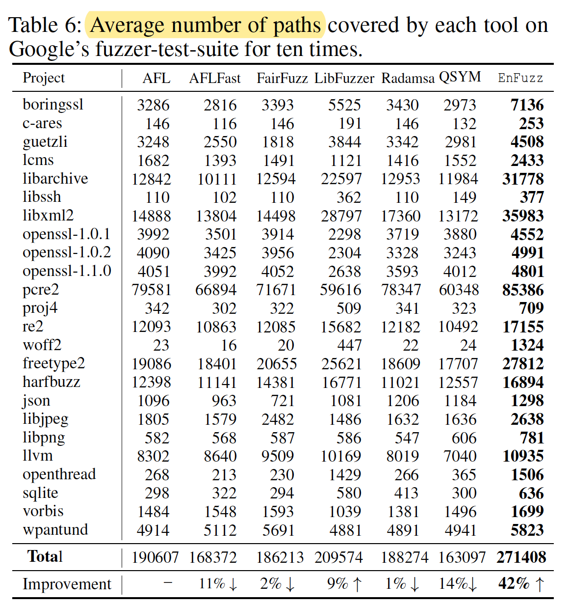

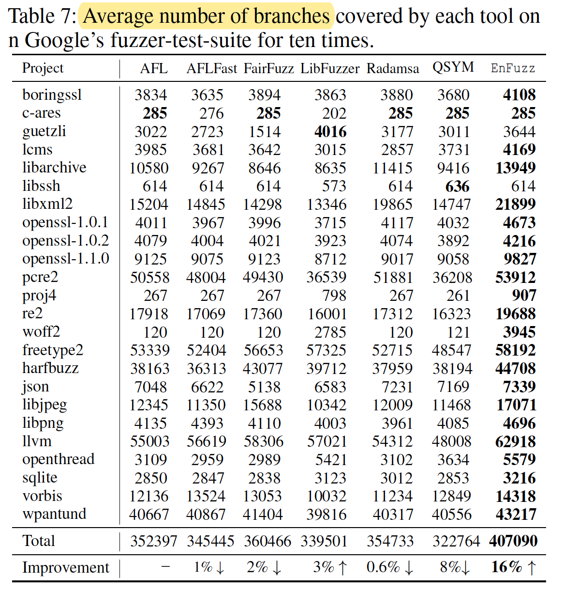

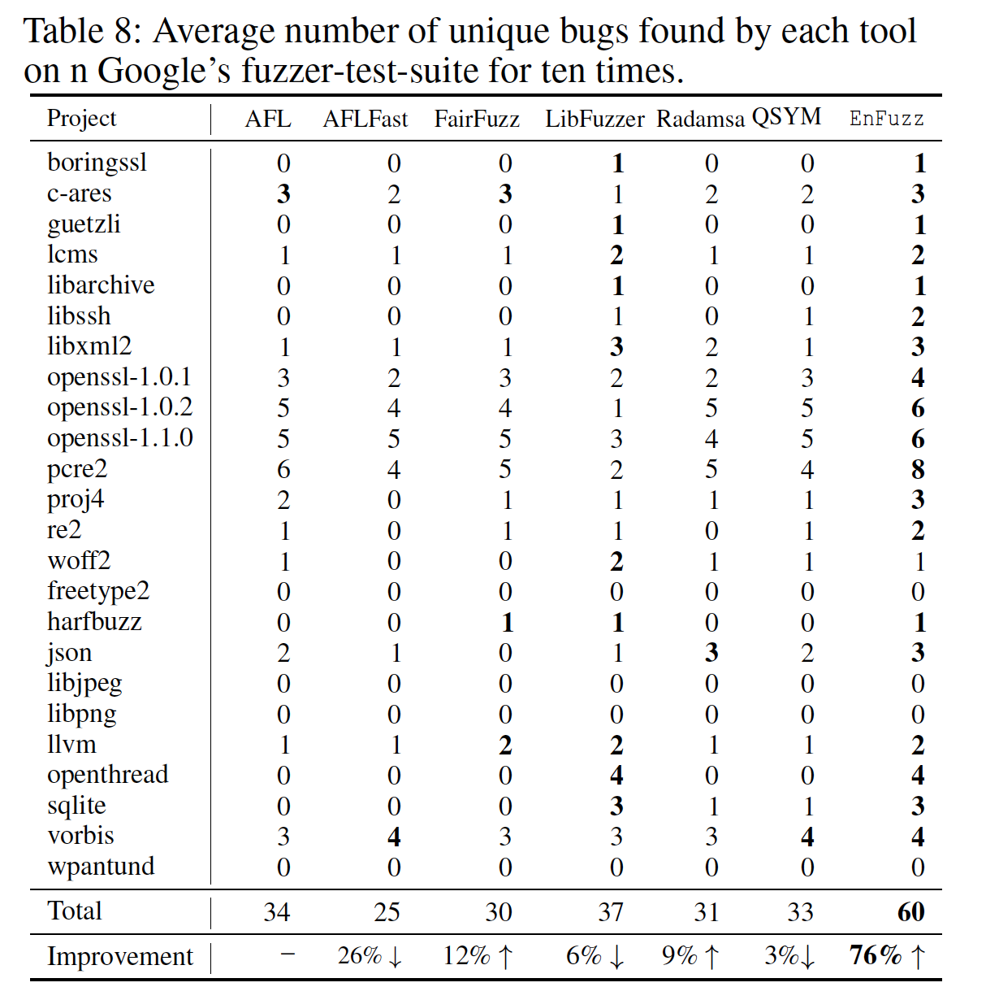

可以看到，各个指标皆较单一的基本模糊测试工具有明显提高。

此外，作者对不同组合的 5 个原型系统进行评测，得到的路径覆盖的结果如下表所示：

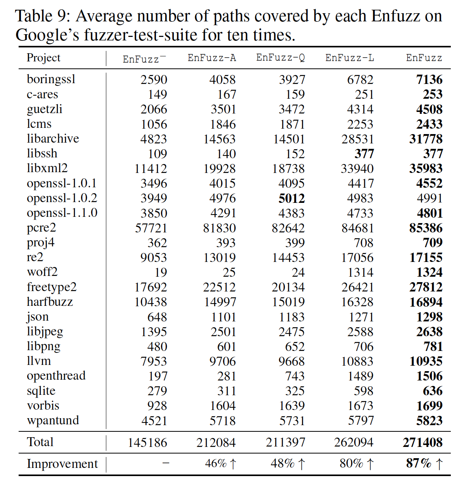

可以看到，启用了种子共享之后可以较明显提高路径覆盖率，同时组合差异性大的几个模糊测试工具也能较好地提高路径覆盖率，从而提高模糊测试的性能。

作者还在真实程序上部署了多个模糊测试工具，最终发现了 60 多个漏洞，获得了 40 多个 CVE 编号。

这篇文章的工作证明了多个多样性高的基本模糊测试工具的协作可以有效提高模糊测试的性能。

## Evaluating Fuzz Testing

*Proceedings of the 2018 ACM SIGSAC Conference on Computer and Communications Security.*

这篇文章对如何评测模糊测试算法的有效性进行了系统性地阐述。作者首先分析了对模糊测试算法进行一次合理评测的要点。作者认为，一次合理的评测，需要选择合适的 `baseline`，目标应用程序，评测的性能指标以及模糊测试工具的参数。此外，由于模糊测试本身的随机性，在相同配置下，不同次运行的效果可能会有很大的不同，而且随着时间的推移，模糊测试的性能表现也会有所不同，因此评测的时候，执行的次数和执行的时间都是需要考虑的地方。作者还发现一些文章对于种子的选取比较随意，它们假设不同的种子之间的作用是差不多的，这种假设也会使得评测结果有所偏差。在对于评测的性能指标来说，一些文章使用代码覆盖率来评估模糊测试的有效性，但是代码覆盖率与漏洞的数量的相关性可能不高。直接测量漏洞数量的评估方式是最直观的，一些文章使用启发式的方法对出现的错误进行去重，然后计数，但是使用的去重方法可能不那么有效。作者认为更好的指标是用实际已知的漏洞去评估模糊测试的性能，例如使用 CGC 数据集和 LAVA 数据集。作者选取了 `32` 篇模糊测试的相关文章，对这些文章的评测方法进行讨论，并总结有效的评估模糊测试的方法。

作者总结了 `32` 篇模糊测试论文中评测方式存在的一些不足：

* 大部分文章在评测过程中仅执行了一次，但是多次运行之间的性能差距可能会很大；
* 很多文章都是通过覆盖率来评估模糊测试工具的性能，但是没有直接证据表明覆盖率与漏洞数量成正比；还有文章用漏洞数量作为评估指标，但是去重的方法使用启发式方法，可能缺乏正确性；
* 很多论文实验的时间较短，应该使用较长的时间；
* 很多论文忽略了种子选择对模糊测试性能的影响；
* 各个论文对于目标程序的选择差异较大，可能有些工具在一些目标程序上效果较好，但是在另一些目标程序上效果并不好；

作者最后认为，一个合理的模糊测试的评估需要选择一个合适的配置，配置包括输入种子的选择，`timeout` 时间间隔的选择等；同时需要选择一个合适的性能指标，该指标通常是模糊测试过程中发现的漏洞数量；此外，还需要做到如下要求：

* 进行多次实验，并进行统计检验对分布进行区分；
* 对已知的程序数据集进行测试，例如 **CGC** 或者 **LAVA-M**；
* 根据已知错误的发现数量来进行评估，可以使用边或块覆盖率进行辅助；
* 考虑各种种子集，包括空种子；
* 至少测试 24 小时；

## T-Fuzz: fuzzing by program transformation

*2018 IEEE Symposium on Security and Privacy (SP)*

这篇文章主要还是聚焦于提高模糊测试的探索深度。作者认为模糊测试对于一些深层的漏洞无法探索的主要原因是因为无法绕过一些复杂的 `sanity check`。与之前聚焦于对输入进行突变的策略不同，作者认为在模糊测试过程中，除了单纯地对输入进行突变，还可以考虑对程序本身进行变换，从而进一步辅助对漏洞的发现。

作者聚焦于那些阻止模糊测试过程往更深的层次探索的 `sanity check`，基本的思想是在模糊测试过程中，如果当前模糊测试过程卡住了，则采用动态检测的方式检测出相应的 `sanity check` 的部分，并通过 Patch 的方式将其禁用，从而可以更快速地探索到更深的部分。但是这种禁用可能会禁用一些程序中的安全检查，从而引入了更多本来不存在的漏洞，造成 **False Positive**。为了防止误报，作者在发现潜在的漏洞之后，引入了符号执行对其进行进一步地验证，从而提高准确率。

作者将 `sanity check` 分成两类，第一种称为 **Non-Critical Check (NCC)**，这种检查是比较简单的检查，类似的有对于 `magic` 值的检查等；另一种称为 **Critical Check (CC)**，这种检查会与实际的内容结合起来，类似与网络报文的长度检查，**CRC** 校验等。

对于 **NCC** 检查来说，直接在程序中删除这种检查不会对误报率产生影响，因为这种检查通常不会用来防止漏洞的产生。而移除 **CC** 可能会产生一些在变换后的程序能崩溃而无法在原始程序中复现的输入，这种情况就需要借助符号执行来对其进行进一步地过滤筛选，从而发现真正的漏洞。

作者最终基于对原始程序进行变换的思想，在 **AFL** 的基础上实现了 **T-Fuzz**，检测定位出原始程序的 **NCC** 检查，然后进行模糊测试。**T-Fuzz** 的基本流程如下：

1. 使用正常的模糊测试过程，对目标程序进行模糊测试，并记录产生的 **Crash** 等；
2. 当模糊测试过程卡住时，调用程序变换模块，首先追踪定位到程序的 `sanity check` 部分，然后将这些检查进行移除；
3. 对于产生的 **Crash**，使用符号执行技术对其进行进一步分析；

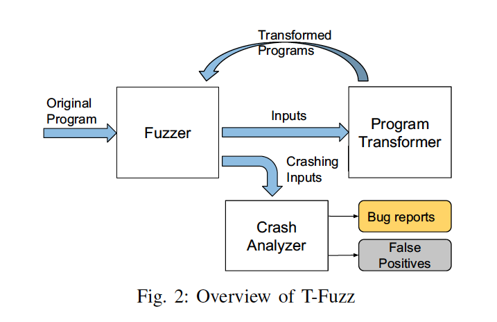

**T-Fuzz** 会维护一个程序队列，队列中存放着每一个被改变的程序（包括原始程序）。当每一轮模糊测试过程卡住的时候，**T-Fuzz** 会根据之前生成的测试用例检测到 `sanity check`，将这些 `sanity check` 禁用掉之后放入到程序队列中，然后从程序队列中获取一个新的程序进行下一轮模糊测试过程。具体算法如下图：

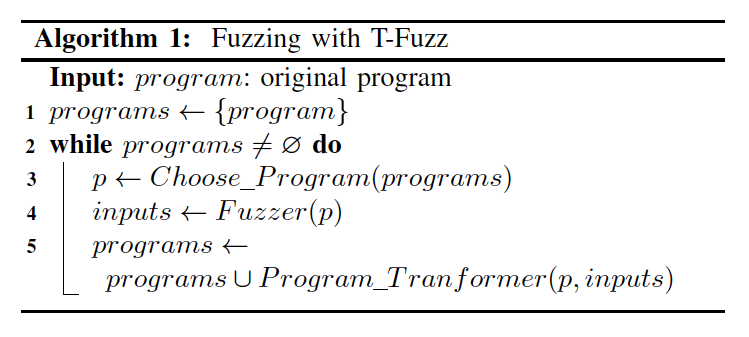

对于 **NCC** 的检测，作者并没有采用精确的静态分析以及数据流依赖分析等方法，因为这些方法会造成很大的性能开销。作者使用简单的不精确的方法对这些程序进行分析。首先，作者通过静态分析提取程序的控制流图。然后，对于每一个当前模糊测试生成的测试用例，作者收集其产生的执行路径，包括所执行到的节点以及所覆盖到的边。覆盖到的边使用 **CE** 集合表示，节点使用 **CN** 集合来表示，如下图算法所示：

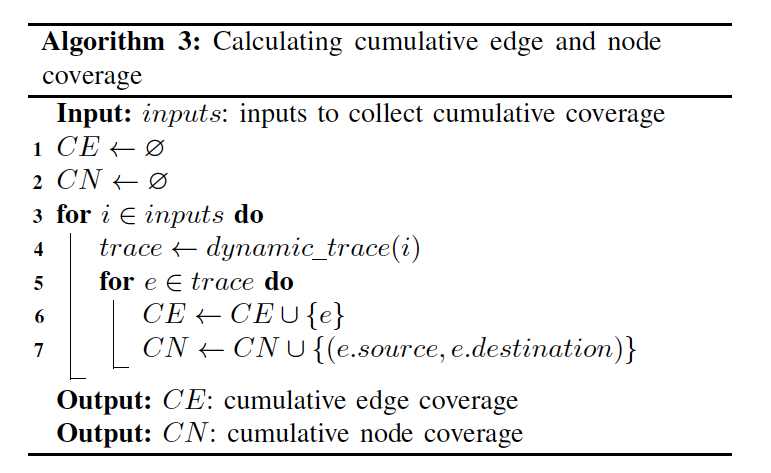

在得到已经覆盖到的边之后，作者再从完整的控制流图中筛选，提取出那些没有被访问过，但是来源节点被访问过了的边，将这些边看作是 **NCC**，如下图算法所示：

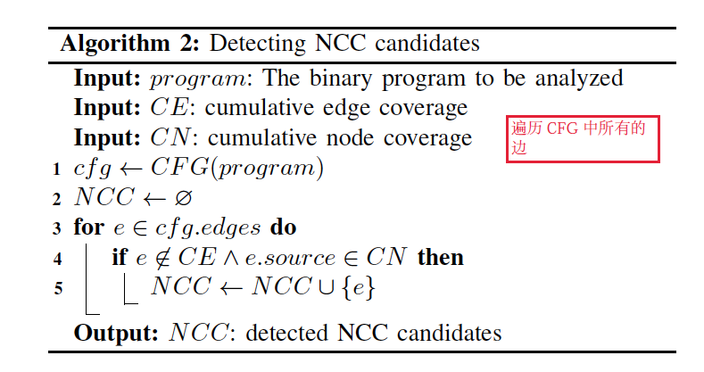

此外，在讲这些 **NCC** 进行删除之前，作者还对这些进行了筛选。首先过滤掉那些位于其他库（不是 Fuzzing 目标）的边，然后作者还认为有一些 **NCC** 之后的路径可能是比较短的错误处理路径，会导致程序很快终止运行，因此根据 **NCC** 后面的路径长度，对这些 **NCC** 也进行一次过滤。

在程序转换阶段，作者的方法是将每个 **NCC** 对应的跳转条件取反（*直接取反会不会造成很大的误报呢？*），作者表示这样的方法可以确保原始程序与变换后的程序的逻辑保持基本不变，这样可以后序简化 Crash 分析的过程。具体算法如下图所示：

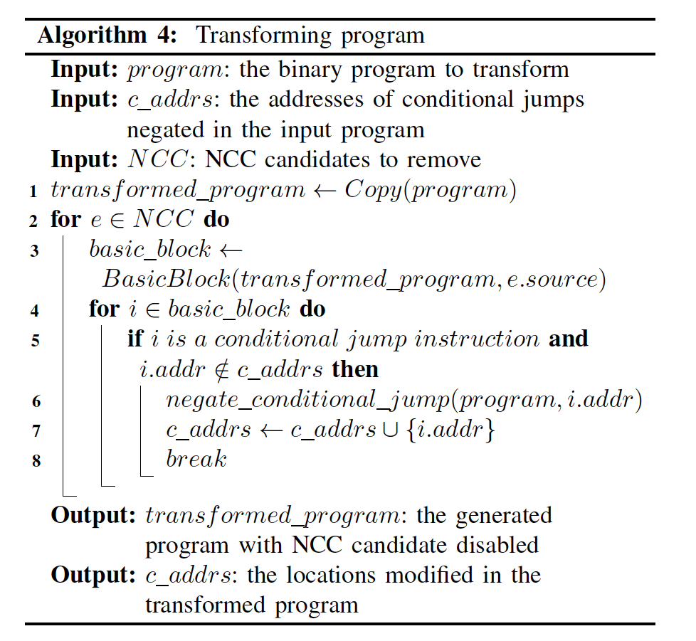

最后，在 Fuzzing 阶段触发了 Crash 之后，会启用 Crash 分析器来验证得到的每个漏洞。Crash 分析采用预约束路径追随的方式，来求解对应的 Crash 路径在原始程序上是否可以满足。首先，对于在变换后的程序上触发漏洞的输入 **I**，将其转换为预约束，添加到变换程序的约束中（**CT**），然后追踪变换程序的执行。如果执行到被取反的条件跳转指令，则将该跳转指令的原始约束提取出来添加到原始程序的约束中（**CO**）。当触发 Crash，Crash 相应的约束也被添加到原始约束中。最后对 **CO** 中的约束进行求解，看这些约束是否能被满足，如果可以被满足，则证明该漏洞在原始程序中也存在。具体的算法过程如下图所示：

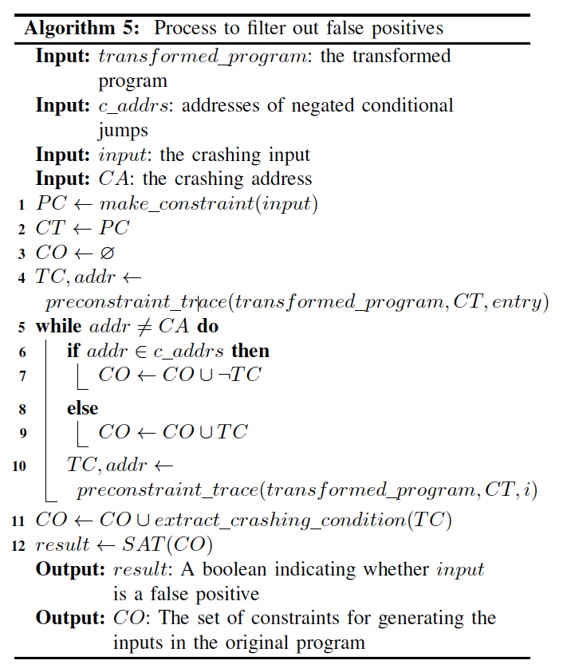

作者实现了 **T-Fuzz** 并将其与 **AFL** 和 **Driller** 进行对比。在大多数情况下，**T-Fuzz** 都可以取得比较好的效果。但是在有些情况下，**T-Fuzz** 也会产生部分的漏报，主要原因是在模糊测试过程中，将条件跳转的条件取反之后，会使得执行路径在到达漏洞之前崩溃，这样就无法到达真正的漏洞路径。此外，如果条件分支太多，**T-Fuzz** 会遭遇程序变换爆炸的问题，即有太多程序的变型版本需要进行模糊测试。而在有些情况下，因为在模糊测试阶段产生了太多的漏洞，导致需要使用符号执行进行验证的漏洞较多，从而导致效率较低。**T-Fuzz** 与 **AFL** 在真实程序下的模糊测试结果对比如下图所示：

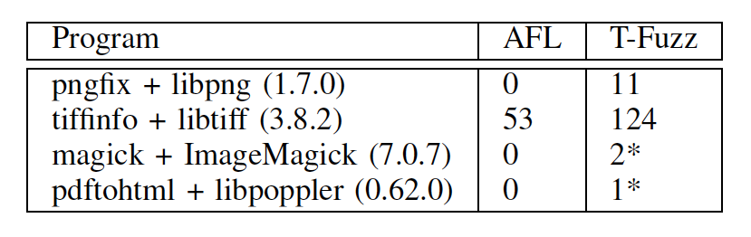

## STOCHFUZZ: Sound and Cost-effective Fuzzing of Stripped Binaries by Incremental and Stochastic Rewriting

*2021 IEEE Symposium on Security and Privacy (SP)*

这篇文章主要聚焦于针对没有源码与符号表的二进制程序的模糊测试的工作。在没有源码的二进制模糊测试中，为了可以获得覆盖率信息的反馈，目前有几种比较常见的技术：1. 基于硬件的支持，比如 **Intel PT**，这种方式的主要问题是只能追踪控制流的转移信息；2. 基于动态重写的技术，例如借助 **QEMU** 等，在基本块执行的时候即时对基本块进行重写，以收集执行信息，这种方法的主要问题是特别慢；3. 静态重写技术，即在模糊测试过程之前对二进制进行一次性重写，但是在缺乏符号表的情况下，这种重写技术的准确率会很低；

作者观察到模糊测试过程由于其大量的可重复性，因此具有**大量的试错机会**。因此，针对那些没有符号表的二进制程序，作者提出了一种增量随机重写技术，通过不断重写二进制来提高针对无符号表程序的重写准确性。

作者实现的方法主要是针对静态重写，目前的静态重写技术主要存在以下局限性。如果该静态重写技术依赖于线性反汇编技术，因为静态重写的过程中会引入一些新的指令，这些指令会导致原来指令之间的相对偏移不一样，所以会导致执行流跳转的过程中出现一些错误。而如果该重写技术依赖的是递归反汇编技术，在反汇编的过程中则无法正确地识别出间接跳转，因此仍然无法正确处理。目前还有一些方法是将这种偏移 / 地址的值进行符号化，在完成指令重写之后再将这些符号化的值转变回具体的值，但是如何在重写过程中判断指令操作所产生的值是需要被符号化的地址或偏移也是一个存在的困难。静态重写的例子如下图所示：

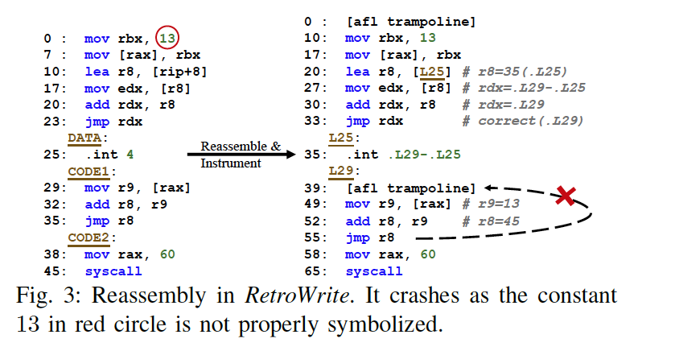

作者观察到，灰盒模糊测试也可以在测试过程中对目标程序进行变化，因此，对程序的静态重写过程也可以随着测试的推进不断提高和加强，从而提高重写的准确率。作者首先将静态二进制的原始代码节区域使用 `hlt` 指令填充，该指令会造成 `segfault` 异常。在执行过程中，如果发现了异常，则认为当前发现了一个代码区域，该区域不应该被当作数据对待，应该对该区域进行重写，插入覆盖率监视的指令。具体地，作者将整个重写的代码放置到一个新的内存区域（*shadow space*），然后将控制流重定向到该区域，同时对与 **PC** 相关的数据依赖值也进行处理，如下图 **Case A** 的过程①所示：

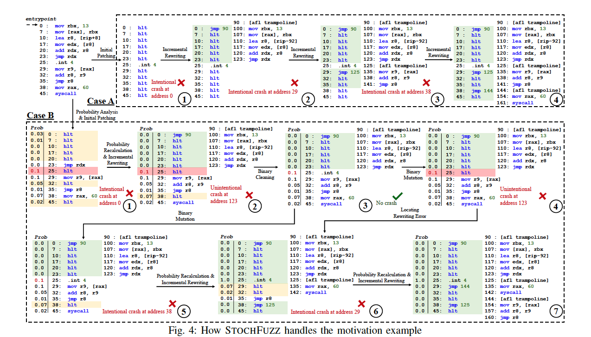

之后，程序会在 **shadow space** 中执行，在下一次遇到崩溃时，如过程②所示，在崩溃点继续重复上述操作，从而实现逐步地增量重写，最终对程序的所有代码段进行准确重写，如上图的④所示。这种方式的一个难点是如果误将夹杂在代码段中的数据也重写之后，可能会导致出现执行错误，如上图的①，如果将第 `25` 行的数据用 `hlt` 重写了，则会导致后面的执行不正确。但是由于模糊测试是一个不断重复的过程，可以有大量的试错机会，因此可以多尝试几次对代码区域和数据区域的划分，随着收集到的程序样本的数量的增加，对于这两个区域的划分就会变的更加准确。基于这个想法，作者首先通过静态分析推导出每个地址作为数据或者指令的概率，例如上图的 **Case B**，每个地址都有一个其作为代码的概率。基于这个概率，随机对目标程序使用 `hlt` 指令重写，如①的左边所示。然后在执行的时候，出现由 `hlt` 指令引起的错误之后，对该段区域的字节进行反汇编，并将这些区域的概率设置为一定为代码（将概率设置为 0），然后剩余地址的概率会被更新。然后，执行这一段区域的指令，此时由于第 `25` 的地址处被重写了，因此会在 `123` 地址处产生崩溃。这时将那些不确定的地址重写的部分恢复，再执行一次，如果未发生崩溃，则可以认为之前触发的错误由误重写引入，然后使用 *delta-debug* 对哪个地址为误重写进行探测，如上图 **Case B** 中的②-⑤所示。

基于上述增量重写的思想，作者实现了 **STOCHFUZZ** 系统，其架构如下图所示：

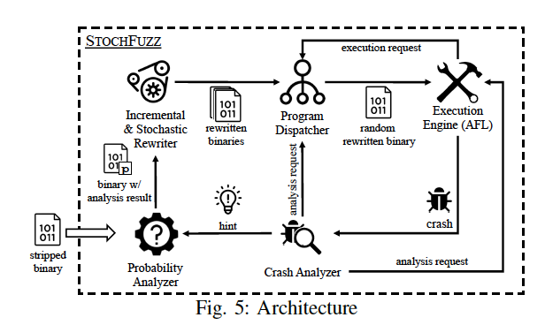

主要由 5 个部分构成：概率分析、静态重写、程序调度、执行引擎、崩溃分析。概率分析用来分析每个地址属于数据区域的概率；静态重写来对目标程序进行二进制重写；程序调度则选择一个重写版本的程序给执行引擎执行；执行引擎基于 **AFL**，对目标程序和测试用例执行，同时监视崩溃；崩溃分析则分析崩溃的类型，来决定是否触发重写；

概率分析部分首先对每个字节的地址进行反汇编，如下图左边所示：

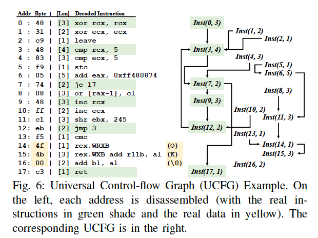

之后会根据已经确定的指令（比如地址 `0`）的大小以及语义，使用一些推导规则来推断出后面地址的类型，推导规则如下表所示：

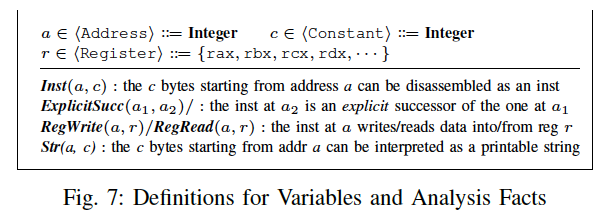

在得到一系列确定的地址之后，需要对当前仍然不确定的地址进行推导。作者定义了一系列的谓词及谓词表达式来描述目标地址的关系：

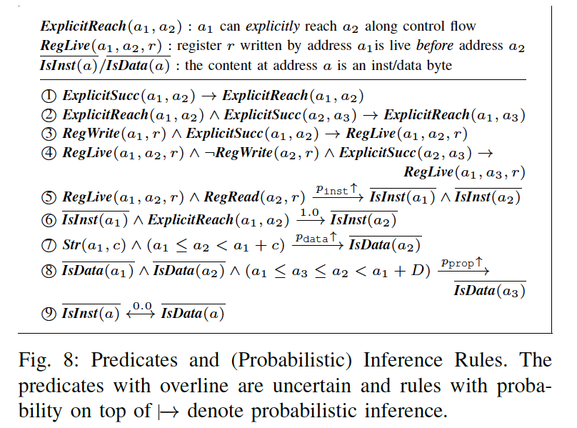

*具体的概率计算过程没太看明白，找时间继续好好看一下。*

对于重写部分，通过之前介绍的引入 `hlt` 指令的形式来进行增量重写，此时需要考虑与 **PC** 相关的地址的重新计算（通过计算 `shadow space` 和原地址的偏差来完成），此外，作者提到部分程序会根据返回地址的值计算得到一些数据，因此作者对 `call` 指令的处理进行了重写，将原始返回地址压入堆栈，并使用 `jmp` 指令来跳转。同时，重写部分会根据之前推导出来的概率对地址的指令进行重写。

作者在部分程序中进行实验，与主流的基于二进制插桩的模糊测试工具进行对比，其中成功插桩的结果表如下所示：

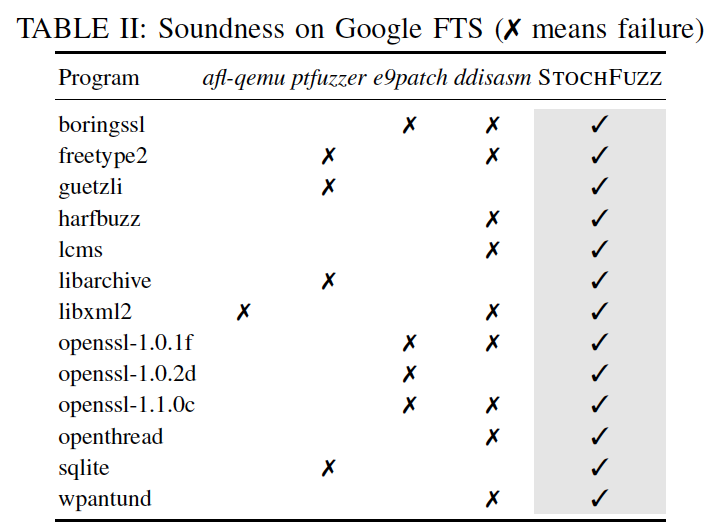

同时，作者在 **Google Fuzz Test Suite** 上测试了效率，如下表所示，在部分程序中可以与使用编译插桩的效率相当，甚至比编译插桩的效率还要高：

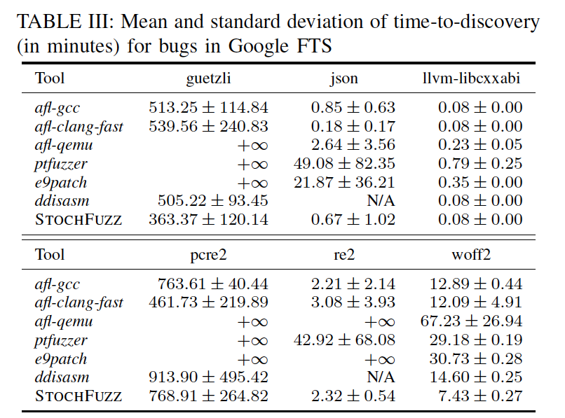

## FairFuzz: A Targeted Mutation Strategy for Increasing Greybox Fuzz Testing Coverage

*Proceedings of the 33rd ACM/IEEE International Conference on Automated Software Engineering. 2018.*

这篇文章的作者提出了稀有分支的概念，通过在模糊测试过程中根据目标程序的分支运行情况推导出程序中较为稀有的分支，同时使用提出的突变掩码（*mutation mask*）来确保生成的新的测试用例能继续命中该稀有分支，从而增加在稀有分支中探索的概率，加大目标程序覆盖率的探索，提高发现漏洞的概率。作者发现 AFL 在模糊测试过程中通常很难在一些比较关键的程序区域中进行探索，这就导致目标程序中关键的漏洞无法被探索。基于此，作者提出的 **FairFuzz** 将模糊测试的探索过程局限在稀有分支处，从而增加关键区域的探索能力。

具体地，作者基于比较重要的代码区域通常较少地被 AFL 命中这一观察来定位需要在模糊测试过程中重点探索的区域。之后，作者采用确定性突变的方式，通过对测试用例进行部分突变，来确定与该代码区域相关的输入部分，来保证相应的部分在后续模糊测试过程中不会被突变，提高了在重要区域探索的概率。因此，作者主要修改了 AFL 中的两个逻辑：1. 修改从队列中的调度种子的方式；2. 修改了针对这些种子的突变方式；

接下来，作者定义了突变掩码的概念，突变掩码描述了对于输入 `x` 在位置 `i` 中进行突变之后是否还可以命中程序目标位置。因此对于位置 `k` 来说，是否可以对其进行突变可以使用下列公式来表示：

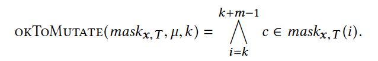

在确定性突变阶段，对于每一个突变以及每一个位置，如果可以满足上述公式，则对其进行突变；在 `havoc` 阶段，与原始的 **AFL** 一致，随机选择一个突变方式，同时在所有满足上述公式的字节位置中选择一个字节，进行突变。具体的算法如下图所示：

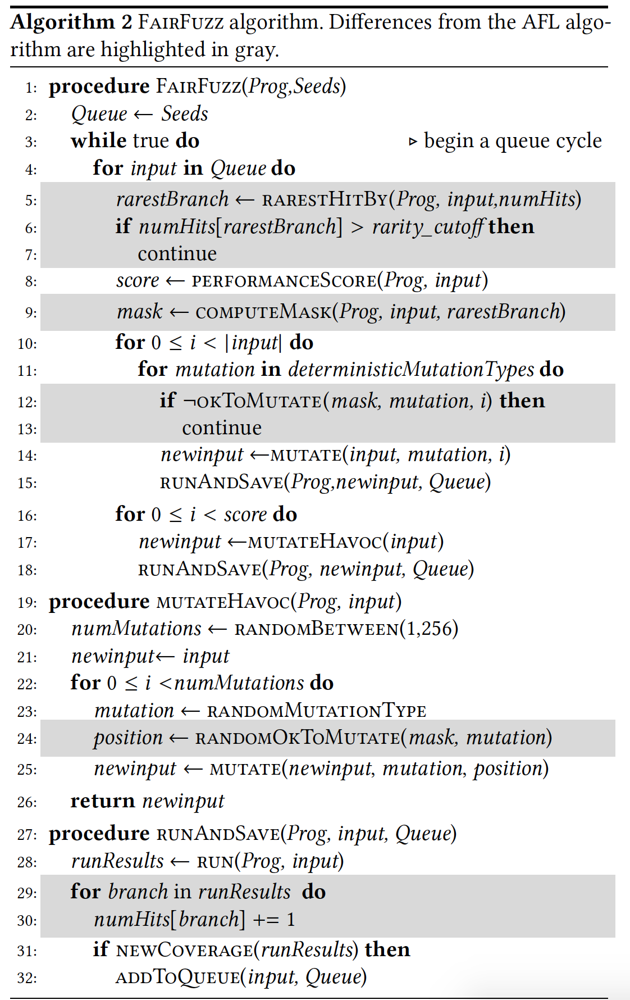

之后，作者通过定义稀有分支的概念，在每一次模糊测试过程中记录分支命中的数量（因为需要首先建立分支数量，所以在第一次执行时采用的突变不使用掩码，先执行一轮），如果满足稀有分支的定义，则认为该分支是稀有的。稀有分支如下定义：

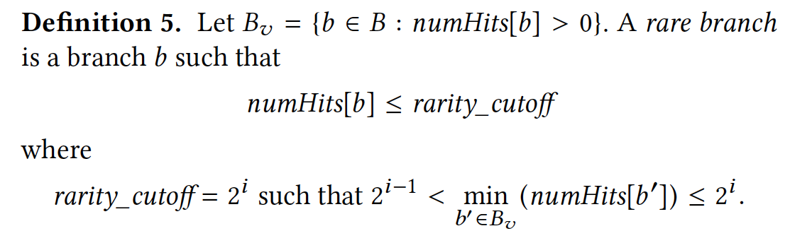

即使用 2 的指数对稀有分支的界限来定义，该指数通过当前最少的命中的分支的数量来决定。

在确定了稀有分支之后，需要根据稀有分支计算掩码，计算掩码在确定性突变阶段（如上图算法 2 中所示）。具体的，对于每个字节开始的位置使用三种操作（复写 / 插入 / 删除），然后查看稀有分支是否仍能被命中，如果可以命中，则将该字节添加进掩码，表示该字节可以进行对应的操作，如下图所示：

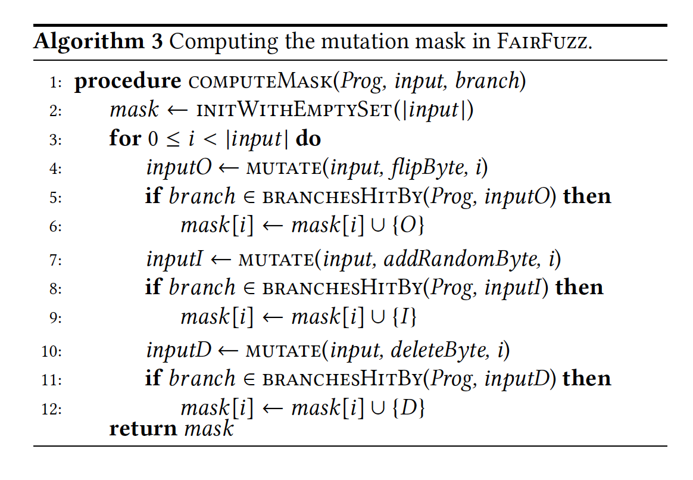

此外，作者还提到，基于上述的思想，可以在对目标测试用例进行缩减的过程中，将目标测试用例缩减地更短，因为在当前模糊测试过程中，只关心能命中目标稀有分支的测试用例。

作者在 AFL 的基础上实现 FairFuzz，并与 AFL 和 AFLFast 进行对比，统计他们的分支覆盖率，结果如下图：

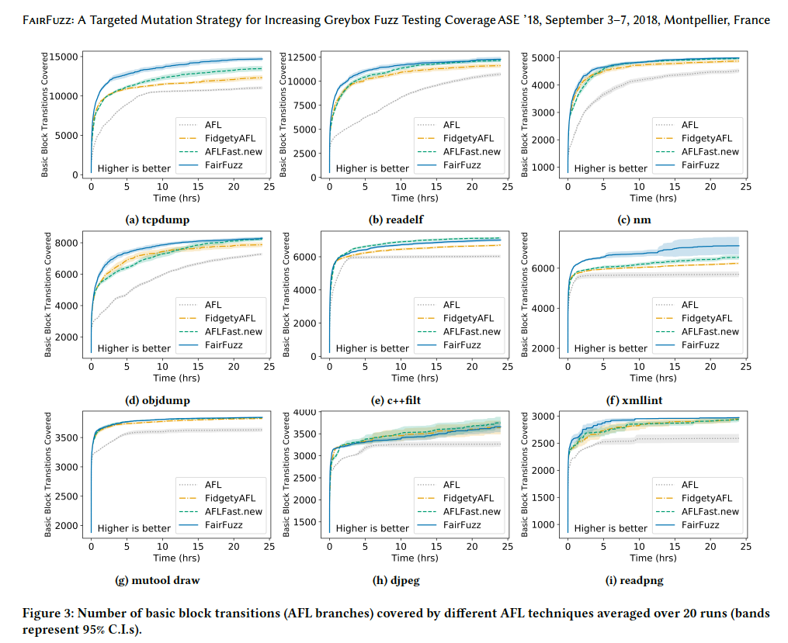

通过分析作者发现，对于 `c++filt` 来说，其中有较多的递归调用，而 FairFuzz 主要针对稀有分支来进行探索，且不会产生较长的输入，所以可能不会命中 `c++filt` 中的太多分支，因此造成了相对效果没有 AFLFast 好的结果。通过作者最后的分析，FairFuzz 这样的技术更适合于探索在输入中具有部分约束或者相应关键字的情况。

最后，作者验证了突变掩码是否对保证目标分支的覆盖起到作用。作者采用 `shadow mode` 的方式，实现一个类似的 FairFuzz，但是不采用突变掩码对突变进行限制。然后统计目标分支命中的差异。

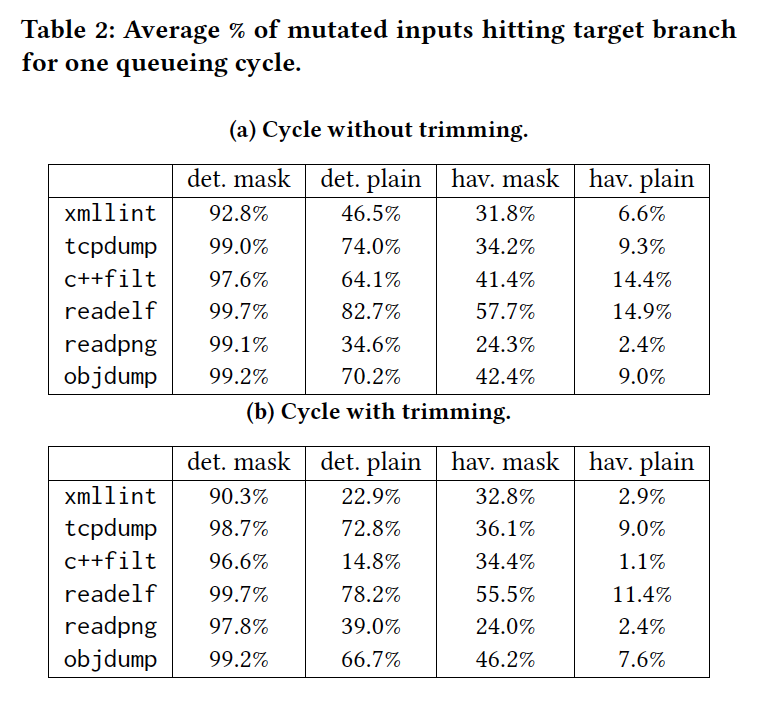

实验表明突变掩码可以确保目标测试能更多地命中目标分支，此外，如果需要对特定的分支加大命中率，可以更改目标掩码的位置来进行实现。

此外，作者也提出了一些缺点，如果稀有分支没有被 AFL 命中过，那么作者提出的这种方式就无法将模糊测试的效率提高。

## GREYONE: Data Flow Sensitive Fuzzing

*29th USENIX Security Symposium (USENIX Security 20). 2020.*

作者提到，数据流分析在模糊测试中可以起到比较重要的作用，但是传统的污点分析存在速度慢和不准确的问题。作者提出了使用一种轻量的模糊测试驱动的污点推导方式来推测变量的污点，之后，基于推导出的污点关系，来进一步优化模糊测试过程。

作者提出的第一个研究内容是如何实现一个有效的且轻量的污点分析方式从而更有效地为模糊测试指导。第二个研究内容是在获得了污点信息之后，如何有效地使用这些污点信息指导模糊测试的突变。第三个研究内容是如何根据数据特征有效地调整模糊测试的探索方向。

对于有效且轻量的污点分析技术，作者结合了模糊测试的性质，使用的基本思想是如果对测试用例中的某个输入字节进行突变之后，程序中的一个变量的值改变了，则这个变量与这个输入字节存在污点关系。而如果某个分支 `br` 依赖于这个变量的值，则可以进一步推断出当前分支 `br` 可以与这个输入字节进行关联。具体的，作者将这个污点推导阶段与 AFL 中的确定性模糊测试阶段相结合，使用基本的突变规则（单位翻转、多位翻转以及数学运算），然后每次只对单个字节进行突变，此外，对于变量值的监视，作者在目标程序中插入对于特定变量追踪的代码。之后，假设某变量 `var` 在对测试用例 `S` 的第 `pos` 个字节进行突变后被改变了，则 `var` 依赖于测试用例 `S` 的第 `pos` 个字节，具体算法如下图所示：

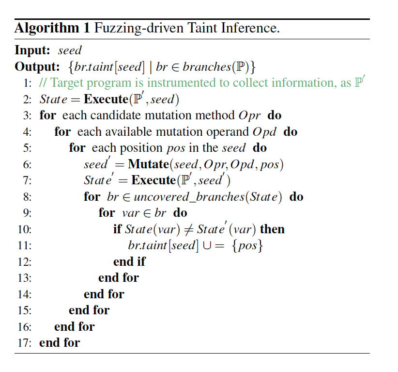

与传统的污点分析相比，作者所实现的 **FTI** 更少地需要人们的干预（传统的污点分析需要人为定义污点传播规则），此外，**FTI** 的速度更快，并且有更高的准确率。下图是传统污点分析和 **FTI** 的一个对比：

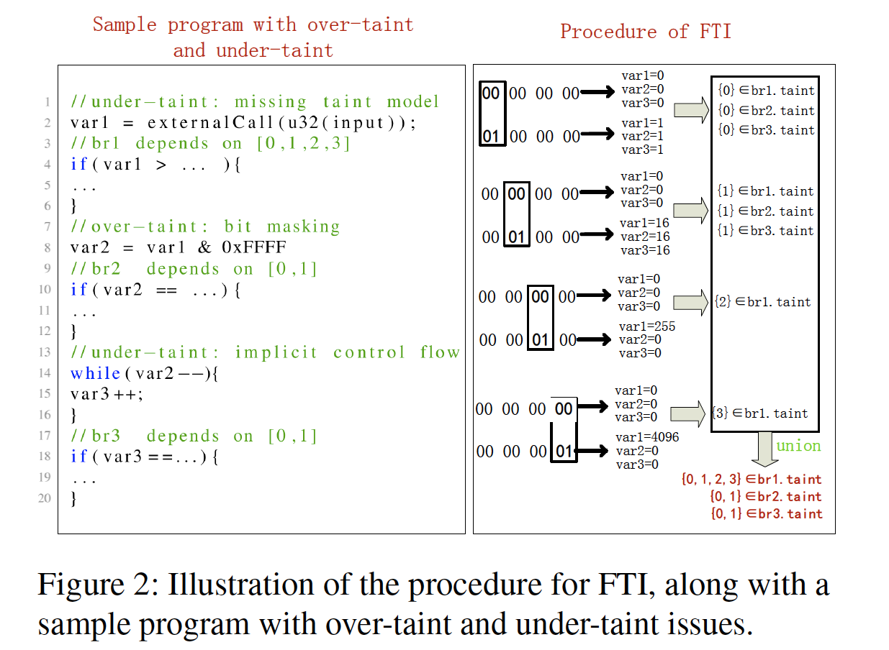

可以看到通过 **FTI** 推导出来的污点关系比传统污点分析要好很多。

在获得污点关系之后，通过污点关系来决定对哪个字节的内容进行突变，以及如何进行突变。作者基于的基本想法是如果一个输入字节可以影响更多的未触碰到的分支，则这个输入字节应该优先考虑被突变，通过公式定义如下所示：

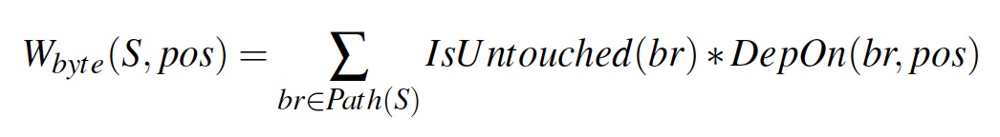

在对输入字节进行优先级排序之后，作者进一步提到对未触碰到的分支也进行排序，基本思想是如果未触碰到的分支受到更高权重的输入字节的影响，则这个分支更应该被优先考虑。因此通过公式定义每个分支的权重如下：

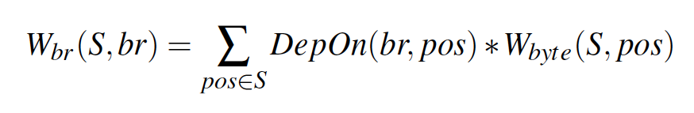

有了上述两个公式之后，对于每个种子优先突变哪个字节就比较好确定了。具体地，首先在这个种子未触碰到的分支中选择一个权重最高的分支，然后在这个分支中受影响的输入字节中选择权重最高的字节进行突变。在找到需要突变的字节之后，需要确定突变的目标值。对于直接拷贝的值，作者将他们突变成确定的值（这个确定的值在 **FTI** 过程中得到）或者对他们做一些小扰动（例如 `+-1` 操作）。对于间接拷贝的值，则对那些输入字节进行随机突变。

此外，由于 **FTI** 是通过特定的输入来对污点进行推导的，那么对于未触碰到的分支中的一些变量，无法有效推导出完整的污点关系，因此作者还选取了这些输入字节的一些字节进行随机突变，以加入足够多的扰动。

之后，作者实现了基于一致性引导的模糊测试过程。假设某个分支 `br` 依赖于两个变量 `var1` 和 `var2`（例如语句 ` if (var1 < var2) ... `），则一致性定义如下：

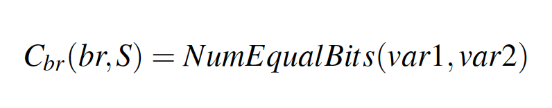

将这个一致性引申到基本块，对于每个基本块 `bb`，其一致性定义为所有未触碰过的分支的一致性的最大值，公式如下：

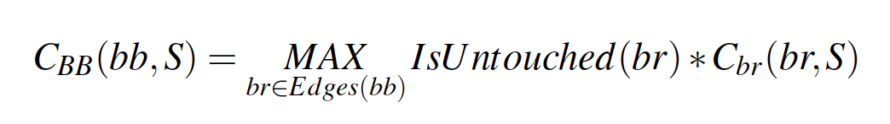

对于测试用例来说，其一致性就是所有基本块的一致性之和：

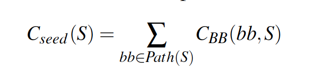

因此，对于具有高一致性的测试用例来说，它可能拥有更多的未触碰到的分支，或者拥有高一致性的未触碰过的分支。高一致性的测试用例会被优先调度，从而更快地发现更多的分支。在调度队列中，作者对调度队列进行进一步优化，不只考虑是否探索到新的路径。对于一些探索到相同路径的测试用例，比较他们之间的一致性以及未触碰到的分支的一致性，来对队列进行更新，如下图所示：

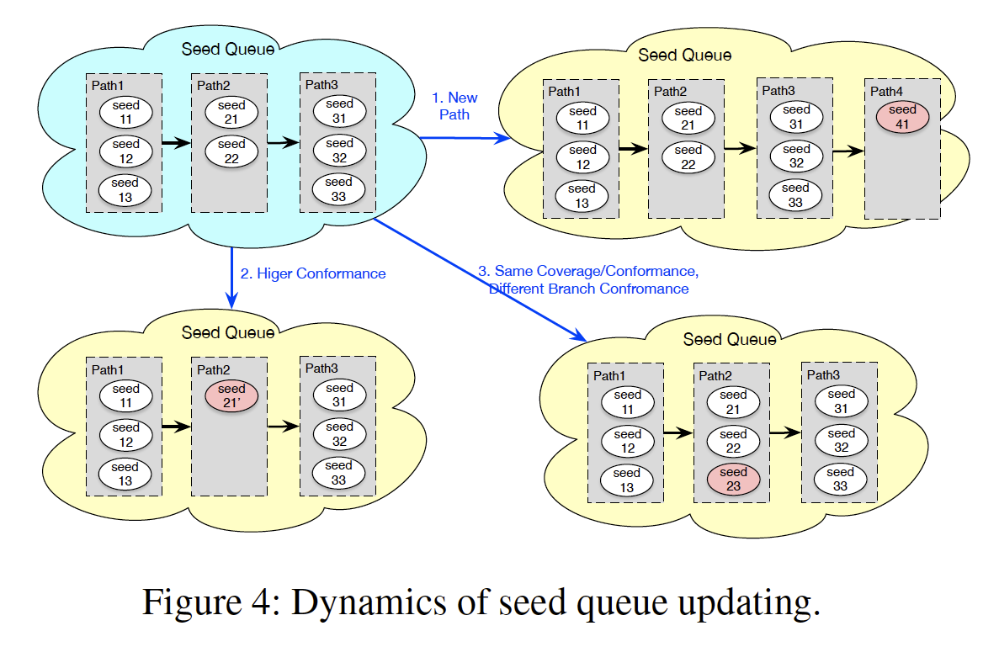

最后，如果发现了一个比较高一致性的测试用例，即使现在正在对其他的测试用例进行突变，作者也直接将新发现的测试用例替换掉之前的测试用例，让新发现的测试用例优先被探索。

在实验阶段，作者做了很多横向对比实验。首先选取了 13 个开源项目，在每个项目使用多个模糊测试工具进行比较运行 60 个小时之后得到的结果如下：

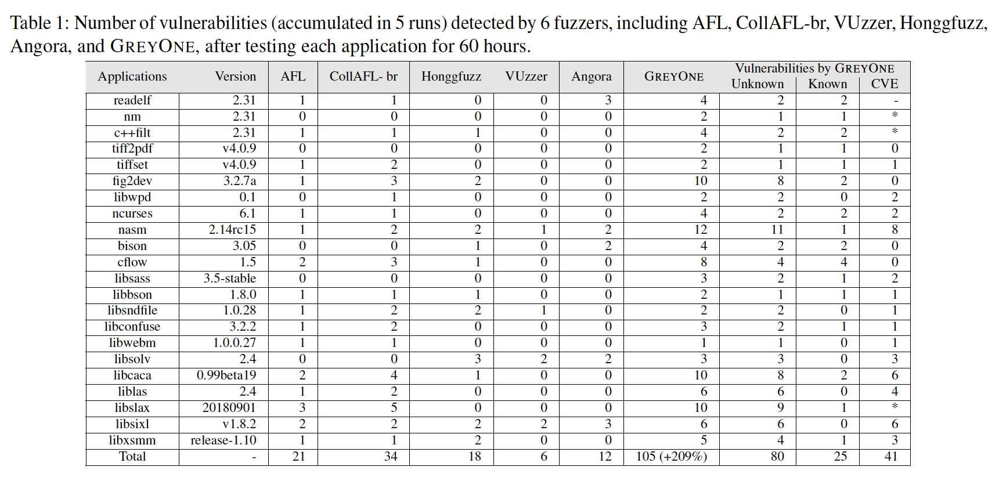

可以看到 **GREYONE** 的效果相比其他模糊测试工具的效果有特别大的提升。

同时，作者还对所产生的 Crash 数量和代码覆盖率的差异进行了比较，**GREYONE** 相比其他的工作均能取得很好的效果。

针对 **LAVA-M** 数据集，作者对每个模糊测试工具运行 24 个小时，最终发现了比其他工具多特别多的漏洞：

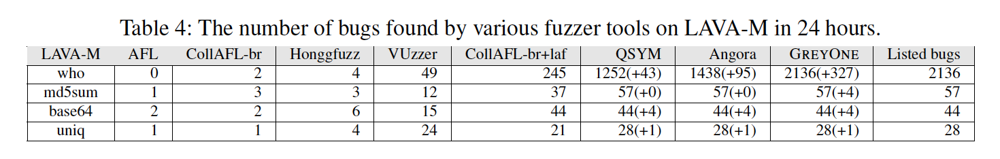

作者还提到，**GREYONE** 可以绕过很复杂的约束，为了验证绕过复杂约束的有效性，与 **Qsym** 进行了对比实验，因为 **Qsym** 使用了两个 **AFL** 实例和一个符号执行实例，因此实际上会使用 3 个进程，而作者部署 **GREYONE** 使用 2 个进程，最终实验结果如下：

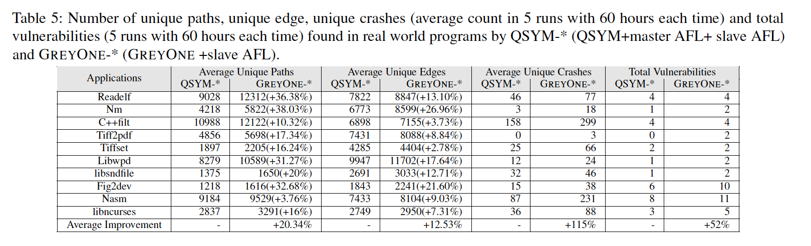

可以看到实验结果 **GREYONE** 均比 **QSYM** 好很多。

作者同时对 **FTI** 机制与传统的污点分析技术进行比较（**DFSan**），通过将 **GREYONE** 的污点分析模块进行替换，作者发现 **FTI** 的效果相较 **DFSan** 可以发现更多的未接触到的分支：

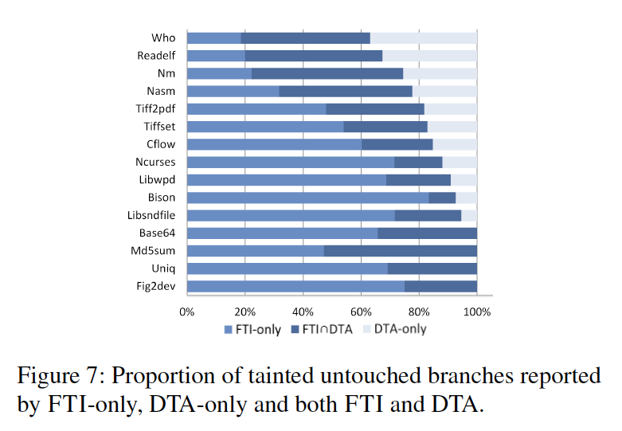

此外，作者还对 **FTI** 所花的时间开销进行实验，与不进行 **FTI** 污点分析的情况下进行对比：

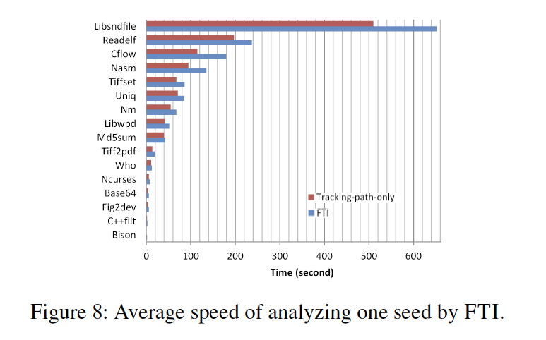

可以看出额外增加的开销并不是很大。

此外，作者还对其他一些模块的效果做了相当详细的实验，可以从原论文中查看。

## Designing New Operating Primitives to Improve Fuzzing Performance

*Proceedings of the 2017 ACM SIGSAC Conference on Computer and Communications Security*

这篇文章主要聚焦于当模糊测试在某个计算机系统上大规模并行部署时，会出现由于模糊测试所采用的几个原语而产生的性能瓶颈问题。

作者首先分析了当模糊测试在多个 CPU 核上同时运行的时候，出现的性能问题。对于第一个瓶颈，作者发现由于模糊测试的特殊性，需要经常调用 `fork` 函数以及来唤起新的进程执行新的目标程序，但是对于操作系统来说，`fork` 函数会带来很多性能上的开销，而且当在短时间内过多地调用 `fork` 函数创建太多的进程时，由于 **PID** 数量等的限制，可能会出现一些不必要的问题。

对于第二个瓶颈，作者提到由于模糊测试过程不断地会与文件系统交互，向文件系统读写文件以读取测试用例和保存感兴趣的测试用例，而这些与文件系统进行交互的过程会导致很大范围对文件系统元数据进行修改，这个过程也会导致很大的开销。

第三个瓶颈作者发现目前模糊测试的测试用例同步机制中，会遍历读取其他对等模糊测试实例中的测试用例，并对每一个测试用例执行，来验证这些测试用例对于当前实例来说是否会触发新的路径。而这个重新执行的过程很大程度上是没有必要的，且造成了很大的性能开销。

作者对这些瓶颈做了一个实验，在核的数量增加的情况下，出现了模糊测试执行速度降低（因为同时调用 `fork` 的实例多了）以及同步所花时间占比增高的问题：

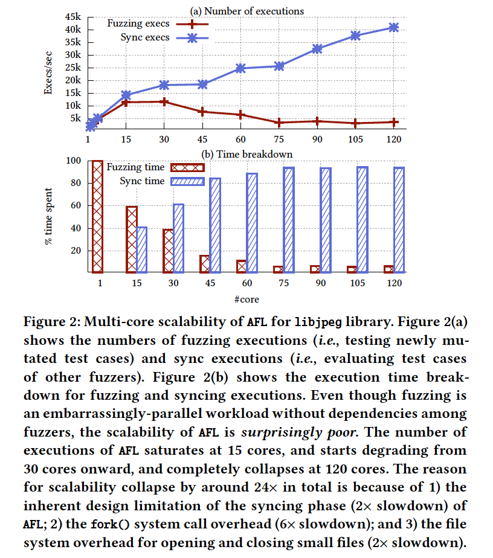

基于上述对于瓶颈的发现，作者提出了三个新的操作原语：

1. 增加 `snapshot` 系统调用来替换 `fork` 系统调用，将 `fork` 带来的额外开销减少；
2. 通过内存实现一个新的双重文件系统服务（Dual File System Service）；
3. 实现内存内共享的测试用例日志记录；

具体的，对于 `snapshot` 系统调用，提供了两个命令：**BEG_SNAPSHOT** 和 **END_SNAPSHOT**。在开始模糊测试过程时，目标程序被启动后不直接执行（与 **AFL** 类似，通过插桩实现）。之后，当收到开始进行测试的指令之后，使用 **BEG_SNAPSHOT** 命令调用 `snapshot` 函数，此时会将当前进程的执行上下文保存（通过 `sigsetjmp` 完成），同时还会对进程各个内存段的起始地址和结束地址进行保存，以及对 `brk` 寄存器的值和文件描述符进行保存。此外，还会对当前可写的内存页做处理，为了维护这些可写内存页的内存状态，作者使用 **CoW** 的思想，将所有内存页设置为不可写，当程序对内存页写入内容时，会调用页错误，通过处理页错误的方式对内存的修改进行记录。**BEG_SNAPSHOT** 还提供注册一个 `callback`，当目标程序结束时，会使用 `callback` 将追踪到的路径信息返回给模糊测试器，或者再进行一些其他的操作，最后以 **END_SNAPSHOT** 调用 `snapshot` 函数，恢复程序执行上下文。通过上述实现，可以在每次模糊测试的时候不需要使用 `fork` 函数创建新的进程，减少了 `fork` 函数所花费的开销。

对于双重文件系统，作者提供了两个级别层级的文件系统，第一层是内存文件系统，第二层是硬盘级别的文件系统。对于每个模糊测试实例，创建一个单独的内存文件系统作为私有的工作目录，这样模糊测试过程中对测试用例的访问不需要在硬盘文件系统中过多地访问文件。此外，会间歇地检查内存文件系统对内存的使用情况，如果超过某个阈值，则将内存文件系统中的一些比较老的文件移到硬盘文件系统中，这在某种意义上有另一个合理的地方，即比较老的测试用例很难再产生新的路径。

对于内存内共享的测试用例日志记录，作者将模糊测试节点分为主从关系，对于主节点，可以创建测试用例日志。其他节点作为从节点，可以访问目标的测试用例日志。测试用例日志包含文件名、文件大小以及追踪路径（Bitmap），如下图所示：

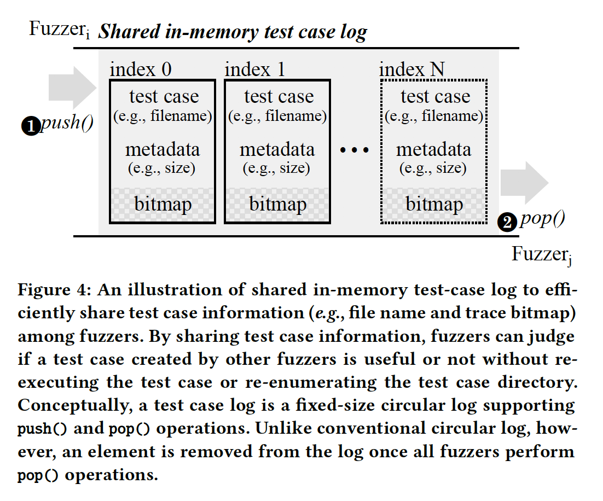

在实现这三个新的原语之后，作者在 **AFL** 中集成了全部 `3` 个新的原语，在 **LibFuzzer** 中集成了后面 `2` 个新的原语（在原文中有对三个原语集成的分析）。之后对效率的提升进行实验，其中 AFL 实验结果如下图所示：

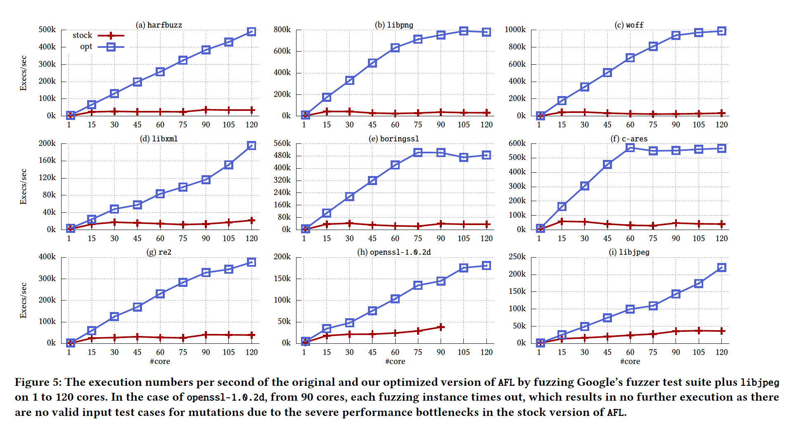

最后，作者还对三个原语的有效性分别进行了实验，其中针对同步阶段的原语的实验结果如下：

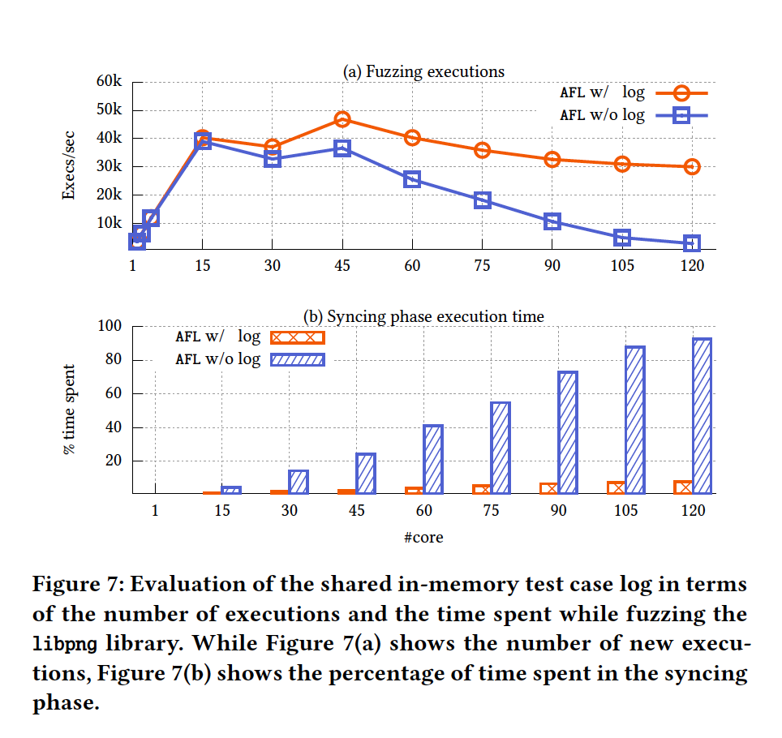

可以看到在使用新的同步原语的情况下，执行速度比旧的模糊测试高，且花费的同步占比时间较低。

针对 `snapshot` 的实验结果如下所示：

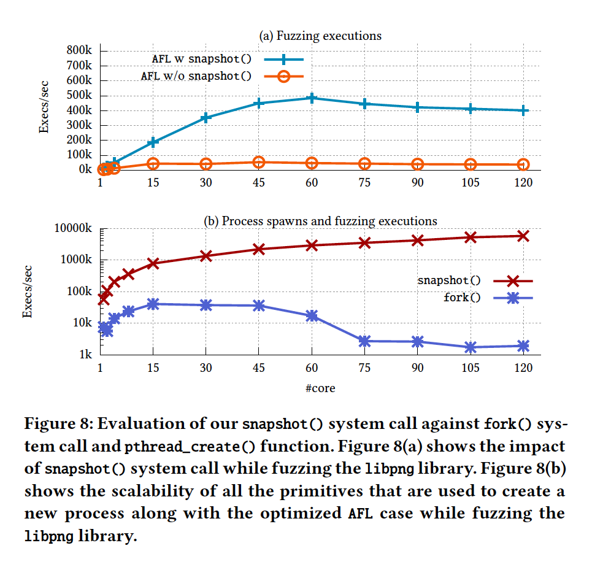

最后对文件系统的速率与不同的介质进行了实验，结果如下：

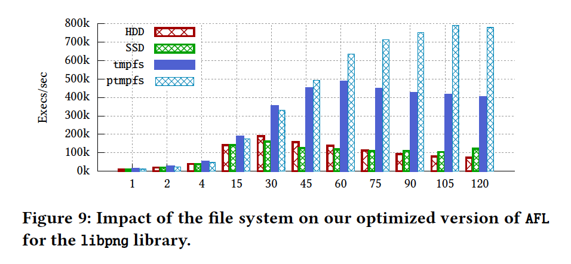

## Steelix: Program-State Based Binary Fuzzing

*Proceedings of the 2017 11th Joint Meeting on Foundations of Software Engineering.*

这篇文章的工作主要聚焦于模糊测试过程中对 **Magic Bytes** 比较判断的绕过。作者做的工作和 **[AFL-lafintel](./laf-intel.md)** 有点类似，但是 **AFL-Lafintel** 只能在具有源码的情况下完成，所实现的功能较为简单，且无法定位到测试用例中对应的 **Magic Bytes** 的位置。作者提出的方法可以在二进制程序中通过插桩完成，同时较详细地记录了模糊测试过程中的比较进度，还能定位到测试用例中需要突变的字节。基于这个思想，作者提出了 **Steelix**，其基本流程如下图所示：

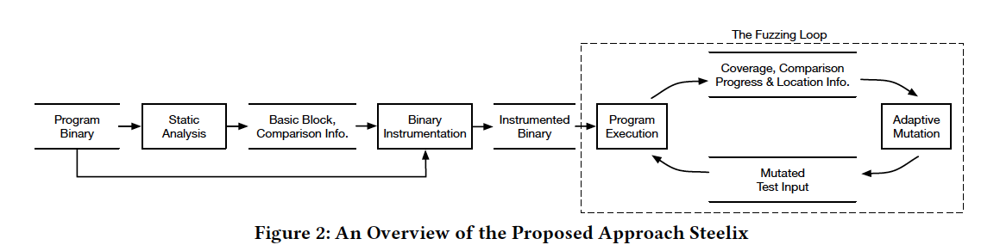

其主要分为 3 个基本组成：静态分析、二进制插桩、以及模糊测试。

具体地，在静态分析阶段，首先会识别出所有比较指令（`cmp` 和 `test` 指令），此外，对于字符串比较，则识别出 `strcmp` 和 `strncmp` 等方法（*对于去掉符号表的该咋办？*）。同时，由于插桩会带来性能的损耗，因此在找到这些比较的指令之后，作者还对他们进行了过滤，删去一些不感兴趣的比较指令：

* 单字节的比较：因为单字节的比较可以被轻易识别出来，因此没有必要；
* 对于函数返回值的比较：无法准确判断函数返回值的具体的值，因此对于函数返回值的比较会引入很大的不精确性；

在过滤了不感兴趣的比较指令之后，对于每一个比较指令，提取其信息进行记录，包括指令地址，操作数类型和操作数实际值等。

接下来是对二进制的插桩。由于除了针对立即数的比较，静态分析无法直接获得比较的真实值。因此作者通过插桩，对比较的进度进行记录，并反馈给模糊测试工具。

由于共享内存的大小限制，作者需要将记录进度的内存大小尽可能地压缩。因此作者定义比较进度为从第一个字节或从最后一个字节开始，连续匹配的字节数量，例如下图：

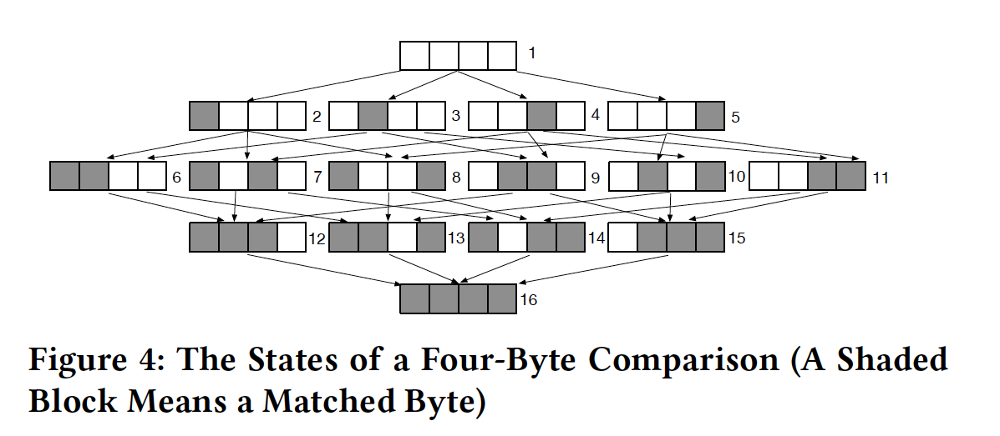

作者仅考虑路径 `1->2->6->12->16` 或路径 `1->5->11->15->16` 作为比较进度。假设当前位于状态 `2`，则只有当之后位于状态 `6` 的时候（或者 `12` 和 `16`）才认为比较进度有所递进。

在插桩阶段，根据比较指令的不同（`cmp` 等指令还是 `strcmp` 等函数）而有所区别。对于比较指令，根据之前记录等比较操作数信息，在比较指令之前提取操作数的具体值，然后生成当前的比较进度。对于调用函数来进行比较的，作者实现了对应版本的函数，该函数的功能与原函数相同，仅增加了对比较进度的生成逻辑。

在模糊测试阶段，作者根据比较进度来定位到测试用例中与比较相关的字节位置。作者基于这样一个基本思想：如果当前字节是与比较相关的字节，那么这个字节周围的字节也会对比较产生影响。因此，在模糊测试过程中，作者根据比较过程反馈信息，如果当前的比较过程取得了推进，则记录刚刚突变的字节的位置（将这个测试用例作为中间状态保存），然后作者对这个字节前后的两个字节进行所有可能的尝试，作者称为 `local exhaustive mutation`。具体算法如下图所示：

通过上述方法，可以在模糊测试过程中比较有效地、快速地探索出 Magic Bytes 实际的值，从而引导模糊测试往更深的位置探索。

作者在 3 个数据集上对 **Steelix** 进行测试：LAVA-M、DARPA CGC 以及 5 个真实的程序（`tiff2pdf`、`tiffcp`、`pngfix`、`gzip`、`tcpdump`）。同时与 **AFL-dyninst**、**VUzzer**、**AFL-lafintel** 这几个工具进行对比，旨在回答以下 3 个问题：

1. **Steelix** 的漏洞检测能力有多强？
2. **Steelix** 的代码覆盖率有多高？
3. **Steelix** 的负载开销有多少？

在 LAVA-M 数据集上的效果如下图所示：

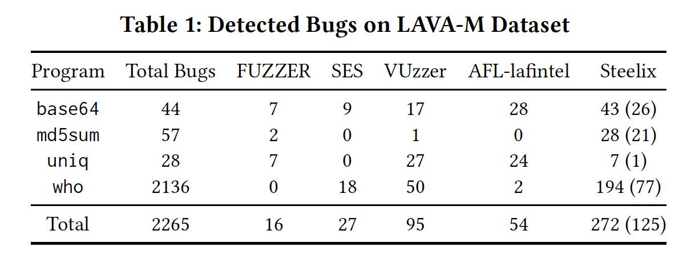

可以看到 **Steelix** 可以发现最多的漏洞。由此可以发现，大部分的漏洞会被一些 Magic Bytes 所保护。但是在 `unique` 中，效果不如 **VUzzer**，作者分析原因发现 **Steelix** 的突变粒度在进行局部突变时较小，而 **VUzzer** 都使用大粒度的突变，有利于对 `unique` 中程序的探索。

在 CGC 数据集上的测试中，作者分析发现当提供的初始种子集较完备时，**AFL-dyninst** 与 **Steelix** 都能取得较好的效果，但是当初始种子集不完备时，**Steelix** 效果比较好。

针对真实世界的 5 个程序的实验结果如下图所示：

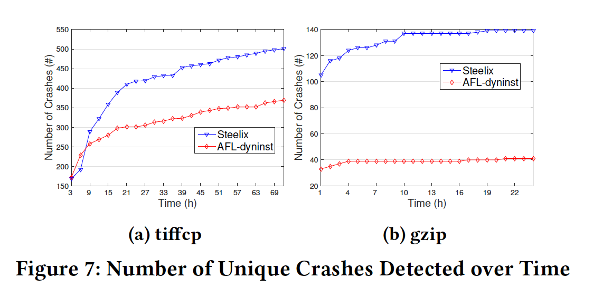

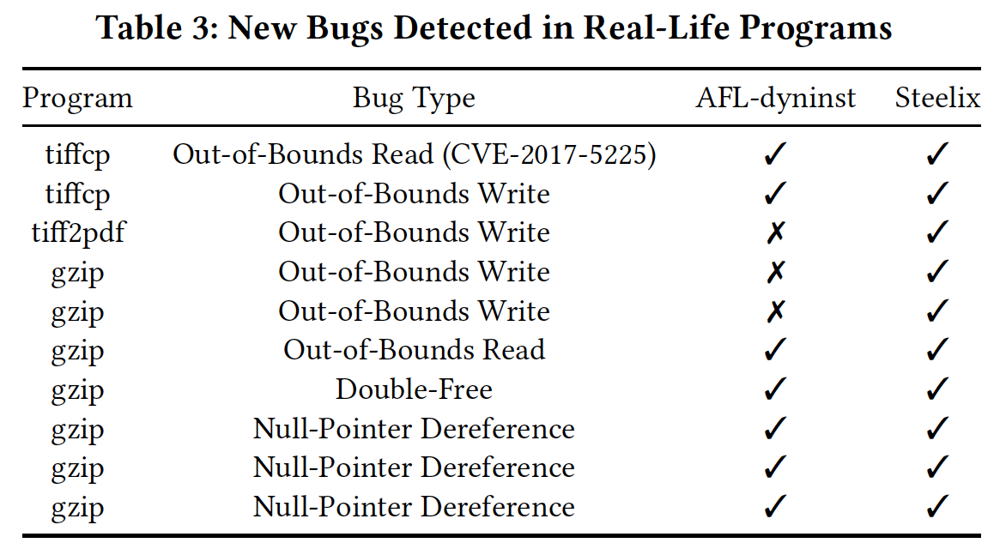

可以看到在漏洞挖掘能力以及 Crash 发现上，**Steelix** 均能取得较好的效果。

在覆盖率的实验上，作者采用覆盖的行、覆盖的函数覆盖的分支以及新产生的测试用例的数量来表示覆盖率的多少（因为对比的工具都是基于 AFL 的，所以还算合理），结果如下图所示：

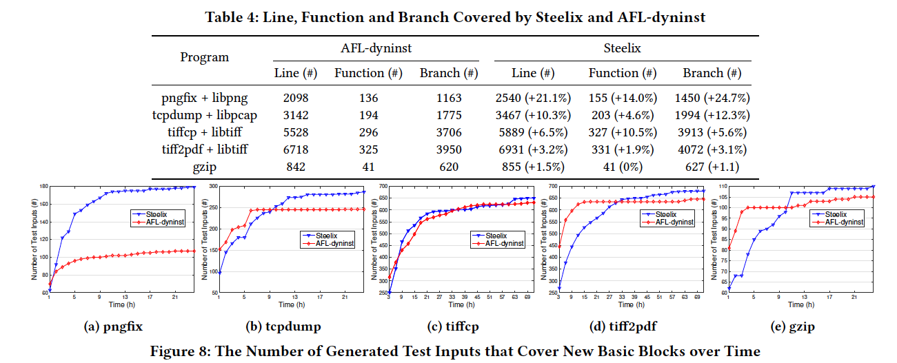

可以看到 **Steelix** 所产生的覆盖率都有有效地提升。

最后作者对 **Steelix** 带来的额外开销作了一个实验，首先作者分析了插桩的比较基本块经过两个策略之后剩下的数量，如下表所示：

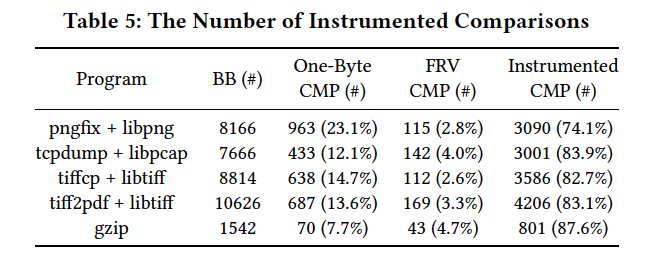

而所带来的额外的开销导致的执行速度的下降如下表所示：

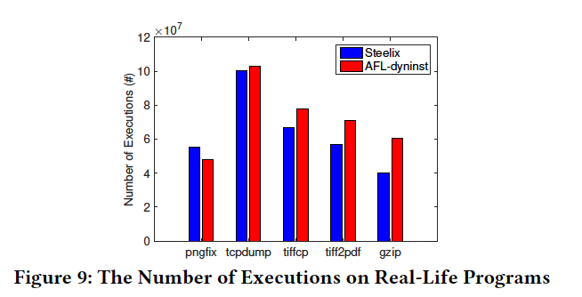

可以看到速度并没有下降很多，但是效果提升了很多。

## REDQUEEN: Fuzzing with Input-to-State Correspondence

*NDSS. Vol. 19. 2019.*

这篇文章的主要工作也是针对模糊测试过程中对于 **Magic Number** 和 **Checksum** 判断的绕过。

作者认为，之前基于上面两个问题的解决方法都引入了污点追踪和符号执行的方式，但是这些工具都引入了对程序运行环境及程序指令集的假设，有较大的限制。而且污点追踪和符号执行的方式扩展性较低，对于大型的真实的程序效率较差。作者观察到，在执行阶段，大量的输入中的字节会被目标程序直接使用，放置到目标寄存器和内存中，因此可以发现输入的字节会与程序状态有一个关联。例如对于 **Magic Number** 的判断，大部分程序将输入的字节以小端序直接解析成正数，然后进行比较。

基于上述观察，作者实现了一个轻量级的污点追踪系统，使用一种非常直观的方式，对输入中的字节使用随机值，然后观察比较指令中使用的值，从而可以推断出可以通过改变输入中的字节来控制的值。此外，对于 **Checksum** 的绕过，作者采用了与 **T-Fuzz** 类似的对程序进行 Patch 的方式。作者最终基于 **kAFL** 实现了一个称为 **REDQUEEN** 的原型系统，并作了大量的对比实验，验证了其方法的有效性。

具体地，作者提到，对于 **Magic Bytes**，目前有很多方法基于污点分析和符号执行来完成，对于这些方法通常会带来很大的性能开销，与模糊测试的较快的速度要求不符合。另外还有一些方法通过提供事先定义的字典来完成，但是这些方法需要依赖专家知识。最后还有一些方法将多字节的对比拆分成单字节的对比，或者将比较拆分成多个进度（例如 **LAF-INTEL** 以及 **STEELIX** 等），但是这些方法由于插桩数量变多了，会带来一些额外的性能开销（*但是 STEELIX 做了实验之后开销不是还好吗？*）。

作者通过观察发现的程序中很多从输入获取到的值会直接拷贝进程序的状态中，因此每当模糊测试遇到新的路径时，会将所有的比较指令进行 `hook`，然后执行单词追踪执行。在追踪执行过程中，提取出比较指令的操作数，同时也会 `hook` 函数调用语句，对于一些比较函数调用，提取出函数参数。在得到这些参数的值（*应该是比较的目标值*）之后，由于无法判断当前比较是大于还是小于，因此对这些目标值采取 `+1` 和 `-1` 的操作。此外，一些比较当中会对这些目标值进行编码，作者通过观察得到常用的编码方案：

* 补零扩展/符号扩展
* 反转
* C 字符串编码
* 内存编码
* ASCII 编码（*这个需要做什么处理吗？好像是把 ASC II 表示的数字转化成真实数字*）

得到了可能的值之后，将这些值与输入中的模式串（就是之前比较指令中出现的另一个参数）全部进行替换，例如 **TestSeedInput** 中的 **TestSeed** 与 **MAGICHDR** 对比时，将 **TestSeed** 替换成生成的目标值。

但是如果使用全部的位置会造成需要替换的位置很多，作者提出了使用一种染色的方法，对潜在需要替换的输入部分，使用随机字符进行替换，然后执行之后与之前的执行进行比较，对相同的偏移处的模式串使用期待值替换。例如下列例子：

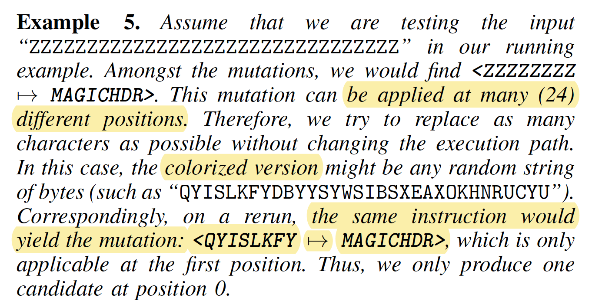

对于一些使用函数调用来判断的，作者 `hook` 所有函数调用，如果当前函数的参数有两个以上的指针，则提取这些指针，从他们指向的内存区域提取 128 个字节，将这些字节与之前的整型的处理方式相同。此外，还会对内存的内容采取一些额外的方式，例如假设只匹配前面若干个字节，或者匹配直到 0 字节。

最后提取一些连续的字节的值作为字典，在后序过程突变过程中可以更好地指导。

接下来是对于校验和的绕过，之前的工作有通过 Patch 目标程序来移除校验和，在检测到安全漏洞之后借助符号执行的技术来修复校验和，来判断是否能满足的技术来实现。

作者提出一种方式，首先定位出与校验和检查相似的语句（这种语句通常一个值是直接从输入中获取的，另一个值是有规律地变化的），然后将这个检查替换成一个永远为真的指令。当模糊测试过程得到了一个较有趣的路径，则进入验证阶段，对补丁进行正确性校验，如果校验通过，则不做处理，如果校验失败，则说明这个比较语句无法被控制，则移除对这个语句的补丁。

由于对这种检查的移除会产生很多误报，因此需要一个验证阶段对这些误报进行消除。当模糊测试过程发现了一个新的路径之后，作者首先尝试修复之前 Patch 掉的比较指令。如果发现某个 Patch 掉的指令无法被修复，则移除这个 Patch，同时，将这个新的输入也放弃掉。（*这里没咋看明白？*）*个人理解*：采用 **Input-To-State** 的方式对输入进行突变，即对之前 Patch 掉的比较指令来说，其左边的数字（比较的值）看作是输入中的字节，右边的数字（期待值）看作是校验和，将输入中与左边的值相同的值通过之前的几个编码方式替换成期待值，然后检查覆盖路径是否被影响，如果影响了则表示这个 Patch 是不正确的，将这个 Patch 去掉。

在实现阶段，作者基于 **kAFL** 来进行实现，并添加一个 **REDQUEEN** 阶段。对于比较语句的 Hook，作者使用硬件辅助的断点，在所有的比较指令中获取比较的参数（如果一个断点在短时间内多次命中，出于性能的考虑，会移除该断点）。

在染色阶段，作者尽可能多地将输入字节替换成随机的字节，并尽可能保持执行路径不变。具体的染色算法使用二分查找的方式，如下所示：

通过二分查找的方式找到最大的染色区间。

对于程序的 Patch，将比较指令 Patch 成全真的指令，作者使用 `cmp al, al` 指令来完成，因为这个指令最小，然后用 `NOP` 指令补齐。作者是通过 **KVM** 以及 **QEMU** 来完成对目标程序的 Patch。

在 Patch 清除阶段，主要通过以下算法来完成：

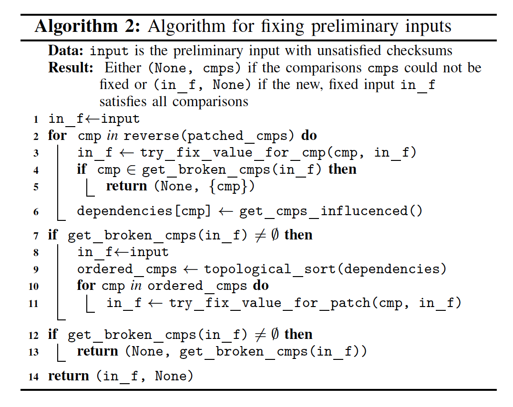

主要是还得解决两个分支判断相互约束的问题。

实验阶段，作者主要针对 3 个研究问题：

1. 基于 **Input-To-State Correspondence** 的技术是否足够通用；
2. 所提出来的方法效果如何？
3. 所提出来的方法在实际应用中提升了哪些地方？

作者针对 **LAVA-M** 和 **CGC** 两个数据集进行测试，同时针对 **GNU binutils** 来测试，下表是 **LAVA-M** 数据集中所发现漏洞的能力：

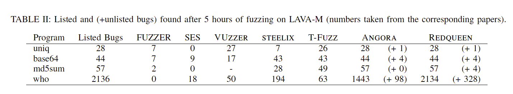

在使用 **binutils** 的实验中，作者部署了 **REDQUEEN** 和 **VUzzer** 以及 **LAF-INTEL** 与 **AFLFast** 进行实验，来评估覆盖率。部分程序的覆盖率情况如下图所示（剩下的可以参考论文）：

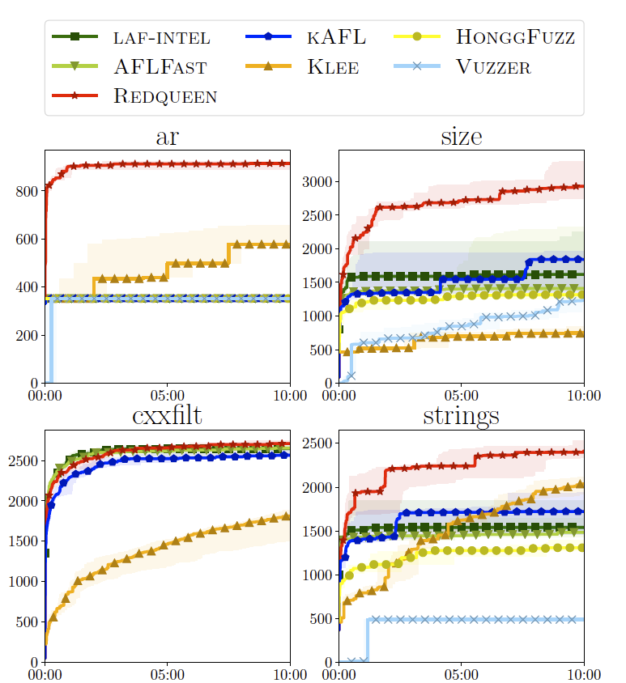

可以看到，**REDQUEEN** 的覆盖率是最高的。此外，**REDQUEEN** 在这些程序中发现的漏洞如下所示：

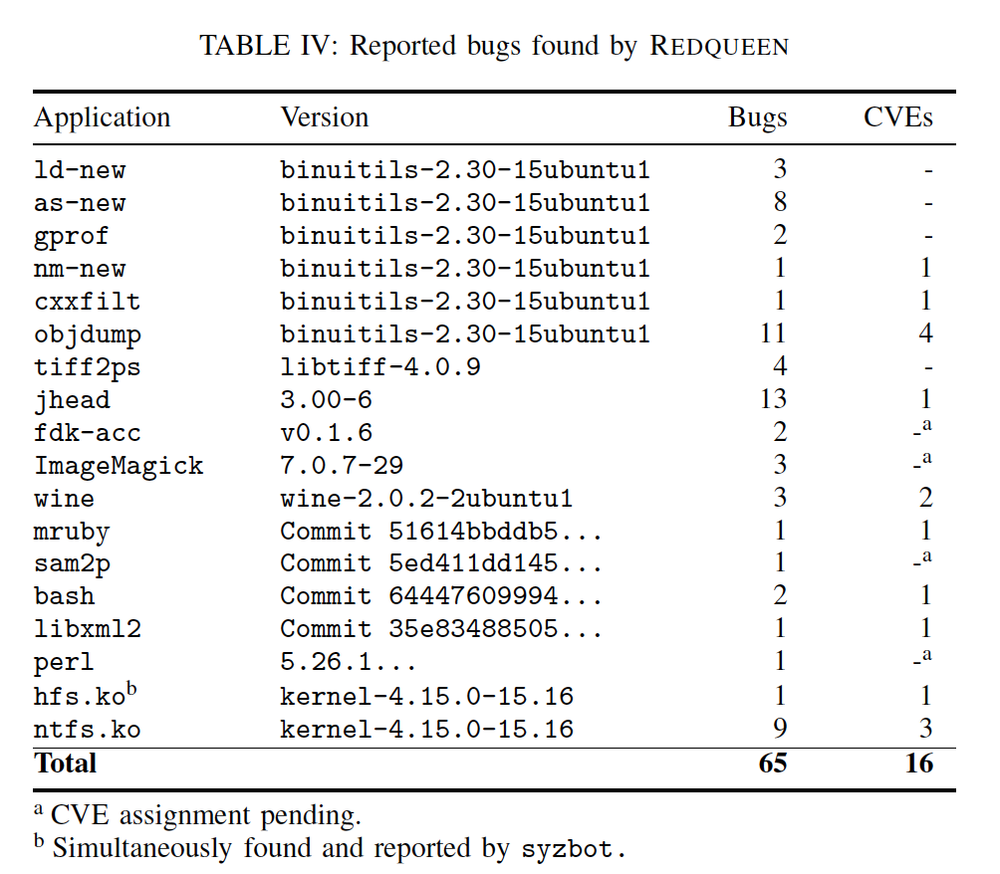

最后，作者进行了一些案例分析。

## NYX: Greybox Hypervisor Fuzzing using Fast Snapshots and Affine Types

*30th USENIX Security Symposium (USENIX Security 21). 2021*

本文聚焦于 **hypervisor** 程序的 Fuzzing 工作。**hypervisor** 也被认为是虚拟机监视器，为在同一个物理机器下运行的不同的虚拟机提供安全边界，为了更好地发现 **hypervisor** 的漏洞，保证云环境的安全，这篇文章的作者提出了名为 **NYX** 的基于覆盖率的模糊测试工具。

作者首先比较了之前的两个工作 **VDF** 和 **Hyper-Cube**，其中 **VDF** 是基于覆盖率的，而 **Hyper-Cube** 没有使用任何覆盖率反馈信息，但是很神奇的是 **Hyper-Cube** 的效果要比 **VDF** 好，作者分析这是由于 **VDF** 在模拟设备的时候太慢了，影响了整个模糊测试效率。除此之外，现有针对 **hypervisor** 的模糊测试工具要么将部分代码剥离出来放到用户态执行，来获得代码覆盖率，但是这种方法需要大量的人工干预，无法直接适用于所有的 **hypervisor**，而且会产生大量的误报和漏报；要么就完全不采用覆盖率反馈信息，但是这种方法无法有效地指引目标运行到有趣的位置。而作者提出的 **NYX** 则在不将 **hypervisor** 代码剥离出来的情况下，实现了基于覆盖率的反馈信息。

作者首先介绍了 **hypervisor** 的相关背景知识，并介绍了针对 **hypervisor** 模糊测试的一些挑战。其中包括 **hypervisor** 通常在特权级运行，因此很难获得覆盖率信息以及对它们的 Crash 进行捕获。此外，由于 **hypervisor** 是高度依赖于状态的，同时管理多个虚拟机，因此当前的测试用例输入之后的状态会被上一个测试用例的输入所影响。最后，**hypervisor** 的输入不是一个良好组成的输入，通常会有一些很复杂的交互操作。作者分别就上述几个挑战提出了解决方案。

对于覆盖率的获取，作者通过使用嵌套虚拟化（KVM 提供该支持），将需要被测试的 **hypervisor** 嵌套在主 **hypervisor** 模拟运行起来的虚拟机中，然后借助 **Intel-PT** 插桩技术，对被测试的 **hypervisor** 的覆盖率进行记录。

对于状态的恢复，主要借助 **Page Modification Logging** 这个硬件特性，该特性会记录虚拟机在运行期间修改的内存页。为了加速对这些内存页的恢复，作者扩展优化了这一特性，引入一个新的与栈结构类似的缓冲区，用来存储被修改的页的基地址，这样可以快速定位到被修改的页（作者称为 **Dirty Page Tracker**）。此外，对于执行过程中修改的一些模拟驱动的状态，也通过维护一系列的内存来对其进行恢复。在模糊测试的过程中，需要被测试的 **hypervisor** 与模糊测试工具交互（例如传递测试用例等），因此作者提供了一些 **hypercalls**，可以使得被测 **hypervisor** 中运行的客户系统直接与模糊测试工具交互。具体在实现的时候，作者使用了增量更新，即在刚启动虚拟机时，首先保存整个虚拟机的完整快照，之后在模糊测试过程中，目标系统与模糊测试工具交互，当需要进行增量更新时，用当前的快照与初始化时生成的快照求得差集，仅更新改变的地方。

对于复杂交互的生成，作者提出了一种新的基于有向无环图的中间表示形式，其中每个节点表示单个函数调用，每条边表示函数之间的值的传递。其中函数的参数可以是值，也可以是引用。如果是单一的值，则说明这个参数在之后无法被使用，而如果是引用，则这个值可以在之后还被使用。一个测试用例的图如下所示：

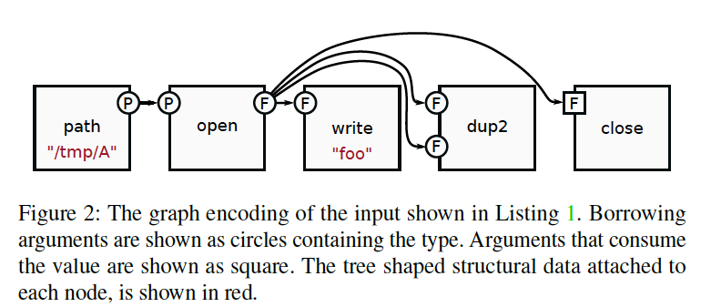

之后，模糊测试的突变是基于上述这个图来进行的，在得到图之后，会解析生成相应的 C 程序代码。

基于上述的技术点，作者实现的 **NYX** 的整体架构如下图所示：

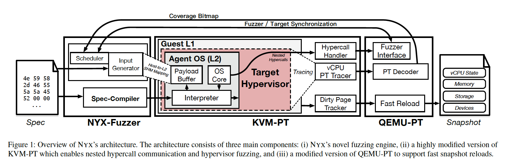

因此，总的来说，作者所做的贡献有以下几点：

* 将嵌套虚拟化与 **Intel-PT** 等技术相结合，使得目标 **hypervisor** 在不需要被拆分代码到用户态执行的情况下，可以获得目标执行的代码覆盖情况；
* 实现一个快速的快照恢复机制，结合 **Page Modification Logging** 特性，快速追踪在虚拟机执行的过程中被修改的内存，并在每次重新开始时快速恢复快照；
* 一套基于图的测试用例生成 / 图片机制，可以更精准地生成有效的测试用例；

**NYX** 的工作流程如下图所示：

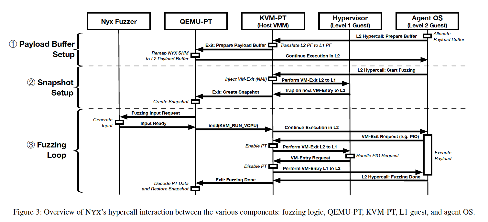

首先，由运行在目标 **hypervisor** 中的 **Agent OS**（作者改自 **Hyper-Cube OS**）申请一段用于放置测试用例的缓冲区，之后向模糊测试工具发送开始模糊测试的命令，这时会让 **QEMU-PT** 保存当前的程序状态，创建快照。在创建完快照之后，会通知模糊测试工具生成测试用例，之后将生成的测试用例通过 `ioctl` 让 **Agent OS** 进行执行。执行完之后会继续通知 **QEMU-PT** 解析保存当前的覆盖状态，同时恢复快照，以进行下一轮。

在评测阶段，作者针对 **QEMU 5.0.0** 和 **bhyve 12.1** 分别进行测试。

首先，作者针对一些驱动设备与 **Hyper-Cube** 进行测试（为了证明基于覆盖率指导是否有提高作用），为了公平起见，作者将（测试用例生成 / 突变引擎）特定的语法与 **Hyper-Cube** 保持基本一致，实现 **NYX-Legacy**，然后比较覆盖率，发现对于简单的驱动程序，确实提高的不多，但是对于复杂的驱动程序，能提升很高的覆盖率，如下图所示：

之后，作者验证其突变引擎的特定语法对模糊测试性能的影响，如下图所示，其中 **NYX-Spec** 是给定了特定语法的结果，可以看到特定语法对模糊测试的性能有比较大的影响。

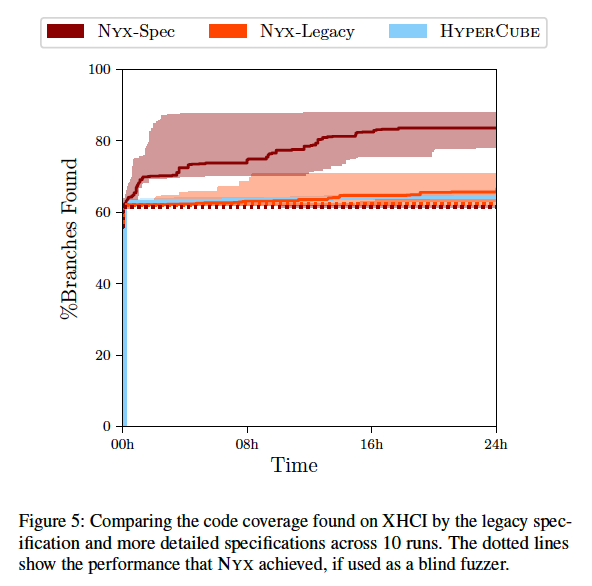

作者还对其实现的快照恢复机制进行了实验，可以看到随着内存页的增多，恢复速度有所下降（但是总的还是比 QEMU 本身的快照恢复机制快），经过与 **AFL** 的 `forkserver` 比较，虽然速度较慢，但是恢复的页面适量却多得多（比如能对文件系统进行恢复），更有利于在 **hypervisor** 层面的模糊测试。

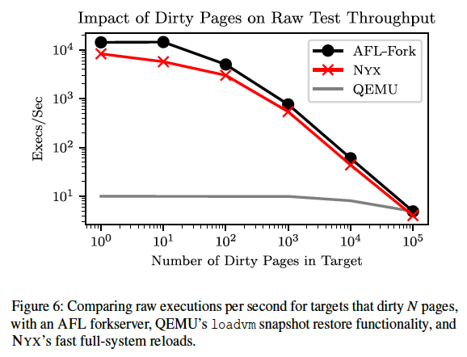

## Towards Systematic and Dynamic Task Allocation for Collaborative Parallel Fuzzing

*ASE-NIER 2021*

这篇文章聚焦于多实例模糊测试之间的协作。文章提到默认的 **AFL** 以及 **LibFuzzer** 的多实例协作机制存在一些问题，即在多个实例之间简单地同步种子目录，导致多个实例在同步之后均具有相同的种子，基于相同的种子突变之后会探索相同的程序空间，从而导致多实例的计算性能被浪费，如下图所示：

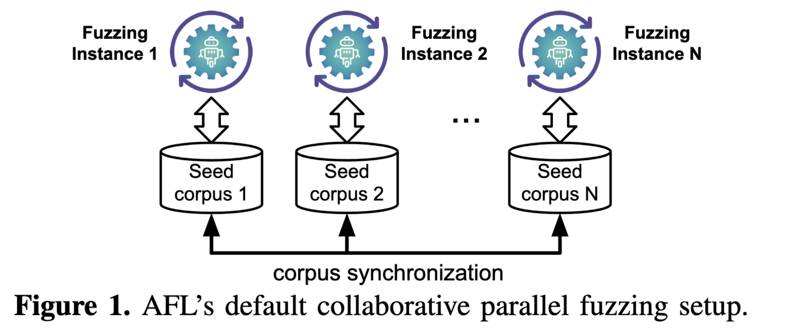

作者在 **LibPNG** 上做实验，发现多个实例之间的覆盖率重叠高达 `95%`，因此确定了这一问题的存在。而且在默认 **AFL** 实现的同步机制中，没有将路径频繁度、分支命中数量等有用的信息同时同步过来。

目前有的一些工作，例如 [**PAFL**](#pafl-extend-fuzzing-optimizations-of-single-mode-to-industrial-parallel-mode)，通过所有实例在同一个中心种子集合里面获取测试用例来缓解这一问题，但是仍然存在没有很好地将任务进行划分的问题。而 PAFL 中使用的任务划分方式也是依赖于随机的 Bitmap，并未考虑到程序的结构，因此可能没有办法到达最优解。

基于此，作者提出了一种多个模糊测试实例之间协同的方式。总的架构图如下所示：

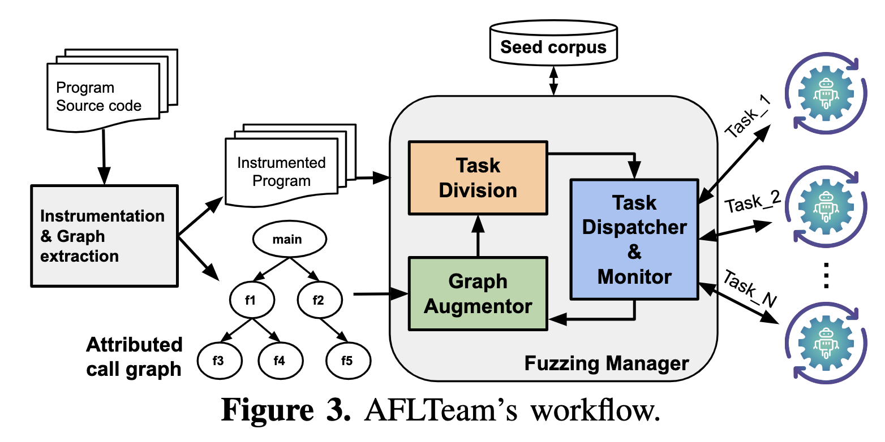

作者使用 **LLVM** 提取得到目标程序的函数调用图，在得到函数调用图之后，作者使用一个函数内部的基本块数量作为每一个函数的初始权重，然后使用现有的图划分算法对图进行划分，将其拆分成不同的部分，从而实现子任务划分。此外作者提到有一些间接调用可能无法直接提取，因此需要对插桩方式进行修改，从而获得间接跳转信息，实时更新函数调用图。

在获得每个子任务的划分之后，每一个实例使用过滤的方式，如果当前种子没有触碰到目标区域，则跳过该种子不进行 Fuzzing，从而实现多实例模糊测试过程的任务划分。

由于这篇文章是发在 *ASE-NIER* 上的，作者只是提了一个想法并做了简单的实现，因此没有做的太完备，实验也比较简略，作者在 10 个核上部署模糊测试实例，并执行 10 个小时，以下是实验结果：

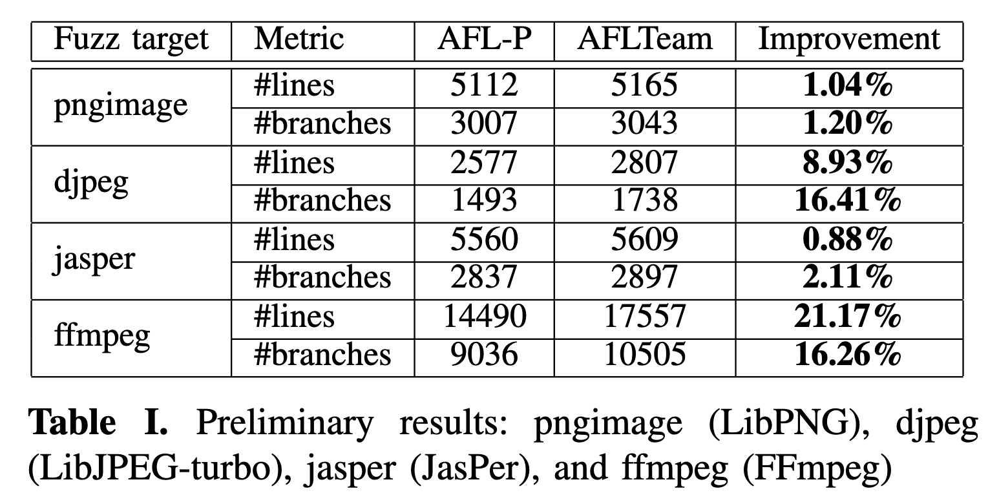

*PS：这篇文章跟我现在在做的一个工作高度相似，包括其对问题的提出和发现都跟我的一样，不过在实现的方法上有些许差别。之前一直对自己做的这个课题能不能被别人认可产生怀疑，现在看到这篇文章感觉能稍微对自己起到一些激励作用。*
