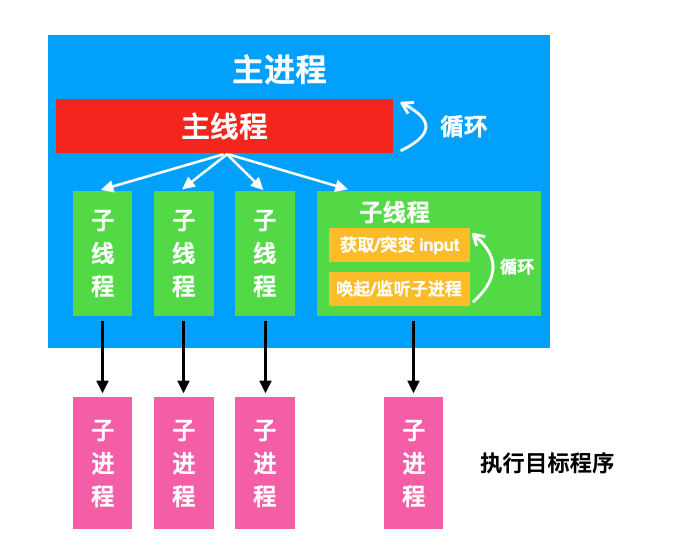

# honggfuzz 概述

## 介绍

**[honggfuzz](https://github.com/google/honggfuzz)** 是 Google 开发并开源的一款基于程序覆盖率指导的灰盒模糊测试，其基本原理与 **AFL** 类似，通过程序的覆盖率情况指导变异器对测试用例进行变异。honggfuzz 使用 **[SanitizerCoverage](https://clang.llvm.org/docs/SanitizerCoverage.html)** 进行插桩，来统计测试用例对目标程序覆盖率的影响，这一部分主要在源码目录下的 `libhfuzz/instrument.c` 中实现，因此如果要对在插桩这一部分做一些改进工作的，可以修改该源码文件。

与 AFL 使用的 `forkserver` 方式不同，honggfuzz 使用多线程并在每个线程中调用 `fork` 系统调用唤起新进程来执行目标进程的方式来完成模糊测试，honggfuzz 支持并行模式，指定多少个实例并行，则会有几个子线程被唤起循环执行。其基本的工作架构流程如下图所示。



## 使用

honggfuzz 的使用很简单，可以同时支持普通模式（有目标源码的情况）和 QEMU 模式（目标二进制程序没有源码时，使用 honggfuzz 提供的 QEMU 对二进制进行插桩）。这里介绍一下在有目标源码的情况下如何对目标程序插桩，并完成模糊测试。

首先进入 honggfuzz 的主目录，执行 `make` 对 honggfuzz 进行编译。编译完成后，在 `hfuzz_cc` 目录下会得到相应的用于对目标二进制程序插桩对编译器。通常情况下，使用 `hfuzz-clang++` 和 `hfuzz-clang` 对目标程序进行编译即可。

对目标程序完成编译得到插桩之后的可执行文件之后，可以开始进行模糊测试，直接使用如下命令即可：

```sh
honggfuzz -i <input_dir> -o <output_dir> -n 4 -- target_bin ___FILE___
```

其中，`-i` 选项用于指定初始种子文件目录，`-o` 选项用于指定当前模糊测试过程的输出目录，包括经过突变得到的有用的种子文件，以及一些日志输出等。`-n` 表示当前同时使用 `4` 个实例对目标程序进行模糊测试，`target_bin` 表示目标可执行程序，`___FILE___` 为占位符，用于指定目标可执行程序的输入。

如果目标可执行程序的输入不是从文件读取，而是从标准输入中读取，则使用 `-s` 选项，并去掉 `___FILE___` 占位符即可。

对于其他更多的选项，可以参考[官方文档](https://github.com/google/honggfuzz/blob/master/docs/USAGE.md)或使用 `honggfuzz --help` 查看。

## 源码流程

### 插桩

honggfuzz 的插桩主要实现位于 `libhfuzz/instrument.c` 文件中，通过 **SanitizerCoverage** 实现。例如，对于程序执行流中的每一条边的追踪，其实现了 `__sanitizer_cov_trace_pc_guard_init` 和 `__sanitizer_cov_trace_pc_guard` 函数，对目标程序的基本块之间的边命中数量进行监视和统计。下面分别对这两个函数，来大致了解一下 honggfuzz 对插桩流程和所涉及到的数据结构。

`__sanitizer_cov_trace_pc_guard_init` 首先调用了 `hfuzzInstrumentInit` 函数，这个函数确保只被初始化一次，否则每次调用一个新的目标程序进行执行都会进行初始化，显然是不对的。然后调用 `initializeInstrument` 进行真正的初始化操作。

在该初始化操作中，最主要的是对 `globalCovFeedback` 和 `localCovFeedback` 进行初始化。这里需要清楚的是，honggfuzz 中，父进程与子进程之间的消息传递大部分通过共享文件描述符来实现，因此对于上述两个数据结构的初始化过程，是通过预定义的文件描述符，将该文件描述符对应的内存映射到当前子进程的内存空间中，这样在当前子进程对这段内存进行操作，则可以实现对共享数据结构的修改。初始化部分的代码如下所示（以 `globalCovFeedback` 为例）：

```c
static bool initializeGlobalCovFeedback(void) {
    struct stat st;
    // 检查父进程那边相应的文件描述符对应的内存区域是否可以被解析成 feedback_t 类型
    if (fstat(_HF_COV_BITMAP_FD, &st) == -1) {
        return false;
    }
    if ((size_t)st.st_size < sizeof(feedback_t)) {
        LOG_W("Size of the feedback structure mismatch: st.size < sizeof(feedback_t) (%zu < %zu). "
              "Build your honggfuzz binary from newer sources",
            (size_t)st.st_size, sizeof(feedback_t));
        return false;
    }

    // 映射对应的文件描述符到相应的内存区域
    globalCovFeedback = initialzeTryMapHugeTLB(_HF_COV_BITMAP_FD, sizeof(feedback_t));
    if (globalCovFeedback == MAP_FAILED) {
        PLOG_W("mmap(_HF_COV_BITMAP_FD=%d, size=%zu) of the feedback structure failed",
            _HF_COV_BITMAP_FD, sizeof(feedback_t));
        return false;
    }
    return true;
}
```

上面代码中的 globalCovFeedback 变量为 `feedback_t` 类型，该类型于 `honggfuzz.h` 中定义，其中包含记录了各种基本块之间边命中数量等信息，用于后续指导测试用例的调度和突变。

在完成这些数据结构的初始化之后，调用 `instrumentClearNewCov` 函数，对这些数据结构中的数据清零。之后，对于 SanitizerCoverage 放置的每一个 `guard`，都使用唯一的数字对其进行标识，方便后续对每一条边的命中数进行统计：

```c
// __sanitizer_cov_trace_pc_guard_init
for (uint32_t* x = start; x < stop; x++) {
    uint32_t guardNo = instrumentReserveGuard(1);
    *x               = guardNo;
}
```

从而完成初始化工作。

接下来，对于基本块转移的边的命中数统计由 `__sanitizer_cov_trace_pc_guard` 函数实现（这里省略一些代码）：

```c
void __sanitizer_cov_trace_pc_guard(uint32_t* guard_ptr) {
    const uint32_t guard = *guard_ptr;
    if (!guard) {
        return;
    }

    if (ATOMIC_GET(localCovFeedback->pcGuardMap[guard]) > 100) {  // 如果这条边被命中太多次，则不再关心这条边
        /* This guard has been maxed out. Mark it as uninteresting */
        ATOMIC_CLEAR(*guard_ptr);
    }

    /* Update the total/local counters */
    const uint8_t v = ATOMIC_PRE_INC(localCovFeedback->pcGuardMap[guard]);
    if (v == 1) {  // 表示这条边之前未被当前实例发现过
        ATOMIC_PRE_INC(globalCovFeedback->pidTotalEdge[my_thread_no]);
    } else {
        ATOMIC_PRE_INC(globalCovFeedback->pidTotalCmp[my_thread_no]);
    }

    /* Update the new/global counters */
    const uint8_t newval = instrumentCntMap[v];
    if (ATOMIC_GET(globalCovFeedback->pcGuardMap[guard]) < newval) {
        const uint8_t oldval = ATOMIC_POST_OR(globalCovFeedback->pcGuardMap[guard], newval);
        if (!oldval) {  // 这条边之前未被任何实例发现过
            ATOMIC_PRE_INC(globalCovFeedback->pidNewEdge[my_thread_no]);
        } else if (oldval < newval) {
            ATOMIC_PRE_INC(globalCovFeedback->pidNewCmp[my_thread_no]);
        }
    }
}
```

上述这些完成了对目标二进制程序执行边的统计。

### 主流程

honggfuzz 的入口位于 `honggfuzz.c` 的 `main` 函数中，该函数首先调用 `cmdlineParser` 函数对命令行参数进行解析（因此如果不清楚各个选项的作用，也可以看这个函数）。之后调用 `input_init` 函数对输入目录初始化，检查输入目录中是否存在种子文件，并将种子文件目录对应的指针赋值给全局 `inputDirPtr` 变量。然后对全局记录覆盖率反馈信息的数据结构以及内存区域进行初始化：

```c
if (!(hfuzz.feedback.covFeedbackMap =
        files_mapSharedMem(sizeof(feedback_t), &hfuzz.feedback.covFeedbackFd,
        "hf-covfeedback", /* nocore= */ true, /* export= */ hfuzz.io.exportFeedback))) {
    LOG_F("files_mapSharedMem(name='hf-covfeddback', sz=%zu, dir='%s') failed",
        sizeof(feedback_t), hfuzz.io.workDir);
}
```

通过 `files_mapSharedMem` 将该内存区域（`covFeedbackMap`）与文件描述符（`covFeedbackFd`）进行映射。然后在进行一些基本的配置之后（honggfuzz 通过 `struct honggfuzz_t` 结构体控制全局一些配置），进入 `fuzz_threadsStart` 函数，对子线程进行设置。最后主线程调用 `mainThreadLoop` 函数，不断循环，监视子线程模糊测试的状态，并对 UI 进行更新。

在 `fuzz_threadsStart` 函数中，该函数通过指定的并行模糊测试实例的数量，创建相应数量的子线程，然后每个子线程调用 `fuzz_threadNew` 函数，接下来流程就进入多个线程并行操作。

在 `fuzz_threadNew` 函数中，对 `struct run_t` 结构体变量进行初始化，这个变量代表每个不同的线程，控制每个线程的行为以及后续每个线程对目标程序的执行。在该函数中，将测试用例的数据（`run.dynfile->data`）与某个文件描述符（`run.dynfile->fd`）绑定，方便后续对测试用例的操作：

```c
if (!(run.dynfile->data = files_mapSharedMem(hfuzz->mutate.maxInputSz, &(run.dynfile->fd),
        mapname, /* nocore= */ true, /* exportmap= */ false))) {
    LOG_F("Couldn't create an input file of size: %zu, name:'%s'", hfuzz->mutate.maxInputSz,
        mapname);
}
```

同时，完成覆盖率信息的内存区域与文件描述符的映射：

```c
if ((run.perThreadCovFeedbackFd = files_createSharedMem(sizeof(feedback_t), mapname,
        /* exportmap= */ run.global->io.exportFeedback)) == -1) {
    LOG_F("files_createSharedMem(name='%s', sz=%zu, dir='%s') failed", mapname,
        sizeof(feedback_t), run.global->io.workDir);
}
```

之后，进入循环，在循环中调用 `fuzz_fuzzLoop` 函数，开始模糊测试流程。该函数中，主要专注三个函数：`fuzz_fetchInput`、`subproc_Run` 和 `fuzz_perfFeedback`。

```c
static void fuzz_fuzzLoop(run_t* run) {
    // ...
    if (!fuzz_fetchInput(run)) {  // 1
        if (run->global->cfg.minimize && fuzz_getState(run->global) == _HF_STATE_DYNAMIC_MINIMIZE) {
            fuzz_setTerminating();
            return;
        }
        LOG_F("Cound't prepare input for fuzzing");
    }
    if (!subproc_Run(run)) {  // 2
        LOG_F("Couldn't run fuzzed command");
    }

    if (run->global->feedback.dynFileMethod != _HF_DYNFILE_NONE) {
        fuzz_perfFeedback(run);  // 3
    }
    // ...
}
```

#### fuzz_fetchInput

`fuzz_fetchInput` 函数是从提供的种子文件或者突变得到的测试用例中得到一个测试用例，供之后的目标程序执行。该函数会根据当前模糊测试所处的状态而执行不同的行为。在正常模糊测试开始时，会处于 **_HF_STATE_DYNAMIC_DRY_RUN** 状态，则会调用 `input_prepareStaticFile` 函数从提供的种子文件目录中获取得到测试用例。该函数首先通过 `input_shouldReadNewFile` 函数判断当前是否需要重新读取新的文件，如果需要，则通过 `input_getNext` 函数从全局 `inputDirPtr` 变量中获取一个种子文件。由于多个线程可以同时对 `inputDirPtr` 进行操作，因此此时不会对每个测试用例重复执行，但是每次获取时需要添加锁。对于每个获取到的测试用例，honggfuzz 不是简单地对其进行执行，而是采用递增式地方法进行读取内容，最开始读取 4 个字节的文件内容，将文件内容读取到 `run.dynfile->data` 中，然后传递给目标程序执行，执行完成后成倍递增，直到读完所有的文件内容，则继续调用 `input_getNext` 函数获取下一个测试用例。

```c
static bool fuzz_fetchInput(run_t* run) {
{
    fuzzState_t st = fuzz_getState(run->global);
    if (st == _HF_STATE_DYNAMIC_DRY_RUN) {  // 当前状态
        run->mutationsPerRun = 0U;  // 不对目标种子文件进行突变
        if (input_prepareStaticFile(run, /* rewind= */ false, true)) {
            return true;
        }
        fuzz_setDynamicMainState(run);  // 进入主要模糊测试流程
        run->mutationsPerRun = run->global->mutate.mutationsPerRun;
    }
    // ...
}

bool input_prepareStaticFile(run_t* run, bool rewind, bool needs_mangle) {
    if (input_shouldReadNewFile(run)) {   // 是否需要读取新的测试用例
        for (;;) {
            if (!input_getNext(run, run->dynfile->path, /* rewind= */ rewind)) {
                return false;
            }
            if (!needs_mangle || !input_inDynamicCorpus(run, run->dynfile->path)) {  // 检查这个文件是不是 run 过了
                LOG_D("Skipping '%s' as it's already in the dynamic corpus", run->dynfile->path);
                break;
            }
        }
        run->global->io.testedFileCnt++;
    }

    // ...
    ssize_t fileSz = files_readFileToBufMax(path, run->dynfile->data, run->dynfile->size);
    // ...
    return true;
}
```

当提供的种子文件目录中所有的种子文件都被执行了一次之后，通过 `fuzz_setDynamicMainState` 函数，将模糊测试的状态设置成 **_HF_STATE_DYNAMIC_MAIN**，进入主要模糊测试流程。此时，`fuzz_fetchInput` 会调用 `input_prepareDynamicInput` 函数，该函数从全局的 `dynfileqCurrent` 获取测试用例，并将 `dynfileqCurrent` 指向全局 `dynfileq` 队列的后一个元素（这个队列在之后 `fuzz_perfFeedback` 函数中会进行设置）。之后，将获取到的测试用例的数据读取到 `dynfile->data` 中，然后调用 `mangle_mangleContent` 函数，对目标测试用例进行突变，之后返回。因此，如果需要对 honggfuzz 的突变策略进行修改，或者突变策略进行学习，可以参考 `mangle_mangleContent` 函数，位于 `mangle.c` 文件中。`input_prepareDynamicInput` 部分代码如下所示：

```c
bool input_prepareDynamicInput(run_t* run, bool needs_mangle) {
    // ...
    int speed_factor = 0;
    for (;;) {
        MX_SCOPED_RWLOCK_WRITE(&run->global->mutex.dynfileq);

        if (run->global->io.dynfileqCurrent == NULL) {
            run->global->io.dynfileqCurrent = TAILQ_FIRST(&run->global->io.dynfileq);
        }

        if (run->triesLeft) {
            run->triesLeft--;
            break;
        }

        /* 获取队列第一个测试用例，并将 dynfileqCurrent 往后挪 */
        run->current                    = run->global->io.dynfileqCurrent;
        run->global->io.dynfileqCurrent = TAILQ_NEXT(run->global->io.dynfileqCurrent, pointers);
        // ...
    }

    // ...
    memcpy(run->dynfile->cov, run->current->cov, sizeof(run->dynfile->cov));  // 一些对于种子文件的设置
    snprintf(run->dynfile->path, sizeof(run->dynfile->path), "%s", run->current->path);
    memcpy(run->dynfile->data, run->current->data, run->current->size);  // 读取种子文件数据到 data 中

    if (needs_mangle) {
        mangle_mangleContent(run, speed_factor);  // 对种子文件进行突变
    }

    return true;
}
```

#### subproc_Run

获得了测试用例之后，模糊测试过程调用 `subproc_Run` 函数，准备对目标程序执行。该函数调用 `subproc_New` 来完成子进程的 `fork`。如果当前模糊测试使用的是 `Persistent` 模式，会有一些特殊的处理，这里不做特殊分析。在成功 `fork` 之后，子进程调用 `subproc_PrepareExecv` 函数，对执行之前的环境进行设置，在这里，honggfuzz 会通过环境变量告诉子进程当前是哪个实例：

```c
char fuzzNo[128];
snprintf(fuzzNo, sizeof(fuzzNo), "%" PRId32, run->fuzzNo);
setenv(_HF_THREAD_NO_ENV, fuzzNo, 1);
```

之后，honggfuzz 通过 `dup2` 将之前在主进程创建的 `covFeedbackFd` 文件描述符复制到 **_HF_COV_BITMAP_FD** 文件描述符上，因此目标程序的插桩部分可以使用相应的文件描述符与主进程通信。对于其他需要与子进程通信的地方，也是使用相似的方式。

接下来，需要将测试用例绑定到相应的文件描述符上（**_HF_INPUT_FD**），如下代码所示。

```c
if (TEMP_FAILURE_RETRY(dup2(run->dynfile->fd, _HF_INPUT_FD)) == -1) {
    PLOG_E("dup2('%d', _HF_INPUT_FD='%d')", run->dynfile->fd, _HF_INPUT_FD);
    return false;
}
if (lseek(_HF_INPUT_FD, 0, SEEK_SET) == (off_t)-1) {
    PLOG_E("lseek(_HF_INPUT_FD=%d, 0, SEEK_SET)", _HF_INPUT_FD);
    return false;
}

// 如果使用了 -s 选项
if (run->global->exe.fuzzStdin &&
    TEMP_FAILURE_RETRY(dup2(run->dynfile->fd, STDIN_FILENO)) == -1) {
    PLOG_E("dup2(_HF_INPUT_FD=%d, STDIN_FILENO=%d)", run->dynfile->fd, STDIN_FILENO);
    return false;
}
```

绑定了文件描述符之后，可以通过访问 `/dev/fd/[fd]` 设备文件读取文件内容。

```c
#define _HF_INPUT_FILE_PATH "/dev/fd/" HF_XSTR(_HF_INPUT_FD)
```

之后，调用 `subproc_prepareExecvArgs` 函数，该函数用于对目标程序的执行参数进行设置：

```c
#define _HF_FILE_PLACEHOLDER "___FILE___"

static void subproc_prepareExecvArgs(run_t* run) {
    size_t x = 0;
    for (x = 0; x < _HF_ARGS_MAX && x < (size_t)run->global->exe.argc; x++) {
        /* 找到占位符的位置 */
        const char* ph_str = strstr(run->global->exe.cmdline[x], _HF_FILE_PLACEHOLDER);
        if (!strcmp(run->global->exe.cmdline[x], _HF_FILE_PLACEHOLDER)) {  // 如果当前参数就是占位符，直接替换
            run->args[x] = _HF_INPUT_FILE_PATH;
        } else if (ph_str) {  // 否则还得处理一下
            static __thread char argData[PATH_MAX];
            snprintf(argData, sizeof(argData), "%.*s%s",
                (int)(ph_str - run->global->exe.cmdline[x]), run->global->exe.cmdline[x],
                _HF_INPUT_FILE_PATH);
            run->args[x] = argData;
        } else {
            run->args[x] = (char*)run->global->exe.cmdline[x];
        }
    }
    run->args[x] = NULL;
}
```

主要是处理 `___FILE___` 占位符，当遇到占位符参数的时候，对占位符使用 `_HF_INPUT_FILE_PATH` 进行替换。

在设置完这些参数与环境之后，`subproc_New` 函数调用 `arch_launchChild` 函数，启动目标程序，并使用相应的测试用例进行执行。

#### fuzz_perfFeedback

当子进程执行完毕之后，主进程中的每个子线程会调用 `fuzz_perfFeedback` 来根据当前执行的情况更新队列。该函数主要检测当前执行结果是否有新的覆盖边出现，如果有新的覆盖边出现，则调用 `input_addDynamicInput` 函数将得到的新的测试用例添加到全局 `dynfileq` 队列中。该函数会有一个根据当前覆盖率对种子文件中的文件进行调度的过程：

```c
dynfile_t* iter = NULL;
TAILQ_FOREACH_HF (iter, &run->global->io.dynfileq, pointers) {
    if (input_cmpCov(dynfile, iter)) {
        TAILQ_INSERT_BEFORE(iter, dynfile, pointers);
        break;
    }
}
if (iter == NULL) {
    TAILQ_INSERT_TAIL(&run->global->io.dynfileq, dynfile, pointers);
}
```

之后，还会将该测试用例写入到目录中，即使用 `-o` 参数指定的目录下：

```c
const char* outDir =
    run->global->io.outputDir ? run->global->io.outputDir : run->global->io.inputDir;
if (!input_writeCovFile(outDir, dynfile)) {
    LOG_E("Couldn't save the coverage data to '%s'", run->global->io.outputDir);
}
```

因此，如果需要在对测试用例的调度，或者决定当前模糊测试过程是否对当前种子感兴趣的过程做一些额外工作的情况下，可以着眼于 `fuzz_perfFeedback` 函数，对其中的某些逻辑进行处理

## 总结

honggfuzz 有着比较好的并发支持，但是其每一次并发操作都需要操作全局变量，需要借助锁来操作，比较消耗性能。此外，honggfuzz 使用比较简单的 `fork` 形式对目标程序进行模糊测试，这一点在模糊测试的过程中也可能会降低一些效率。