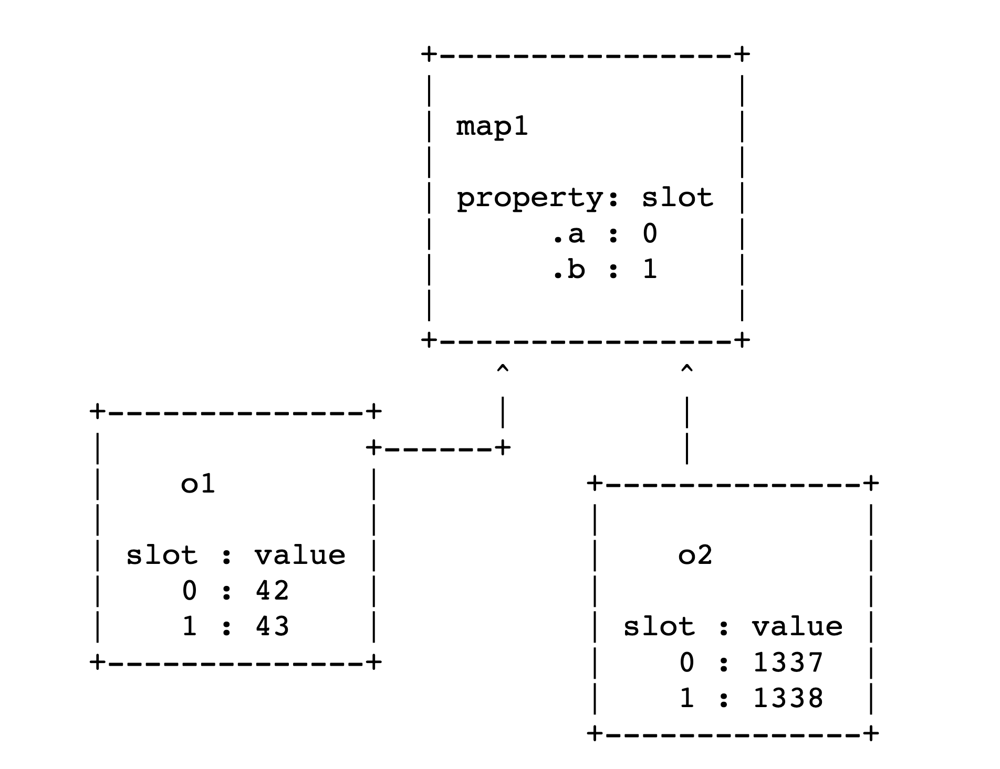
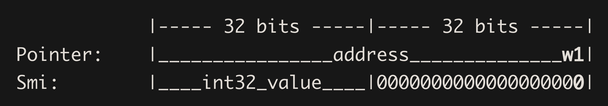

# V8 学习笔记

## 漏洞分析链接

* <https://abiondo.me/2019/01/02/exploiting-math-expm1-v8/>
    * 一个 `Math.expm1` 的漏洞，会在优化（JIT）之后导致 `Object.is(Math.expm1(-0), -0)` 返回 `false`。大致是因为 `Math.expm1` 在经过 `JIT` 优化时，会使得 `Math.expm1` 的返回类型被标记成（PlainNumber, NaN）这样的联合体，但是 -0 不属于上述联合体，因此 `Object.is` 会直接返回 false。
* <http://www.phrack.org/papers/jit_exploitation.html>
    * CVE-2018-17463，安全检查冗余消除导致的漏洞，此外这篇文章还讲解了一些 V8 的基础知识。漏洞是 V8 将 `CreateObject` 对应的操作标记成无副作用的（但实际上会改变对象的 Maps，使得对象的 `Out-line` 属性的类型从 `Array` 形式变成 `Dictionary` 形式，这时 `In-line` 的属性也会被放到 `Out-line` 属性中），因此如果对含有 `CreateObject` （`Object.create`）调用的函数一开始触发了对对象的 Maps 的检查，那么之后的检查就会被冗余消除优化删去，再结合 `CreateObject` 实际的副作用，最终可以导致 `Out-line` 属性的 `Overlap`，这样就能构造出 **Type Confusion**，从而进一步利用。

## 其他学习链接

1. <https://es6.ruanyifeng.com/>
    * ES6 学习教程
2. <https://www.freebuf.com/vuls/203721.html>
    * 从一到 CTF 题理解 V8 漏洞的利用，零基础入门题目，提供 `oob` 方法存在一索引越界读写漏洞
3. <https://e3pem.github.io/2019/11/20/browser/%E6%95%B0%E5%AD%97%E7%BB%8F%E6%B5%8E%E7%BA%BF%E4%B8%8B-Browser/>
    * 虽说是 CTF 题，但是这题的漏洞比较巧妙，提供的 coin 方法中存在可以通过 `valueOf` 回调改写数组大小从而导致越界写的漏洞
    * 拓展（通过内存越界，构造 Victim Object，来获得 addr_of 原语可参照该链接）：<https://xz.aliyun.com/t/6577>
4. <https://paper.seebug.org/1145/>
    * 也是 CTF 题，但是属于真实漏洞。属于存在数组越界访问的漏洞，其实原理跟「3」差不多，也是在执行过程中忽略了可以调用用户自定义的方法，然后在自定义方法中将数组大小做改变，从而构造越界读写。但是这篇文章还讲解了对代码的分析。不过文章中有一些错误，在 JavaScript 以 `.call` 形式调用函数时，`call` 中的第一个参数在解析时作为 Receiver，而第二个参数才是真正的下标 0 的参数。此外，这个漏洞还使用了到了 JS 中的迭代对象的概念，不清楚的可以参考「学习链接 1」。
    * 拓展链接（1）：<https://www.anquanke.com/post/id/147829> 这个劫持控制流思路是自定义一个函数，然后使其 JIT，之后改写这个函数地址的内容
    * 拓展链接（2）：<https://www.sunxiaokong.xyz/2020-01-16/lzx-roll-a-d8/> 有对相关 JS 语法的讲解
    * 拓展链接（3）：<https://xz.aliyun.com/t/5190> 这个劫持控制流思路是泄漏堆地址和栈地址，通过堆地址搜索泄漏 `libc` 地址，然后通过 `ArrayBuffer` 布置 Shellcode，之后通过 ROP 将布置 Shellcode 的地址设置为可执行，最后跳转到 Shellcode 进行执行
5. <https://esprima.org/doc/>
    * 根据 JavaScript 源代码生成抽象语法树（AST）
6. <https://juejin.im/post/5dc4d823f265da4d4c202d3b?from=groupmessage>
    * 对 V8 的执行和 GC 进行了一个概述性质的介绍
7. <https://ponyfoo.com/articles/an-introduction-to-speculative-optimization-in-v8#excurse-value-representation>
    * 针对 V8 `Ignition` 和 `TurboFan` 优化（主要是 IC 和 Feedback Vector）的详细讲解
8. <https://animal0day.blogspot.com/2020/04/setting-up-vulnerable-v8-on-windows.html>
    * 构建 Windows 下的 V8 调试环境

## 配置 V8 环境

* <https://mem2019.github.io/jekyll/update/2019/07/18/V8-Env-Config.html>

可以参考上述链接完成。

首先，需要配置 `git` 本地代理：

```sh
$ git config —global http.proxy http://ip:port
$ git config —global https.proxy http://ip:port
```

然后，需要配置环境变量代理（因为后续命令会用到 `curl`）：

```sh
$ export http_proxy=“http://ip:port”
$ export https_proxy = “http://ip:port”
```

之后，下载 `depot_tools`：

```sh
$ git clone https://chromium.googlesource.com/chromium/tools/depot_tools.git
$ export PATH=/path/to/depot_tools:$PATH
```

然后，安装 `Ninja`，为编译做准备：

```sh
$ git clone https://github.com/ninja-build/ninja.git
$ cd ninja && ./configure.py —bootstrap && cd ..
$ export PATH=/path/to/ninja:$PATH
```

最后，调用 `fetch v8` 即可拉取 V8 代码。

拉取代码之后，切换到需要调试的版本 / 分支，之后执行 `gclient sync` 来同步一些编译时需要的文件 / 配置。如果是在 Linux 下执行，则还需调用 `./build/install-build-deps.sh` 进行一些依赖的下载。（`gclient sync` 如果报需要 `config` 的错误，可以先执行这个命令：`gclient config https://chromium.googlesource.com/v8/v8`）

之后执行 `tools/dev/v8gen.py x64.release` 或者 `tools/dev/v8gen.py x64.debug` 生成构建的配置，最后执行 `ninja -C out.gn/x64.release` 或者 `ninja -C out.gn/x64.debug` 开始编译，完成构建。

如果想要在 `release` 的情况下获得调试信息（即在 `gdb` 中用 `job` 命令对内存进行打印），可以在生成构建配置之后，编辑 `x64.release/args.gn`，添加以下内容：

```sh
v8_enable_backtrace = true
v8_enable_disassembler = true
v8_enable_object_print = true
v8_enable_verify_heap = true
```

## 基本概念

（浏览器 DOM 相关对象不由 V8 引擎提供。）

* **Isolate**: 隔离，每个隔离是一个独立的 V8 运行时，具有独立的 Heap，同一时刻只能被一个线程执行，每个隔离需要运行脚本就需要一个 Context，一个隔离可以有多个 Context；
* **Context**: 上下文，V8 中所有的代码都是在某个 V8 上下文中运行的，属于一个隔离（Isolate）内部的概念；
* **Handle**: 对 Heap 中对象的引用（V8 中 JavaScript 的值和对象均在 Heap 中存放），Handle 分为 Local 和 Persistent 两种，Local 是受 HandleScope 来管理的，可以理解成一个指向对象的指针，Persistent 不受 HandleScope 管理，由于 V8 的 GC 机制，因此使用 Handle 对对象进行管理是很必要的（具体可以看下面 GC 小节）；
* **Scope**: 可以看成一个句柄的容器，在某个 Scope 内部管理对应的对象，当使用完一个Scope 内的 Handle 之后，可以直接删除整个 Scope 来删除 Scope 内的 Handle；
* **Templates**: 两种类型（Function Template、Object Template），Function Template 是用来生成 JS 函数的 C++ 对象，而每一个 Function Template 都有一个对应的 Object Template，当使用某个 JS 函数创建对象时，V8 就会使用对应的 Object Template 来实例化对象。
    * （Template）ObjectTemplate 的声明位于 `include/v8.h` 中，类内部的方法实现位于 `src/api/api.cc` 中
        * 可以通过 Set 方法向 ObjectTemplate 实例中添加属性，之后通过该实例所创建得到的对象都有对应的属性；
    * FunctionTemplate 可以获得 Function，Function 内部方法的实现位于 `src/api/api.cc` 中，对于 Function 的调用，最终会进入 `Function::Call` 方法，该方法最终调用的是 `i::Execution::Call`，其定义在 `src/execution/execution.cc` 中

## V8 值表示

V8 中主要有三种类型的值表示（`src/objects.h`）：

* 浮点数
* 整数
* 对象

对于浮点数来说，在 V8 中的二进制表示不作其他处理，对于整数（`32 bit`，暂不知道 `64 bit` 怎么处理，就是下面的 Smi）来说，V8 会将 `32 bit` 整数左移 32 位来表示，对于对象来说（HeapObject），V8 会通过在对象地址最低位与 1 来表示（由于地址都是对齐的，所以这个就相当于地址加 1）。

```c
Smi:        [32 bit signed int] [31 bits unused] 0
HeapObject: [64 bit direct pointer]           | 01
```

在 V8 中，上述方法所表示的值称为 **Tagged Pointer**，对于对象（HeapObject）来说，具体决定于是哪个对象的，是通过 **Maps** 来完成的，Maps 位于 HeapObject 内存的 0 偏移处。因为 HeapObject 的最低字节的特殊处理，所以在 V8 中对 HeapObject 内部成员数据的访问需要借助特殊的访问器，这也说明了一个事情，V8 中的对象不会使用到任何 C++ 的数据成员（否则无法正确处理最后一位）。

V8 的数组中的元素也遵循上述的值表示方法，因此在利用过程中，通常使用浮点数数组对内存进行更改。

## 隐藏类（Hidden Class, Maps）

V8 中，所有具有相同属性的对象共享一个隐藏类（Maps），Maps 包含一个对象的动态类型（String、Uint8Array、HeapNumber 等），对象的大小、对象的属性（以及存储位置）、数组元素的类型以及 `prototype` 等。

```c
   +----------------------+
   |         Maps         |
   +----------------------+
   |      Properties      |
   +----------------------+
   |       Elements       |
   +----------------------+
   |         ...          |
   +----------------------+
   |         ...          |
   +----------------------+
   |         ...          |
   +----------------------+
```

在 Maps 中存放着属性名对应的下标，这样 V8 中的对象访问属性的时候，会先根据 Maps 通过属性名获取相应的下标，然后再回到对象字段中查找具体的值。在 V8 中，动态的添加属性会生成新的 Maps，在新的 Maps 中添加新增的属性，旧的 Maps 会指向新的 Maps。具体可以参考[《JavaScript 引擎的一些优化处理》](./JavaScript_Optim.md)。V8 维护这一个转换表，决定当前对象增加了某个属性之后转换到哪个新的 Maps 中。

对象的具体属性值由对象本身存储，存储在多个可能的内存区域中的一个（对于对象来说，一个属性有不同的内存区域可以进行存放），而 Maps 就可以用来指出该属性值存储在具体的哪个内存区域中。对象中可以存储属性值的内存区域有三个：

* inline properties：位于对象内存内部
* out-of-line properties：位于对象外部，一个动态大小的堆空间（FixedArray）
* 如果属性是可索引的（实际上就是属性名是数字），则存储在另一个动态大小的堆空间中（由 elements 指向）

前两种方式的内存存储模式如下图所示：



对于复杂的对象，V8 会使用字典模式（Dictionary Mode）对其进行访问，在字典模式中，就不需要使用 Maps 来查找某个属性在对象中的 `slot` 值来获取属性值了，而是直接维护一个哈希表，通过属性名映射属性值。当 V8 认为使用 Maps 机制会消耗性能时，会使用这种方式对属性进行访问。

Maps 中第三个字段指向一个描述符数组，该数组中存放着每个命名属性（详请看下一节）的名称、保存的索引等基本信息。

### 属性

* <https://blog.crimx.com/2018/11/25/v8-fast-properties/>

V8 中的属性有两种，一种是命名属性，以字符串作为属性的索引；另一种是数组索引属性，常叫做元素（Elements），是以整数作为数组索引的。这两种属性通常保存在不同的内存区域中。在最简单的情况下，两种属性的存储方式都类似于数组，即一串有序的连续内存空间。对于 Elements 来说，可以直接通过索引进行访问，而对于属性来说，则需要借助 Maps 获取相应属性的索引，然后去连续内存段中访问。但是，属性有时也会切换成基于稀疏字典的方式来存储（类似哈希表？），从而节省内存。需要注意的是 Maps 不存储 Elements 的信息，因此添加 Elements 不会改变对象的 Maps 指向。

对于命名属性来说，每个对象都支持对象内属性，这些属性由对象在创建时预留出一定数量的属性槽，访问这些属性是最快的。而如果属性的数量超过了对象预留的属性槽，则继续添加属性会将属性放入专门存储属性的内存空间中，该内存空间是可以动态改变大小的。以上所说的存储在有序的连续内存空间中，通过 Maps 映射索引来进行访问的属性称为“快属性”。

V8 为了支持大量的属性添加和删除操作，因此对象内部有时候会有独立的词典空间作为一些属性的存储，这些属性称为“慢属性”，慢属性的信息也不保存在 Maps 中，而是直接保存在对象中，因此对慢属性的更改（继续增加慢属性或者删除慢属性）也不会改变 Maps 的指向。对一个对象进行大量的添加属性操作，会将对象的属性存储模式从快属性变成慢属性，而且对象内属性也会被变成慢属性，移到慢属性存储区域进行存储。

对于 Elements 来说，得考虑他的空隙值，此外，Elements 是可以沿着原型链进行查找的，比如当前对象的索引 2 的 Elements 为空，那其会查找其 `prototype` 的索引为 2 的 Elements。由于空隙值太多会导致数组过于稀疏，因此也存在两种模式的 Elements：“快元素”和“慢元素”。快元素就是之前的数组，慢元素通过键值（存储键-值-描述符）进行存储。除了具有太大的空隙会导致变成慢元素存储之外，改变快元素中的哪怕一个描述符，也会导致变成慢元素进行存储。

在 ECMAScript 中，上面说到的描述符即对象属性的 Attribute，被定义成以下几类：

* Value：属性值
* Writable：属性是否可写
* Enumerable：定义属性是否可枚举
* Configurable：定义属性是否可配置（删除）

### V8 中的数组

* <https://v8.dev/blog/elements-kinds>

V8 的数组也有对应的 Map 结构，可能为 JSArray 或者 FloatArray 等。数组中存储的 Elements 也是一个对象结构，内部存有具体的对象的值，通过数组对象的 Elements 属性进行引用。

数组存在一个通用元素类型的概念，通用元素类型可以保存当前数组所包含元素的基本类型，从而可以使得 V8 在后续操作中进行进一步的优化。这些元素类型包括：

* **PACKED_SMI_ELEMENTS**：表示当前数组仅存在 Smi 类型的元素
* **PACKED_DOUBLE_ELEMENTS**：表示当前数组包含浮点数类型的元素和 Smi 类型的元素（-0、NaN 等也会使得 Smi 变成 Double）
* **PACKED_ELEMENTS**：表示当前数组包含各种类型的元素
* **HOLEY_SMI_ELEMENTS**：稀疏的存放 Smi 类型的数组
* **HOLEY_DOUBLE_ELEMENTS**：稀疏的存放浮点类型的数组
* **HOLEY_ELEMENTS**：稀疏数组（之所以区分 HOLEY 与 PACKED，是因为 PACKED 类型的数组可以更好地被优化），使用 new Array(3) 这种语句创建，则一开始就是这种类型
* ……（一共有 21 种）

因此数组的元素类型可能会随着向数组中添加不同的元素而改变，但是只会朝着一个方向改变，而不会逆转，即使数组的值被变回来了。

### V8 中的 JSFunction

JSFunction 类中有一个 `code` 字段，该字段存储着该函数被调用时执行的机器码地址，且该字段指向的地址内存区域为 RWX 类型的，因此可以进行写入和执行。V8 在对一个函数进行优化之后，就会修改位于这里的机器码。但是在 `6.7` 之后的版本里，该内存地址不可写。

## Pointer Compression

* <https://v8.dev/blog/pointer-compression>

V8 的内存消耗比较大，因为所有的值都是 Tagged Pointer，在 `64-bit` 环境下都是 8 个字节，尤其是用 Tagged Pointer 在 `64-bit` 系统下存储 Smi 时，有很严重的内存浪费，如下图所示：



因此需要一种方法降低 V8 的内存消耗。**Pointer Compression** 就是一种这样的方式。Pointer Compression 的基本思想是通过存储 `32-bit` 的偏移值来代替存储 `64-bit` 的指针值。具体地，Pointer Compression 技术确定所有 V8 对象都申请在 4GB 内存区域内，然后就可以使用偏移来表示对象在这个内存范围内的地址，同时，对于 Smi 来说，也可以使用 `32-bit` 来表示。这是最简单的一种表示方式。

此外，也可以将 `base` 选为最中间的地址，则 `offset` 的范围为 `-2GB` 到 `2GB` 之间。这种表示方式的好处是符号对于 Smi 和对象指针来说，处理起来是一样的。

在 `64-bit` 架构中，V8 保留一个寄存器作为「根」寄存器，该寄存器指向数组或者 V8 的根。V8 的一些外部引用表和内建表都是用这个「根」寄存器的偏移来引用。V8 实现 Pointer Compression 就是通过这个根寄存器，将这个根寄存器存储堆基地址，因此在实现的时候需要在堆基址开始的位置将之前能通过「根」寄存器访问的对象进行存放。

V8 的 Pointer Compression 的实现可以在 `v8/src/common/ptr-compr.h` 和 `v8/src/common/ptr-compr-inl.h` 中看到。

Pointer Compression 对漏洞利用的影响：<https://blog.infosectcbr.com.au/2020/02/pointer-compression-in-v8.html>

对利用的影响是如果伪造了 JSArray，通过修改 JSArray 的 Elements 的指针来实现任意地址读取，由于使用了 Pointer Compression，只能访问 4GB 范围内的内存。因此可以使用 ArrayBuffer 来修改 Backing Store（这个 Backing Store 存储的就是地址，不是 Tagged Pointer，也没有被压缩）实现任意地址读写。

此外，Double 由于不是 Tagged Pointer 类型的，因此也不会被压缩。这么看来，Pointer Compression 对漏洞利用的影响实际上微乎其微。

## 深入方法调用

**Function** 被调用之后，会进入 **Function::Call** (`src/api/api.cc`) 方法，该方法最终调用 **i::Execution::Call** (`src/execution/execution.cc`)，并在该方法中调用 **Invoke** (`src/execution/execution.cc`) 函数。**Invoke** 函数会获得一个 **InvokeParams** 作为参数（通过 **InvokeParams::SetUpForCall** (`src/execution/execution.cc`) 进行获取）。

在 **Invoke** 函数中，会根据 `params.is_construct` 来设置 `receiver` 对象（如果是构造函数，则 `receiver` 将与普通函数调用不同，`isolate->factory()->the_hole_value()`），之后调用 **Builtins::InvokeApiFunction** (`src/builtins/builtins-api.cc`) 函数，在该函数中，根据传进来的参数设置好之后用来调用的参数，然后调用 **HandleApiCallHelper** (`src/builtins/builtins-api.cc`) 函数.

## JIT

V8 中 JavaScript 执行被分为几个阶段。

在解析阶段，JavaScript 被解析生成 AST，由于解析生成 AST 需要时间消耗，因此 V8 采用 **Lazy-Parsing** 的方式，对所有代码进行预解析（检查语法等，不生成 AST），之后对可以执行到的代码进行完全解析（生成 AST）。V8 中的 AST 节点 / 结构的定义可以在 `src/ast/ast.h` 中找到。

完成解析之后，V8 会通过 **Ignition** 基础编译器对代码生成字节码进行执行。通过 Ignition 生成的字节码可以直接被下一步的 **TurboFan** 优化生成图，从而防止了 TurboFan 再一次从源代码开始处理。V8 中 Ignition 的字节码定义在 `src/interpreter/bytecodes.h` 中。

**Ignition** 是一个具有累加器寄存器的机器，因此很多字节码指令隐含一个累加器寄存器，例如 `Add r1` 将 `r1` 的值加到累加器中。对于 Ignition 的字节码可以参考：<https://medium.com/dailyjs/understanding-v8s-bytecode-317d46c94775>。大部分以 `Lda` 或者 `Sta` 开头的字节码中的 `a` 表示累加器。比如 `LdaSmi [42]` 表示将 `42` 存储到累加寄存器中，`Star r0` 表示将累加寄存器中的值存储到 `r0` 寄存器中。

在 Ignition 字节码中，函数的参数存在于 `ai` 寄存器中，代表第 `i` 个参数。而在字节码中，通常会存在一个 **Feedback Vector** 的索引，用于代码的优化。目前来看 Feedback Vector 的信息只影响 JIT 的构建图阶段（即第一阶段），该阶段通过 Feedback Vector 中的信息选择对应的节点，而之后的节点类型则通过各个节点之间的关系和节点本身的类型进行推导，不再使用 Feedback Vector。因此，如下字节码：

```
LdaNamedProperty a0, [0], [4]
```

表示从第 `0` 个参数的索引为 `0` 的位置处（Ignition 在执行的时候有一个 ConstantPool，既是相对于这个的索引）的属性加载值，存入累加寄存器中，`4` 表示 Feedback Vector 的索引。

Feedback 根据过往执行记录对应的类型，如果类型信息只有一种（一直用一种类型在执行），则称为单态模式（**Monomorphic**）；一到四种类型信息，则称为多态模式（**Polymorphic**）；大于四种类型则称为复态模式（**Megamorphic**）。

`Return` 字节码表示将累加寄存器中的值返回。

V8 通过 **BytecodeGenerator** 类（位于 `src/interpreter/bytecode-generator.h`）生成字节码，**BytecodeGenerator** 类继承自 **AstVisitor** 类，在函数的 AST 上遍历，之后对每个节点生成对应的字节码。

当一段代码被**反复执行多次**之后，或者这段代码本身**比较耗时**，就会交由 **TurboFan**，进行优化之后生成机器码。

由于 JavaScript 类型的灵活性，因此无法直接产生明确类型的机器代码来进行执行。因此 JavaScript 引擎通常使用 JIT 技术，而在执行 JIT 之后的代码（specialized code），如果遇到一些情况（比如整数加法中出现溢出、或者参数类型不同等），会 bailout 回字节码，重新回到解释器来执行（generic code）。

在生成机器码的过程中，需要根据明确的数据类型来产生对应的指令，但是 JavaScript 是没有明确的类型的。JIT 通常发生在一段代码通过解释器执行多次之后，因此 JIT 可以借助之前对这段代码执行时的类型信息（经验），这种借鉴方式成为推测优化（speculative optimization）：JIT 编译器会假设这段代码在将来也使用类似的方式来进行执行。这种优化方式的基本思想可以参看[《JavaScript 引擎的一些优化处理》](./JavaScript_Optim.md)。

但是，问题在于，JavaScript 的代码可能在后续执行过程中，不按照之前执行的方式来执行。在这种情况下，JIT 编译器必须确定所有的类型猜测仍然是正确的。因此，JIT 编译器所产生的机器码一般都存在简单的检查指令，来确保所执行的代码的数据类型与之前所猜测的类型相同。

在使用 JIT 编译的时候，JIT 编译器会把之前用于解释器执行的字节码进一步转换成为中间表示形式（IR），从而可以更好地进行优化。V8 中完成这一工作的是 Turbofan。

Turbofan 所生成的 IR 是基于图的，由很多个操作节点和不同类型的边组成，这些边的类型如下（Sea-Of-Nodes）：

* **Control-Flow Edges**：连接控制流操作，比如循环和 `if` 条件等；
* **Data-Flow Edges**：连接输入和输出流；
* **Effect-Flow Edges**：为了正确调度一些有效的操作，比如前面一个操作将一个值存储到一个属性中，后面一个操作加载这个属性的值，之间没有直接的 **Data-Flow** 或 **Control-Flow**；

Turbofan 还支持三种类型的操作

* JavaScript 操作：类似于一个通用的字节码指令，在翻译成机器指令的过程中需要进一步操作；
* 简化操作：介于两者之间；
* 机器操作：类似于机器指令，可以方便地直接翻译成为机器指令；

使用 V8 工具包提供的 turbolizer 可以更好地理解 Turbofan 的过程。该工具可以显示 V8 产生的优化过程文件（需要在 V8 执行时制定 —trace-turbo 命令）。

因此，JIT 的基本流程如下：

1. 图的生成和特定化：通过解释器执行阶段的字节码和类型偏好，Turbofan 生成一个 IR 图，同时考虑类型猜测以及类型检查；
2. 优化：生成的 IR 图已经具有了基本的类型信息，因此可以与 AOT 编译器一样对代码进行优化；
3. Lowering：将优化之后的图生成为机器代码，然后插入到可执行区域；

### JIT 相关的攻击面

* <https://saelo.github.io/presentations/blackhat_us_18_attacking_client_side_jit_compilers.pdf>

* 编译阶段内存错误：
    * 因为 JIT 编译器通常用 C++ 编写，因此编译阶段可能会存在 C++ 语言相关的经典漏洞
* 慢路径处理阶段的漏洞：
    * 慢路径应该就是通过非机器码进行处理（Deoptimize？）的代码，在这个代码中出现的错误（例子：CVE-2017-2536）
* 代码生成阶段：
    * JIT 将 JavaScript 代码转换成机器码的过程中出现的漏洞（CVE-2017-2536、Issue 1380、Issue 716044）
* 优化阶段：
    * Bounds 检查消除（Issue 762874）
    * 冗余消除

## 代码缓存

* <https://v8.dev/blog/improved-code-caching>

V8 中有两种形式的代码缓存，第一种是在 V8 的每个实例的内存中进行缓存，这种代码缓存只能在当前实例中使用；另一种是将代码生成存储到硬盘上的缓存，这种缓存不是特定于某个 V8 实例的，这台机器上的所有使用 V8 的实力都能使用这个缓存。

以 Chrome 举例，Chrome 会将对应的 JavaScript 生成的代码缓存到硬盘中，使用该 JavaScript 文件的 URL 对其进行索引。加载脚本的时候，Chrome 浏览器会检查磁盘缓存，如果这个脚本已经对应了一个缓存的代码，则直接对该代码进行加载（反序列化），之后执行一系列检查（确定缓存没有过期等）。
