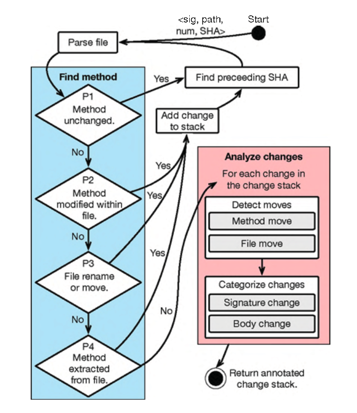
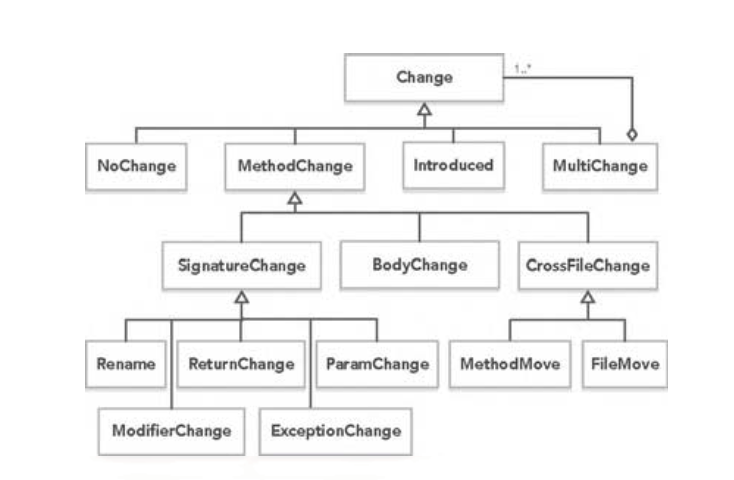

# Papers

这里记录一些与通用的软件工程相关的工作的论文，主要来源为 **ICSE**、**FSE**、**ASE** 等会议以及部分期刊等。

* [CodeShovel: Constructing Method-Level Source Code Histories](#codeshovel-constructing-method-level-source-code-histories) ：借助 `git` 日志对源代码在方法级别上的变化进行记录和分析；

---

## CodeShovel: Constructing Method-Level Source Code Histories

*2021 IEEE/ACM 43rd International Conference on Software Engineering (ICSE)*

这篇文章主要做了针对软件开发过程中的追踪代码改变历史的工作。作者提到在软件开发过程中，大量的使用了版本控制工具，而这些版本控制工具中存在着大量的代码历史信息，这些信息可以帮助了解开发者的开发习惯，预测代码的改变。但是通常情况下，开发者仅仅对其中的部分代码比较感兴趣，而这种功能是目前的版本控制工具无法很好地支持的。作者通过调研发现，开发者们通常感兴趣的是方法级别上的代码的历史变化，而现在很多工作都是直接基于文件级别（粒度太大）或者代码行级别（粒度太小）来追踪代码的改变。此外，目前已有的工作还存在一些缺陷，例如需要耗费大量的时间对整个工程的代码进行分析等。基于上述开发人员的需求以及现有工具存在的缺陷，作者提出了 **CodeShovel** 工具，来更好地追踪源代码的改变情况。作者提到了在他们所实现的工具中，有很高效率的**方法级别源代码相似度比较**的算法。

**CodeShovel** 可以快速追踪、定位到相同代码的变化历史，其主要在方法粒度上来生成相应的历史记录。而且为了防止不必要的性能开销，代码历史的生成采用按需生成的方式。主要的方法是借助 `git`，从最近的与目标方法相关的 `commit` 开始，往回迭代查询，提取所有与该方法相关的 `commit`。在这个过程中，会遇到两个问题：

1. 如何找到所有的与该方法相关的 `commit`；
2. 如何确定该方法都做了哪些改变；

**CodeShovel** 的整体方法如下图所示，其核心算法是根据文件的版本进行方法相似度匹配。

对于方法相似度匹配，主要借鉴克隆检测的思想，为了进一步提高准确率，其结合了方法体和方法签名的相似度。对于具体相似度的计算，则采用了 **Jaro-Winkler Distance** 的计算方法（*所以最后只是用了字符串匹配？*）。具体来说，对于给定的文件和方法，作者通过对给定文件（如果当前 `commit` 对方法进行了移动，则会对多个文件进行解析）的所有方法进行解析，从而定位到指定方法，然后存储方法基本信息。

然后从后往前遍历每个 `commit`，针对每个 `commit`，经历上图左边的 4 个阶段一一比较，确定方法是否被改变？方法是否在单个文件中被改变？方法是否在文件之中移动？如果这些阶段都没有匹配上目标方法，则认为这是引入这个方法的`commit`，所以接下来进入第 2 个大阶段，确定该方法做了哪些改变。

作者将方法的改变按照下图所示来区分：

对于这些改变的识别，也是通过字符串匹配的方式来实现。

然后作者对工具的性能进行了实验，主要着眼于两个方面：

1. 对方法的历史信息提取的准确性；
2. 性能；

具体实验部分可以参照论文原文。总的来说文章使用了一些启发式的方式，借助 `git` 日志系统，提出了一套方法级别的代码修改历史的分析框架，可以追踪到具体方法的改变路径，也为相关开源项目的分析提供了一些新的思路。
