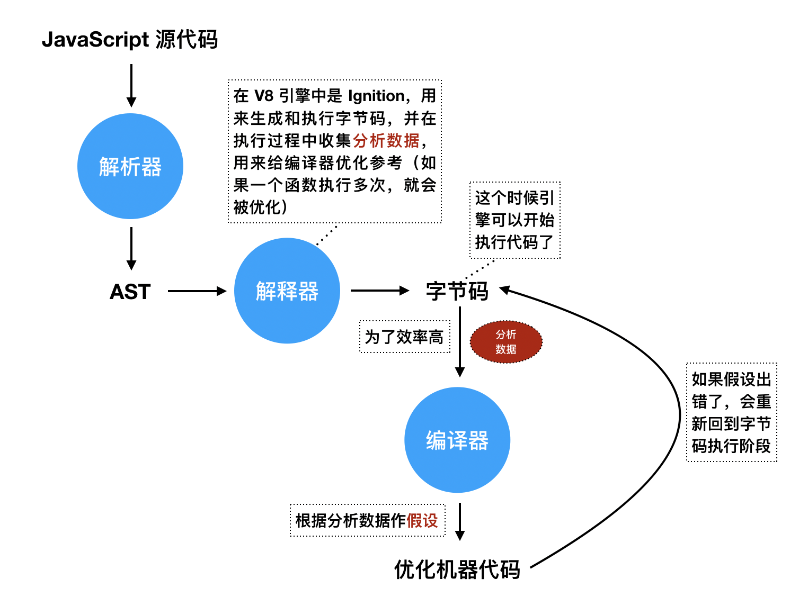
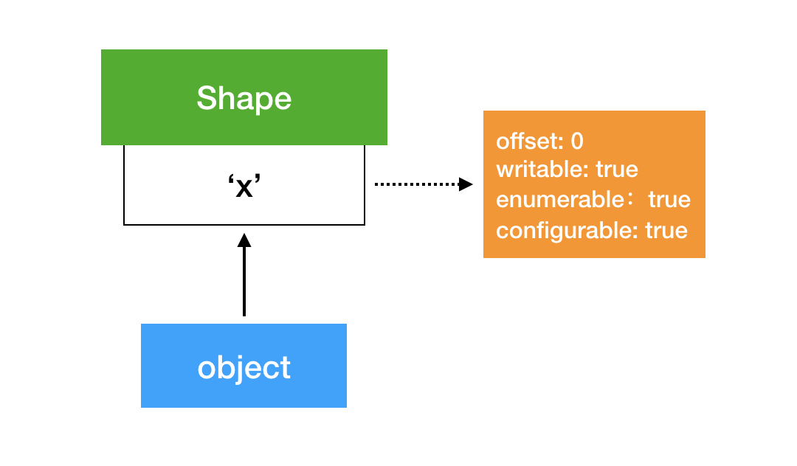
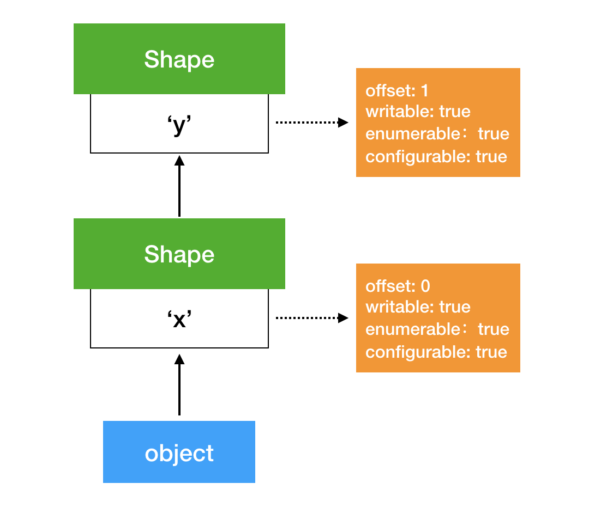
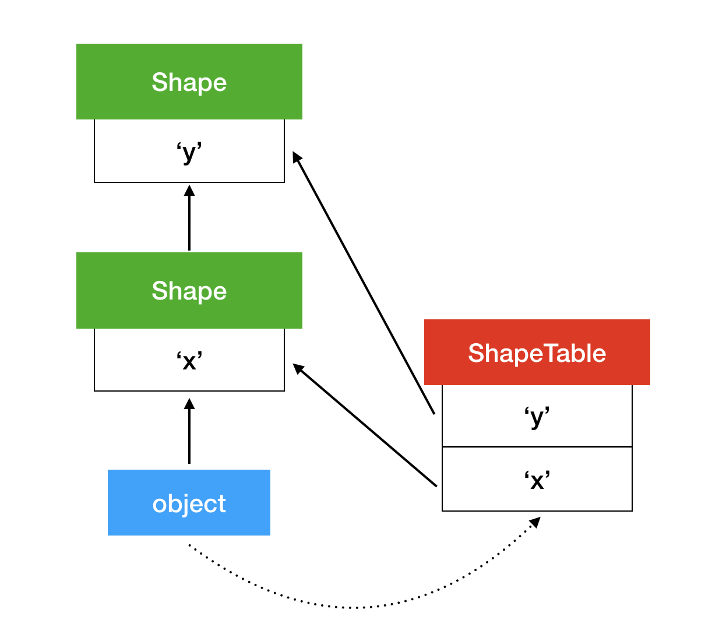

# JavaScript 引擎的一些优化处理

参考链接：
* <https://mathiasbynens.be/notes/shapes-ics>
* <https://mathiasbynens.be/notes/prototypes>

首先，JavaScript 引擎中代码的执行以及执行的优化过程大致如下图所示：



引擎的基本优化过程如上图所示，但是根据具体实现的引擎不同，会有一些差距，比如 **V8** 就是跟上图一样，只有一级优化，而 **SpiderMonkey**、**Chakra** 具有两级优化、**JSC** 具有三级优化。具备不同级别优化的目的是为了平衡「生成机器代码的时间」和「代码执行时间」两个时间所带来的消耗。

在 **ECMAScript** 中规定，所有对象都被当成字典，所有的键都映射到对应的属性，即 \[value\]、\[Writable\]、\[Enumerable\]、\[Configurable\] 这些基本属性。此外，数组是特殊的对象，数组的索引都被当成键来存储，并且数组都有一个 `length` 属性，用来存储数组的长度。每个数组最多存放 `2^32 - 1` 个元素。

对于 JavaScript 语言来说，访问对象的属性是很频繁的，因此如何快速访问属性对于 JavaScript 引擎来说就是主要的任务。对于一般情况下，多个对象具有相同的属性是很常见的（来自同一个类），因此首要解决的是如何快速访问不同对象的相同属性。

JavaScript 引擎中解决这个问题，使用的是引入一个 Shape 数据结构（即 V8 中的 Maps）：



这个 Shape 就是用来表示对象的类型的，Shape 是会被多个对象共享的。访问属性时，首先根据属性名找到对应的 Shape，根据对应的 Shape 找到对应属性的偏移量，然后在对象所占的内存中根据偏移量得到需要访问的属性，这样就不需要在每个对象中存储一个属性名。在不同的引擎中，有不同的叫法，V8 称为 Maps，Chakra 中称为 Types，JavaScriptCore 中称为 Structures 等，而在学术界通常称为 Hidden Class。

当对一个对象添加属性时，会延长 Shape 链，如下图所示：



由于这个性质，JavaScript 的对象可以随时添加属性。

但是，如果链条长了，访问属性会变得很慢。因此，JavaScript 引擎会添加一个数据结构，来映射不同的属性找到不同的 Shape，从而实现快速定位到需要用到的 Shape，实现快速访问。如下图所示：



但是这样又添加了一个字典，来映射不同的属性与不同的 Shape。实际上，使用这一系列的原因是可以使用 Inline Caches 加快对象属性的快速访问。引擎使用 Inline Cache 记录从哪儿寻找属性的信息，导致了 JavaScript 快速运行的关键因素。

例如，在下列代码中：

```javascript
function getX(o) {
    return o.x;
}
```

使用 Inline Cache 之后，会生成字节码如下：

```
get_by_id loc0, arg1, [A], [B]
return loc0
```
