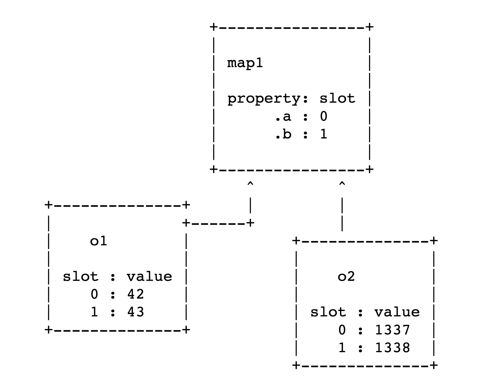

# V8 学习笔记

## 漏洞分析链接

* <https://abiondo.me/2019/01/02/exploiting-math-expm1-v8/>
    * 一个 `Math.expm1` 的漏洞，会在优化（JIT）之后导致 `Object.is(Math.expm1(-0), -0)` 返回 `false`。大致是因为 `Math.expm1` 在经过 `JIT` 优化时，会使得 `Math.expm1` 的返回类型被标记成（PlainNumber, NaN）这样的联合体，但是 -0 不属于上述联合体，因此 `Object.is` 会直接返回 false。
* <http://www.phrack.org/papers/jit_exploitation.html>
    * CVE-2018-17463，安全检查冗余消除导致的漏洞，此外这篇文章还讲解了一些 V8 的基础知识。漏洞是 V8 将 `CreateObject` 对应的操作标记成无副作用的（但实际上会改变对象的 Maps，使得对象的 `Out-line` 属性的类型从 `Array` 形式变成 `Dictionary` 形式，这时 `In-line` 的属性也会被放到 `Out-line` 属性中），因此如果对含有 `CreateObject` （`Object.create`）调用的函数一开始触发了对对象的 Maps 的检查，那么之后的检查就会被冗余消除优化删去，再结合 `CreateObject` 实际的副作用，最终可以导致 `Out-line` 属性的 `Overlap`，这样就能构造出 **Type Confusion**，从而进一步利用。

## 其他学习链接

1. <https://es6.ruanyifeng.com/>
    * ES6 学习教程
2. <https://www.freebuf.com/vuls/203721.html>
    * 从一到 CTF 题理解 V8 漏洞的利用，零基础入门题目，提供 `oob` 方法存在一索引越界读写漏洞
3. <https://e3pem.github.io/2019/11/20/browser/%E6%95%B0%E5%AD%97%E7%BB%8F%E6%B5%8E%E7%BA%BF%E4%B8%8B-Browser/>
    * 虽说是 CTF 题，但是这题的漏洞比较巧妙，提供的 coin 方法中存在可以通过 `valueOf` 回调改写数组大小从而导致越界写的漏洞
    * 拓展（通过内存越界，构造 Victim Object，来获得 addr_of 原语可参照该链接）：<https://xz.aliyun.com/t/6577>
4. <https://paper.seebug.org/1145/>
    * 也是 CTF 题，但是属于真实漏洞。属于存在数组越界访问的漏洞，其实原理跟「3」差不多，也是在执行过程中忽略了可以调用用户自定义的方法，然后在自定义方法中将数组大小做改变，从而构造越界读写。但是这篇文章还讲解了对代码的分析。不过文章中有一些错误，在 JavaScript 以 `.call` 形式调用函数时，`call` 中的第一个参数在解析时作为 Receiver，而第二个参数才是真正的下标 0 的参数。此外，这个漏洞还使用了到了 JS 中的迭代对象的概念，不清楚的可以参考「学习链接 1」。
    * 拓展链接（1）：<https://www.anquanke.com/post/id/147829> 这个劫持控制流思路是自定义一个函数，然后使其 JIT，之后改写这个函数地址的内容
    * 拓展链接（2）：<https://www.sunxiaokong.xyz/2020-01-16/lzx-roll-a-d8/> 有对相关 JS 语法的讲解
    * 拓展链接（3）：<https://xz.aliyun.com/t/5190> 这个劫持控制流思路是泄漏堆地址和栈地址，通过堆地址搜索泄漏 `libc` 地址，然后通过 `ArrayBuffer` 布置 Shellcode，之后通过 ROP 将布置 Shellcode 的地址设置为可执行，最后跳转到 Shellcode 进行执行
5. <https://esprima.org/doc/>
    * 根据 JavaScript 源代码生成抽象语法树（AST）
6. <https://juejin.im/post/5dc4d823f265da4d4c202d3b?from=groupmessage>
    * 对 V8 的执行和 GC 进行了一个概述性质的介绍
7. <https://ponyfoo.com/articles/an-introduction-to-speculative-optimization-in-v8#excurse-value-representation>
    * 针对 V8 `Ignition` 和 `TurboFan` 优化（主要是 IC 和 Feedback Vector）的详细讲解
8. <https://animal0day.blogspot.com/2020/04/setting-up-vulnerable-v8-on-windows.html>
    * 构建 Windows 下的 V8 调试环境

## 配置 V8 环境

* <https://mem2019.github.io/jekyll/update/2019/07/18/V8-Env-Config.html>

可以参考上述链接完成。

首先，需要配置 `git` 本地代理：

```sh
$ git config —global http.proxy http://ip:port
$ git config —global https.proxy http://ip:port
```

然后，需要配置环境变量代理（因为后续命令会用到 `curl`）：

```sh
$ export http_proxy=“http://ip:port”
$ export https_proxy = “http://ip:port”
```

之后，下载 `depot_tools`：

```sh
$ git clone https://chromium.googlesource.com/chromium/tools/depot_tools.git
$ export PATH=/path/to/depot_tools:$PATH
```

然后，安装 `Ninja`，为编译做准备：

```sh
$ git clone https://github.com/ninja-build/ninja.git
$ cd ninja && ./configure.py —bootstrap && cd ..
$ export PATH=/path/to/ninja:$PATH
```

最后，调用 `fetch v8` 即可拉取 V8 代码。

拉取代码之后，切换到需要调试的版本 / 分支，之后执行 `gclient sync` 来同步一些编译时需要的文件 / 配置。如果是在 Linux 下执行，则还需调用 `./build/install-build-deps.sh` 进行一些依赖的下载。（`gclient sync` 如果报需要 `config` 的错误，可以先执行这个命令：`gclient config https://chromium.googlesource.com/v8/v8`）

之后执行 `tools/dev/v8gen.py x64.release` 或者 `tools/dev/v8gen.py x64.debug` 生成构建的配置，最后执行 `ninja -C out.gn/x64.release` 或者 `ninja -C out.gn/x64.debug` 开始编译，完成构建。

如果想要在 `release` 的情况下获得调试信息（即在 `gdb` 中用 `job` 命令对内存进行打印），可以在生成构建配置之后，编辑 `x64.release/args.gn`，添加以下内容：

```sh
v8_enable_backtrace = true
v8_enable_disassembler = true
v8_enable_object_print = true
v8_enable_verify_heap = true
```

## 基本概念

（浏览器 DOM 相关对象不由 V8 引擎提供。）

* **Isolate**: 隔离，每个隔离是一个独立的 V8 运行时，具有独立的 Heap，同一时刻只能被一个线程执行，每个隔离需要运行脚本就需要一个 Context，一个隔离可以有多个 Context；
* **Context**: 上下文，V8 中所有的代码都是在某个 V8 上下文中运行的，属于一个隔离（Isolate）内部的概念；
* **Handle**: 对 Heap 中对象的引用（V8 中 JavaScript 的值和对象均在 Heap 中存放），Handle 分为 Local 和 Persistent 两种，Local 是受 HandleScope 来管理的，可以理解成一个指向对象的指针，Persistent 不受 HandleScope 管理，由于 V8 的 GC 机制，因此使用 Handle 对对象进行管理是很必要的（具体可以看下面 GC 小节）；
* **Scope**: 可以看成一个句柄的容器，在某个 Scope 内部管理对应的对象，当使用完一个Scope 内的 Handle 之后，可以直接删除整个 Scope 来删除 Scope 内的 Handle；
* **Templates**: 两种类型（Function Template、Object Template），Function Template 是用来生成 JS 函数的 C++ 对象，而每一个 Function Template 都有一个对应的 Object Template，当使用某个 JS 函数创建对象时，V8 就会使用对应的 Object Template 来实例化对象。
    * （Template）ObjectTemplate 的声明位于 `include/v8.h` 中，类内部的方法实现位于 `src/api/api.cc` 中
        * 可以通过 Set 方法向 ObjectTemplate 实例中添加属性，之后通过该实例所创建得到的对象都有对应的属性；
    * FunctionTemplate 可以获得 Function，Function 内部方法的实现位于 `src/api/api.cc` 中，对于 Function 的调用，最终会进入 `Function::Call` 方法，该方法最终调用的是 `i::Execution::Call`，其定义在 `src/execution/execution.cc` 中

## V8 值表示

V8 中主要有三种类型的值表示（`src/objects.h`）：

* 浮点数
* 整数
* 对象

对于浮点数来说，在 V8 中的二进制表示不作其他处理，对于整数（`32 bit`，暂不知道 `64 bit` 怎么处理，就是下面的 Smi）来说，V8 会将 `32 bit` 整数左移 32 位来表示，对于对象来说（HeapObject），V8 会通过在对象地址最低位与 1 来表示（由于地址都是对齐的，所以这个就相当于地址加 1）。

```c
Smi:        [32 bit signed int] [31 bits unused] 0
HeapObject: [64 bit direct pointer]           | 01
```

在 V8 中，上述方法所表示的值称为 **Tagged Pointer**，对于对象（HeapObject）来说，具体决定于是哪个对象的，是通过 **Maps** 来完成的，Maps 位于 HeapObject 内存的 0 偏移处。因为 HeapObject 的最低字节的特殊处理，所以在 V8 中对 HeapObject 内部成员数据的访问需要借助特殊的访问器，这也说明了一个事情，V8 中的对象不会使用到任何 C++ 的数据成员（否则无法正确处理最后一位）。

V8 的数组中的元素也遵循上述的值表示方法，因此在利用过程中，通常使用浮点数数组对内存进行更改。

## 隐藏类（Hidden Class, Maps）

V8 中，所有具有相同属性的对象共享一个隐藏类（Maps），Maps 包含一个对象的动态类型（String、Uint8Array、HeapNumber 等），对象的大小、对象的属性（以及存储位置）、数组元素的类型以及 `prototype` 等。

```c
   +----------------------+
   |         Maps         |
   +----------------------+
   |      Properties      |
   +----------------------+
   |       Elements       |
   +----------------------+
   |         ...          |
   +----------------------+
   |         ...          |
   +----------------------+
   |         ...          |
   +----------------------+
```

在 Maps 中存放着属性名对应的下标，这样 V8 中的对象访问属性的时候，会先根据 Maps 通过属性名获取相应的下标，然后再回到对象字段中查找具体的值。在 V8 中，动态的添加属性会生成新的 Maps，在新的 Maps 中添加新增的属性，旧的 Maps 会指向新的 Maps。具体可以参考[《JavaScript 引擎的一些优化处理》](./JavaScript_Optim.md)。V8 维护这一个转换表，决定当前对象增加了某个属性之后转换到哪个新的 Maps 中。

对象的具体属性值由对象本身存储，存储在多个可能的内存区域中的一个（对于对象来说，一个属性有不同的内存区域可以进行存放），而 Maps 就可以用来指出该属性值存储在具体的哪个内存区域中。对象中可以存储属性值的内存区域有三个：

* inline properties：位于对象内存内部
* out-of-line properties：位于对象外部，一个动态大小的堆空间（FixedArray）
* 如果属性是可索引的（实际上就是属性名是数字），则存储在另一个动态大小的堆空间中（由 elements 指向）

前两种方式的内存存储模式如下图所示：



对于复杂的对象，V8 会使用字典模式（Dictionary Mode）对其进行访问，在字典模式中，就不需要使用 Maps 来查找某个属性在对象中的 `slot` 值来获取属性值了，而是直接维护一个哈希表，通过属性名映射属性值。当 V8 认为使用 Maps 机制会消耗性能时，会使用这种方式对属性进行访问。

Maps 中第三个字段指向一个描述符数组，该数组中存放着每个命名属性（详请看下一节）的名称、保存的索引等基本信息。

### 属性

* <https://blog.crimx.com/2018/11/25/v8-fast-properties/>

V8 中的属性有两种，一种是命名属性，以字符串作为属性的索引；另一种是数组索引属性，常叫做元素（Elements），是以整数作为数组索引的。这两种属性通常保存在不同的内存区域中。在最简单的情况下，两种属性的存储方式都类似于数组，即一串有序的连续内存空间。对于 Elements 来说，可以直接通过索引进行访问，而对于属性来说，则需要借助 Maps 获取相应属性的索引，然后去连续内存段中访问。但是，属性有时也会切换成基于稀疏字典的方式来存储（类似哈希表？），从而节省内存。需要注意的是 Maps 不存储 Elements 的信息，因此添加 Elements 不会改变对象的 Maps 指向。

对于命名属性来说，每个对象都支持对象内属性，这些属性由对象在创建时预留出一定数量的属性槽，访问这些属性是最快的。而如果属性的数量超过了对象预留的属性槽，则继续添加属性会将属性放入专门存储属性的内存空间中，该内存空间是可以动态改变大小的。以上所说的存储在有序的连续内存空间中，通过 Maps 映射索引来进行访问的属性称为“快属性”。

V8 为了支持大量的属性添加和删除操作，因此对象内部有时候会有独立的词典空间作为一些属性的存储，这些属性称为“慢属性”，慢属性的信息也不保存在 Maps 中，而是直接保存在对象中，因此对慢属性的更改（继续增加慢属性或者删除慢属性）也不会改变 Maps 的指向。对一个对象进行大量的添加属性操作，会将对象的属性存储模式从快属性变成慢属性，而且对象内属性也会被变成慢属性，移到慢属性存储区域进行存储。

对于 Elements 来说，得考虑他的空隙值，此外，Elements 是可以沿着原型链进行查找的，比如当前对象的索引 2 的 Elements 为空，那其会查找其 `prototype` 的索引为 2 的 Elements。由于空隙值太多会导致数组过于稀疏，因此也存在两种模式的 Elements：“快元素”和“慢元素”。快元素就是之前的数组，慢元素通过键值（存储键-值-描述符）进行存储。除了具有太大的空隙会导致变成慢元素存储之外，改变快元素中的哪怕一个描述符，也会导致变成慢元素进行存储。

在 ECMAScript 中，上面说到的描述符即对象属性的 Attribute，被定义成以下几类：

* Value：属性值
* Writable：属性是否可写
* Enumerable：定义属性是否可枚举
* Configurable：定义属性是否可配置（删除）

### V8 中的数组

* <https://v8.dev/blog/elements-kinds>

V8 的数组也有对应的 Map 结构，可能为 JSArray 或者 FloatArray 等。数组中存储的 Elements 也是一个对象结构，内部存有具体的对象的值，通过数组对象的 Elements 属性进行引用。

数组存在一个通用元素类型的概念，通用元素类型可以保存当前数组所包含元素的基本类型，从而可以使得 V8 在后续操作中进行进一步的优化。这些元素类型包括：

* **PACKED_SMI_ELEMENTS**：表示当前数组仅存在 SMI 类型的元素
* **PACKED_DOUBLE_ELEMENTS**：表示当前数组包含浮点数类型的元素和 SMI 类型的元素（-0、NaN 等也会使得 SMI 变成 Double）
* **PACKED_ELEMENTS**：表示当前数组包含各种类型的元素
* **HOLEY_SMI_ELEMENTS**：稀疏的存放 SMI 类型的数组
* **HOLEY_DOUBLE_ELEMENTS**：稀疏的存放浮点类型的数组
* **HOLEY_ELEMENTS**：稀疏数组（之所以区分 HOLEY 与 PACKED，是因为 PACKED 类型的数组可以更好地被优化），使用 new Array(3) 这种语句创建，则一开始就是这种类型
* ……（一共有 21 种）

因此数组的元素类型可能会随着向数组中添加不同的元素而改变，但是只会朝着一个方向改变，而不会逆转，即使数组的值被变回来了。

### V8 中的 JSFunction

JSFunction 类中有一个 `code` 字段，该字段存储着该函数被调用时执行的机器码地址，且该字段指向的地址内存区域为 RWX 类型的，因此可以进行写入和执行。V8 在对一个函数进行优化之后，就会修改位于这里的机器码。但是在 `6.7` 之后的版本里，该内存地址不可写。
